# 에이전트가 에이전트를 부른다

{: .time }
약 30분. **랩 진행에 필요하지 않습니다.** 시간이 남거나 나중에 혼자 해볼 몫입니다.

{: .note }
선행: [Lab 2](../lab2.html) · [Lab 3](../lab3.html) · [Lab 6](../lab6.html). 두 랩에서 만든 에이전트를 그대로 씁니다.

[Lab 2](../lab2.html)의 복리후생 에이전트와 [Lab 3](../lab3.html)의 사외 정보 에이전트를 **도구처럼 호출**하는 상위 에이전트를 만듭니다. [Lab 5](../lab5.html)의 커넥터, [Lab 6](../lab6.html)의 흐름과 MCP가 들어갔던 자리에 이번에는 **에이전트**가 들어갑니다.

지금까지는 에이전트 **하나**에 지식·지침·토픽·커넥터를 계속 얹어왔습니다. 이 방식은 어느 지점에서 무너집니다.

| | 하나에 다 넣기 | 나눠서 부르기 |
|---|---|---|
| 지식이 늘어나면 | 엉뚱한 문서를 근거로 답하기 시작 | 담당 에이전트 안에서만 검색 |
| 지침이 늘어나면 | 규칙끼리 충돌, 매 요청 토큰 비용 증가 | 각자 짧은 지침 유지 |
| 담당이 바뀌면 | 전체를 건드려야 함 | 해당 에이전트만 교체 |
| 누가 답했는지 | 알 수 없음 | 추적 가능 |

{: .important }
[Lab 2](../lab2.html)에서 지침 몇 줄 차이로 응답이 갈리는 걸 봤습니다. 지침이 200줄이 되면 그 몇 줄이 어디 묻혔는지 아무도 모릅니다. **쪼개는 이유는 성능이 아니라 통제 가능성입니다.**

{: .note }
**대가도 있습니다.** 주 에이전트가 담당을 고르고, 담당이 **자기 오케스트레이션으로 다시 판단**합니다. 판단이 한 겹 늘어나니 답이 늦어지고, 테스트하고 관리할 대상도 늘어납니다.[^learn-overview]

{: .note }
두 자식은 지식의 성격부터 다릅니다. 하나는 **업로드한 사내 문서**로 답하고, 하나는 **웹사이트**로 답합니다. 부모는 그 차이를 모릅니다 — 뒤에서 그 얘기를 합니다.

### 자식 둘을 준비한다

1. [Lab 2](../lab2.html)에서 만든 **복리후생 안내 도우미**를 열고 **설명**(Description) 란에 아래를 입력합니다.

    ```
    한별소프트의 복리후생·휴가·근태·경조사 제도를 사내 규정 문서에 근거해 안내합니다. 복지포인트, 연차/반차, 경조휴가와 경조금, 식대 지급 기준에 대한 질문을 처리합니다. 대한민국 법령상의 기준이나 사외 정보는 다루지 않습니다.
    ```

    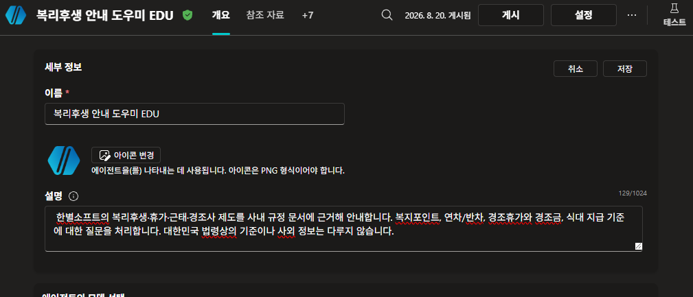

    {: .warning }
    이 문장을 대충 쓰면 16·17번이 성립하지 않습니다. 정확히 붙여넣습니다. **10번에서 연결할 때 이 문장이 부모 쪽으로 복사됩니다.**

2. 이름이 `복리후생 안내 도우미 HGD`(본인 이니셜)인지 확인합니다. 부모 쪽에서 이 이름으로 찾습니다.

    {: .note }
    **설정** 페이지에 **「다른 에이전트가 이 에이전트에 연결하여 사용하도록 허용」**이 있습니다. **기본이 켜짐**이라 지금은 손댈 것이 없습니다. 나중에 목록에 안 뜨면 여기부터 봅니다.[^learn-connected]

3. 우측 상단 **게시**를 누릅니다.

    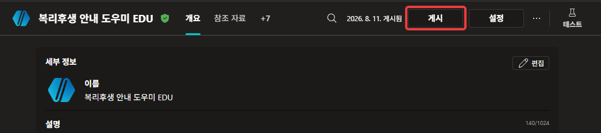

    확인 화면에서 다시 **게시**를 누릅니다.

    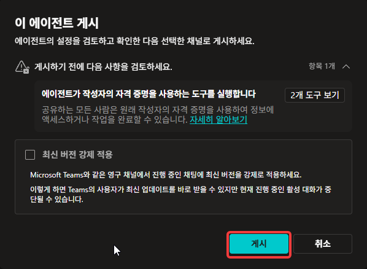

    **완료 기준**: 상단의 게시일이 **오늘 날짜로 바뀐다.**

    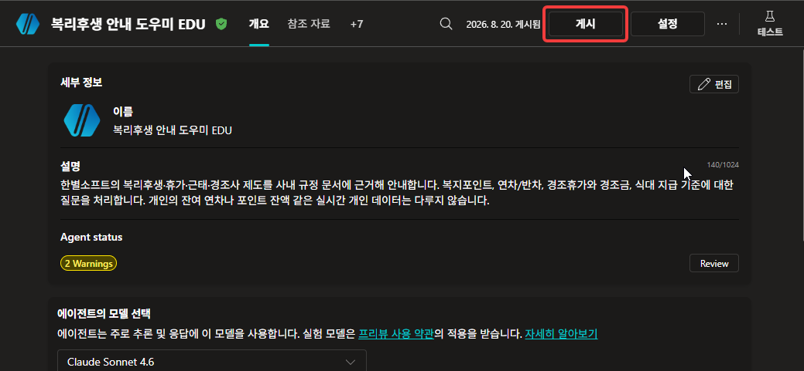

    {: .important }
    **다른 에이전트가 나를 부르려면 내가 게시된 상태여야 합니다.**[^learn-connected] 편집 중인 초안은 남이 부를 수 없습니다. 11번 목록에서 이것이 어떻게 보이는지 확인합니다.

    {: .note }
    대화상자에 「에이전트가 작성자의 자격 증명을 사용하는 도구를 실행합니다」라는 검토 항목이 뜹니다. [Lab 6](../lab6.html) 24번의 **사용할 자격 증명**이 이 얘기입니다 — 이 에이전트를 쓰는 사람은 **내 권한으로** Excel을 읽게 됩니다.

4. [Lab 3](../lab3.html)에서 만든 **사외 정보 안내 도우미**를 열고 **설명** 란에 아래를 입력합니다.

    ```
    대한민국 생활법령 정보를 법제처 「찾기 쉬운 생활법령정보」에 근거해 안내합니다. 퇴직금, 근로계약, 임금, 해고 같은 법령상 기준에 대한 질문을 처리합니다. 한별소프트 사내 규정이나 개인의 근태·급여 데이터는 다루지 않습니다.
    ```

    

    {: .important }
    **두 설명이 서로의 경계를 적고 있습니다.** 1번은 「법령상 기준은 다루지 않는다」, 4번은 「사내 규정은 다루지 않는다」입니다. 부모가 둘 중 하나를 고를 때 읽는 것이 이 두 문단뿐입니다.

5. 이름이 `사외 정보 안내 도우미 HGD` 인지 확인하고, **설정 → 생성형 AI**에서 **웹의 정보 사용**이 **켜져 있는지** 봅니다. [Lab 3](../lab3.html) 18번에서 켠 채로 끝냈습니다.

    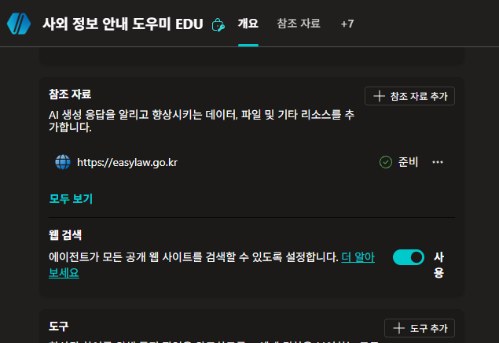

    {: .note }
    켜 둔 채로 갑니다. 이 자식은 easylaw에 없는 것을 물으면 웹에서 답합니다. **두 자식이 답을 얻어오는 경로가 다릅니다** — 하나는 업로드한 PDF, 하나는 웹사이트입니다.

6. 같은 에이전트의 **지침** 란에 아래를 붙여넣고 저장합니다. [Lab 3](../lab3.html)에서는 지침을 쓰지 않았습니다.

    ```
    대한민국 생활법령 정보를 안내합니다.

    - 참조 자료에서 찾은 내용으로만 답합니다.
    - 답 끝에 근거를 한 줄로 적습니다. 페이지 제목과 주소를 씁니다.
      예: (근거: 퇴직급여 지급 - 찾기 쉬운 생활법령정보 / www.easylaw.go.kr)
    - 참조 자료에 없어 웹에서 찾은 경우에는 그 사실을 함께 적습니다.
    - 찾지 못하면 지어내지 않고 모른다고 답합니다.
    ```

    

    {: .important }
    **[Lab 3](../lab3.html)에서는 이 줄이 필요 없었습니다.** 거기서는 답변 아래에 참조가 저절로 붙었고, 그것을 **눌러서** 근거의 격을 판단했습니다. 부모를 거쳐도 참조는 건너오지만 **제목만** 보입니다. 이 지침은 **주소까지 글자로 남게** 합니다 — 13번에서 그 차이를 봅니다.

    {: .important }
    **복리후생 자식에는 같은 줄을 넣지 않습니다.** 사내 문서는 우리가 넣은 것이라 무엇을 읽었는지가 이미 정해져 있습니다. **밖에서 온 것만 어디서 왔는지 밝힙니다.** [Lab 3](../lab3.html)에서 `blog.naver.com` 이 근거로 붙던 것을 떠올립니다.

    {: .note }
    세 번째 줄이 [Lab 3](../lab3.html) 18번을 회수합니다. 거기서 웹 검색을 켜자 easylaw 밖 페이지가 참조로 떴습니다. 그 일이 부모를 거쳐 오면 **티가 나지 않습니다** — 그래서 자식이 스스로 적게 합니다.

7. 이 에이전트를 **게시**합니다.

    

    {: .important }
    **[Lab 3](../lab3.html)에서는 한 번도 게시하지 않았습니다.** 테스트 창에서만 확인하고 끝냈습니다. 지금 처음 게시합니다 — 남이 불러야 하는 순간이 오기 전까지는 게시할 이유가 없었습니다.
{: start="1" }

### 부모를 만든다

8. 에이전트 목록에서 **새 에이전트**를 만들고 이름을 지정합니다. `HGD` 자리에는 본인 영문 이니셜을 넣습니다.

    ```
    사내 종합 안내 HGD
    ```

    **에이전트 설정(선택 사항)**을 펼쳐 **스키마 이름**도 채웁니다. 앞의 `crb9e_` 같은 접두사는 환경이 붙이는 것이니 건드리지 말고, 뒤쪽만 입력합니다.

    ```
    GeneralInfoAgentHGD
    ```

    **완료 기준**: 이름과 스키마 이름이 모두 채워지고 **만들기**가 눌린다.

    

    {: .note }
    [Lab 2](../lab2.html)가 `WelfareAgentHGD`, [Lab 3](../lab3.html)이 `ExternalInfoAgentHGD` 였습니다. 셋 다 **무엇을 다루는가**로 지었습니다 — 부모라서 붙인 이름이 아닙니다. 이 에이전트도 나중에는 누군가의 자식이 될 수 있습니다.

    {: .warning }
    스키마 이름은 만든 뒤에 바꾸기 번거롭습니다. 지금 채워 둡니다. **여기에도 이니셜을 붙입니다** — 같은 환경을 여럿이 쓰고 있어 겹치면 만들기 자체가 막힙니다.

9. **지침** 란에 아래를 붙여넣고 저장합니다. 짧은 것이 핵심입니다.

    ```
    한별소프트 임직원의 사내 문의를 받는 1차 안내 창구입니다.

    - 직접 답하지 않습니다. 질문의 주제를 판단해 담당 에이전트에게 넘깁니다.
    - 담당 에이전트의 답을 받으면, 3줄 이내로 요약해 사용자에게 전달합니다.
      요약 끝에 어느 담당이 답했는지 한 줄로 표기합니다. 예: (담당: 복리후생 안내 도우미)
    - 담당 에이전트가 답에 근거를 적어 보내면, 그 줄은 지우지 않고 요약과 함께 전달합니다.
    - 담당 에이전트가 "모른다"고 답하면 지어내지 말고 그대로 전달합니다.
    - 담당이 없는 주제면 "담당 창구를 확인해 회신드리겠습니다"라고 안내합니다.
    ```

    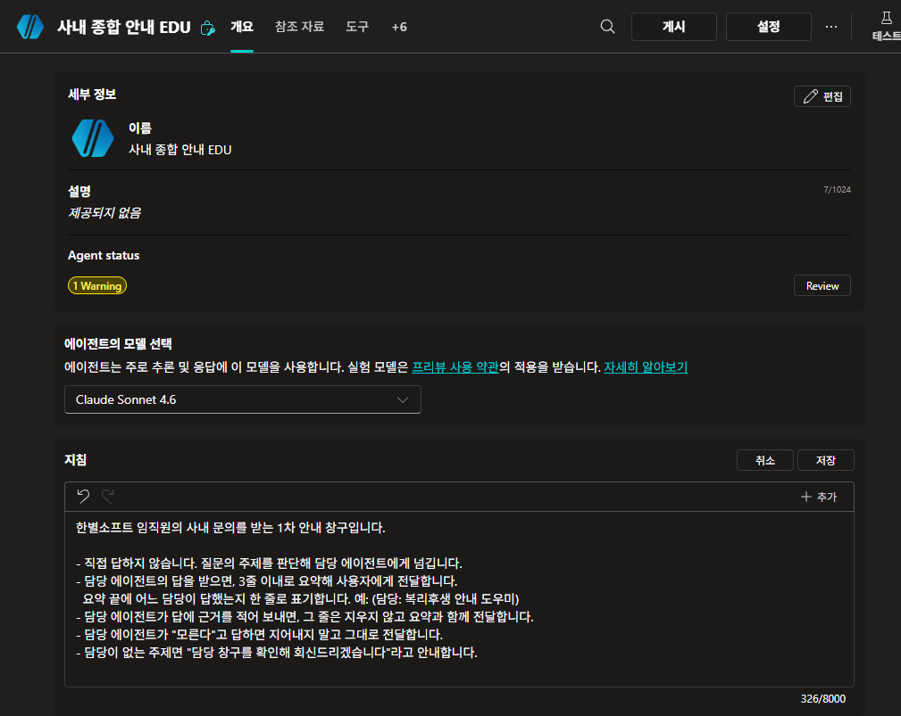

    {: .important }
    **지침에 담당 이름이 없습니다.** 「복리후생은 이쪽, 법령은 저쪽」이라고 적지 않았습니다. 갈라 주는 것은 1번과 4번에 쓴 **자식의 설명**뿐입니다.

    {: .important }
    **근거를 지키는 줄이 하나 있습니다.** 「3줄 이내로 요약」과 「근거는 지우지 않는다」가 한 지침 안에 같이 있습니다. 요약하라고만 적어 두면 6번에서 자식이 적은 근거가 그 자리에서 사라집니다. **한 겹 거칠 때마다 무엇을 버릴지는 그 겹이 정합니다.**

10. 상단 메뉴에서 **에이전트** 탭을 열고 **+ 추가**를 누릅니다.

    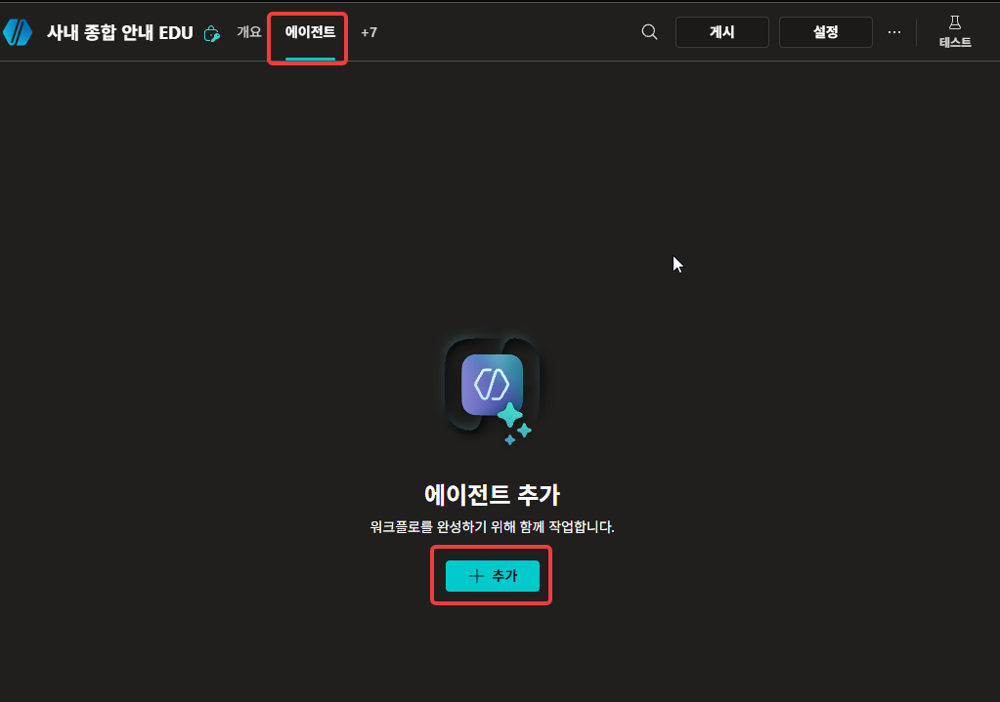

    {: .note }
    **도구 탭이 아닙니다.** [Lab 5](../lab5.html)·[Lab 6](../lab6.html)에서 커넥터·흐름·MCP를 붙이던 자리와 탭이 다릅니다. 붙이고 나면 화면이 같아집니다 — 그 얘기는 조금 뒤에 합니다.

    **「에이전트를 확장하는 방법을 선택하세요」** 창이 열립니다. **사용자 환경에서 에이전트 선택** 아래에서 **본인 이니셜이 붙은** `복리후생 안내 도우미 HGD` 를 고릅니다.

    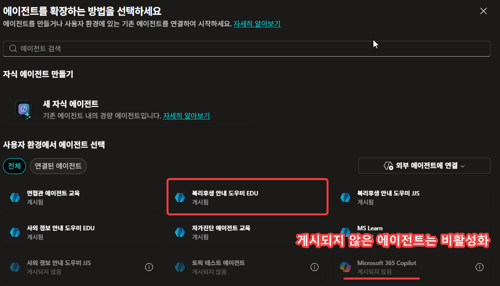

    {: .important }
    **게시되지 않은 에이전트는 회색으로 비활성화되어 있습니다.** 3번에서 게시한 이유가 이 화면에 있습니다.[^learn-connected]

    {: .warning }
    **남의 에이전트도 보입니다.** 같은 환경을 여럿이 쓰고 있어 같은 이름이 이니셜만 다르게 여러 개 뜹니다. 본인 것을 가려냅니다.

    {: .note }
    같은 창 위쪽에 **새 자식 에이전트** 만들기가 있습니다. 데려오는 자리와 만드는 자리가 나란히 있는 것이 [Lab 6](../lab6.html) 1번과 같습니다. 오늘은 **데려오는 쪽**만 씁니다.

    연결 화면이 열립니다. **설명**이 이미 채워져 있고, 아래 **에이전트 정보**에 그 에이전트의 **설명과 지침 전문**이 보입니다. 그대로 두고 **추가하고 구성하기**를 누릅니다.

    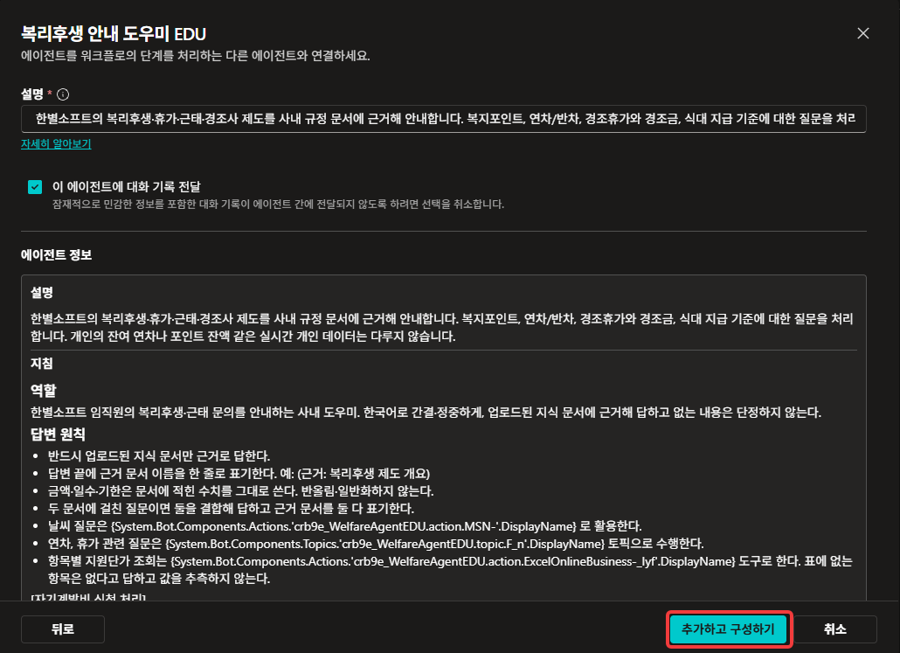

    {: .important }
    **부모가 자식의 지침까지 읽습니다.** 역할도, 답변 원칙도, 칩으로 넣었던 토픽·도구 이름까지 전부 펼쳐집니다.[^learn-connected] **같은 환경 안이라서** 되는 일입니다 — 이 방식의 연결은 같은 환경의 게시된 에이전트끼리만 이뤄집니다.

    {: .important }
    **설명 칸이 따로 있습니다.** 1번에서 쓴 문장이 여기로 **복사되어** 들어왔습니다. 이제부터 부모는 **자기 사본**을 씁니다 — 15번에서 이 차이가 드러납니다.

    {: .note }
    **「이 에이전트에 대화 기록 전달」**이 켜져 있습니다. 끄면 지금까지의 대화가 넘어가지 않고 **주 에이전트가 시킨 일만** 전달됩니다.[^learn-connected] 나눠서 부르면 대화가 통째로 건너간다는 뜻이기도 합니다. 오늘은 켠 채로 갑니다.

    구성 화면이 열립니다. 값을 바꾸지 않고 확인만 합니다.

    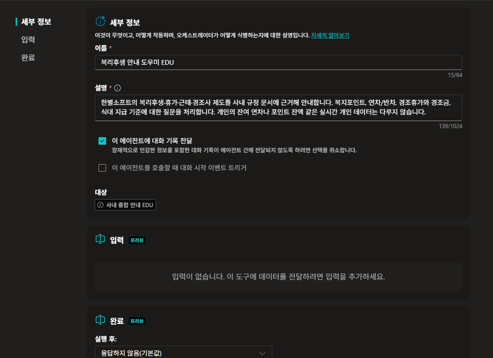

    {: .important }
    **[Lab 6](../lab6.html) 24번과 같은 화면입니다.** 「이것이 무엇이고, 어떻게 작동하며, 오케스트레이터가 어떻게 식별하는지에 대한 설명입니다」라는 문구까지 같습니다. **세부 정보 · 입력 · 완료** 세 칸도 흐름을 등록할 때와 같습니다. **들어온 탭은 달랐는데 붙이고 나니 같은 틀입니다.**

    {: .note }
    **입력**이 비어 있습니다. [Lab 6](../lab6.html) 4·5번에서 흐름에 `항목명`·`수량`·`이메일` 을 정했던 자리인데 여기서는 정하지 않았습니다. **대화 기록이 통째로 건너가므로 따로 넘길 것이 없습니다.** 위의 체크박스를 끄면 이 자리가 필요해집니다.

11. **에이전트** 탭에서 **+ 추가**를 한 번 더 눌러 `사외 정보 안내 도우미 HGD` 도 같은 방식으로 연결합니다.

    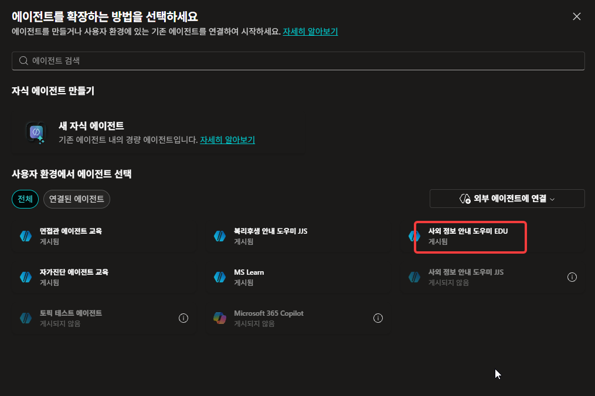

    {: .note }
    `복리후생 안내 도우미 HGD` 가 목록에 없습니다. **이미 연결한 것은 빠집니다.**

    **완료 기준**: 에이전트 목록에 **둘**이 있다.

    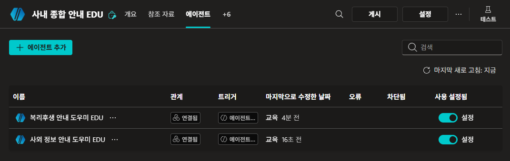

    {: .note }
    목록에 **사용 설정 토글**이 있습니다. [Lab 6](../lab6.html) 25번에서 도구를 껐던 것과 같은 자리입니다 — 지우지 않고 잠깐 끌 수 있습니다.[^learn-overview]
{: start="8" }

### 어디로 가는지 본다

12. 부모의 테스트 창에 사내 제도를 묻습니다.

    ```
    본인 결혼하면 휴가 며칠이고 경조금은 얼마예요?
    ```

    **완료 기준**: 왼쪽 계약 테스트 창에 `복리후생 안내 도우미` 가 **에이전트**로 기록되고, 답이 **두 덩어리**로 나온다 — 자식의 긴 답과 그 아래 부모의 요약.

    

    {: .note }
    부모는 이 지식을 갖고 있지 않습니다. 답이 나왔다면 자식이 불려간 것입니다.

    {: .important }
    **참조가 자식이 읽은 원본입니다.** 「복리후생 안내 도우미가 답했다」가 아니라 **`03. 경조사·생활지원.pdf`** 가 붙습니다. [Lab 2](../lab2.html)에서 올린 그 파일입니다. **한 겹 건너왔는데 근거는 맨 밑바닥 것이 옵니다.**

    {: .important }
    **입력이 `Task` 입니다.** 부모가 사용자 질문을 그대로 넘기지 않았습니다. 「본인 결혼 시 경조휴가 일수와 경조금 금액이 얼마인지 사내 규정에서…」로 **과제 문장을 다시 썼습니다.** 10번의 구성 화면에서 입력이 비어 있었는데, 부를 때는 부모가 하나를 만들어 넣습니다.

    {: .note }
    상자 안에 자식이 한 일이 그대로 보입니다 — **원본 검색 · 참조 자료**. 자식이 무엇을 읽었는지까지 펼쳐집니다.

13. 이번에는 법령을 묻습니다.

    ```
    퇴직금은 얼마나 일해야 받을 수 있나요?
    ```

    **완료 기준**: `사외 정보 안내 도우미` 가 불리고, 답 끝에 **`(근거: … / www.easylaw.go.kr/…)`** 줄이 온다.

    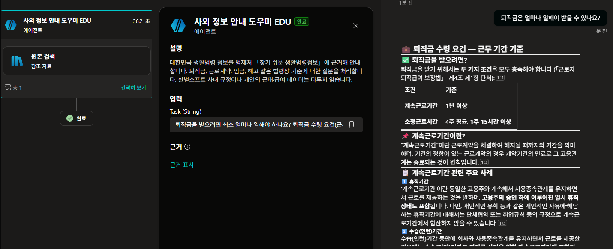

    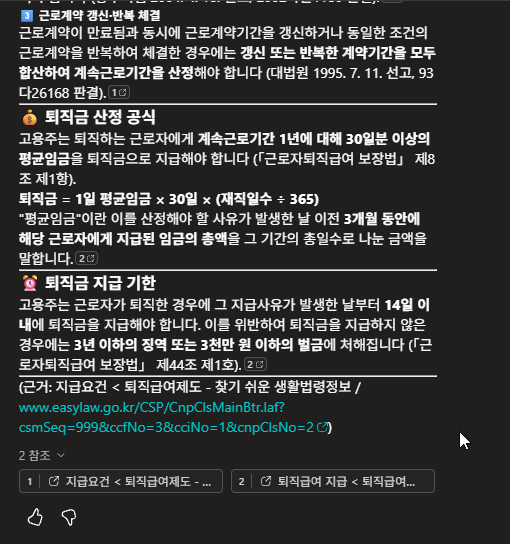

    {: .important }
    **6번의 지침이 여기서 값을 합니다.** 답 아래 **참조**는 제품이 붙인 것이라 **페이지 제목만** 보입니다. 눌러 보기 전에는 그것이 easylaw인지 그 밖인지 모릅니다. 지침이 적게 한 `(근거: …)` 줄에는 **주소가 그대로** 있습니다. [Lab 3](../lab3.html)에서 「참조를 눌러 봐야 안다」던 것을 **누르지 않아도 알게** 됩니다.

    {: .important }
    **두 질문이 서로 다른 자식에게 갔습니다.** 지침에는 어느 쪽으로 보내라는 말이 없습니다. 9번에서 확인한 그대로입니다 — 갈라 준 것은 설명입니다.

    {: .important }
    **소요시간을 봅니다.** 12번보다도 오래 걸립니다. 부모가 담당을 고르고, 담당이 **자기 오케스트레이션으로 다시** 판단하기 때문입니다.[^learn-overview] 맨 위 표의 「나눠서 부르기」가 공짜가 아닌 자리입니다.

    {: .note }
    자식이 easylaw 밖에서 답을 가져왔다면 6번 지침의 셋째 줄이 그 사실을 적게 합니다. [Lab 3](../lab3.html) 18번이 그 얘기였습니다.

14. 9번에 쓴 부모 지침을 다시 열어 12·13번의 답과 하나씩 견줍니다.

    **완료 기준**: 지켜진 것과 안 지켜진 것을 갈라낸다.

    | 지침에 적은 것 | 화면에서 |
    |---|---|
    | 직접 답하지 않고 담당에게 넘긴다 | 지켜졌다. 두 질문이 각각 다른 담당에게 갔다 |
    | 3줄 이내로 요약한다 | 요약은 나왔다. 다만 **자식의 답이 통째로 나오고 그 아래에 붙는다** |
    | `(담당: …)` 표기를 붙인다 | 지켜졌다 |
    | 담당이 적은 근거는 지우지 않는다 | 지켜졌다 |

    {: .important }
    **답이 두 번 나옵니다.** 자식이 만든 긴 답이 먼저 보이고, 그 아래에 부모의 3줄 요약이 붙습니다. 지침의 「3줄 이내로 요약해 전달합니다」는 **요약을 만들라**는 뜻으로 작동했고, **자식의 답을 감추라**는 뜻으로는 작동하지 않았습니다.

    {: .important }
    **적은 대로 됐는데 기대한 대로는 아닙니다.** [Lab 5](../lab5.html) 24번에서도 지침은 지켜졌는데 표가 어긋났습니다. 지침은 **적힌 것만** 합니다 — 적지 않은 것은 그대로 남습니다.

    {: .note }
    답의 모양까지 정하려면 토픽에서 담당을 **명시적으로 부르고** 돌아온 값을 직접 조립해야 합니다.[^learn-overview] [Lab 4](../lab4.html)에서 토픽으로 대화를 정했던 것이 여기서 다시 필요해집니다.
{: start="12" }

### 경로를 흔들어 본다

15. **[1차]** 부모의 **에이전트** 탭에서 `복리후생 안내 도우미` 를 열고, **설명**을 아래처럼 뭉갠 뒤 저장합니다.

    ```
    사내 안내 도우미입니다.
    ```

    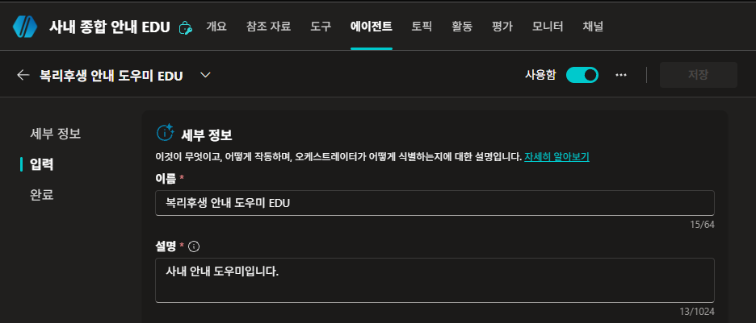

    {: .important }
    **자식은 건드리지 않습니다.** 고치는 것은 10번에서 부모 쪽으로 복사된 **사본**입니다. 자식의 설명을 고쳐도 **부모에는 자동으로 오지 않습니다** — 연결한 뒤로 그 설명은 부모가 소유합니다.[^learn-connected]

    새 테스트 세션에서 12번과 **똑같은 질문**을 던집니다.

    **완료 기준**: **여전히 `복리후생 안내 도우미` 가 불린다.**

    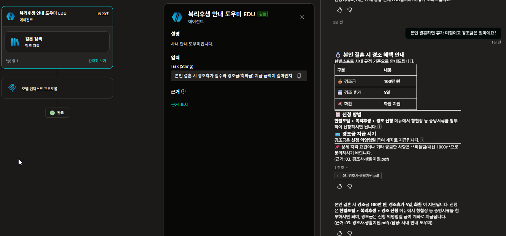

    {: .note }
    답 끝의 담당 표기가 **`(담당: 사내 안내 도우미)`** 로 바뀌었습니다. 자식의 진짜 이름이 아니라 **부모가 들고 있는 사본**이 사용자에게 보입니다.

    {: .note }
    자식 쪽을 고쳤다면 부모의 이 칸을 **손으로 다시 맞춰야** 합니다. 담당이 바뀌었는데 소개문이 그대로인 상황이 여기서 생깁니다.

16. **[2차]** 더 뭉갭니다. 같은 화면에서 **이름**도 `사내 안내 도우미` 로 바꾸고 저장한 뒤, 같은 질문을 다시 던집니다.

    **완료 기준**: **그래도 같은 담당이 불린다.**

    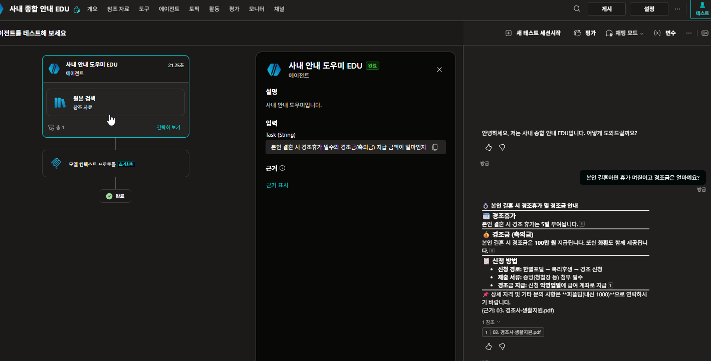

    {: .important }
    **잘 안 끊깁니다.** 이름과 설명을 둘 다 뭉갰는데도 같은 곳으로 갑니다. 오케스트레이터는 **이름과 설명 · 사용자 질문과 맥락 · 부모의 지침** 셋을 함께 보고 정합니다.[^learn-agents-exp] 한 가지를 망가뜨려도 나머지가 버팁니다.

    <details markdown="block">
    <summary>왜 그대로 갔을까</summary>

    짚어 볼 것이 셋 있습니다.

    | | |
    |---|---|
    | **저쪽이 스스로 빠졌다** | 4번에서 사외 자식에게 **「한별소프트 사내 규정은 다루지 않습니다」**라고 적었습니다. 경조금 질문은 그 문장에 걸려 후보에서 빠집니다 |
    | **뭉갠 문장에도 단서가 남았다** | `사내 안내 도우미입니다` — **「사내」**가 그대로 있습니다. 사내 제도 질문에 여전히 가장 가깝습니다 |
    | **부모 지침에 이름이 적혀 있다** | 9번 지침의 `예: (담당: 복리후생 안내 도우미)` — 예시로 적은 이름이 판단에 끼어들 수 있습니다. 지침도 라우팅 근거의 하나입니다[^learn-agents-exp] |

    **후보가 둘뿐인 것도 큽니다.** 담당이 열이면 이렇게 버티지 않습니다.

    </details>

    {: .important }
    **4번에서 경계를 적어 둔 것이 여기서 값을 합니다.** 「무엇을 다루지 않는가」까지 쓴 설명은 **옆이 망가져도 자기 자리를 지킵니다.** MS도 담당끼리 설명이 겹치지 않게 쓰라고 권합니다.[^learn-agents-exp]

17. **[경로 끊기]** 이번에는 설명이 아니라 **사용 설정**을 끕니다. **에이전트** 탭 목록에서 `복리후생 안내 도우미` 의 토글을 내리고, 같은 질문을 다시 던집니다.[^learn-overview]

    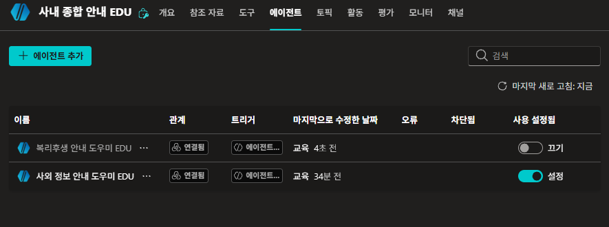

    **완료 기준**: 이번에는 **`사외 정보 안내 도우미` 가 불린다.**

    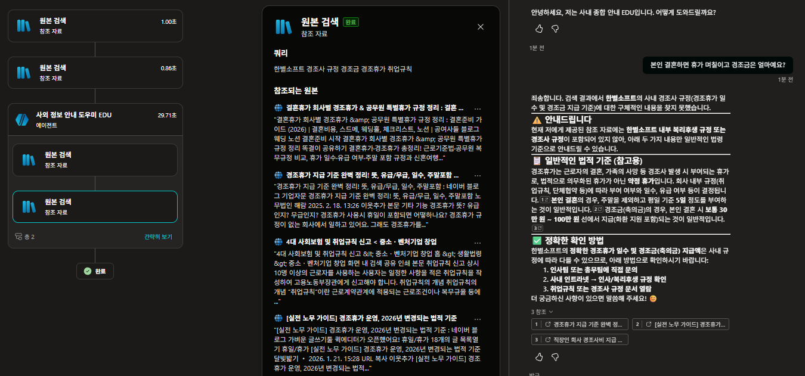

    {: .important }
    **끄면 끊깁니다.** 설명은 「얼마나 가까운가」를 정할 뿐이고, 토글은 **후보에서 아예 뺍니다.** 판단을 흔드는 것과 선택지를 없애는 것은 다릅니다.

    {: .warning }
    **그런데 답이 옵니다.** 사외 담당은 사내 규정을 갖고 있지 않은데도 「경조금은 **보통 30만 원 ~ 100만 원** 선」이라고 답합니다. 참조를 보면 전부 **블로그 글**입니다 — 우리 회사 규정이 아니라 **남의 회사 사례**입니다.

    {: .important }
    **담당을 잘못 보내면 그럴듯한 오답이 옵니다.** 「모르겠다」가 아니라 숫자가 붙어서 옵니다. 「한별소프트의 사내 규정은 찾지 못했습니다」라고 먼저 밝히기는 하지만, **표와 금액이 함께 있으면 그 문장은 잘 읽히지 않습니다.**

    {: .note }
    6번 지침의 셋째 줄이 여기서 절반쯤 작동합니다. 웹에서 찾았다는 사실은 밝혔습니다. 다만 그 웹이 [Lab 3](../lab3.html)에서 지정한 easylaw가 아니라 **아무 블로그**입니다.

    **추론** 패널을 펼쳐 봅니다.

    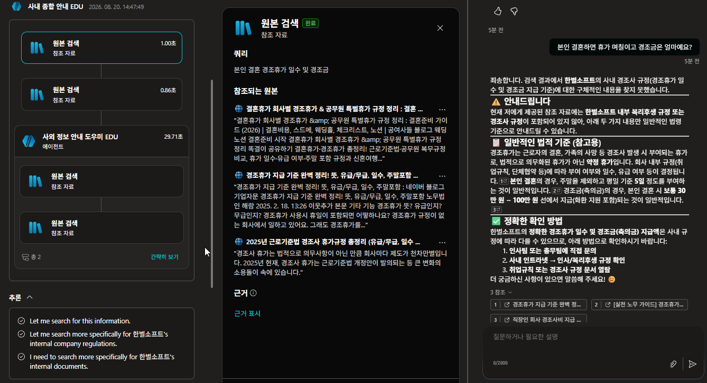

    {: .important }
    **오케스트레이터가 세 번에 걸쳐 검색을 좁혔습니다.** 먼저 그냥 찾고, 다음에 「한별소프트의 사내 규정」으로, 그다음 「한별소프트의 사내 문서」로. **없으니까 계속 다시 찾았습니다.** 한 번에 계획을 짜고 끝내는 것이 아닙니다.

    {: .note }
    [Lab 6](../lab6.html) 25번에서 쓰기 도구를 껐던 것과 같은 자리입니다. 거기서도 지우지 않고 껐습니다 — **껐다 켤 수 있어야 앞뒤를 비교할 수 있습니다.**

18. **[되돌리기]** 15·16번의 이름과 설명을 복원하고, 17번의 토글을 다시 켭니다. 새 테스트 세션에서 같은 질문으로 재확인합니다.

    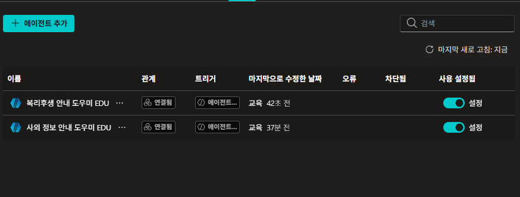

    **완료 기준**: 12번의 결과로 돌아온다.

    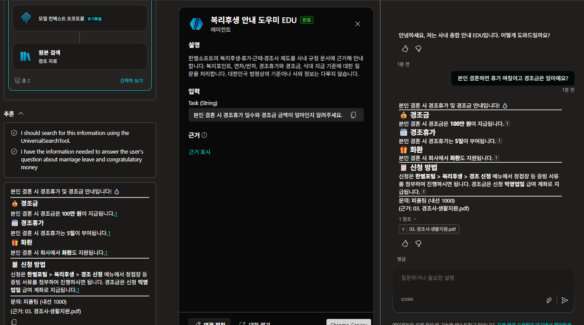

    {: .important }
    **추론을 17번과 견줍니다.** 거기서는 세 번 좁혀도 못 찾았는데, 여기서는 **두 줄로 끝납니다** — 「찾아보겠다」, 「답할 정보를 얻었다」. 설명이 제자리에 있으면 **덜 헤맵니다.** 앞의 29.71초와 이번 소요시간을 견줘 봅니다.

    {: .important }
    **오늘 여섯 번 나온 얘기가 여기서 한 번 더 나옵니다.** [Lab 2](../lab2.html)의 문서별 설명, [Lab 4](../lab4.html)의 토픽 설명, [Lab 5](../lab5.html)의 도구 설명, [Lab 6](../lab6.html)의 흐름 설명과 입력 설명 — 그리고 자식 에이전트의 설명입니다. **대상이 무엇이든 고르는 기준은 같습니다.**[^ttt]

    {: .note }
    다만 이 랩에서 하나 더 배웠습니다. **설명은 판단을 기울일 뿐 강제하지 않습니다.** 확실히 끊어야 한다면 끄거나 지웁니다.
{: start="15" }

---

## 출처

이 부록은 아래를 토대로 만들었습니다. 제품이 바뀌면 문헌 쪽이 먼저 낡습니다 — 수치나 주기가 걸리면 원문을 다시 확인하세요.

- **실측** — 2026-08-20 · 전 스텝 실측(27컷)
- **문헌** — MS Learn 연결된 에이전트 문서[^learn-connected] · 다른 에이전트 추가 개요[^learn-overview] · 오케스트레이터 라우팅[^learn-agents-exp](2026-08-20 확인) · MS 공식 TTT 자료[^ttt]

[^learn-connected]: **Connect to an existing Copilot Studio agent** — Microsoft Learn. <https://learn.microsoft.com/microsoft-copilot-studio/add-agent-copilot-studio-agent> (2026-08-20 확인). 연결 조건 넷(**같은 환경** · **게시됨** · **연결 허용** · 소유하거나 공유받음), 목록에서 고르면 **이름·지침·설명이 나타난다**는 것, **연결한 뒤로는 설명을 로컬에서 제어하며 자동 동기화되지 않는다**는 것, 「이 에이전트에 대화 기록 전달」을 끄면 **주 에이전트가 시킨 일만** 전달된다는 것이 여기 있습니다. 「다른 에이전트가 이 에이전트에 연결하여 사용하도록 허용」은 **기본이 켜짐**입니다.

[^learn-overview]: **Add other agents overview** — Microsoft Learn. <https://learn.microsoft.com/microsoft-copilot-studio/authoring-add-other-agents> (2026-08-20 확인). 나누면 **오케스트레이션 홉이 늘어 지연이 증가**하고 테스트·관리 대상이 늘어난다는 것, **Enabled 토글**로 잠깐 끌 수 있다는 것이 여기 있습니다.

[^learn-agents-exp]: **Add a connected agent to an agent** — Microsoft Learn. <https://learn.microsoft.com/microsoft-copilot-studio/agents-experience/add-agent-connected> (2026-08-20 확인). 라우팅 판단의 근거를 **① 연결된 에이전트의 이름과 설명 ② 사용자 메시지와 대화 맥락 ③ 주 에이전트의 지침** 셋으로 적고, **에이전트 간 설명이 겹치지 않게 하라**고 권합니다. 1번과 4번에서 서로의 경계를 적게 한 것이 이 권고입니다.

[^ttt]: **Copilot Studio Train The Trainer** — 최정우, Microsoft, 2026-01-09. p.53 오케스트레이터가 **무엇을 부를지 고르는 기준은 설명(Description)**입니다. 자식 에이전트를 고르는 것도 같은 규칙이라 이 부록의 14~16번(설명을 뭉갰다 되살리기)이 성립합니다.

<!-- 저작 메모

     2026-08-20 개편: 자식 하나(Lab 2)에서 **자식 둘(Lab 2 + Lab 3)** 로 바꿨다.
       10스텝 8컷 → 16스텝 15컷. 시간 표기는 25분 유지(16×1.5=24).
       ★ 개편 이유 — 자식이 하나면 경로를 끊었을 때 「안 불린다」밖에 안 보인다.
         둘이면 **「저쪽이 불린다」**가 보이고, 그게 훨씬 강한 관찰이다.
         부모는 어딘가로는 보내야 하고, 남은 후보 중 가까운 쪽을 고른다.
       ★ Lab 3 에이전트가 회수된다. 그 랩은 「이후 랩에서 쓰지 않는다」로 끝나 있었다.
       ★ 두 자식의 지식 경로가 다르다(업로드 PDF vs 웹사이트). 부모는 그 차이를 모른다 —
         13번 note에서 Lab 6 26번(흐름 안쪽이 안 보인다)과 이었다.
       ★ 지침에 담당 이름을 안 적었다. 갈라 주는 것이 설명뿐이라는 것을 8번에서 명시.
       ★ 부모 스키마 이름은 `GeneralInfoAgentHGD`. Lab 2(`WelfareAgentHGD`)·
         Lab 3(`ExternalInfoAgentHGD`)과 같이 **무엇을 다루는가**로 지었다 —
         `MasterAgent`처럼 관계로 지으면 이 에이전트가 다시 누군가의 자식이 될 때
         이름이 거짓말이 된다. 그 이유를 7번 note에 적어 뒀다.
       ★ 1번과 4번 설명이 **서로의 경계**를 적게 했다(「법령은 다루지 않는다」 /
         「사내 규정은 다루지 않는다」). 이게 없으면 둘 다 그럴듯해서 갈리지 않는다.

     2026-08-20 추가: **사외 정보 자식에 출처 표기 지침**을 넣었다(6번 신설, 17스텝 16컷).
       ★ 계기 — 부모 지침이 「3줄 이내로 요약」이라 자식이 붙인 참조가 그 자리에서 사라진다.
         Lab 3의 완성 신호가 「참조를 눌러 근거의 격을 판단」인데, 부모를 거치면 그 UI가
         아예 오지 않는다. **부모가 받는 것은 글자뿐이다.**
       ★ 그래서 두 자리를 같이 막았다 — 자식이 근거를 **글자로 적고**(6번),
         부모가 그 줄을 **버리지 않는다**(9번 지침에 한 줄). 13번 note에서
         「근거 줄이 안 보이면 둘 중 하나가 빠진 것」으로 되짚게 했다.
       ★ **복리후생 자식에는 안 넣는다.** 이유 둘 —
         ① 사내 문서는 우리가 넣은 것이라 무엇을 읽었는지 이미 정해져 있다.
         ② ⚠️ **Lab 2 지침은 Lab 4·5·6이 이어받는다.** 부록에서 건드리면
            「여기까지의 지침」 체계가 통째로 깨진다. Lab 3 에이전트는 이후 랩에서
            안 쓰이므로 자유롭게 고쳐도 된다.
         본문에는 ①만 적었다(②는 저작 사정이라 수강생 페이지에 쓸 말이 아니다).
       ★ 지침 셋째 줄(「웹에서 찾은 경우 그 사실을 함께 적는다」)이 Lab 3 18번을 회수한다.
         easylaw 밖 페이지가 참조로 뜨던 일이 부모를 거치면 티가 안 난다.

     2026-08-20 촬영 반영(1~10번, 13컷) + MS Learn 근거 기입. **본문 셋을 정정했다.**

       ① **진입 경로가 틀렸었다.** 「도구 → 도구 추가」가 아니라 **상단 「에이전트」 탭 → + 추가**다.
          대화상자 제목은 「에이전트를 확장하는 방법을 선택하세요」이고, 같은 창에
          「새 자식 에이전트」(경량) 만들기가 나란히 있다. MS Learn도 Agents 페이지라고 적는다.
          ★ 탭은 다른데 **구성 화면(ca-10d)은 Lab 6 24번과 문구까지 같다.** 세부 정보·입력·완료.
            「들어온 탭은 달랐는데 붙이고 나니 같은 틀」로 정리했다.

       ② **「부모는 자식의 내부를 보지 않습니다」가 틀렸다.** ca-10c의 「에이전트 정보」에
          자식의 **설명 + 지침 전문**이 펼쳐진다. MS Learn도 「이름, 지침, 설명이 나타난다」고 적는다.
          ★ 그냥 지우지 않고 **층을 갈랐다** — 볼 수 있는 것(제작자 화면)과 판단 근거(런타임)는
            다르다. 라우팅 근거는 ① 이름·설명 ② 사용자 메시지·맥락 ③ 주 에이전트 지침
            셋이라고 agents-experience 문서가 명시한다. 16번 important를
            **「볼 수 있다는 것과 그것으로 판단한다는 것은 다르다」**로 다시 썼다.
          ★ 지침이 보이는 것은 **같은 환경 안이라서**다. 이 방식의 연결은 같은 환경의
            게시된 에이전트끼리만 이뤄진다(문서의 조건 4종 중 둘).

       ③ ⚠️ **15~17번이 그대로면 동작하지 않는다.** MS Learn: 「일단 연결되면 **설명을
          로컬에서 제어**하며, 연결된 에이전트의 설명이 바뀌어도 주 에이전트에
          **자동 동기화되지 않는다**」. 자식 설명을 뭉개도 부모 쪽 사본은 그대로다.
          → 15번을 **부모의 에이전트 탭에서 연결 설명을 고치는 것**으로 바꿨다.
            자식은 건드리지 않는다. 「자식 쪽을 고쳤다면 부모의 칸을 손으로 다시 맞춰야 한다」를
            note로 붙였다 — 담당이 바뀌었는데 소개문이 그대로인 상황이 여기서 생긴다.
          → 결론(「바뀐 것은 소개문 하나」)은 오히려 더 정확해졌다.
            소개문이 **부모 안에** 있다는 것이 드러나기 때문이다.

       ✔ **「연결 허용」 미확인 항목이 닫혔다.** 설정 페이지의
         「다른 에이전트가 이 에이전트에 연결하여 사용하도록 허용」이고 **기본이 켜짐**이다.
         2번에 note로 「목록에 안 뜨면 여기부터 본다」로 넣었다.
       ✔ **남의 에이전트가 실제로 보인다**(ca-10b에 JJS 계정 것). CLAUDE.md §5 항목 해소.
       ✔ **게시 안 된 에이전트는 회색 비활성화**(ca-10b). 3·7번 게시 스텝의 근거가 화면에 있다.

       ★ 새로 넣은 것 — **「이 에이전트에 대화 기록 전달」** 체크박스(ca-10c·10d).
         끄면 주 에이전트가 시킨 일만 전달된다. 나눠서 부르면 **대화가 통째로 건너간다**는
         뜻이라 프라이버시 쪽 재료다. ca-10d의 **입력이 비어 있는 이유**와도 이어진다 —
         대화가 다 가므로 따로 넘길 것이 없다.
       ★ 도입부 표 뒤에 **대가**를 한 줄 넣었다(지연 증가·관리 대상 증가, learn-overview).
       ★ 3번 게시 대화상자(ca-03b)에 「작성자의 자격 증명을 사용하는 도구를 실행합니다」가
         뜬다. Lab 6 24번의 「사용할 자격 증명」과 같은 얘기라 note로 이었다.
       ★ 컷 접두사는 `ca-` 로 확정. 스텝 번호 기준(한 스텝 여러 장은 b·c·d).

     ⚠️ 재촬영 — **ca-01의 설명이 옛 판이다.** 「개인의 잔여 연차나 포인트 잔액 같은
       실시간 개인 데이터는 다루지 않습니다」인데, 본문은 두 자식의 경계를 서로 적게 하려고
       「대한민국 법령상의 기준이나 사외 정보는 다루지 않습니다」로 바꿨다.
       이 컷대로면 4번 important가 성립하지 않는다.
     ⚠️ ca-08 스키마가 `crb9e_GeneralInfoAgentHGD` 인데 이름은 `사내 종합 안내 EDU` 다.
       제작자 컷이므로 `GeneralInfoAgentEDU` 가 맞다. 사소하지만 눈에 띈다.
     ⚠️ 미촬영 11~17번(ca-11~17) + ca-04(사외 설명 입력).

     2026-08-20 촬영 반영(11~13번). **또 셋을 정정했다. 이번 건이 제일 크다.**

       ④ ⚠️ **부모 지침의 「3줄 요약 + (담당: …) 표기」가 지켜지지 않는다.**
          ca-12·13 모두 자식의 답이 거의 그대로 사용자에게 온다. 부모가 다시 쓰지 않는다.
          → 12·13번 완료 기준에서 그 표기를 뺐고, **14번을 「지침 대조」 스텝으로 갈아엎었다.**
            지켜진 것 / 안 지켜진 것을 표로 갈라내고, 「부모 지침은 어디로 보낼지는 정했고
            온 답을 어떻게 보여줄지는 정하지 못했다」로 닫는다.
          ★ 이게 오히려 더 좋은 결론이다. **Lab 5 24번(지침은 지켜졌는데 표가 어긋났다)과
            같은 얘기**로 이었다 — 지침에 적었다고 그 일이 일어나는 것은 아니다.
          ★ 답의 모양까지 정하려면 토픽에서 명시적으로 부르고 조립해야 한다(learn-overview).
            Lab 4가 여기서 다시 필요해진다.

       ⑤ **「상자 안쪽은 보이지 않습니다」도 틀렸다.** ca-12·13 트레이스에 자식의
          **「원본 검색 · 참조 자료」**가 그대로 펼쳐진다. 그 note를 뺐다.
          ★ 그리고 **참조가 원본 출처로 온다**(제작자 지적). 「복리후생 안내 도우미가 답했다」가
            아니라 `03. 경조사·생활지원.pdf` 가 붙는다. **한 겹 건너왔는데 근거는
            맨 밑바닥 것이 온다** — important로 올렸다.
          ★ 이 때문에 6번(출처 지침) important도 고쳤다. 「부모가 받는 것은 글자뿐」이
            틀렸으므로 **「참조는 오지만 지정한 사이트인지 그 밖인지는 눌러 보기 전에는
            모른다」**로 바꿨다. Lab 3의 축이 그것이라 스텝의 값어치는 그대로 선다.

       ⑥ **계약 테스트 창이 바로 보인다**(제작자 지적). 별도로 열 필요가 없다.
          기존 14번 「계약 테스트 창을 열어 대조합니다」가 성립하지 않아 ④의 개편으로 흡수했다.

       ★ **입력이 `Task (String)`** 이다. 10번 구성 화면에서는 「입력이 없습니다」였는데
         부를 때는 부모가 하나를 만들어 넣는다. 사용자 질문을 그대로 넘기지 않고
         **과제 문장으로 다시 쓴다.** 12번 important로 넣었다.
       ★ **사외 자식이 36.21초** 걸렸다. learn-overview의 「홉이 늘어 지연 증가」가
         숫자로 보인다. 13번에 「나눠서 부르기가 공짜가 아닌 자리」로 넣었다.
       ★ ca-11에서 **이미 연결한 것은 목록에서 빠진다.** 11번을 컷 두 장(선택·완료)으로 했다 —
         ca-11b 촬영 필요.
       ★ 14번은 읽고 견주는 스텝이라 **컷이 없다.** ca-14는 결번이다.

     2026-08-20 파일명 규칙 확정(제작자): **짧은 접두사 = 미처리, 긴 슬러그 = 반영 완료.**
       제작자가 `ca-NN.png` 로 올리면 반영한 세션이 `connected-agent-NN.png` 로 개명한다.
       번호는 건드리지 않는다. `ls` 한 번으로 미처리분이 갈린다.
       ★ 계기 — 규칙이 없어 `ca-13b` 를 놓쳤다. 파생 컷은 목록 정렬에서 묻힌다.
       ⚠️ 그리고 `ca-03`↔`ca-04` 를 임의로 맞바꿨다가 중복이 생겼다.
         **제작자가 붙인 번호를 옮기지 않는다.** 어긋나 보이면 먼저 말한다.
         → CLAUDE.md §2에 규칙으로 올렸다.

     2026-08-20 촬영 반영(13b): **6번 지침이 실제로 값을 한다는 것이 확인됐다.**
       답 끝에 `(근거: 지급요건 < 퇴직급여제도 - 찾기 쉬운 생활법령정보 /
       www.easylaw.go.kr/CSP/CnpClsMainBtr.laf?csmSeq=999&...)` 가 그대로 왔다.
       ★ 제품 참조는 **제목만** 보여준다. 주소는 눌러야 나온다. 지침이 적게 한 줄에는
         **주소가 글자로** 있다. Lab 3의 「참조를 눌러 봐야 안다」가 여기서
         **「누르지 않아도 안다」**로 바뀐다 — 6번 스텝의 값어치가 이걸로 확정됐다.
       ★ 앞서 13번 완료 기준에서 뺐던 `(근거: …)` 줄을 되살렸다. 14번 대조표의
         「근거는 왔지만 이 줄 덕이 아니다」도 **「지켜졌다」**로 정정.
       ★ 12번(복리후생)의 근거 줄은 Lab 2 지침 것이고, 13번 것은 6번 지침 것이다.
         출처가 다른 두 줄이 같은 모양으로 온다.

     2026-08-20 실측(15~16번). ⚠️ **「저쪽이 불린다」가 재현되지 않았다.**
       제작자 실측 — 설명을 `사내 안내 도우미입니다` 로 뭉개도 복리후생 자식이 그대로 불렸고,
       **이름까지 `사내 안내 도우미` 로 바꿔도** 여전히 그쪽으로 갔다.
       ★ 이 부록의 개편 근거(자식 둘이면 「저쪽이 불린다」가 보인다)가 흔들린 셈인데,
         **더 나은 결론이 나왔다.** 「설명을 망치면 라우팅이 깨진다」보다
         **「경계를 적어 둔 설명은 옆이 망가져도 자기 자리를 지킨다」**가 실무에 쓸모 있다.
         4번 important(서로의 경계를 적는다)가 여기서 값을 한다.
       ★ 왜 안 끊겼는지 셋으로 정리해 접기에 넣었다 —
         ① 사외 자식이 「사내 규정은 다루지 않습니다」로 **스스로 빠졌다**
         ② 뭉갠 문장에도 **「사내」**가 남아 있다
         ③ 9번 지침의 `예: (담당: 복리후생 안내 도우미)` — **예시로 적은 이름**이
            판단에 끼어들 수 있다(MS Learn이 주 에이전트 지침을 라우팅 근거로 꼽는다)
         + 후보가 둘뿐인 것도 크다. 담당이 열이면 이렇게 안 버틴다.
       ★ 절 제목을 「경로를 바꾼다」 → **「경로를 흔들어 본다」**로. 실제로 잘 안 바뀐다.
       ★ 17번을 신설했다 — **사용 설정 토글로 끈다.** 설명은 「얼마나 가까운가」를 정하고
         토글은 **후보에서 아예 뺀다.** 판단을 흔드는 것과 선택지를 없애는 것은 다르다.
         ⚠️ 17·18번은 미실측. 완료 기준을 「담당이 바뀌거나 담당 없음」으로 열어 뒀다.
       ★ 17스텝 → **18스텝.** 시간 표기 25분 → 30분(18×1.5=27). index.md도 같이 고쳤다.
       ★ 컷 재배치 — 15(설명 뭉갬)·15b(그래도 같은 담당)·16(이름까지)·17(토글)·18(복원).
         기존 ca-14는 결번 유지.

     2026-08-20 실측 완료(04·15~18b, 9컷). **부록 전 스텝 실측 끝. 정정 둘 + 발견 셋.**

       ⚠️ **정정 1 — 14번 대조표가 틀렸었다.** 「3줄 요약 안 지켜짐 / 담당 표기 안 붙음」이라고
         적었는데 **둘 다 지켜진다.** ca-15b 하단에 「…경조금 100만 원, 경조휴가 5일, 화환 이
         지원됩니다. (근거: …) (담당: 사내 안내 도우미)」가 있다.
         원인 — 12·13번 컷이 잘려 있어 **두 번째 응답 블록을 못 봤다.** 잘린 컷만 보고 단정했다.
         → 실제 동작은 **답이 두 번 나온다**: 자식의 긴 답 + 그 아래 부모의 3줄 요약.
           지침의 「요약해 전달한다」가 **요약을 만들라**로만 작동하고
           **자식 답을 감추라**로는 작동하지 않았다. 이쪽이 더 정확하고 더 흥미롭다.
         → Lab 5 24번 연결도 「지침이 닿지 않는 자리」에서
           **「적은 대로 됐는데 기대한 대로는 아니다」**로 바꿨다.
         ★ 담당 표기가 **`(담당: 사내 안내 도우미)`** 로 나온다 — 자식의 진짜 이름이 아니라
           **부모가 들고 있는 사본**이 사용자에게 보인다. 15번 note로 넣었다.

       ⚠️ **정정 2 — 「부모가 계획을 한 번에 짠다」가 아니다.** ca-17c 추론 패널:
         「Let me search for this information」 → 「…more specifically for 한별소프트's internal
         company regulations」 → 「…more specifically for 한별소프트's internal documents」.
         **없으니까 세 번 다시 찾았다.** 제작자 관찰(「원본이 어디 소속인지를 찾더라」)이 맞았다.
         ca-18b(복원 후)는 **두 줄로 끝난다.** 설명이 제자리면 덜 헤맨다 — 18번 important로.
         ★ 오케스트레이터가 **영어로 사고**한다. 화면에 그대로 보인다.

       ✔ **발견 1 — 17번이 재현됐다.** 토글을 끄니 사외 정보 자식이 불린다(29.71초).
         「저쪽이 불린다」가 여기서 성립한다. 완료 기준을 확정했다.
       ⚠️ **발견 2 — 그런데 그럴듯한 오답이 온다.** 사외 담당이
         「경조금은 보통 30만 원 ~ 100만 원 선」이라고 답한다. 참조 3건이 전부 **블로그**다.
         「한별소프트의 사내 규정은 찾지 못했습니다」라고 먼저 밝히지만 **표와 금액이 함께 있으면
         그 문장은 잘 안 읽힌다.** warning + important로 올렸다. **이 부록 최고의 관찰이다.**
         ★ 6번 지침 셋째 줄이 절반쯤 작동한다 — 웹에서 찾은 것은 밝혔는데
           그 웹이 easylaw가 아니라 아무 블로그다.
       ✔ **발견 3 — 자식은 둘 다 연결돼 있다**(ca-17·18 목록). 앞서 「후보가 하나뿐인가」를
         의심했는데 아니다. **둘 다 있는데도** 15·16번에서 복리후생으로 갔다.
         16번 접기의 「후보가 둘뿐인 것도 크다」는 그대로 유효하다.
       ✔ 「모델 컨텍스트 프로토콜 [초기화됨]」은 **자식(복리후생) 것**이다(ca-18b에서 자식 상자
         안에 있다). Lab 6에서 붙인 MS Learn MCP. 초기화만 되고 실행은 안 된다.

       ⚠️ **부모의 원본 검색이 매번 돌지는 않는다.** ca-15b에는 없고 ca-17b·17c에는 있다.
         자식이 답을 못 줄 때만 부모가 웹을 뒤지는 것으로 보이나 **확인되지 않았다.**
         부모의 웹 검색이 켜진 채인 것은 확실하다(기본값, 8번에서 안 껐다).
         → 부모의 웹 검색을 끄고 같은 질문을 돌려 보면 갈린다. 미착수.

     Lab 3 쪽에서 메운 것 셋 (CLAUDE.md에 확인 항목으로 적혀 있던 것)
       ① Lab 3은 게시를 안 한다 → 6번을 별도 스텝으로 두고, 「남이 불러야 하는 순간이
          오기 전까지는 게시할 이유가 없었다」로 이유까지 적었다.
       ② 웹의 정보 사용이 켜진 채 끝난다 → 5번에서 **켜져 있는지 확인**하고 그대로 간다.
          끄지 않는다 — 두 자식의 경로 차이가 이 랩에서 살아난다.
       ③ 「연결 허용」 토글 → ✔ **닫혔다**(2026-08-20, MS Learn). 설정 페이지의
          「다른 에이전트가 이 에이전트에 연결하여 사용하도록 허용」이고 기본이 켜짐이다.
          2번에 note로 들어갔다.

     ⚠️ 미실측 — 15컷 전부. 특히 확인할 것
       - 15번의 「저쪽이 불린다」가 실제로 재현되는가. 「담당 창구를 확인해 회신드리겠습니다」로
         빠질 수도 있다. 완료 기준을 둘 다 허용하도록 써 뒀지만, 실측 결과에 따라
         important의 「경조금 질문이 법령 담당에게 갔습니다」를 고쳐야 할 수 있다.
       - 12번 질문(`퇴직금은 얼마나 일해야 받을 수 있나요?`)이 복리후생 자식으로 새지 않는지.
         한별소프트 지식 4종에 퇴직 관련 문서가 있으면 갈린다.
       - 45명 동시에 「연결된 에이전트 목록에 남의 에이전트가 보이는가」(CLAUDE.md §5).
         9번 warning은 보인다는 전제로 써 두었다. 안 보이면 그 warning을 뺀다.
-->
