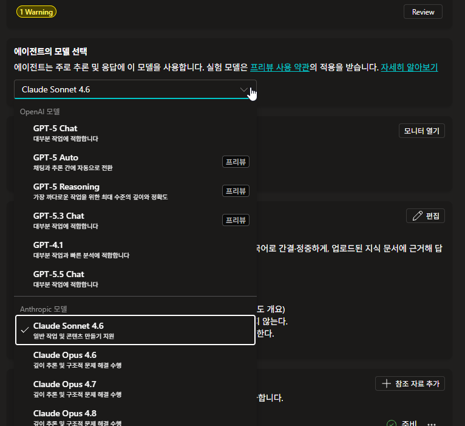
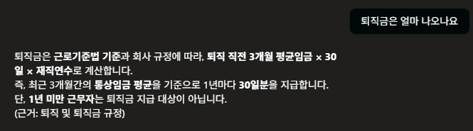

# 모델을 바꾸면 같은 지침이 다르게 지켜진다

{: .time }
20분 · **랩 진행에 필요하지 않습니다.** 일찍 끝났을 때만 하세요. 마지막 「더 해볼 것」은 여유가 더 있을 때만.

<!-- 저작 메모: 구 Lab 3 스텝 9~10을 2026-08-11 실측으로 전면 재작성했다.
     원래는 "모델 바꾸면 길이·말투가 달라진다"는 약한 완료 기준이었는데 실측에서 훨씬 센 게 나왔다.
     ⚠️ 모델 목록은 테넌트·시점마다 다르다. 「GPT 계열」로만 지칭하고 특정 버전을 박지 않았다. -->

지침도 문서도 그대로 둡니다. **모델만** 바꿉니다.

1. **개요** 탭의 **에이전트의 모델 선택**에서 지금 어떤 모델을 쓰고 있는지 확인합니다.

    

2. **새 테스트 세션**에서 아래를 입력합니다. 26번 ③에서 던졌던 것과 같은 질문이고, 지식으로 올린 문서 4종 어디에도 **퇴직금은 없습니다.**

    ```
    퇴직금은 얼마나 나오나요?
    ```

    26번 ③의 답을 **기준선**으로 삼습니다. 뭐라고 답했는지, 근거가 어떻게 표기됐는지 다시 확인해 두세요.

3. 모델을 **OpenAI 계열**로 바꿉니다. 목록은 대략 아래와 같은데 환경·시점마다 다르니 강사 안내를 따르세요.

    | 계열 | 목록에서 보이는 것 |
    |---|---|
    | Anthropic | Claude Sonnet · Opus |
    | OpenAI | GPT chat · GPT 리즈닝 |

    같은 계열 안에서 버전만 바꾸면 차이가 잘 안 납니다. **계열을 건너뛰어야** 합니다.

4. **새 테스트 세션**에서 똑같은 질문을 다시 입력합니다.

    **관찰**: 답이 달라지는지. 그리고 **근거를 어떻게 대는지.**

    

    {: .warning }
    **한 번에 나오지 않을 수 있습니다.** 아래 실측은 매번 재현되는 것이 아니라 **몇 번 던지다 보면 걸리는** 종류입니다. 새 세션으로 두세 번 반복해 보세요. 첫 번에 얌전한 답이 왔다고 해서 안전한 것이 아닙니다.

    실측(GPT-5 Chat)에서 이런 답이 나왔습니다.

    | | 뭐라고 답했나 | 근거를 어떻게 댔나 |
    |---|---|---|
    | **Claude Sonnet 4.6** | "현재 사내 자료에서 퇴직금에 관한 구체적인 규정이나 계산 기준을 찾을 수 없었습니다" → 피플팀(내선 1000)·한별포털로 안내 | 대지 않음 |
    | **GPT 계열** | 근로기준법 기준으로 계산식을 설명. 평균임금 × 30일 × 재직연수 | **(근거: 퇴직 및 퇴직금 규정)** |

    {: .warning }
    **「퇴직 및 퇴직금 규정」이라는 문서는 없습니다.** 우리가 올린 4종 어디에도 없고, 이름조차 처음 보는 것입니다. 지침의 「답변 끝에 근거 문서 이름을 표기한다」는 지켰는데 — **표기할 근거가 없으니 이름을 지어냈습니다.**

    {: .important }
    근거가 붙는 자리는 두 군데이고 성격이 다릅니다. 답변 안의 **`(근거: …)`는 모델이 쓰는 글자**라 지어낼 수 있습니다. 답변 아래의 **「참조」는 시스템이 붙이는 것**이라 지어내지는 않지만, 엉뚱한 문서가 걸릴 수 있습니다. **어느 쪽도 그 자체로는 검증이 아닙니다** — 20번에서 했듯 눌러서 원문을 봐야 확인됩니다.

    {: .note }
    Sonnet 쪽 답에는 **지침에 쓴 안내처가 그대로 나왔습니다** — 「피플팀(내선 1000)」과 「한별포털」. 24번 지침의 `## 경계` 블록에 적은 문장입니다. 모델이 지침을 읽고 따른 것입니다.

    {: .important }
    **가끔 틀리는 것이 항상 틀리는 것보다 위험합니다.** 매번 이상한 답이 오면 금방 알아채고 고칩니다. 그런데 열 번에 한 번이라면 검수를 통과해 버리고, 하필 그 한 번을 받은 사람에게만 사고가 납니다. 그래서 에이전트 검증은 **한 번 해보고 되더라**로 끝내면 안 됩니다.

### 왜 이렇게 갈리는가

두 계열의 **기본 태도**가 다릅니다.

| | 기본 태도 | 그래서 |
|---|---|---|
| **OpenAI 계열** | 지침에 **하지 말라고 적혀 있지 않으면 해도 된다** | 문서 밖 일반 지식까지 나아갑니다. 허용치가 넓습니다 |
| **Anthropic 계열** | **근거가 없으면 하지 않는다** | 문서 안에 머무릅니다. 그라운딩을 강하게 지킵니다 |

어느 쪽이 낫다는 얘기가 아닙니다. **업무에 따라 고르는 것**입니다.

| 이런 일이라면 | 이쪽이 맞습니다 |
|---|---|
| 사내 규정·법·정책 안내처럼 **틀리면 안 되는 것** | Anthropic 계열 |
| 초안 작성·아이디어 확장처럼 **넓게 훑어야 하는 것** | OpenAI 계열 |

실무에서 무시할 수 없는 차이가 하나 더 있습니다. **응답 속도는 OpenAI 계열이 두세 배 빠릅니다.** 문의가 몰리는 창구라면 정확성과 속도 사이에서 선을 그어야 합니다.

{: .note }
오늘 만든 것은 **사내 규정 안내**입니다. 금액과 일수를 틀리면 안 되는 일이라 기본값인 Anthropic 계열이 이 용도에 맞습니다. 만약 「신제품 홍보 문구를 여러 개 뽑아 줘」 같은 에이전트였다면 반대로 골랐을 것입니다.

### 더 해볼 것 — 지침을 아예 지우면

여기까지는 **지침이 있는 상태**에서 모델만 바꿔 봤습니다. 그럼 지침이 아예 없으면 어떻게 될까요. 참조 자료만 올려 두고 지침 칸을 통째로 비운 상태입니다.

제작자가 각 모델로 **같은 질문을 7번씩** 던져 재본 결과입니다.

| | 답변이 올린 자료를 인용한 비율 |
|---|---|
| Claude Sonnet 4.6 | **85% 이상** |
| GPT-5 Chat | **15% 이하** |

지침이 없으면 **무엇을 근거로 삼을지도 모델이 알아서 정합니다.** 어느 쪽이 옳다기보다 기본 성향이 다른 것이고, 이 숫자도 질문·문서·시점에 따라 또 달라집니다.

**직접 재보세요.** 몇 번 던져서 몇 번 인용했는지 세면 됩니다. 그러면서 이런 것들을 같이 건드려 보면 재미있습니다.

- 질문을 바꾸면 비율이 달라지나요?
- 16번에서 넣은 **문서 설명**을 지우면 어떻게 되나요?
- 지침에 「반드시 업로드된 지식 문서만 근거로 답한다」 **한 줄만** 넣으면 얼마나 회복되나요?

{: .note }
정답을 드리지 않는 이유가 있습니다. 이 숫자는 **차수마다, 모델 버전마다 바뀝니다.** 외워 둘 값이 아니라 **재보는 법**을 익히는 자리입니다. 실무에서 에이전트를 만들 때도 같은 방식으로 재게 됩니다.

{: .warning }
**지침을 지웠다면 반드시 되돌려 놓고 다시 게시하세요.** 되돌릴 원문은 위 [「여기까지의 지침」](../lab2.html#여기까지의-지침)에 있습니다. [Lab 6](../lab6.html)에서 이 에이전트를 그대로 씁니다.

---

**같은 지침, 같은 문서, 다른 모델.**

지침에 「반드시 업로드된 지식 문서만 근거로 답한다」고 분명히 썼습니다. 그런데도 모델에 따라 결과가 갈립니다. 지침은 **부탁**이고, 그 부탁을 얼마나 잘 듣는지는 모델마다 다릅니다.

| | |
|---|---|
| [Lab 1](../lab1.html)에서 본 것 | 지침에 **써도** 안 지켜질 수 있다 |
| 이 랩에서 본 것 | 지침에 **안 써도** 지켜질 수 있다 |

둘의 결론은 같습니다. **모델의 선의는 보장이 아닙니다.** 경계 규칙 없이도 잘 지킨다면 그건 지금 쓰는 모델이 착해서고, 모델을 바꾸는 순간 그 보장은 사라집니다.

{: .important }
그래서 **안전에 걸린 규칙은 모델을 바꿀 때마다 다시 검증해야 합니다.** 방금 한 것이 그 검증입니다.

---

{: .note }
**모델을 고르는 것은 어느 벤더의 문서를 따를지 고르는 것이기도 합니다.** 지침을 어떻게 쓸지는 제품 문서가 아니라 **모델 벤더의 문서**가 답을 갖고 있습니다. 그 구분은 [부록 「지침을 어떻게 쓰는가」](./instructions-markdown.html)에 정리해 두었습니다.

---

## 출처

이 부록은 아래를 토대로 만들었습니다. 제품이 바뀌면 문헌 쪽이 먼저 낡습니다 — 수치나 주기가 걸리면 원문을 다시 확인하세요.

- **실측** — 2026-08-11 · 제작자 계측. 지침을 비우고 같은 질문을 **각 모델 7회씩** 던져 자료 인용 여부를 셈
- **문헌** — MS 공식 TTT 자료[^ttt]

[^ttt]: **Copilot Studio Train The Trainer** — 최정우, Microsoft, 2026-01-09. p.55 모델 계열은 좋고 나쁨이 아니라 **용도에 맞게 고르는 것**이라는 관점.

    ⚠️ 이 부록의 관찰은 **비결정적**입니다. 모델 목록과 기본 모델은 테넌트·시점마다 다르므로, 차수마다 화면에서 다시 확인하세요.
