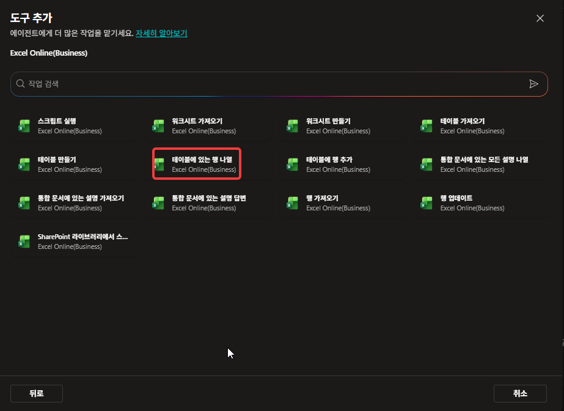
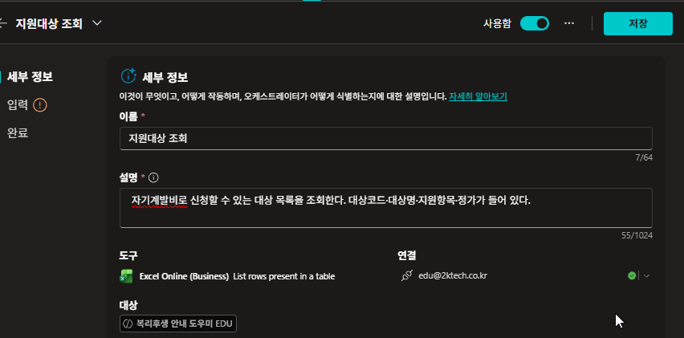
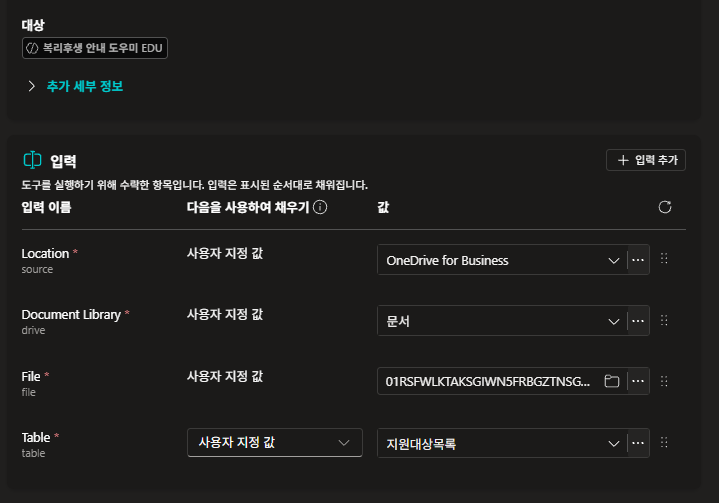
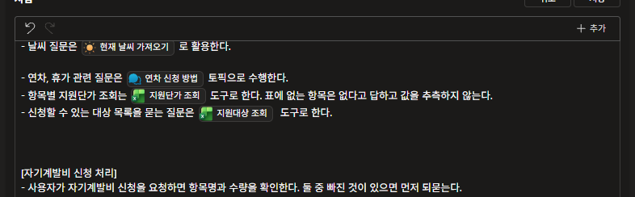
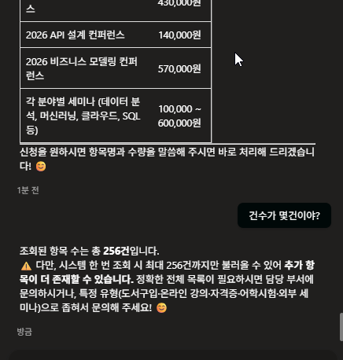
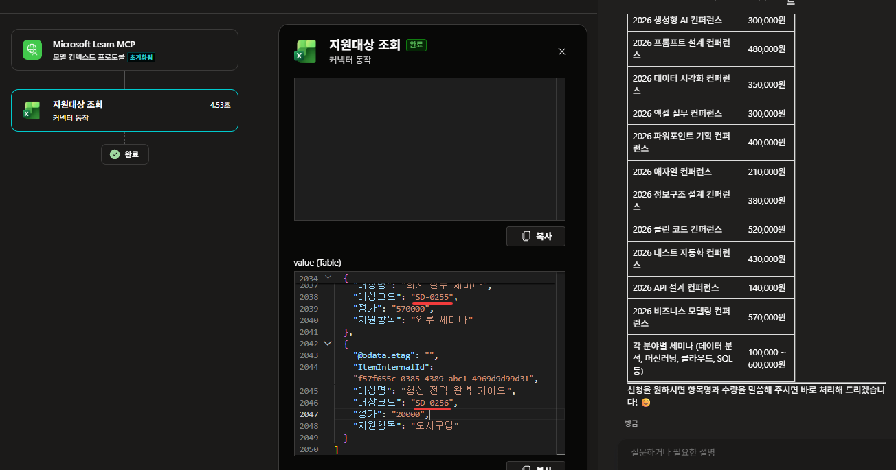
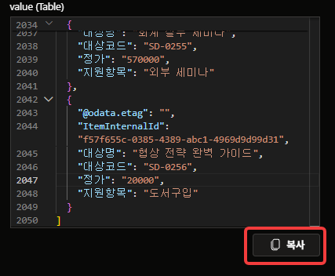
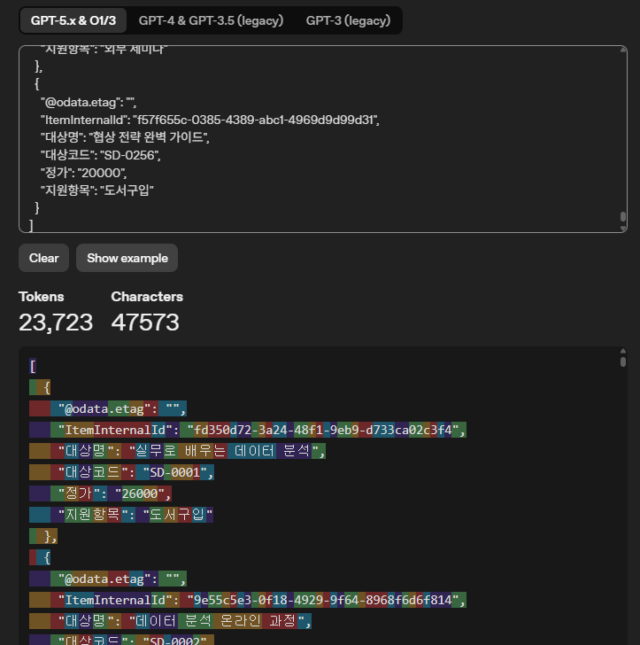
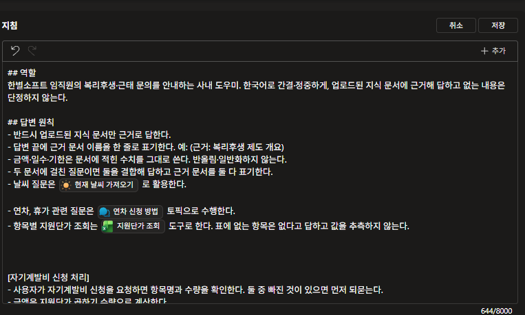
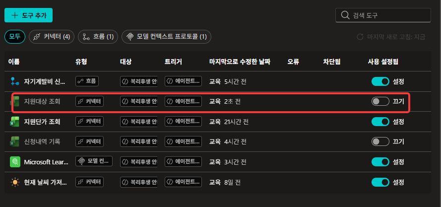

# 읽어 오는 양 — 1,000행짜리 표를 붙이면 📏

{: .time }
약 20분. **랩 진행에 필요하지 않습니다.** [Lab 5](../lab5.html)를 마쳤다면 이어서 할 수 있습니다.

> **이 부록에서 하는 것**: [Lab 5](../lab5.html)에서 쓴 도구를 1,000행짜리 표에 그대로 붙여 봅니다.
> **완성 신호**: 1,000행 중 어디서 끊겼는지 원시 출력에서 짚고, 먼저 알려 주지는 않는다는 것을 확인한다.

---

## 왜 이걸 하나

[Lab 5](../lab5.html) 11번에서 「표를 통째로 읽어 왔다」를 봤습니다. 다만 그 표는 **다섯 행**이라 통째로 와도 아무 일이 없었습니다.

같은 파일에 `지원대상목록` 이 들어 있습니다. **1,000행**입니다. 같은 도구를 여기에 붙이면 무슨 일이 생기는지 봅니다.

<!-- 저작 메모(2026-08-18 신설 · 초안 · 전 스텝 미실측):
     ★ 계기 — Lab 5 11번의 「수천 행짜리 표에 붙이면 그 전부가 넘어갑니다」가 말로만 있었다.
       제작자 사전 확인에서 **1,000행 중 256행에서 끊기고, 답변에는 「총 256건」이라고 적힌다**는
       것이 나왔다. 공식 문서에도 256이 명시돼 있다(Excel 커넥터 Known issues — Pagination).
     ★ 이 부록의 결론은 「많이 와서 느리다」가 아니라 **「덜 왔는데 덜 왔다는 표시가 없다」**다.
       Lab 5 22번(값이 밀렸는데 정상 접수로 보고)과 같은 구조다. 속도 이야기로 흘리지 말 것.
     ★ 도구 이름을 `지원대상 조회` 로 짓게 한다. 본문 도구는 「테이블에 있는 행 나열」 그대로라
       둘이 이름으로 구분된다. MS 문서가 「이름과 설명」을 함께 적는 이유가 여기서 보인다.
       본문 도구 이름은 건드리지 않는다 — 건드리면 Lab 5 컷 여러 장이 낡는다.
     ★ 끝나면 **지침 줄과 도구를 회수한다.** 남겨 두면 Lab 6 27번(도구 목록에서 쓰기 도구를
       비활성화)에서 목록이 헷갈린다. Lab 2 부록이 지침을 되돌리게 하는 것과 같은 처리다.
     2026-08-20 전 스텝 실측(9스텝·10컷). 미실측 4건 중 3건 해소, **결론 하나 정정.**
       ✔ 2. 배열은 **`SD-0256` 에서 닫힌다.** 256이 맞다. 7번 완료 기준을 그 값으로 확정했다.
       ✔ 4. 토크나이저가 버틴다. **23,723 토큰 · 47,573자** — 예상(7만 자)보다 작다.
         ★ 토크나이저 화면에서 `ItemInternalId` 의 GUID가 **토큰 여러 개로 쪼개지는 것**이
           색으로 보인다. Lab 6 11번의 「우리가 넣지 않은 값도 같이 온다」가 여기서 값이 된다.
           「쓰지도 않을 값이 자리를 차지한다」로 important를 하나 더 넣었다.
       ⚠️ **3번이 뒤집혔다 — 이 부록의 축을 고쳤다.**
         첫 질문(「뭐가 있어?」)의 답에는 건수도 경고도 없다. 그런데 **「건수가 몇건이야?」를
         따로 물으면** 「총 256건」 + **「최대 256건까지만 불러올 수 있어 추가 항목이 더
         존재할 수 있습니다」**를 스스로 밝힌다.
         → 기존 축 「덜 왔는데 덜 왔다는 표시가 없다」는 **틀렸다.**
         → 새 축: **「먼저 말해 주지 않는다. 물으면 「더 있을 수 있다」까지는 답하지만,
            1,000이라는 숫자는 끝내 안 나온다.」** 에이전트가 아는 것은 **자기가 받은 256**뿐이고
            표에 몇 행이 있는지는 모른다. 그래서 「담당 부서에 문의하세요」로 넘긴다.
         → Lab 5 22번과의 대비는 오히려 선명해졌다 — 거기서는 **물어봐도 몰랐다.**
            여기서는 **물으면 절반은 답한다.** note로 이었다.
         → 5번을 「표만 나온다」, 6번을 「건수를 따로 물어본다」로 갈랐다.
       ★ 9번을 **삭제 → 끄기**로 바꿨다(컷이 끄기다). Lab 6 25번과 같은 처리라 이유도 선다.
         완료 기준의 「도구 목록이 세 개로 돌아온다」도 뺐다 — 실제 목록은 여섯이다
         (흐름 1 · 커넥터 4 · MCP 1). Lab 6까지 마친 상태에서 찍혔다.
       ★ 컷 번호를 **스텝 번호 기준**으로 맞췄다. 본문이 연번(01~08)이었고 제작자는
         스텝으로 찍었다(07·08·08b·09·09b). **제작자 쪽이 규칙이다.** 06은 결번 —
         5번 컷 하나가 5·6번을 함께 담는다.
       ✔ 1번(이름 칸 편집)은 rv-02에서 `7/64` 가 보인다. 문제없다. -->

---

## 단계

1. [Lab 5](../lab5.html) 6번과 같은 자리에서 **도구 추가**를 엽니다. 아래쪽 탭에서 **Excel Online (Business)** 의 **테이블에 있는 행 나열**을 다시 고릅니다.

    

    {: .note }
    **같은 도구를 두 번 붙입니다.** 커넥터는 하나지만, 무엇을 읽을지 정해 둔 도구는 별개입니다.

2. **세부 정보**에서 **이름**을 아래로 바꿉니다.

    ```
    지원대상 조회
    ```

    이어서 **설명**을 씁니다.

    ```
    자기계발비로 신청할 수 있는 대상 목록을 조회한다. 대상코드·대상명·지원항목·정가가 들어 있다.
    ```

    **완료 기준**: 도구 목록에 이름이 다른 도구가 둘이 된다.

    

    {: .important }
    [Lab 5](../lab5.html) 7번에서도 이름을 바꿨습니다. 커넥터가 붙여 주는 이름은 `테이블에 있는 행 나열 1` · `2` 라 사람도 구분하지 못합니다. MS 문서는 오케스트레이터가 **「이름과 설명」**으로 무엇을 부를지 판단한다고 적습니다 — 설명만 잘 써도 이름이 저 상태면 반쪽입니다.

3. **입력** 항목에서 `Table` 을 **`지원대상목록`** 으로 지정합니다. 나머지 칸은 [Lab 5](../lab5.html) 8번과 같습니다.

    **완료 기준**: `Table` 이 **사용자 지정 값**이고 `지원대상목록` 이다.

    

4. **지침**의 「답변 원칙」 아래에 한 줄을 더합니다. 도구 이름 자리에서 **`/`** 를 누릅니다.

    ```
    - 신청할 수 있는 대상 목록을 묻는 질문은 /지원대상 조회 도구로 한다.
    ```

    **완료 기준**: 도구 이름이 칩으로 바뀐다. 저장합니다.

    

    {: .note }
    이 줄은 부록이 끝나면 **지웁니다.** 9번에서 되돌립니다.

5. **새 테스트 세션**에서 물어봅니다.

    ```
    자기계발비로 신청할 수 있는 게 뭐가 있어?
    ```

    **완료 기준**: 목록이 표로 나온다. 몇 건인지도, 잘렸다는 말도 없다.

6. 이어서 **건수를 따로 물어봅니다.**

    ```
    건수가 몇건이야?
    ```

    **완료 기준**: 「총 256건」이라고 답하고, 더 있을 수 있다는 경고가 붙는다.

    

    {: .important }
물어보니 알려 줍니다. 「시스템 한 번 조회 시 최대 256건까지만 불러올 수 있어 추가 항목이 더 존재할 수 있습니다」라고 스스로 밝힙니다. 5번의 첫 답에는 없던 문장입니다. **먼저 말해 주지는 않습니다.**

    {: .important }
그런데 1,000이라는 숫자는 끝내 안 나옵니다. 에이전트가 아는 값은 자기가 받은 256입니다. 표에 몇 행이 있는지는 모릅니다. 그래서 「담당 부서에 문의하시거나 특정 유형으로 좁혀서 문의해 주세요」로 넘깁니다 — **얼마나 빠졌는지는 아무도 모릅니다.**

    {: .note }
[Lab 5](../lab5.html) 22번에서는 물어봐도 몰랐습니다. 값이 밀려 들어갔는데 「5건 모두 정상 접수」였습니다. 이번에는 **물으면 절반은 답합니다.**

7. **계약 테스트 창**에서 도구 상자를 눌러 **원시 출력**을 엽니다. `value` 배열의 길이를 셉니다.

    **완료 기준**: 배열이 `SD-0256` 에서 닫힌다. `SD-1000` 은 없습니다.

    

    {: .important }
**오류가 아닙니다.** `statusCode` 는 `200` 이고 상자에는 체크가 붙습니다. 성공적으로 끝난 호출인데 전부 오지 않았습니다. [Lab 5](../lab5.html) 22번에서 값이 밀려 들어갔는데 「5건 모두 정상 접수」로 보고했던 그 자리입니다.

    {: .note }
이 커넥터는 **기본적으로 최대 256행을 돌려줍니다.**[^learn-excel] 전부 가져오려면 페이지 매김을 켜야 하는데, 그 설정은 도구 화면에 없습니다 — [Lab 6](../lab6.html)의 흐름으로 내려가야 나옵니다.

8. `value` 옆의 **복사**를 눌러 원시 출력을 전부 가져와, 토크나이저에 붙여 넣습니다. [부록 「에이전트 안에서 일어나는 일」 2부](./inside-the-agent.html)에서 쓴 그 도구입니다.

    

    **완료 기준**: 토큰 수를 숫자로 읽는다. 실측에서는 23,723 토큰 · 47,573자였습니다.

    

    {: .important }
**이 숫자가 질문 한 번에 오케스트레이터로 넘어간 양입니다.** 사용자는 「뭐가 있어?」 여섯 글자를 물었습니다. 지식 문서를 아무리 잘 정리해도, 도구가 이만큼을 실어 나르면 길이는 그쪽에서 정해집니다.

    {: .important }
색이 칠해진 것을 봅니다. `ItemInternalId` 의 `fd350d72-3a24-48f1-9eb9-d733ca02c3f4` 한 줄이 토큰 여러 개로 쪼개집니다. [Lab 6](../lab6.html) 11번에서 「우리가 넣지 않은 값도 같이 온다」고 지나쳤던 그 값입니다. **쓰지도 않을 값이 자리를 차지합니다.**

    {: .note }
    이것이 **256행어치**입니다. 1,000행이 다 왔다면 네 배입니다.

9. 되돌립니다. 먼저 **지침에서 4번에 더한 줄을 지웁니다.**

    **완료 기준**: 지침이 이 부록을 시작하기 전과 같아진다.

    

    이어서 **도구 목록에서 `지원대상 조회` 의 사용 설정을 끕니다.**

    **완료 기준**: `지원대상 조회` 가 회색 **끄기** 상태가 된다.

    

    {: .note }
    지우지 않고 **끕니다.** [Lab 6](../lab6.html) 25번에서 쓰기 도구를 껐던 것과 같은 처리입니다 — 다시 해보고 싶을 때 켜면 됩니다.

    {: .warning }
    **반드시 되돌립니다.** 지침 줄을 남겨 두면 이어지는 랩이 다른 조건에서 돌아가고, 도구를 켠 채 두면 [Lab 6](../lab6.html) 25번에서 무엇을 꺼야 할지 헷갈립니다.

---

## 더 해볼 것 — [Lab 6](../lab6.html)을 마쳤다면

흐름 안의 「테이블에 있는 행 나열」에는 도구 화면에 없던 것이 둘 있습니다.

| | 무엇을 정하나 |
|---|---|
| **필터 쿼리** | 어떤 것을 읽을지 |
| **최대 개수** | 몇 개를 읽을지 |

같은 `지원대상목록` 을 흐름에서 읽어 보면 1,000행이 한 줄이 됩니다. [Lab 6](../lab6.html) 12·13번에서 한 것과 같은 조작입니다.

{: .note }
필터에 쓸 수 있는 함수는 **`eq` · `ne` · `contains` · `startswith` · `endswith`** 다섯 개이고, **한 열에 함수 하나**만 걸립니다.[^learn-excel] `지원항목 eq '온라인 강의'` 는 되고, 두 조건을 한 열에 겹치는 것은 안 됩니다.

---

## 확인

{: .checklist }
- ① 같은 커넥터로 도구를 하나 더 만들고 **이름을 구분되게** 지었다
- ② 1,000행짜리 표를 읽었는데 **전부 오지 않는다**는 것을 원시 출력에서 확인했다
- ③ 그 사실이 **답변에도 오류에도 드러나지 않는다**는 것을 확인했다
- ④ 질문 한 번에 넘어간 양을 **토큰 수로** 봤다
- ⑤ 지침 줄과 도구를 되돌렸다
{: .checklist }

---

## 출처

이 부록은 아래를 토대로 만들었습니다. 제품이 바뀌면 문헌 쪽이 먼저 낡습니다 — 수치나 주기가 걸리면 원문을 다시 확인하세요.

- **실측** — 2026-08-20 · 전 스텝 실측(9스텝·10컷). 배열은 `SD-0256` 에서 닫혔고, 원시 출력은 23,723 토큰이었습니다
- **문헌** — Excel Online (Business) 커넥터 문서[^learn-excel]

[^learn-excel]: [Excel Online (Business) — Microsoft Learn](https://learn.microsoft.com/en-us/connectors/excelonlinebusiness/) (확인 2026-08-18). 「List rows present in a table」 항목에 **「기본적으로 최대 256행을 돌려준다. 전부 가져오려면 페이지 매김을 켜라」**고 적혀 있습니다. 필터 쿼리는 `eq` · `ne` · `contains` · `startswith` · `endswith` 만 지원하고 **한 열에 함수 하나**, 정렬도 **한 열만** 됩니다.
