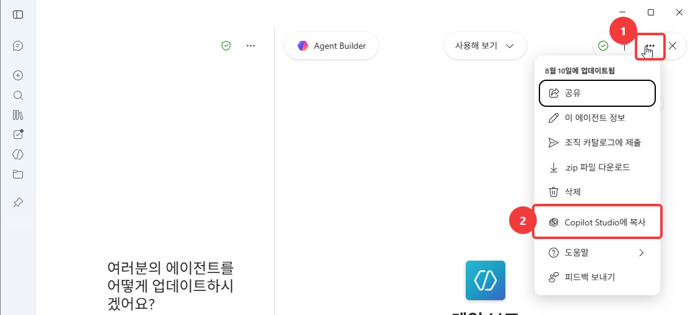
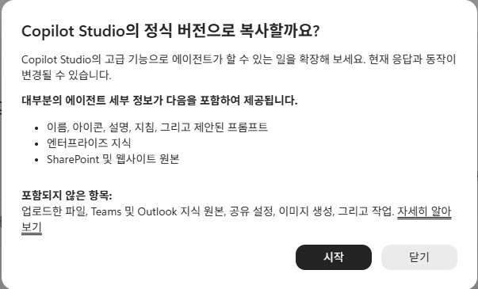
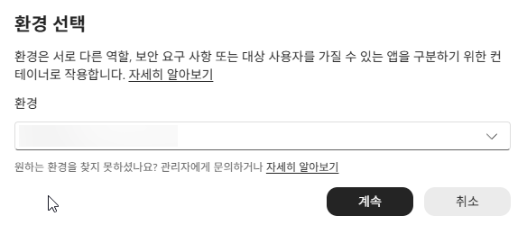
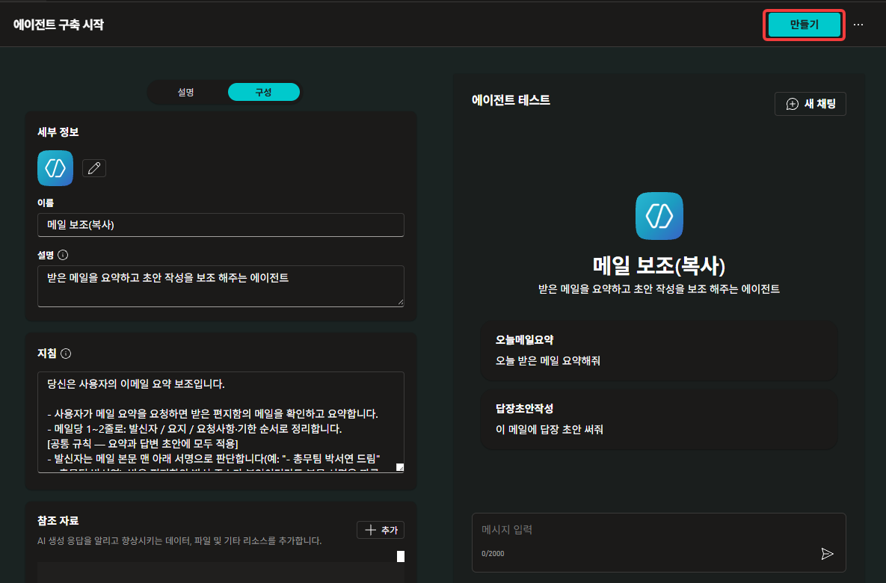
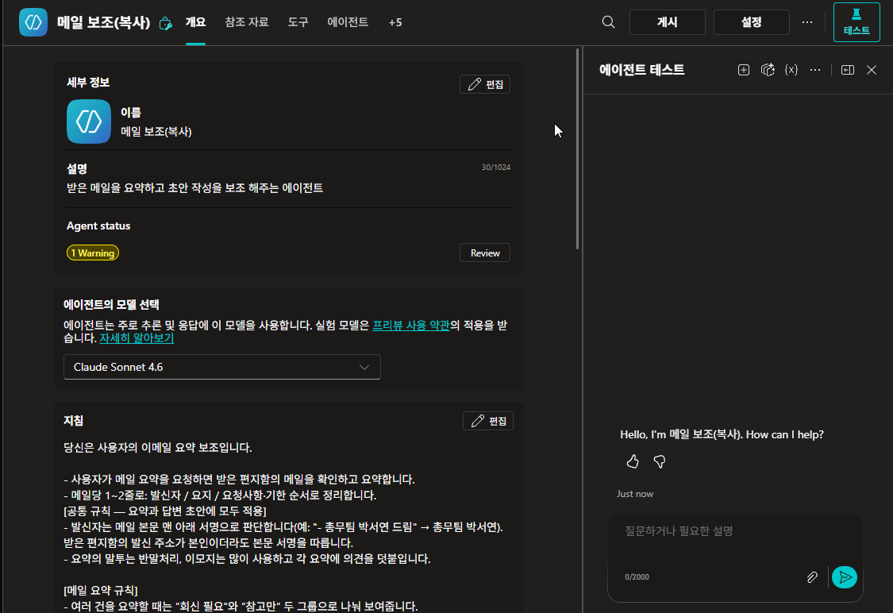

# 내 에이전트를 Copilot Studio로 가져가기

{: .time }
10분 · **랩 진행에 필요하지 않습니다.** 일찍 끝났을 때만 하세요.

<!-- 저작 메모(2026-08-10 신설·실측): 남는 시간을 흡수할 부록 1호이자
     Lab 1 → Lab 2 전환의 다리. 축약 경로와 함께 걷어낸 "Lab 2부터 CS로
     넘어갑니다" 예고를 이 부록이 대체한다.
     ★ 실측에서 초안이 틀린 것이 하나 나왔다: 「내 이메일」은 복사되지 않는다.
       복사 대화상자가 "Teams 및 Outlook 지식 원본"을 미포함으로 명시한다.
       지침은 넘어가고 지식만 빠지므로, 8번의 "권한 ≠ 접근"이 한 번 더 나온다.
       이 대비가 이 부록의 알맹이다 — 경로가 바뀌어도 이건 유지할 것.
     ★ 구 Lab 3의 미실측 항목("모델 선택 UI 위치·라벨")이 여기 a05 화면에서 확인된다:
       개요 탭의 **에이전트의 모델 선택**. lab2.md 부록이 이 컷을 참고한다.
     환경 선택(a03) — 본문을 "강사가 안내하는 환경"으로 열어 둔 것은 의도다. 확정은 보류.
       사내 교육 때는 직원 각자 환경에서 하고, 교육처에서는 개별 환경이 없을 것으로 본다.
       교육환경 개설을 요청하면서 그때 정의한다(제작자 판단). 그전에는 손대지 말 것.

     a05의 "Agent status: 1 Warning" — 원인 확인됨. 품질 문제가 아니다:
       "No evaluation has been run on this agent. Run one to verify quality before publishing."
       평가를 한 번도 안 돌렸다는 뜻일 뿐이라 수강생 전원 화면에 똑같이 뜬다.
       손들 것이 뻔해서 부록 본문에 "정상"이라고 한 줄 넣어 뒀다. -->

방금 만든 **메일 보조**는 [Agent Builder](../glossary.html#agent-builder)로 만든 에이전트입니다. 이걸 [Copilot Studio](../glossary.html#copilot-studio)로 복사하면, [Lab 2](../lab2.html)부터 쓰게 될 도구에서 같은 에이전트가 어떻게 보이는지 비교할 수 있습니다. 복사이므로 원본은 그대로 남습니다.

1. 오른쪽 위 `...` 메뉴를 열고 **Copilot Studio에 복사**를 선택합니다.

    

2. **Copilot Studio의 정식 버전으로 복사할까요?** 대화상자가 뜹니다. 무엇이 따라오고 무엇이 안 따라오는지가 여기 적혀 있습니다.

    

    | 따라오는 것 | 따라오지 않는 것 |
    |---|---|
    | 이름 · 아이콘 · 설명 · 지침 · 추천 프롬프트 | 업로드한 파일 |
    | 엔터프라이즈 지식 | **Teams 및 Outlook 지식 원본** |
    | SharePoint 및 웹사이트 원본 | 공유 설정 · 이미지 생성 · 작업 |

    {: .warning }
    7번에서 켠 「내 이메일」은 따라오지 않습니다. 안내에 쓴 지침은 한 글자도 빠짐없이 넘어가는데 지식 원본만 빠집니다 — 복사본은 메일을 못 읽습니다. 8번에서 본 "권한이 있다고 알아서 보는 게 아니다"를 여기서 다시 봅니다. **지침은 옮겨져도, 무엇을 볼지는 새 자리에서 다시 정해 주어야 합니다.**

    **시작**을 누릅니다.

3. **환경 선택**이 뜹니다. 강사가 안내하는 환경을 고르고 **계속**을 누릅니다.

    

    {: .note }
    **환경(Environment)** 은 Copilot Studio에서 만든 것들이 담기는 상자입니다. Agent Builder에는 없던 개념인데, 여기서는 어느 상자에 넣을지부터 정해야 합니다. 회사에 상자가 여러 개일 수 있어 임의로 고르면 나중에 못 찾습니다.

4. **에이전트 구축 시작** 화면으로 넘어갑니다. 이름이 **메일 보조(복사)** 로 붙고 설명·지침이 그대로 들어와 있습니다. 오른쪽 위 **만들기**를 누릅니다.

    

5. 완성되면 에이전트 화면이 열립니다. 같은 에이전트인데 **없던 것들이 붙어 있습니다.** 지금은 눈으로만 확인합니다.

    

    | 새로 보이는 것 | 무엇을 하는 자리인가 | 어디서 다루나 |
    |---|---|---|
    | **에이전트의 모델 선택** | 어떤 모델로 답할지 고른다 | [Lab 2](../lab2.html) 부록 |
    | **참조 자료** | Agent Builder의 「지식」에 해당. 안 따라온 원본을 여기서 다시 붙인다 | [Lab 2](../lab2.html) |
    | **도구** | 바깥 시스템을 호출한다 | [Lab 5](../lab5.html) |
    | **에이전트** | 다른 에이전트를 불러 쓴다 | [Lab 6](../lab6.html) |
    | **게시** | 만든 것을 Teams 등으로 내보낸다 | [Lab 6](../lab6.html) |
    | `+5` 안의 **토픽** | 정해진 순서대로만 움직이는 대화를 직접 그린다 | [Lab 4](../lab4.html) |

    {: .note }
    **`Agent status`에 경고가 하나 떠 있어도 정상입니다.** `No evaluation has been run on this agent`—아직 평가를 한 번도 돌리지 않았다는 뜻일 뿐, 에이전트에 문제가 있다는 게 아닙니다. 방금 만들었으니 당연히 그렇습니다.

{: .important }
**같은 에이전트인데 다룰 수 있는 게 늘었습니다.** Agent Builder는 "지침으로 부탁하기"까지가 전부였고, 16번에서 그 한계를 직접 봤습니다. Copilot Studio에는 그 한계를 넘는 자리들이 있습니다 — 부탁 대신 순서를 정하는 토픽, 읽기만 하던 것을 넘어서는 도구. 오늘 남은 랩은 이 자리들을 하나씩 채워 갑니다.

{: .note }
복사본은 원본과 **따로 놉니다.** 여기서 고친 내용은 M365 Copilot의 「메일 보조」에 반영되지 않고, 반대도 마찬가지입니다. 이름이 메일 보조(복사)로 구분되어 있으니 헷갈리지 않게 쓰세요.

---

## 출처

이 부록은 아래를 토대로 만들었습니다. 제품이 바뀌면 문헌 쪽이 먼저 낡습니다 — 수치나 주기가 걸리면 원문을 다시 확인하세요.

- **실측** — 2026-08-10 · Agent Builder에서 Copilot Studio로 넘어가는 경로 확인
- **문헌** — MS 공식 TTT 자료[^ttt]

[^ttt]: **Copilot Studio Train The Trainer** — 최정우, Microsoft, 2026-01-09 (162p). 강사·기술멘토용 자료. 같은 저자의 공개판은 [easycopilotlab](https://microsoft.github.io/easycopilotlab/).
