# Lab 1. 지식 기반 챗봇 🧑‍💼

<!-- 2026-09-11 번호 변경: 입문 Lab 2 → TDG Lab 1. 파일·자산·덱 경로와 본문의 Lab 번호는 새 번호로 바꿨다.
     아래 저작 메모 안의 「Lab N」은 입문 번호 그대로다(이력이라 고치지 않았다). 입문 2·4·5·6 = TDG 1·2·3·4. -->

<!-- 2026-09-14 /tone: .note·.important 21개를 .warning 3 · 평문 14 · 삭제 4로 정리했다.
     본문에서 뺀 랩 간 의존을 여기 남긴다.
     - 4번 이니셜 경고: 새 Lab 4에서 목록에서 이 에이전트를 골라 붙인다
     - 10번 연결된 에이전트 허용: 새 Lab 4에서 이 에이전트를 도구로 붙이는 조건이다
     - 28번 날씨 질문: 새 Lab 3이 도구를 붙인 뒤 같은 질문을 다시 던진다
     19번의 「9번과 같은 질문을 세 번째로」는 옛 스텝 번호였다. 13번으로 고쳤다. -->

> **이번 랩 완성물**: 한별소프트 복리후생 안내 에이전트([지식](./glossary.html#knowledge) 4종 + [지침](./glossary.html#instructions) 2단계 + 경계 검증)
> **예상 시간**: 40분 (순수 핸즈온) · 도입 개념 설명 10분은 별도 · 부록 20분은 선택
> **완성 신호**: "내 남은 연차 며칠?"에 숫자를 지어내지 않고 안내로 넘긴다

{: .time }
40분 타이머 — 「단계」 1번부터 켭니다.

**인터미션 슬라이드** — 랩 시작 전 강사가 설명하는 개념입니다. [브라우저로 보기](../assets/decks/lab1-intermission.html) · [PDF](../assets/decks/lab1-intermission.pdf)

<!-- 저작 메모(2026-08-11 통합): 구 Lab 2(지식) + 구 Lab 3(지침 A/B/C·범위 밖 질문)을 합쳤다.
     통합 근거:
     (1) 분량. 실제 작업은 생성·업로드·지침·설정·테스트뿐이라 클릭만 10~15분이다.
         구 Lab 2의 35분은 인덱싱 대기라는 빈 시간을 메우려고 콘텐츠를 얹은 결과였다.
     (2) 중복. 구 Lab 3의 지침 A/B/C는 구 Lab 2와 질문·지침 블록이 문자열 단위로 같았고,
         Lab 1의 가드레일 On/Off와도 교훈이 겹쳐 같은 얘기를 세 번 하는 구조였다.
         → 별도 실험을 없애고 "지침을 2단계로 나눠 붙이는" 자연스러운 순서로 흡수했다.
     구 Lab 3에서 옮겨간 것:
       - 스텝 9~10 모델 교체 → 이 랩 부록. 모델 목록이 테넌트·시점마다 다르고
         완료 기준이 주관적이라 본문에 두면 45명 결과가 제각각이 된다.
       - 스텝 11~14 토크나이저·크레딧 → `appendix/inside-the-agent.md` 2부.
         비용은 성격이 다르고 외부 웹툴에 의존한다. 랩이 아니라 설명+실습이 맞다.
       - 스텝 6 범위 밖 질문(날씨) → 이 랩 스텝 9. Lab 5와의 대구가 여기 걸려 있어 반드시 유지.
     구 Lab 2에서 옮겨간 것:
       - 스텝 7 RAG 수동 매칭 → `appendix/inside-the-agent.md` 1부.
     ★ 지식 소스가 4종으로 교체됐다(2026-08-11). 회사명이 한별소프트로 교안과 일치하고
       용어도 한별포털·피플팀·별포인트로 통일됐다. 수치가 전부 바뀌었으니 옛 값을 되살리지 말 것:
       별포인트 연 120만 원(분기 30만 적립) / 결혼 경조금 100만 원 / 식대 월 20만 원 한도 /
       자기계발비 연 50만 원 / 건강검진 30세 격년·40세 매년.
     2026-08-11 삭제: "테스트 채팅은 무료입니다. 마음껏 시도해도 되는 이유입니다" 팁.
       (1) 공시상 무료라도 실제로 그렇지 않은 경우가 있어 사실 관계가 불확실하다. 확인되지 않은
           주장을 교안에 두지 않는다 — Lab 1의 "Graph 권한 상속" 건과 같은 종류의 위험이다.
       (2) "마음껏 시도해도 된다"는 안심시키는 말투이고 근거도 약하다.
       (3) 뒷부분(에이전트 흐름 안 프롬프트는 크레딧 소모)은 이 랩에서 흐름을 쓰지 않으므로
           자리가 아니다. 비용 이야기는 appendix/inside-the-agent.md 2부가 소관이다.
       되살리려면 요율·과금 조건을 먼저 실측할 것.

     2026-08-11 실측 정정: 추천 프롬프트는 Copilot Studio 테스트 패널에 나오지 않는다.
       섹션 설명이 "Teams 및 Microsoft 365 채널에 대한 대화를 시작하는 방법을 제안합니다"라고
       명시한다 — 게시해서 그 채널에 올라간 뒤에만 보인다. 스텝 8의 완료 기준을
       "테스트 창에 카드 2개가 보인다"에서 "목록에 2줄이 저장된다"로 고쳤고,
       스텝 9는 카드 클릭 대신 직접 입력으로 바꿨다.
       Lab 1의 Agent Builder는 미리보기에 바로 보였기 때문에 그 감각을 그대로 옮긴 것이 원인이다.
       ※ MS 문서: 게시 후에도 캐시·세션 때문에 즉시 안 보일 수 있다(브라우저/Teams/CDN).
         안 보이면 저장·게시 확인 → 새 채팅 세션 → Teams 캐시 삭제 → 채널 재추가 순으로 본다.

     2026-08-11 실측 정정(2): 스텝 순서를 바꿨다. 설정을 먼저 다 하고 기준선 질문을 한 번만 던진다.
       원인 — 「웹의 정보 사용」은 **기본값이 끄기**다. 손대기 전 컷(lab1-11)에서 이미 꺼져 있다.
       그래서 "웹 켜진 상태 → 끈 상태" 대비가 애초에 성립하지 않았다. 소재가 가상 회사라
       웹을 일부러 켜도 답이 달라지지 않는다(lab1-13에서 확인: 웹 없이도 "찾지 못했다"고 답한다).
       같은 질문 4회 → 3회로 줄었다(기준선 / 참조 자료 후 / 지침 후).
     2026-08-11 발견: 설정 > 생성형 AI에 **연결된 에이전트 > 다른 에이전트가 이 에이전트에
       연결하여 사용하도록 허용** 토글이 있다.
       기본값이 켜기로 보이나 스텝 10에서 확인하게 했다. CLAUDE.md의 "연결된 에이전트 게시
       선행조건" 실측 항목이 이것으로 일부 풀린다.

     2026-08-11 실측 정정(5): 경계 규칙 전후 비교(구 27·28번)를 **삭제**했다.
       실측 — 답변 원칙 첫 줄("반드시 업로드된 지식 문서만")을 빼도 Sonnet 4.6은
       "퇴직금은?"에 "사내 자료에서 찾을 수 없었습니다"로 답하고 피플팀·한별포털로 안내한다.
       지침이 아니라 **모델이 막는 것**이다. 어떤 지침 배치로도 전후 대비가 안 나온다.
       본문에서 모델을 GPT로 바꿔 비교하는 안도 검토했으나 기각 — 45명이 되돌리는 걸 잊으면
       Lab 4~7이 통째로 오염된다. 그 대비는 부록이 이미 더 잘 한다.
       대신 지침을 한 번에 붙이고(24번) 게시한 뒤(25번), **성격이 다른 세 질문**으로
       한 번에 검증한다(26번): 문서에 있는 것 / 기준은 있고 데이터는 없는 것 / 아예 없는 것.
       "지식은 무엇을 아는가, 지침은 무엇을 말해도 되는가"라는 교훈은 그대로 살아남는다.
       30 → 28스텝. 표기 35분 유지(28 × 1.25 = 35).

     2026-08-11 실측 정정(4): 경계 규칙 실험이 Lab 1의 함정을 반복하고 있었다.
       기본 모델 Claude Sonnet 4.6은 경계 규칙 없이도 "내 잔여 연차"에 안내로 넘긴다.
       "발송해줘"에 모델이 알아서 거절해 Lab 1 T4가 무효였던 것과 같은 구조다.
       원인 — "내 연차"는 모델이 **알 수 없음이 자명한** 질문이라 규칙이 없어도 거절한다.
       숨기지 않고 28번 note로 인정했고 진짜 검증은 부록(모델 대조)으로 넘겼다.
     ★ 그 부록이 본문급 소재가 됐다(2026-08-11 실측):
       GPT 계열에 "퇴직금은 얼마나 나오나요?"를 물으면 문서에 없는 내용을 근로기준법
       일반 상식으로 상세히 답하고 **참조에 「02. 휴가·근태 안내.pdf」를 붙인다.**
       그 문서에 퇴직금은 없다 — 근거 표시가 거짓이다. Sonnet 4.6은 그라운딩 준수가 압도적.
       20번에 "참조가 붙었다고 믿지 말 것" 경고를 복선으로 깔고 부록에서 회수한다.
     ★ 모델 계열 차이 — 제작자 관점(2026-08-11). 교안 본문에는 **동작으로** 서술했고
       라벨은 여기 남긴다. 강사가 구두로 쓸 표현이다:
         "Anthropic은 화이트리스트 스타일, OpenAI는 블랙리스트 스타일"
         = Claude는 **허용된 것(근거가 있는 것)만** 답한다. "없는 건 하지 말아야 한다"로
           RAG 준수를 강하게 지지한다.
           GPT는 **금지된 것만 막고 나머지는 허용**한다. 지침에 하지 말라는 규정이 없으면
           범용 답변 허용치가 높다.
       (2026-08-11 정정: 처음 메모에 두 라벨이 뒤바뀌어 있었다. 통상적인 보안 용어 기준으로
        화이트리스트 = 허용 목록에 있는 것만 통과다.)
       응답 속도는 OpenAI 계열이 2~3배 빠르다(제작자 실측). 정확성과 속도의 트레이드오프로
       본문에 넣었다 — TTT p.55 "나쁜 게 아니라 용도에 맞게 쓰자"와 같은 결이다.
     2026-08-11 모델 목록 실측(lab1-a01 컷, 변동 주의):
       OpenAI = GPT-5 Chat / GPT-5 Auto(프리뷰) / GPT-5 Reasoning(프리뷰) /
                GPT-5.3 Chat(프리뷰) / GPT-4.1 / GPT-5.5 Chat
       Anthropic = Claude Sonnet 4.6(기본) / Claude Opus 4.6 · 4.7 · 4.8
       교안에는 계열만 적고 버전을 박지 않았다.
     ★ 「더 해볼 것」 절의 수치는 제작자 계측(2026-08-11): 지침을 통째로 비우고 참조 자료만
       남긴 상태에서 같은 질문을 **각 모델 7회씩** 던져 자료 인용 여부를 셌다.
       Sonnet 4.6 = 85% 이상, GPT-5 Chat = 15% 이하.
       열린 케이스로 썼다 — 정답을 주지 않고 "직접 재보라"로 남긴다. 차수·버전마다 값이
       바뀌므로 외울 숫자가 아니라 **재보는 법**을 익히는 자리다.
     ⚠️ 부록 실측은 **비결정적**이다(제작자 2026-08-11). "매번 그런 게 아니라 몇 번 테스트하다
       보면 걸린다." 교안은 단정하지 않고 "몇 번 던져 보라"로 썼고, 완료 기준도 관찰로만 둔다.
       이 비결정성 자체를 {: .important }로 살렸다 — 가끔 틀리는 것이 항상 틀리는 것보다
       위험하다는 것. Lab 1의 "지침 준수는 비결정적"과 같은 결이다.
     ★ 부록 실측(lab1-a03, GPT-5 Chat): GPT 계열이 퇴직금을 근로기준법으로 답하면서
       **`(근거: 퇴직 및 퇴직금 규정)`이라고 썼다. 그런 문서는 존재하지 않는다.**
       앞서 관찰한 "참조에 02.휴가·근태를 붙임"보다 강한 증거다. 둘은 층위가 다르다 —
       `(근거: …)`는 모델이 쓰는 글자라 날조 가능, 「참조」는 시스템이 붙이는 것이라
       날조는 안 되지만 엉뚱한 문서가 걸린다. 부록 콜아웃에서 이 구분을 짚는다.
       같은 계열 내 버전 차이로는 대비가 안 나므로 "계열을 건너뛰라"고 명시했다.
       ※ 중급 교안에도 모델 선택 언급이 약간 있다. 입문 부록은 선택 항목이라 중복은 무해하나,
         중급 일반화 작업 시 두 곳의 서술이 어긋나지 않는지 한 번 대조할 것.
     ⚠️ 이 대비는 기본 모델이 Sonnet일 때 성립한다. 기본이 GPT로 바뀌면 방향을 뒤집어야 한다.

     2026-08-11 실측 정정(3): 스텝 18~24 촬영분 반영.
       - 상태 라벨이 「준비됨」이 아니라 **「준비」**다. lab1.md·참고 페이지 전부 정정했다.
       - ★ 별포인트 질문의 근거가 **문서 두 건**(01 제도 개요 + 04 FAQ)으로 잡힌다.
         20번 완료 기준을 "01이 근거로 표시된다"에서 "두 건이 잡힌다"로 고쳤다.
         04 FAQ에도 별포인트 Q&A가 있으니 당연한데 저작 시 놓쳤다. 오히려 교육 포인트라
         {: .important }로 올렸다 — 한 답변이 문서 하나에서만 나오지 않는다는 것,
         그리고 문장마다 붙는 각주 번호가 그 문장의 출처를 가리킨다는 것.
       - 인용 라벨은 「참조」다(「N 참조」로 접혀 있다). Lab 1의 M365 Copilot과 같다.
       - 지침은 바로 입력하는 칸이 아니라 **편집** 버튼을 눌러야 열린다. 24번을 두 컷으로 나눴다.

     2026-08-11 실측: 인덱싱 소요시간 = 평균 5분, 최대 10분(PDF 4종 기준, 단독 사용자).
       참고 페이지 1부가 이 시간을 그대로 흡수한다. 붕 뜨지 않는다.
       ⚠️ 45명 동시 업로드 시에도 같은지는 미확인. 리허설에서 재확인할 것.
     2026-08-11 밀도 재구성(3차): 26 → 30스텝. 중급 lab2를 대조해
     빠져 있던 필수 요소를 회수했다. 중급은 14스텝 10분이라 스텝당 시간은 다르지만 방식은 같다.
     회수한 것:
       - 근거 없는 응답 허용 = ON 확인(11번). ★ 끄면 "모른다" 응답이 폴백으로 차단되어
         이 랩의 마지막 검증(경계)이 통째로 성립하지 않는다. 가장 큰 누락이었다.
       - 게시(Publish)(25·27번). 저장만으로는 지침이 반영되지 않는다. 중급 저작 메모에도
         "지침 바꿔도 동작이 그대로면 게시 여부 먼저 확인"이 경고로 있다.
       - 지식 문서별 설명 입력(16번). 오케스트레이터가 어느 문서를 뒤질지 고를 때 참고한다.
       - 스키마 이름 영문 직접 입력(4번). 한글 이름만 넣으면 스키마명이 공란이 된다.
       - 사용자 반응 수집 끄기(12번).
       - 「이번 랩 새 용어」 표. 중급의 랩 진입 방식을 그대로 가져왔다.
       - 지침을 마크다운 구조(## 역할 / ## 답변 원칙 / ## 경계)로. 중급과 통일했다.
       - 새 테스트 세션 강조. 설정·지침 변경 후마다.
     표기 30 → 35분(30스텝 기준).

     2026-08-11 밀도 재구성(2차): 14스텝 → 26스텝. 표기 30분 ÷ 1.25 = 24스텝이 필요한데
     14스텝은 baseline이 절반이었다. 스텝 무게를 저울질하지 않고 단순 계산으로만 잡는다(CLAUDE.md §2).
     늘린 방식은 padding이 아니라 실제 조작을 빠짐없이 펼친 것 —
     로그인/환경확인/생성방식선택/이름/개요탭확인/설명/추천프롬프트/카드클릭을 각각 세우고,
     지식 업로드도 탭 이동과 파일 선택을 나눴다. 문서 4종을 각각 겨냥한 질문 3개(18~20번)를
     새로 넣어 "4종이 다 인덱싱됐는가"를 검증하게 했다 — 준비 절의 파일 설명표와 대응된다.

     2026-08-11 밀도 재구성(1차): 9스텝(약 12분) → 14스텝. 스텝당 1~1.5분 기준으로 20분 내외가 되어
     개념 10분과 합쳐 30분이 된다. 채운 방식은 분량 늘리기가 아니라 **같은 질문 하나를
     조건을 바꿔가며 네 번 던지는 누적 구조**다:
       4번 아무것도 없음(웹검색 ON) → 5번 웹검색 OFF → 9번 지식 등록 → 11번 지침 추가.
     확인 절 첫머리의 4행 표가 이 네 번을 회수한다. Lab 1의 마스킹 On/Off가 반복 실험이라면
     이쪽은 누적이라 같은 구조를 두 번 쓰는 느낌이 나지 않는다.
     신규 스텝 3(설명·추천 프롬프트)은 Lab 1 Agent Builder와 같은 자리를 CS에서 다시 만지는 것이고,
     신규 스텝 10(인용 펼쳐 근거 확인)은 참고 페이지 1부의 그라운딩이 실제로 일어난 증거를 눈으로 보는 자리다.
     ⚠️ 미실측: 4번(웹검색 ON, 지식 없음)에서 무슨 답이 나오는지. 한별소프트가 가상 회사라
       웹에서 못 찾을 수 있고, 그러면 4번과 5번의 대비가 약해진다. 둘 다 완료 기준을
       "관찰"로 둔 이유다. 리허설에서 확인하고 대비가 없으면 두 스텝을 하나로 합칠 것.
     ⚠️ 미실측: 10번의 인용 표시가 CS에서 어떤 UI로 나오는지. Lab 1 실측에서 M365 Copilot은
       답변 하단에 "참조" 목록으로 나왔으나 CS는 다를 수 있다.
     ⚠️ 문서에 답이 없는 질문 2개 — 옛 지식 소스엔 있었으나 새 4종에서 빠졌다:
       "반차 얼마 차감되나요"(02는 "반차(4시간)"까지만, 차감 일수 없음),
       "재택일 식대"(규정 자체가 없음). 확인 절 추가 질문에서 뺐다. 문서에 넣으면 되살릴 것. -->

---

## 이번 랩 새 용어

| 용어 | 화면에서 | 한 줄 |
|---|---|---|
| [지식 (Knowledge)](./glossary.html#knowledge) | 상단 **참조 자료** 탭 | 답변의 **근거 문서**. 화면 라벨은 「참조 자료」. 이 랩에서는 복리후생 문서 4종 |
| [지침 (Instructions)](./glossary.html#instructions) | **개요** 탭의 큰 입력칸 | 에이전트의 **행동 규칙**을 자연어로 적은 것 |
| [RAG](./glossary.html#rag) | (동작) | 질문과 관련된 문서 **조각만 찾아** 근거로 쓰는 방식 |
| 근거 없는 응답 허용 | 설정 토글 | 켜 두면 "그건 모른다"고 **스스로 설명**함. 끄면 대화가 오류로 끊김 |
| 게시 (Publish) | 우측 상단 버튼 | 저장한 내용을 실제로 적용하는 동작. **저장만으로는 반영되지 않음** |
| 솔루션 (Solution) | 만들 때 선택 | 만든 것들을 **배포 단위로 묶는 컨테이너**. 기본값 그대로 둠 |

---

---

## 준비

- 가상 회사 **한별소프트**의 복리후생 안내 에이전트를 만듭니다. 회사명·금액·제도는 모두 가상 설정입니다.
- 지식 소스 **4종**을 준비해 바탕화면에 모아 두세요. 파일 이름을 누르면 다운로드됩니다.

    | 파일 | 담고 있는 것 |
    |---|---|
    | [01. 복리후생 제도 개요](../assets/download/01.%20복리후생%20제도%20개요.pdf) | 식대·통신비·별포인트·건강검진·자기계발비 |
    | [02. 휴가·근태 안내](../assets/download/02.%20휴가·근태%20안내.pdf) | 근무시간·연차·특별휴가·육아돌봄 |
    | [03. 경조사·생활지원](../assets/download/03.%20경조사·생활지원.pdf) | 경조금·경조휴가·학자금·주택자금 |
    | [04. 사내복지·자주 묻는 질문(FAQ)](../assets/download/04.%20사내복지·자주%20묻는%20질문%28FAQ%29.pdf) | 사내 시설·자주 묻는 질문 |

- 본인 M365 계정으로 [copilotstudio.microsoft.com](https://copilotstudio.microsoft.com)에 접속 가능한 상태.

{: .warning }
> ## ⚠️ 시작 전에 — 환경부터 확인하세요
>
> Copilot Studio 우측 상단 **환경**이 강사가 안내한 환경인지 **반드시** 확인합니다.
>
> **다른 환경에서 만들면** 에이전트 생성 권한 부족이나 도구 호출이 어려울 수 있습니다.

---

## 단계

1. [copilotstudio.microsoft.com](https://copilotstudio.microsoft.com)에 본인 M365 계정으로 로그인합니다. **완료 기준**: Copilot Studio 홈 화면이 열린다.

    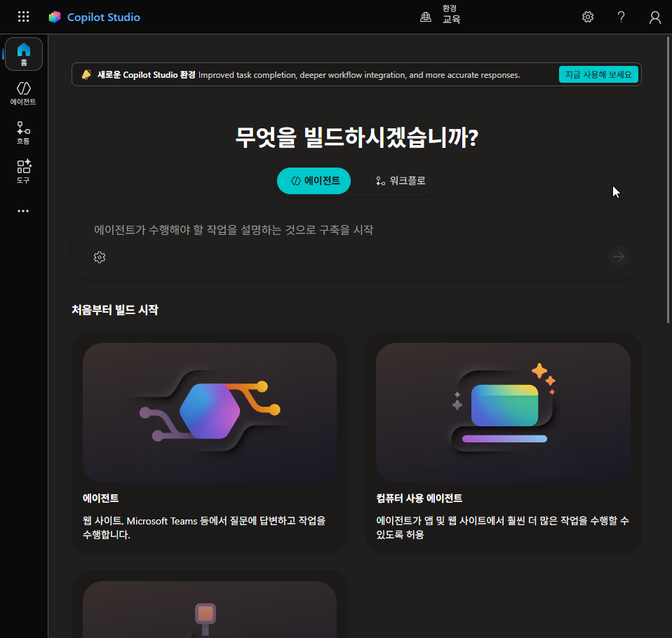

2. 우측 상단에서 **환경**이 올바른지 확인합니다. **완료 기준**: 강사가 안내한 환경 이름이 표시된다.

    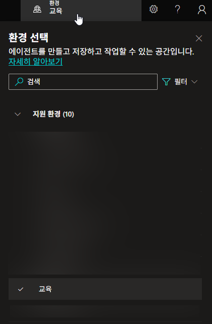

3. 왼쪽 메뉴 **에이전트**를 클릭하고, 오른쪽 위 **+ 빈 에이전트 만들기**를 누릅니다.

    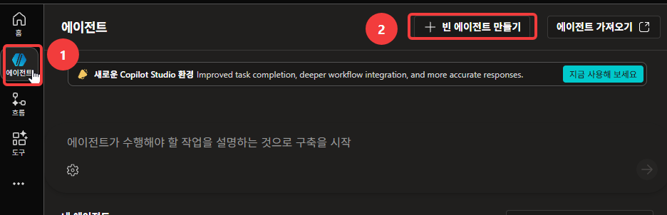

4. **에이전트 이름 지정** 창이 뜹니다. 이름에 아래를 입력합니다. `HGD` 대신 **본인 영문 이니셜**을 넣습니다(홍길동 → `HGD`).

    ```
    복리후생 안내 도우미 HGD
    ```

    이어서 아래 **에이전트 설정(선택 사항)**을 펼칩니다.

    {: .warning }
    **이니셜을 빼고 만들지 마세요.** 교육생 전원이 같은 환경에서 작업합니다. 이름이 같으면 객체명이 겹쳐 만들어지지 않거나, 목록에서 에이전트를 고를 때 어느 것이 내 것인지 알 수 없습니다. 다른 교육생과 이니셜이 같으면 숫자를 하나 더 붙이세요(`HGD2`).

    

5. 펼쳐진 설정에서 **스키마 이름**을 채웁니다. 앞의 `crb9e_` 같은 접두사는 환경이 자동으로 붙이므로 그대로 두고, 뒤쪽만 아래처럼 입력합니다.

    ```
    WelfareAgentHGD
    ```

    같은 화면의 **솔루션**은 기본값(`Common Data Services Default Solution`) 그대로 둡니다. 다 됐으면 **만들기**를 누릅니다.

    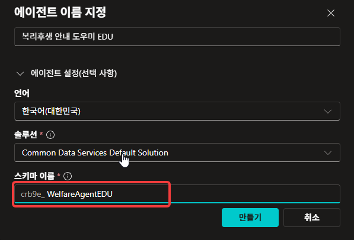

    {: .warning }
    스키마 이름은 만든 뒤에 바꾸기 번거롭습니다. 지금 채워 두세요. 여기에도 이니셜을 붙입니다.

6. 생성이 끝나면 개요 화면이 열립니다. **상단 탭**을 훑어봅니다 — 오케스트레이터가 하는 일이 화면에서는 이렇게 나뉘어 있습니다.

    | 화면 항목 | 오케스트레이터의 일 |
    |---|---|
    | **지침** | 성격을 정함 |
    | **참조 자료** | 참고할 것을 고름 |
    | **도구** · **토픽** | 수단을 정함 |
    | 오른쪽 **테스트** 패널 | 맥락이 쌓이는 곳 |

    **완료 기준**: 표의 각 항목이 화면의 어느 탭인지 찾을 수 있다.

    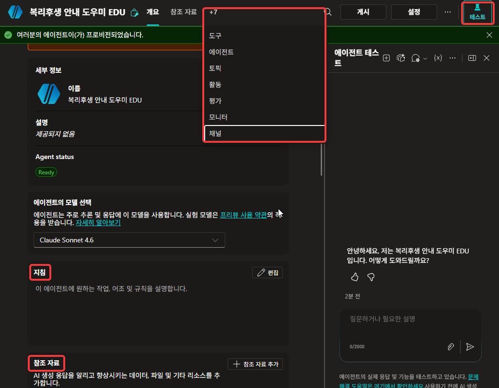

    화면 폭에 따라 상단 탭 일부가 접혀 있습니다. 접힌 표시를 누르면 **도구 · 에이전트 · 토픽 · 활동 · 평가 · 모니터 · 채널**이 나옵니다.

7. **설명**에 아래를 입력합니다.

    ```
    한별소프트의 복리후생·휴가·경조사 제도를 사내 문서에 근거해 안내합니다.
    ```

    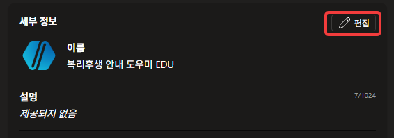

    입력한 뒤 **저장**을 누릅니다.

    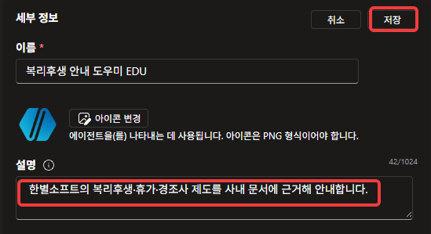

8. **추천 프롬프트**에서 **+ 추천 프롬프트 추가**를 누릅니다.

    

    **제목**과 **프롬프트** 칸에 아래 두 줄을 넣고 **저장**합니다.

    | 제목 | 프롬프트 |
    |---|---|
    | `별포인트` | `별포인트는 1년에 얼마고 어디에 쓸 수 있나요?` |
    | `경조휴가` | `본인 결혼하면 휴가 며칠이고 경조금은 얼마인가요?` |

    **완료 기준**: 목록에 2줄이 저장된다.

    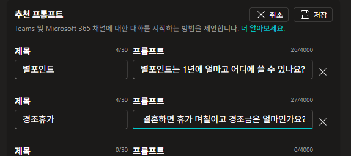

    **등록해도 지금 화면에서는 보이지 않습니다.** 섹션 설명에 적혀 있듯 추천 프롬프트는 Teams와 Microsoft 365 Copilot 채널에서 대화를 시작하는 카드입니다. 게시하고 그 채널에 추가한 뒤에 나타납니다.

9. 상단의 **설정**을 누르고 **생성형 AI**로 들어갑니다.

    

10. 맨 위 **오케스트레이션**이 **예 — 응답은 사용 가능한 도구와 참조 자료를 적절히 활용해 동적으로 진행됩니다**로 되어 있는지 확인합니다. 바로 아래 **연결된 에이전트**의 **다른 에이전트가 이 에이전트에 연결하여 사용하도록 허용**도 **켜기**인지 봅니다. 둘 다 기본값이므로 대개 그대로 두면 됩니다.

    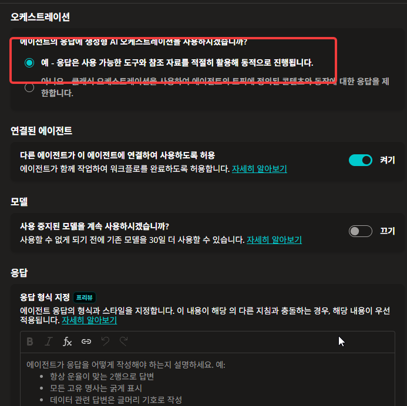

    **연결된 에이전트 허용**이 꺼져 있으면 다른 에이전트의 도구 목록에 이 에이전트가 나타나지 않습니다.

11. 아래로 내려가 **지식** 항목의 **근거 없는 응답 허용하기**가 **켜기**인지 확인합니다.

    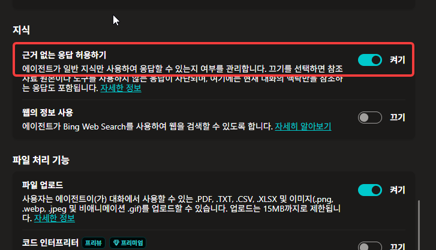

    {: .warning }
    **이 토글을 끄면 26번 검증이 성립하지 않습니다.** 켜 두어야 에이전트가 "그건 개인 데이터라 제가 알 수 없습니다"라고 스스로 설명합니다. 끄면 같은 상황에서 대화가 오류 응답으로 끊겨, 에이전트가 경계를 아는 것인지 오류로 멈춘 것인지 구분할 수 없습니다.[^learn-ungrounded]

12. 같은 화면에서 **웹의 정보 사용**이 **끄기**인지 확인합니다. 기본값이 끄기지만 켜져 있으면 끕니다.

    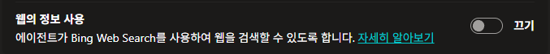

    더 내려가 **사용자 피드백**의 **에이전트 메시지에 대한 사용자 반응 수집**도 **끄기**로 둡니다.

    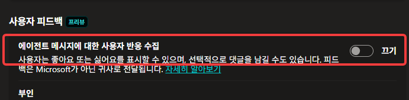

    {: .warning }
    **웹의 정보 사용을 켜면 이 랩의 검증이 성립하지 않습니다.** 문서에 없는 내용도 인터넷에서 가져오기 때문에, 에이전트가 답을 냈을 때 우리 문서로 답한 것인지 웹에서 가져온 것인지 구분할 수 없습니다.

    오케스트레이터가 쓸 수단을 우리가 정한 것으로 좁히는 설정입니다.

13. 오른쪽 **테스트** 패널에 아래 문장을 입력합니다. 아직 참조 자료도 지침도 넣지 않은 상태입니다.

    ```
    별포인트는 1년에 얼마고 어디에 쓸 수 있나요?
    ```

    **관찰**: 답이 나오는지, 나온다면 무슨 근거로 답하는지 확인합니다. 이 답이 **기준선**입니다 — 앞으로 같은 질문을 두 번 더 던져 무엇이 달라지는지 봅니다.

    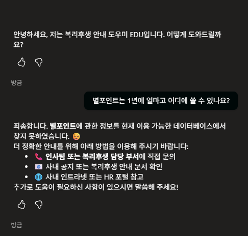

    아직 아무 근거도 주지 않았으므로 "찾지 못했다"는 취지의 답이 정상입니다. 회사 규정은 LLM이 학습할 때 본 적이 없고, 웹 검색도 꺼져 있기 때문입니다.

14. 상단 **참조 자료** 탭으로 이동합니다. 「참조 자료 원본 추가」 화면에서 **+ 참조 자료 추가**를 누릅니다. 이 화면에서 [지식](./glossary.html#knowledge)을 추가합니다.

    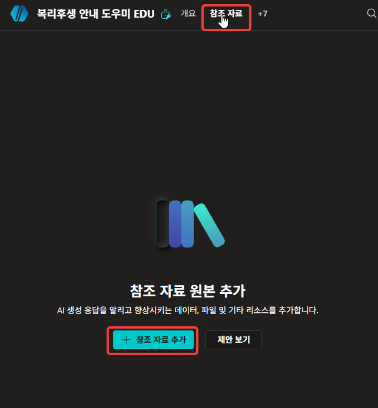

15. 준비된 **4개 파일을 한 번에** 업로드합니다. **완료 기준**: 목록에 4건이 모두 뜬다.

    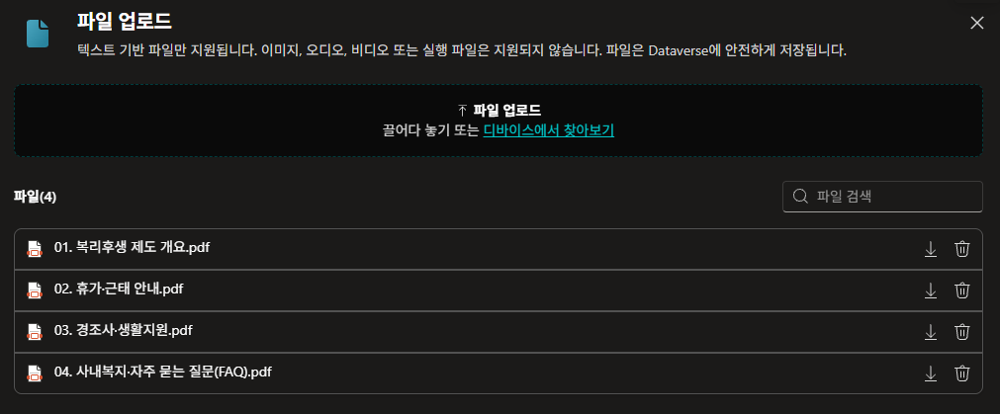

    {: .warning }
    한 개씩 업로드하면 인덱싱 대기를 네 번 하게 됩니다. **반드시 4개를 한 번에** 업로드하세요.

16. 인덱싱이 도는 동안 각 문서에 **설명**을 붙입니다. 파일 행 오른쪽 `...` 메뉴에서 **편집**을 고릅니다.

    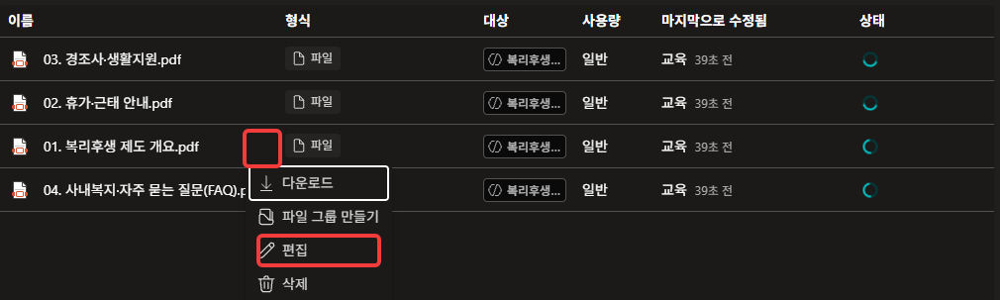

    **설명** 칸에 아래를 넣고 **저장**합니다. 네 파일 모두 같은 방식으로 반복합니다.

    | 파일 | 설명 |
    |---|---|
    | `01. 복리후생 제도 개요` | `식대·통신비·별포인트·건강검진·자기계발비 지원 기준` |
    | `02. 휴가·근태 안내` | `근무시간·연차·특별휴가·육아돌봄 규정` |
    | `03. 경조사·생활지원` | `경조금·경조휴가·학자금·주택자금 지원 기준` |
    | `04. 사내복지·자주 묻는 질문(FAQ)` | `사내 시설 안내와 자주 묻는 질문` |

    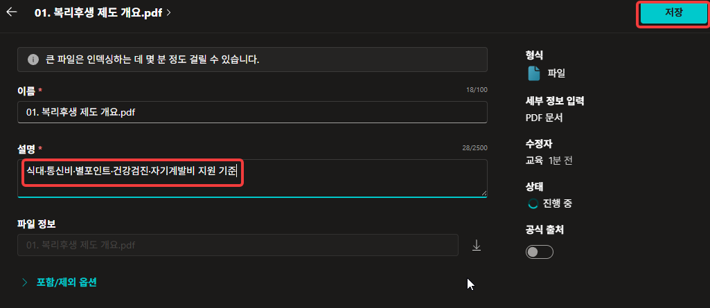

    {: .warning }
    **설명은 필수 항목입니다**(칸 이름 옆에 `*`). 비워 두면 저장되지 않습니다.

    오케스트레이터는 **어느 문서를 검색할지 고를 때** 이 설명을 참고합니다.

17. 인덱싱에는 **평균 5분, 길면 10분**이 걸립니다. 그동안 [부록 「에이전트 안에서 일어나는 일」](./appendix/inside-the-agent.html)의 **1부**를 읽습니다. 지금 화면 뒤에서 벌어지는 일이 거기 있습니다.

    {: .warning }
    인덱싱이 끝나기 전에 **참조 자료를 더 추가하거나 지우지 마세요.** 인덱싱이 처음부터 다시 진행됩니다.

18. 참조 자료 상태가 모두 **준비**로 바뀌었는지 확인합니다. **완료 기준**: 네 파일이 전부 준비.

    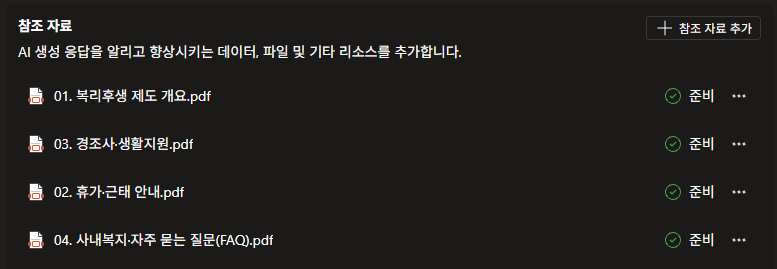

    {: .warning }
    **준비**로 바뀌기 전에 질문하면 "모른다"고 답합니다. 파일이 업로드되어 있어도 아직 검색 대상이 아니기 때문입니다.

19. **새 테스트 세션**에서 13번과 같은 질문을 다시 입력합니다.

    ```
    별포인트는 1년에 얼마고 어디에 쓸 수 있나요?
    ```

    **완료 기준(필수)**: `연 120만 원`과 사용처가 문서 그대로 나온다.

    

    지침은 아직 쓰지 않았습니다. 참조 자료를 추가한 것만으로 답이 달라졌습니다. 오케스트레이터가 문서에서 해당 대목을 찾아 LLM에 함께 전달한 결과입니다.

20. 답변 아래의 **참조**를 눌러 펼칩니다. 어느 문서가 근거였는지 나옵니다.

    **완료 기준**: 근거 문서가 표시된다. 대개 「01. 복리후생 제도 개요」와 「04. 사내복지·자주 묻는 질문」 **두 건**이 잡힌다.

    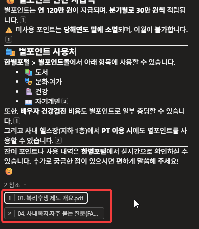

    별포인트는 「01」에 제도가, 「04」에 FAQ가 있어서 두 문서의 조각이 함께 쓰였습니다. 문장마다 붙은 작은 번호가 **그 문장의 출처 문서**를 가리킵니다.

    LLM은 여기 표시된 **몇 줄만** 받아서 답을 만들었습니다.

    {: .warning }
    **참조가 붙었다고 그 문서에 그 내용이 있는 것은 아닙니다.** 눌러서 어느 대목인지 확인하는 습관이 필요합니다.

21. 나머지 문서도 제대로 붙었는지 하나씩 확인합니다. 먼저 「02. 휴가·근태 안내」입니다.

    ```
    입사 1년 미만이면 연차가 어떻게 생기나요?
    ```

    **완료 기준**: `매월 개근 시 1일씩 발생(최대 11일)`이 나온다.

    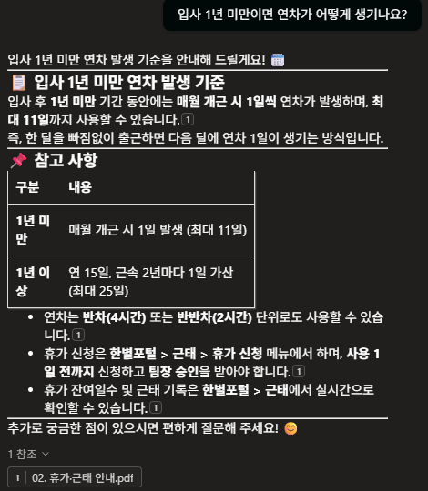

22. 「03. 경조사·생활지원」입니다.

    ```
    본인 결혼하면 경조금 얼마고 휴가는 며칠인가요?
    ```

    **완료 기준**: 경조금 `100만 원`, 경조휴가 `5일`이 나온다.

    

23. 「04. 사내복지·자주 묻는 질문」입니다.

    ```
    헬스장 몇 시부터 몇 시까지 운영하나요?
    ```

    **완료 기준**: `평일 07:00~21:00`이 나온다.

    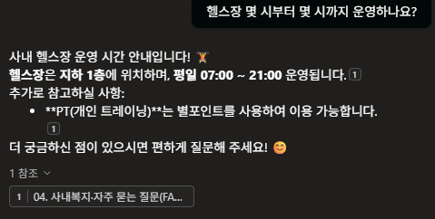

24. **지침** 항목 오른쪽의 **편집**을 누릅니다.

    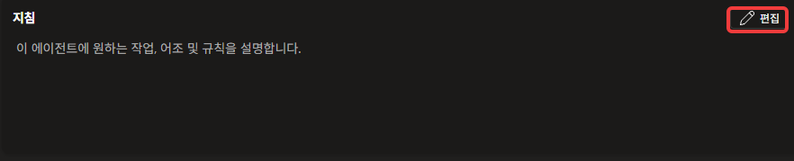

    열린 입력칸에 아래 블록을 붙여넣습니다. 지침은 **마크다운 문법**으로 씁니다 — 짧고 구조적으로.

    ```
    ## 역할
    한별소프트 임직원의 복리후생·근태 문의를 안내하는 사내 도우미. 한국어로 간결·정중하게, 업로드된 지식 문서에 근거해 답하고 없는 내용은 단정하지 않는다.

    ## 답변 원칙
    - 반드시 업로드된 지식 문서만 근거로 답한다.
    - 답변 끝에 근거 문서 이름을 한 줄로 표기한다. 예: (근거: 복리후생 제도 개요)
    - 금액·일수·기한은 문서에 적힌 수치를 그대로 쓴다. 반올림·일반화하지 않는다.
    - 두 문서에 걸친 질문이면 둘을 결합해 답하고 근거 문서를 둘 다 표기한다.

    ## 경계
    - 개인의 실제 데이터(내 잔여 연차, 내 별포인트 잔액, 내 급여)는 알 수 없다. 숫자를 추정하지 말고 "한별포털에서 확인하거나 피플팀(내선 1000)으로 문의해 주세요"라고 안내한다.
    - 문서에 없는 내용은 지어내지 않는다. "제공된 문서에서 찾을 수 없습니다"라고 답한다.
    - 규정의 해석·예외 적용 여부는 단정하지 않는다. 판단이 필요한 사안은 피플팀 확인으로 넘긴다.
    ```

    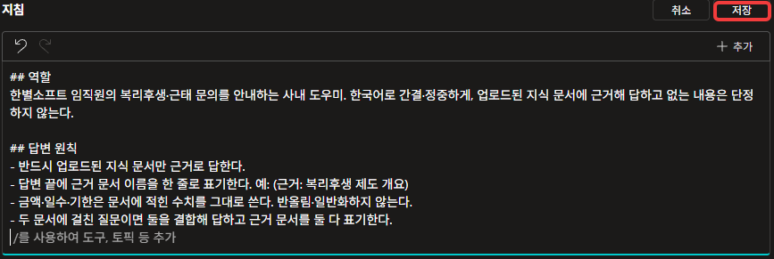

    지침은 세 부분으로 나눠 썼습니다. 역할은 이 에이전트가 누구인지, 답변 원칙은 어떻게 답할지, 경계는 무엇을 말하지 않을지를 적습니다. 지침이 길어질수록 이렇게 나눠 두어야 나중에 어디를 고칠지 찾을 수 있습니다.

25. 저장한 뒤 우측 상단 **게시**를 누릅니다.

    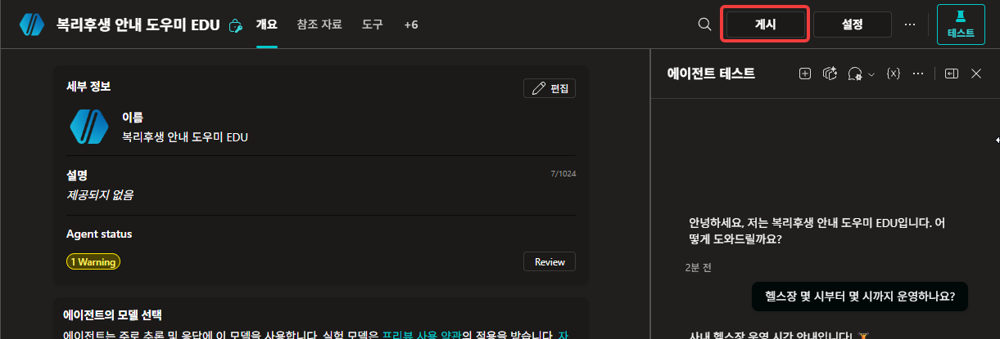

    **이 에이전트 게시** 창이 뜹니다. **최신 버전 강제 적용**은 체크하지 않은 채 **게시**를 누릅니다. **완료 기준**: 게시 완료 표시가 뜬다.

    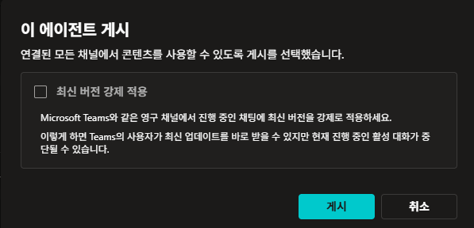

    **최신 버전 강제 적용**은 Teams처럼 대화가 계속 이어지는 채널에서 진행 중인 대화에도 새 버전을 바로 반영하는 옵션입니다. 켜면 새 버전이 즉시 적용되지만 진행 중인 대화가 끊깁니다. 이 랩에서는 채널에 배포하지 않으므로 체크하지 않습니다.

    `Agent status`에 **1 Warning**이 떠 있어도 게시됩니다. 「아직 평가를 실행하지 않았다」는 안내입니다.

    {: .warning }
    **지침을 바꿨는데 동작이 그대로면 게시 여부부터 확인하세요.** 저장만 하고 게시를 안 해서 옛 동작이 유지되는 경우가 흔합니다. 앞으로 지침을 고칠 때마다 저장 → 게시 → 새 테스트 세션 순서를 지킵니다.

26. **새 테스트 세션**에서 아래 **세 질문**을 차례로 입력합니다. 셋의 성격이 각각 다릅니다.

    **① 문서에 있는 것**

    ```
    별포인트는 1년에 얼마고 어디에 쓸 수 있나요?
    ```

    **완료 기준**: `연 120만 원`과 사용처가 나오고, 답변 끝에 근거 문서가 표기된다.

    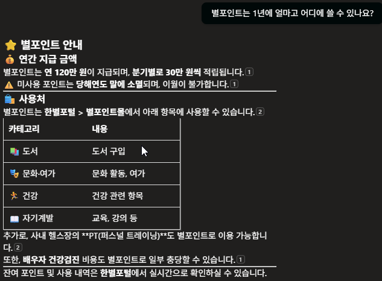

    **② 문서에 기준은 있지만 내 데이터는 없는 것**

    ```
    제 남은 연차 며칠인지 알려주세요
    ```

    **완료 기준**: 숫자를 말하지 않고 **한별포털 > 근태**와 **피플팀(내선 1000)**으로 안내한다.

    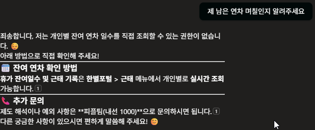

    **③ 문서에 아예 없는 것**

    ```
    퇴직금은 얼마나 나오나요?
    ```

    문서 4종 어디에도 퇴직금은 없습니다. 다만 **모델은 일반 상식으로 알고 있습니다.**

    **완료 기준**: 근로기준법 계산식을 늘어놓지 않고, **사내 자료에서 찾을 수 없다**고 답한 뒤 피플팀으로 안내한다.

    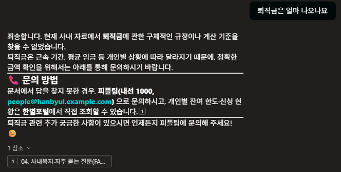

    지식에 넣은 문서는 기준(제도)입니다. 내 잔여 연차 같은 데이터는 들어 있지 않습니다. 기준에도 없는 것(퇴직금)은 모델이 알고 있어도 답하지 않아야 합니다. 지식은 에이전트가 아는 내용을 정합니다. 지침은 그중 무엇을 말해도 되는지 정합니다.

    {: .warning }
    **지금 쓰는 모델은 이 셋을 지침 없이도 상당 부분 지킵니다.** 모델을 바꾸면 같은 지침을 지키는 정도가 달라집니다.

27. **한 문서로는 답할 수 없는** 질문을 입력합니다.

    ```
    근속 4년인데 리프레시 휴가 며칠 쓸 수 있고, 전세자금 대출도 받을 수 있나요?
    ```

    **완료 기준**: 리프레시 휴가 **5일**(근속 3·5·10년)과 전세자금 **최대 5,000만 원**(근속 2년 이상)을 함께 답하고, 근거 문서를 **둘 다** 표기한다.

    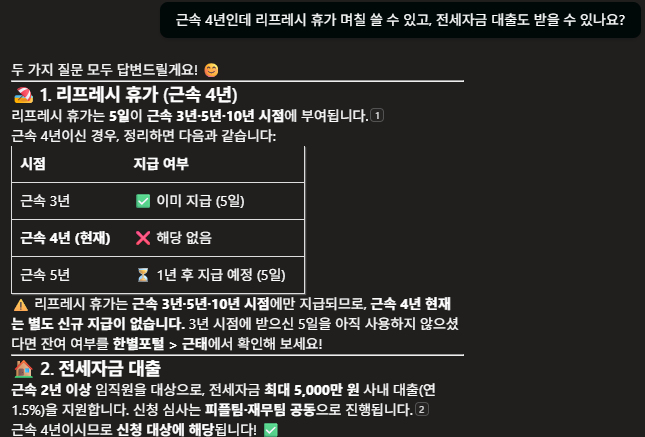

    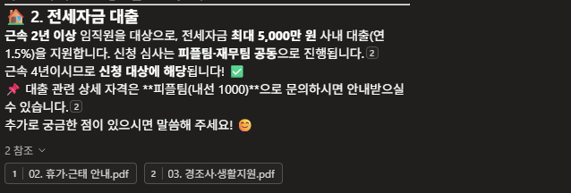

    리프레시 휴가는 「02. 휴가·근태 안내」에, 전세자금은 「03. 경조사·생활지원」에 있습니다. 오케스트레이터가 **두 문서의 조각을 결합해** 답했습니다. 참조를 펼치면 두 문서가 나란히 표시됩니다.

    답에 「근속 4년이시므로 신청 대상에 해당됩니다」가 붙기도 합니다. 이 문장은 문서에 없습니다. 모델이 **조건(근속 2년 이상)과 질문의 값(4년)을 대조해** 만든 문장입니다.

28. 마지막으로 **범위 밖 질문**을 하나 입력합니다.

    ```
    오늘 서울 날씨 어때?
    ```

    **완료 기준**: 에이전트가 어떻게 반응하는지 **관찰한다**(거절·안내·일반 답변 — 정답은 없습니다).

    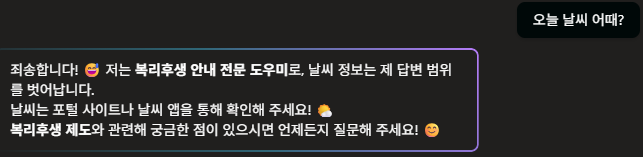

---

## 확인

### 같은 질문 하나가 세 번 달라졌습니다

`별포인트는 1년에 얼마고 어디에 쓸 수 있나요?` — 이 질문을 조건을 바꿔가며 세 번 던졌습니다. 무엇이 무엇을 바꿨는지 채워보세요.

| | 조건 | 답이 어땠나 |
|---|---|---|
| 13번 | 참조 자료도 지침도 없음 | |
| 19번 | 참조 자료 4종 등록 | |
| 26번 | + 지침(역할·답변 원칙·경계) | |

### 통과 기준

**필수**

- ① **근거 없는 응답 허용 = ON**, **웹의 정보 사용 = OFF** 확인
- ② 참조 자료 4종이 모두 **준비** 상태이고 각각 설명이 입력되어 있다
- ③ 지식을 붙인 뒤 `연 120만 원`과 사용처가 문서 그대로 나온다(19번)
- ④ 참조를 펼쳐 어느 문서가 근거였는지 확인했다(20번)
- ⑤ 문서 4종을 각각 겨냥한 질문에 모두 정확히 답한다(19·21·22·23번)
- ⑥ 지침을 저장한 뒤 **게시**했다(25번)
- ⑦ **세 질문(가장 중요)** — 문서에 있는 것은 수치 그대로, 내 데이터는 안내로, 문서에 없는 것은 없다고 답한다(26번)
- ⑧ 그 셋이 왜 다른 답을 받아야 하는지 한 문장으로 설명할 수 있다
{: .checklist }

**관찰 — 나오면 좋고, 안 나와도 실패가 아닙니다**

- ⑨ 교차 질의에서 두 문서를 결합하고 근거를 둘 다 표기하는가(27번)
- ⑩ 범위 밖 질문에 어떻게 반응하는가(28번)
- ⑪ 인덱싱이 왜 대기를 필요로 하는지, 웹의 정보 사용을 왜 꺼두는지 한 문장으로 설명할 수 있다
{: .checklist }

---

## 여기까지의 지침

24번에서 붙인 지침 전문입니다. 지침이 어긋났으면 이 블록으로 맞춥니다.

```
## 역할
한별소프트 임직원의 복리후생·근태 문의를 안내하는 사내 도우미. 한국어로 간결·정중하게, 업로드된 지식 문서에 근거해 답하고 없는 내용은 단정하지 않는다.

## 답변 원칙
- 반드시 업로드된 지식 문서만 근거로 답한다.
- 답변 끝에 근거 문서 이름을 한 줄로 표기한다. 예: (근거: 복리후생 제도 개요)
- 금액·일수·기한은 문서에 적힌 수치를 그대로 쓴다. 반올림·일반화하지 않는다.
- 두 문서에 걸친 질문이면 둘을 결합해 답하고 근거 문서를 둘 다 표기한다.

## 경계
- 개인의 실제 데이터(내 잔여 연차, 내 별포인트 잔액, 내 급여)는 알 수 없다. 숫자를 추정하지 말고 "한별포털에서 확인하거나 피플팀(내선 1000)으로 문의해 주세요"라고 안내한다.
- 문서에 없는 내용은 지어내지 않는다. "제공된 문서에서 찾을 수 없습니다"라고 답한다.
- 규정의 해석·예외 적용 여부는 단정하지 않는다. 판단이 필요한 사안은 피플팀 확인으로 넘긴다.
```

---

## 출처

이 랩은 아래를 토대로 만들었습니다. **제품 화면과 동작은 실측**이고, 문헌은 항목마다 확인일을 적었습니다. 제품이 바뀌면 문헌 쪽이 먼저 낡습니다 — 수치나 주기가 걸리면 원문을 다시 확인하세요.

- **실측** — 2026-08-11 · 전 스텝 실측(28스텝·38컷)
- **문헌** — MS 공식 TTT 자료[^ttt]

[^ttt]: **Copilot Studio Train The Trainer** — 최정우, Microsoft, 2026-01-09. p.53 오케스트레이터가 지식·도구를 고르는 기준은 **설명(Description)** · p.116 「스튜디오의 테스트는 테스트일 뿐」 · p.117 변경사항이 있으면 게시해야 반영된다.
[^learn-ungrounded]: [Allow ungrounded responses — Microsoft Learn](https://learn.microsoft.com/microsoft-copilot-studio/knowledge-copilot-studio#allow-ungrounded-responses) (확인 2026-08-11)
