# Lab 2. 토픽 → 적응형 카드 🧭

<!-- 2026-09-11 번호 변경: 입문 Lab 4 → TDG Lab 2. 파일·자산·덱 경로와 본문의 Lab 번호는 새 번호로 바꿨다.
     아래 저작 메모 안의 「Lab N」은 입문 번호 그대로다(이력이라 고치지 않았다). 입문 2·4·5·6 = TDG 1·2·3·4. -->

<!-- 2026-09-14 /tone: .note·.important 61개를 .warning 2 · 평문 31 · 접기 9(블록 4) · 삭제 19로 정리했다.
     본문에서 뺀 랩 간 참조를 여기 남긴다.
     - 4번: Lab 1 16번의 문서 설명과 같은 구조이고, Lab 4에서 한 번 더 나온다
     - 5번: 노드 메뉴의 도구 추가·에이전트 추가는 Lab 3·4에서 쓴다
     - 12번: `/` 로 도구도 지목한다. Lab 3에서 커넥터를 붙이면 같은 목록에 도구가 뜬다
     - 13번: 입문 Lab 1(지침 불이행) · Lab 1(지식) · 이 랩(실행 지시)으로 지침 칸의 일이 달라진다
     - 20번: 여기서 만든 변수를 Lab 3에서 Excel 조회에 쓴다(위 ★ Lab 6 의존과 같은 사슬)
     - 22번: 시스템 변수는 Lab 4 24번에서 쓴다
     - 37번: 카드와 문장의 차이 — Lab 1 부록의 가짜 근거(걷어낸 부록)
     11번의 「개념 절의 표」는 이 페이지에 없는 절이라 문장째 뺐다. -->

> **이번 랩 완성물**: 작업 설명으로 호출되는 [토픽](./glossary.html#topic) 2개 — 하나는 고정 응답, 하나는 [Question 노드](./glossary.html#question-node)로 받은 입력을 변수에 담고 조건으로 분기해 [Adaptive Card](./glossary.html#adaptive-card)로 보여주는 토픽
> **예상 시간**: 60분 · **완성 신호**: 같은 에이전트에 던진 두 질문 중 하나는 토픽이, 하나는 지식이 답하는 화면을 나란히 놓고 그 경계가 무엇인지 설명할 수 있다

{: .time }
60분 타이머. 4단(트리거 → 입력 변수·슬롯 필링 → 조건 분기 → 적응형 카드)으로 나눠 진행합니다.

**인터미션 슬라이드** — 랩 시작 전 강사가 설명하는 개념입니다. [브라우저로 보기](../assets/decks/lab2-intermission.html) · [PDF](../assets/decks/lab2-intermission.pdf)

---

## 준비

- **[Lab 1](./lab1.html)에서 만든 복리후생 안내 도우미**에 이어서 작업합니다. 새 에이전트도, 새 소재도 필요하지 않습니다.
- 그 에이전트가 지식 기반으로 답하는 상태여야 합니다. 이 랩은 **그 에이전트에 토픽을 추가하는** 작업입니다.

<!-- 저작 메모(2026-08-10 개편, 2026-08-11 확장).
     14스텝 → 33스텝. 표기 50분 기준 필요 스텝 수(50÷1.5≈33)에 맞춘 것.

     ★ 확장의 핵심 두 가지
       1. 설명을 틀리게 써서 일부러 실패시킨다(스텝 9~10).
          ⚠️ 2026-08-11 실측으로 전제가 뒤집혔다. 신규 UI 생성형 오케스트레이션에는
             트리거 문구 목록이 없다. 트리거 노드는 「이 에이전트 선택」 + 「토픽이
             수행하는 작업 설명」 한 칸이다. 즉 토픽도 Description으로 선택된다
             (TTT p.53). Lab 2 16번 설명과 근거가 같다.
             → 초안의 "트리거 1개 → 3개" 구조를 "설명 구체 → 뭉갬 → 복원"으로 교체.
       2. 조건 분기를 추가했다(스텝 28~32).
          기존 초안은 변수를 받아서 그대로 되돌려주기만 해서 변수를 만든 이유가 안 보였다.
          조건으로 담당부서를 정하고 그 값을 카드가 표시하는 구조로 바꿨다.

     ★ 삭제한 것
       - 구 스텝 14 「에이전트 흐름 구경」 제거(2026-08-11 편성 확정).
         여기서 옵션만 확인하고 넘어갈 이유가 없어졌다.
       - 「축약 경로」 절 → 2026-08-10 폐지 규칙 적용.

     ★ Lab 6 의존 (번호가 바뀌었으므로 주의)
       - 변수:  구 스텝 9  → 신 스텝 19~20
       - 카드:  구 스텝 11~13 → 신 스텝 32~36
       Lab 6이 이 둘 위에 그대로 올라간다. 덜어내면 Lab 6이 무너진다.

     ★ TTT p.56(「다중 주제 매칭」이 생성형에서 호출되지 않는다)은 확장 과정에서 뺐다.
       트리거가 설명 기반인 것이 확인되면서, 되묻지 않는다는 사실이 8번의 "뜻으로
       걸린다"에 이미 포함된다. 따로 콜아웃을 둘 자리가 없다.
     ★ TTT p.57 반영: 토픽이 메시지로 끝내면 AI가 그 문장에 손대지 못한다.
       스텝 7·11이 이 얘기다. 초안에는 "글자 그대로 출력된다"만 있고 이유가 없었다.

     ★ 9번을 "뭉개기"에서 "틀리게 쓰기"로 교체(2026-08-11).
       설명 칸에 예상 질문 3줄만 넣어도 정상 동작하는 것을 실측했다. 모델이 토픽
       이름과 맥락으로 메워버려서 "안내" 한 단어로 뭉개는 정도로는 실패가 재현되지
       않는다. Lab 1(지침 없이도 지킴)·Lab 2(경계 규칙 무효)에 이어 세 번째로 밟은
       같은 함정이다.
       → 판단을 흐리는 대신 **다른 업무를 가리키게** 바꿨다(출장비 정산).
         이건 모델이 똑똑할수록 확실히 재현된다. 함정이 보증으로 뒤집힌 셈이다.
       ⚠️ 이 패턴을 일반화할 것: 모델의 실패에 기대는 실험은 교안에 넣지 않는다.
         모델이 잘할수록 결과가 뚜렷해지는 실험만 남긴다.

     ★ 신규 11~13번(2026-08-11 실측). ① 절의 축이 「문제 → 해법」으로 바뀐 대목이다.
       11번 같은 질문을 연달아 두 번 하면 첫 번째는 토픽,
       두 번째는 지식이 답한다. 오케스트레이터가 대화 이력을 포함해 매 턴 다시
       판단하기 때문이다(TTT p.57 — 토픽이 메시지로 끝나면 대화가 완결된다).
       → 개념 표의 「같은 입력, 같은 출력: 보장됨」이 틀렸으므로 고쳤다.
         결정론은 토픽 안에서만 성립하고, 토픽이 불릴지는 매번 판단이다.
       ⚠️ 소재가 겹치는 것도 원인이다. 「연차」는 Lab 2 지식 문서에도 있어서
         토픽과 지식이 같은 질문을 두고 경쟁한다. 소재를 바꾸는 대신 그 경쟁을
         교육 내용으로 삼기로 했다(현장에서 늘 생기는 문제다). 4번 설명에
         "일수나 발생 기준이 아니라 신청 절차"로 경계를 적었지만 완전히 갈리지는
         않는다 — 그 사실 자체가 11번의 내용이다.

       12~13번 지침에서 토픽을 직접 지목할 수 있다. 「연차, 휴가 관련 질문은
       [연차 신청 방법] 토픽으로 수행한다」를 넣으면 두 번 다 토픽이 호출된다.
       지침 칸에서 토픽 이름이 칩으로 렌더된다(목록에서 골라 넣는 방식).
       → 4번 설명은 「이 토픽이 무엇을 하는가」, 12번 지침은 「이럴 때 저것을 써라」.
         판정 근거를 늘리는 것과 실행을 지시하는 것이 다르다는 것이 이 절의 결론.
       → 하루 전체로 보면 지침 칸이 랩마다 다른 일을 한다.
         Lab 1 안 지켜지는 부탁 / Lab 2 근거 사용 규칙 / Lab 4 실행 지시.

       ⚠️ 순서가 중요하다. 지침 강제(12번)를 설명 실험(9~10번) 앞에 두면 설명을
         틀리게 써도 지침이 토픽을 불러서 실험이 오염된다. 반드시 설명 → 지침 순서.

         14번 부작용 실측 완료(2026-08-11). 가로채기는 **첫 질문일 때만** 일어난다.
       세션을 이어서 물으면 지식이 답하고, 새 세션 첫 질문이면 토픽이 답한다.
       → 오케스트레이터가 토픽 안을 미리 보지 못한다는 뜻이다. 한 번 실행해서
         결과를 본 뒤에야 그 토픽이 무엇을 답하는지 알고 다음 판단에 반영한다.
         판단 재료는 설명 · 지침 · 이번 대화의 이력 셋뿐이다.
       → 11번과 같은 원리의 양면이라 짝으로 붙였다. 경고를 스텝으로 승격.
       ⚠️ 실무 함의: 가장 엉뚱하게 가는 것이 첫 질문이다. 리허설 때 강사가 이 점을
         짚을 것 — 수강생이 테스트할 때 항상 새 세션 첫 질문으로 봐야 최악을 본다.

     ★ 번호가 절마다 1로 돌아가는 문제(2026-08-11 발견).
       kramdown은 `15.`로 시작해도 목록 태그에 start 속성을 넣지 않는다. Lab 1~3은 `## 단계`가
       하나뿐이라 안 걸렸고, 4단으로 쪼갠 Lab 4에서 처음 드러났다. 본문이 "8번에서"
       같은 상호참조를 30군데 넘게 쓰므로 치명적이다.
       → 각 절 끝에 `{: start="N" }` IAL을 붙였다. 중첩 콜아웃·이미지가 있어도 먹는다.
         조건 둘: `---` 앞에 와야 하고(뒤에 두면 hr에 붙는다), 앞에 빈 줄이 없어야
         한다(빈 줄을 두면 앞 블록과 끊겨 무효가 된다). 둘 다 한 번씩 겪었다.
       → 앞으로 절을 쪼개는 랩을 쓰면 이 IAL을 같이 넣을 것.

     ★ 변수 범위는 미실측(2026-08-11). 기본이 토픽 범위이고 전역으로 올릴 수 있다는
       것까지는 20번에 적었으나, 토픽 종료 후 실제로 사라지는지·전역 승격 UI가
       어디인지는 확인 못 했다. Lab 6이 변수를 물고 있으므로 리허설에서 볼 것.

     ★ 슬롯 필링 — 25~27번으로 본문 진입(2026-08-11 실측 해결).
       조건이 둘이고 둘 다 있어야 걸린다.
         1. 질문 노드의 변수를 **입력 변수**로 올린다(토픽 밖에서 값을 넣을 수 있게)
         2. 트리거 작업 설명에 값의 목록을 적는다
            「문의유형은 "복지포인트", "휴가·근태", "경조사" 중 하나로 처리한다.」
       그러면 `복지포인트 담당자 알려줘`에 선택지 없이 바로 답한다.

       ★ 왜 이게 14번과 이어지는가 — 오케스트레이터는 토픽 안을 보지 못한다.
         그래서 변수를 밖으로 올리고(1) 설명으로 알려줘야(2) 채울 수 있다.
         14번에서 세운 원리가 여기서 해법이 된다. ①과 ②를 잇는 다리다.
       ★ 설명 칸이 두 가지 일을 한다 — 4번은 "언제 부를지", 26번은 "무엇을 채울지".

       ★ 표기를 50 → 60분으로 올렸다(2026-08-11 편성 결정). 39스텝 × 1.54분/스텝으로
         실측 랩(Lab 1·2·3)과 같은 밀도에 앉는다.
         재원은 Lab 5(커넥터 최소 호출)를 Lab 6에 흡수해서 만든다. 오후 편성은
           Lab 4 토픽 70 / Lab 5 커넥터 통합 40 / Lab 6 흐름+MCP 60 / 피날레 10 = 180
         판단 근거: 오케스트레이터가 똑똑해질수록 제어 가능 영역이 줄고, 그중 가장
         많이 줄어든 것이 토픽이다. 오늘 실측이 그 증거를 다섯 개 만들었다
         (트리거 문구 소실 / 11번 재현성 / 13번 화면 통제 / 14번 첫 질문 / 25~27번
         내부 비가시성). 토픽과 흐름이 "내가 정하는" 축이므로 커넥터에서 재원을
         빼 두 랩에 몰아준다.

     ★ ④ 절을 다시 짰다(2026-08-11, 사용자 실측 지적). 초안이 네 군데 틀렸다.
       1. 「메시지 노드를 텍스트 ∨ 로 적응형 카드로 바꾼다」 → 불가능하다.
          「메시지 보내기」와 「적응형 카드로 질문」은 다른 계열이고 상호 전환이
          안 된다. 카드는 **새 노드로 추가**해야 한다. 5번의 「텍스트 ∨」 설명도
          같이 지웠다(그 드롭다운이 무엇인지는 미확인).
       2. 카드 노드의 정식 이름은 **「적응형 카드로 질문」**이고 질문 계열이다.
          17번 「질문하기」와 같은 갈래. 다만 입력 요소를 두지 않으면 표시만 한다.
          실무에서는 예/아니오 확인에 많이 쓰인다.
       3. ⚠️ **적응형 카드는 슬롯 필링이 안 된다.** 25~27번은 「질문하기」 전용이다.
       4. ⚠️ **JSON에서 `${변수}` 를 쓰면 글자 그대로 찍힌다.** 초안의 "변수 연결
          기능" 스텝은 존재하지 않는 기능이었다.
          → 실측 경로: 노드 속성의 **형식** 드롭다운이 `JSON` / `수식` 둘이다.
            JSON으로 틀을 붙여넣고 → 형식을 수식으로 바꾸면 내용이 옮겨진다 →
            값 두 칸만 직접 고쳐 쓴다. 지우고 다시 쓰는 것이 아니다.
          → 수식 쪽에는 `{x}` 버튼이 없다. `Topic.` 접두사를 직접 쓴다.
          → ⚠️ **`문의유형`은 `Text()` 로 감싸야 한다.** choice 형식이라 카드의
            value(문자열)에 그대로 못 넣는다. `담당부서`는 string이라 그대로.
            22번에서 본 `choice`/`string` 표시가 여기서 쓸모를 낸다.
          → ⚠️ 내가 "변수는 문자열 밖에 놓고 `&` 로 잇는다"고 쓴 것은 틀렸다.
            그건 TextBlock에서 리터럴과 문자열을 결합할 때 쓰는 방식이고 여기엔
            해당 없다. 기억이 교차된 것. 삭제했다.
       - 「적응형 카드 편집」은 디자이너 한 화면이다. 왼쪽 요소 팔레트 / 가운데
         카드 구조 트리 / 아래 **카드 페이로드 편집기**(JSON)가 같이 있다.
         초안의 "JSON 보기와 UI 편집을 오간다"는 틀렸다 — 한 화면에 다 있다.
       - 노드 속성에 「다시 질문하기」·「질문 재프롬프트 횟수(최대 2회)」가 있다.
         이 노드가 질문 계열이라는 증거인데, 오늘은 표시만 하므로 건드리지 않는다.
       - 37번이 랩의 마무리로 좋다. 한 화면에 27번(슬롯 필링) · 30번(조건) ·
         35번(수식)이 다 들어간다. 콜아웃으로 명시했다.

     ★ 2026-08-11 실측 6차(28~32번, 12컷)에서 나온 것
       - 변수 생성 경로: 변수 관리 → **변수 값 설정** → 「변수 선택 → 새 변수 만들기」.
         값 칸의 라벨은 「받는 값」. 유형은 입력한 값에서 자동으로 잡힌다(string).
       - ⚠️ 2026-08-14 교정(내부교육 피드백): 25번이 변수 속성을 여는 방법을 틀리게 적고 있었다.
         「다음 이름으로 사용자 응답 저장」 칸은 `{x} 문의유형 | choice | >` 구조인데,
         **오른쪽 끝의 `>`는 변수 선택창**(이 칸에 담을 변수를 바꾸는 자리)이고,
         **속성은 왼쪽 `{x}` 쪽**을 눌러야 열린다. 교안은 `>`를 누르라고 적고 있었다.
         본문은 누를 자리만 적는다 — `>`가 무엇인지 덧붙이는 주의는 뺐다(TMI).
         ★ 다시 `>`로 되돌리지 말 것.
       - ★ 변수 속성의 **사용량**에 범위 모델이 다 나와 있다.
           ● 토픽(범위 제한)  □ 다른 토픽에서 값 수신   ← 25번에서 켠 것
                              □ 원본 토픽으로 값 반환
           ○ 전역(모든 토픽에서 액세스 가능)
         25번은 이 중 하나만 켠 것이었다. 28번 note에서 전체 그림을 보여준다.
       - 조건의 값 칸은 **목록에서 고른다**(choice 형식이라 값이 정해져 있다).
         오타로 조건이 안 맞는 일이 없다는 점을 note로 넣었다.
       - ⚠️ 출력에 **`총무팀 에서`처럼 공백이 하나 들어간다.** 변수 조각이 하나의
         덩어리라 조사가 붙지 않는다. 재촬영 대신 사실을 note로 적고, 조사가 꼭
         필요하면 띄어 써도 자연스러운 말로 바꾸라는 회피책을 붙였다.

     ★ 입력 변수의 수명을 오케스트레이터가 관리한다(2026-08-11 실측, 32번).
         복지포인트 → 담당자 알려줘  → 묻지 않고 총무팀 재사용   (유지)
                    → 다른 문의 담당자 알려줘 → 다시 묻는다      (비움)
       채우고 · 유지하고 · 비운다. 세 동작이 한 세션에서 다 관측된다.
       → 27번에 "선택지를 말하지 않으면 다시 묻는다"고 적었던 것이 틀렸다. 고쳤다.

       ⚠️ 처음에 이것을 "편해지는 만큼 값이 따라온다 / 부담이다"로 썼다가 뒤집었다
         (사용자 지적 2026-08-11). 결함이 아니라 **의도대로, 그것도 안정적으로**
         동작하는 것을 핸즈온으로 관측한 대목이다.
       → 랩 전체에서 오케스트레이터는 제어를 가져가는 쪽으로만 그려져 왔다
         (11번 재현성 상실, 14번 첫 질문). 32번이 그 반대편의 유일한 사례다.
         맡기면 흔들리는 자리와 맡겨도 되는 자리가 따로 있다는 것이 랩의 결론이고,
         32번이 그 후자를 처음 보여준다. 프레이밍을 이쪽으로 맞췄다.
       → "값의 수명을 직접 쥐려면 25번 토글을 끈다"는 선택지만 note로 남겼다.
         권하지 않는다. 기본은 맡기는 쪽이다.

     ★ ③ 절을 다시 짰다(2026-08-11, 사용자 지적).
       조건 갈래 안에서 변수를 처음 선언하면 스코프가 그 갈래로 좁아진다.
       갈래가 합쳐진 뒤 메시지에서 부르면 비어 있다.
       → 28번을 "조건 앞에서 변수 초기화"로 신설하고, 조건은 29번으로 밀었다.
       → 기본값(경영지원팀)을 28번에 두니 **거짓 갈래가 통째로 필요 없어졌다.**
         구 31번(거짓 갈래에도 변수 설정) 삭제. 스텝 수는 5개 그대로이면서
         "기본값 먼저, 예외만 덮어쓰기"라는 패턴이 하나 더 들어갔다.
       → 32번에 근거 표시로 갈래를 비교하는 것을 붙였다. 24번에서 익힌 것이
         여기서 쓸모를 낸다. 답이 맞아도 엉뚱한 갈래를 탄 경우를 잡는다.

     ★ 2026-08-11 실측 5차(24b~27번)에서 나온 것
       - 입력 변수 설정의 실제 라벨은 「사용량 → 토픽(범위 제한)」 아래의
         **「다른 토픽에서 값 수신」** 체크다. 범위는 토픽으로 남고 수신만 열린다.
         → 초안이 "입력으로 지정"이라 뭉뚱그렸던 것을 라벨대로 고쳤다.
       - ★ 같은 패널의 **참조** 항목에 슬롯 필링의 원리가 적혀 있다.
         「변수가 비어 있을 경우 이 노드에서 값을 가져옵니다」
         = 비어 있을 때만 묻는다. 27번 콜아웃을 이 문장에 걸었다.
         제품이 화면에 써 놓은 것을 읽게 하는 편이 설명보다 낫다.

     ★ 2026-08-11 실측 4차(22~24번)에서 나온 것
       - 메시지 노드 도구 모음의 `{x}` → 「변수 선택」 패널. 탭이 셋이다.
         사용자 지정 / 시스템 / 환경 = 범위 셋.
       - 사용자 지정 탭에 **`문의유형 (Topic.문의유형) choice`** 로 뜬다.
         `Topic.` 접두사가 범위를 이름으로 드러낸다 → 20번의 범위 설명을 22번에서
         화면으로 확인하는 구조로 연결했다.
       - ⚠️ **계약 테스트 창에서 변수 값을 볼 수 없다.** 토픽 상자를 눌러도
         「설명」과 「근거 표시」만 나온다. 실행 중 값의 흐름은 추적되지 않는다.
         → 구 24번(「{x} 변수」로 값 확인)은 성립하지 않아 폐기했다. 대신
           24번을 "설명이 판정 근거임을 화면에서 확인 + 값은 답변으로 되짚는다"로
           바꿨다. 결과적으로 ① 절의 9~10번(설명을 바꿔 결과를 뒤집기)과 이어진다.
         → 실무 함의: 값을 화면에 한 번도 내보내지 않는 토픽은 잘못돼도 알아채기
           어렵다. 24번 note에 넣었다.
       - 「근거 표시」 = **실행된 노드를 캔버스에 체크로 표시**한다(2026-08-11 확인).
         판단 근거 텍스트가 아니라 실행 경로다. 조건 분기가 생기는 28번부터
         "어느 갈래로 갔는지"를 보는 도구가 되므로 24번에서 미리 익히게 했다.

     ★ 2026-08-11 실측 3차(15~21번)에서 나온 것
       - 질문 노드의 응답 형식은 「식별 → 다중 선택 옵션」, 선택지 칸은
         「사용자에 대한 옵션」, 변수 칸은 「다음 이름으로 사용자 응답 저장」.
       - 변수 기본 이름이 `var1`로 들어간다. 형식은 `choice`로 표시된다.
       - ⚠️ **선택지를 추가할 때마다 조건 분기가 자동으로 생긴다.**
         선택지 3개 → 조건 3개 + 「기타 모든 조건」 = 네 갈래. 21번을 신설해
         지우게 했다(사용자 판단 2026-08-11).
         → 자동 갈래를 그대로 쓰는 선택지도 있었다. 안 쓴 이유는 ③ 절이
           가르치려는 것이 "선택지 수와 갈래 수는 같지 않아도 된다"이기 때문이다.
           자동 갈래는 1:1이고, ③은 복지포인트냐 아니냐로 둘로만 나눈다.
           자동 갈래를 쓰면 담당부서를 네 곳에 넣어야 하고 캔버스도 네 배로 벌어진다.

     ★ 2026-08-11 실측 2차(8~14번)에서 나온 것
       - 지침에서 토픽·도구를 지목할 때 **`/`** 또는 **`<<`** 로 목록이 열린다.
         토픽과 도구가 같은 방식이다 → Lab 6 커넥터에서 같은 자리에 도구가 뜬다.
       - 13번은 매 실행마다 생김새가 다르다. 토픽 문장은 항상 그대로지만 뒤에
         붙는 AI 멘트가 있기도 없기도 하다(13·13b 두 컷으로 둘 다 실었다).
         → 지침으로 고정되는 것은 **실행**이지 화면 전체가 아니다.
       - ⚠️ 4번 설명은 재촬영본(lab2-04)에 맞춰 초안 문구로 되돌렸다.
         한때 "일수나 발생 기준이 아니라 신청 절차"로 경계를 그었으나, 14번 실측이
         경계를 그어도 첫 질문은 토픽으로 간다는 것을 보여줬다. 스크린샷과 본문이
         어긋나는 것보다 실측된 문구를 쓰는 편이 낫다.
       - lab2-14.png(=[가] 지식이 답한 화면)는 미촬영. 사용자가 올린 14/14b가
         동일 파일이었고 둘 다 [나] 케이스여서 14b만 남겼다.

     ★ 2026-08-11 실측(1~7번, 12컷)에서 나온 UI 사실
       - 토픽 메뉴는 좌측이 아니라 화면 상단. `+8` 오버플로에 접힐 수 있다(폭 의존)
       - 토픽 목록은 「사용자 지정」·「시스템」 두 묶음. 사용자 지정에 인사말·감사합니다·
         다시 시작·안녕히 가세요가 이미 들어 있다(만든 적 없는데 4개)
       - 「토픽 추가 → 처음부터」가 아니라 **「새로 시작」**
       - 노드 메뉴 라벨: 메시지 보내기 / 질문하기 / 적응형 카드로 질문 / 조건 추가 /
         변수 관리 / 토픽 관리 / 도구 추가 / 에이전트 추가 / 고급
       - 메시지 노드 우측 상단에 **「텍스트 ∨」** 드롭다운 — 카드 전환이 여기다
       - 테스트 창 우상단 **「계약 테스트 창」** → 좌측에 호출된 토픽·도구와 소요시간
       - 테스트 도구 모음에 **「{x} 변수」** 버튼 — 21번은 추적이 아니라 이걸 쓴다
       - ⚠️ **메시지 노드의 줄바꿈이 출력에서 사라진다.** 편집기 5줄 → 출력 한 덩어리.
         이 칸도 마크다운이라 단일 개행이 무시된다. 붙여넣기 규칙에 한 건 추가.

     전 스텝 실측 완료(38스텝·48컷). 2026-08-11. 2026-08-13 리허설 대상. 스크린샷 12/35컷. -->

---

## 단계 — ① 무엇이 토픽을 부르는가 (21분)

1. 화면 **상단 메뉴**에서 **토픽**을 엽니다. **완료 기준**: 토픽 목록이 열린다.

    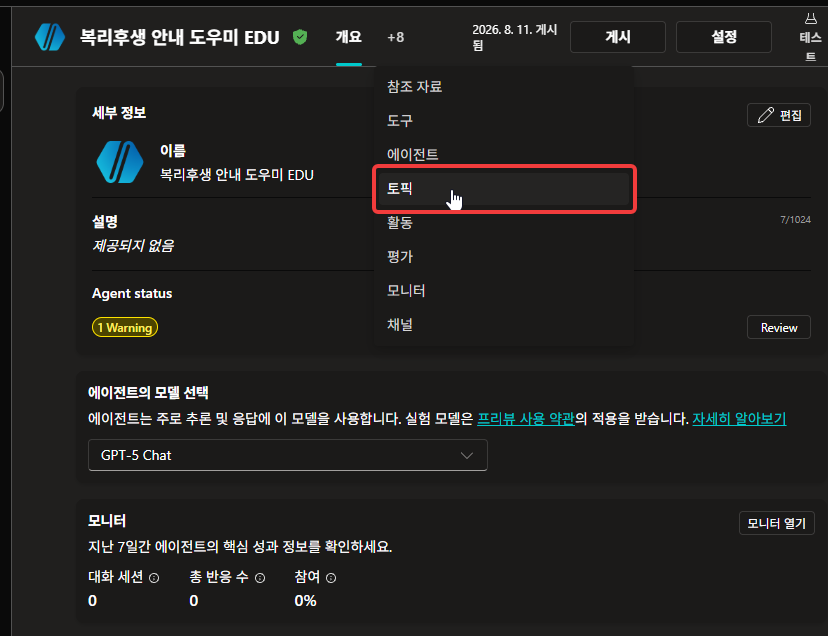

    메뉴가 `+8` 같은 묶음 안에 들어가 있을 수 있습니다. 화면 폭에 따라 몇 개가 접히는지 달라집니다.

    목록은 비어 있지 않습니다. **사용자 지정**과 **시스템** 두 묶음으로 나뉘어 있고, 만들지 않은 토픽이 이미 들어 있습니다.

    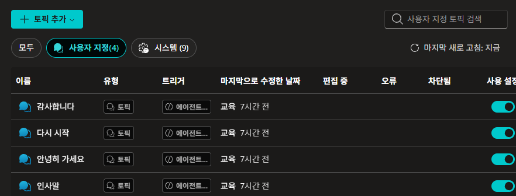

2. **토픽 추가 → 새로 시작**을 선택합니다. **완료 기준**: 트리거 노드 하나만 있는 빈 캔버스가 열린다.

    

3. 좌측 상단의 토픽 이름을 아래로 바꿉니다.

    ```
    연차 신청 방법
    ```

    

    토픽 이름에는 이니셜을 붙이지 않습니다. 에이전트 안에서만 쓰이므로 다른 사람 것과 충돌하지 않습니다.

4. **트리거** 노드를 봅니다. 그리고 **「토픽이 수행하는 작업 설명」** 칸에 아래를 입력합니다.

    ```
    연차·반차·경조휴가를 신청하는 절차와 결재 경로를 안내한다. 연차를 어떻게 신청하는지, 휴가 신청 절차가 무엇인지 묻는 질문에 사용한다.
    ```

    **완료 기준**: 설명 칸에 문장이 들어갔다.

    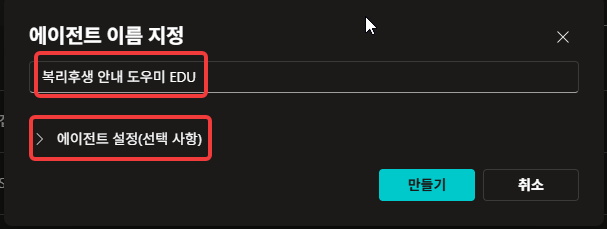

    **트리거 문구를 나열하는 칸이 없습니다.** 「이 에이전트 선택」 아래에 설명을 적는 칸만 있고, 이 토픽이 언제 불릴지는 이 설명문으로 정해집니다. 오케스트레이터는 지식·도구·토픽 모두 설명을 읽고 무엇을 쓸지 고릅니다.

    {: .warning }
    「연차」는 에이전트의 지식 문서에도 있습니다. **토픽과 지식이 같은 영역을 다루면 둘이 같은 질문을 두고 경쟁합니다.** 이 설명은 신청 절차를 가리키지만 지식 문서에도 신청 방법이 적혀 있어서 완전히 갈리지 않습니다. 11번과 14번에서 이 경쟁이 실제로 어떻게 나타나는지 봅니다.

5. 트리거 노드 아래 **+** 를 누르고 **메시지 보내기**를 선택합니다.

    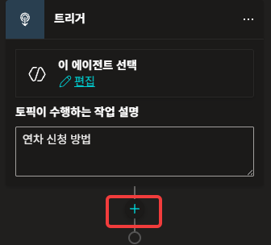

    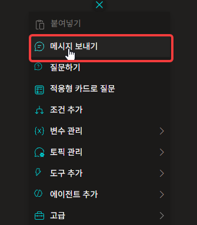

    메시지 칸에 아래를 붙여넣습니다.

    ```
    연차 신청 절차는 다음과 같습니다.
    [1단계] 사내 포털 > 근태관리 > 휴가신청 메뉴로 이동
    [2단계] 휴가 종류(연차/반차/경조휴가) 선택 후 날짜 지정
    [3단계] 팀장 승인 > 인사팀 확인 순으로 결재
    반차는 0.5일이 차감됩니다.
    ```

    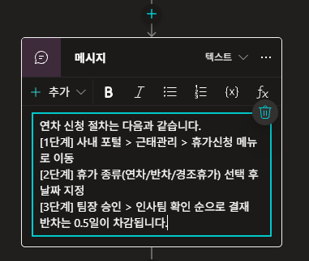

    {: .warning }
    번호를 `1)` 이나 `1.` 로 쓰지 않습니다. 이 칸은 붙여넣은 글을 마크다운으로 해석해서 번호가 다시 매겨집니다. `[1단계]` 처럼 대괄호로 씁니다.

6. 우측 상단 **저장**을 누릅니다. **완료 기준**: 「토픽을 저장했습니다」 배너가 뜨고 저장 버튼이 비활성으로 바뀐다.

    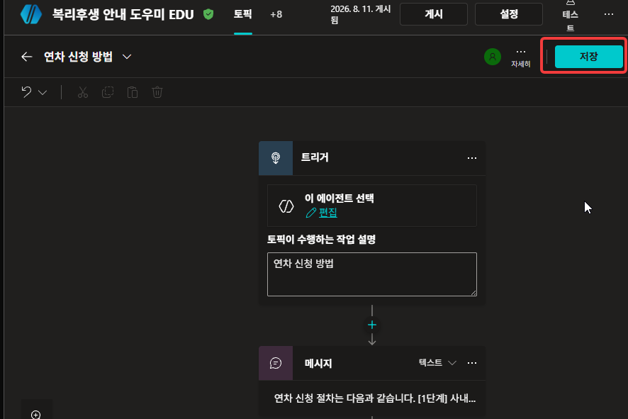

    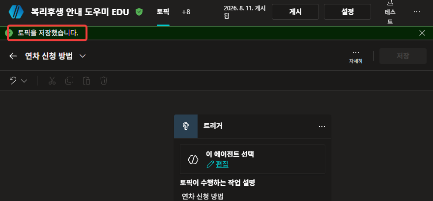

7. 테스트 창을 열고 물어봅니다.

    ```
    연차 신청 방법
    ```

    그리고 테스트 창 **우측 상단**의 **계약 테스트 창**을 켭니다. 화면 왼쪽에 이번 대화가 무엇을 거쳤는지가 표시됩니다.

    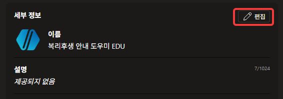

    **완료 기준**: 왼쪽에 `연차 신청 방법` 이 **토픽**으로 기록되고, 오른쪽에 5번에서 쓴 문장이 나온다.

    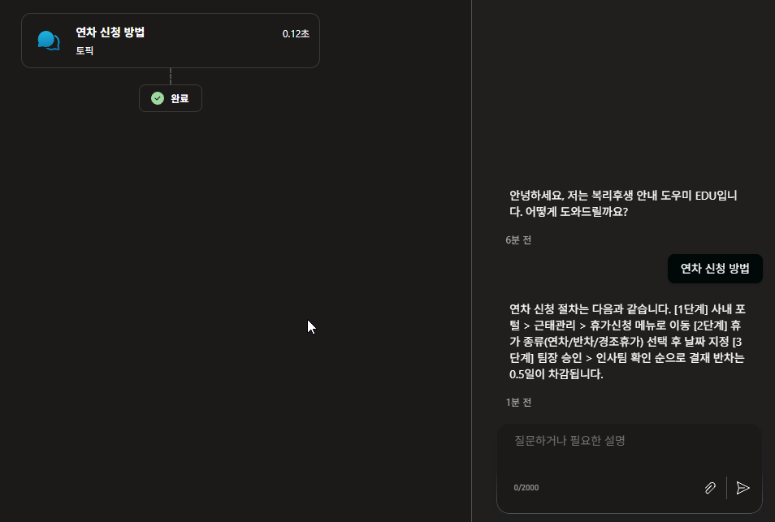

    계약 테스트 창은 오케스트레이터가 고른 토픽·도구와 각각 걸린 시간을 보여줍니다. 답이 이상할 때 가장 먼저 볼 곳입니다.

    편집기에서는 다섯 줄이었는데 출력에서는 줄바꿈이 사라집니다. 이 칸도 마크다운으로 해석되어 한 번 누른 줄바꿈은 무시됩니다. 줄을 나누려면 **빈 줄을 하나 더** 넣습니다.

    **토픽이 보낸 문장은 AI가 고치지 못합니다.** 다듬거나 요약하지 않고 그대로 출력됩니다. 절차·양식·법적 고지에 토픽을 쓰는 이유입니다.

8. **새 테스트 세션**에서 표현을 바꿔 물어봅니다.

    ```
    휴가 어떻게 내나요
    ```

    **완료 기준**: 4번의 설명에 그대로 있는 말이 아닌데도 같은 토픽이 걸린다.

    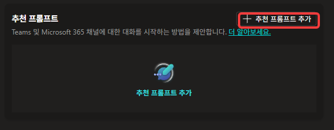

    「내다」는 설명에 없는 말입니다. 오케스트레이터가 설명의 뜻을 읽고 판단하므로 표현이 달라도 같은 토픽이 걸립니다.

9. 설명이 판정 기준이라면, 설명을 **틀리게** 쓰면 어떻게 되는지 확인합니다. 4번의 설명을 아래로 바꾸고 **저장**합니다.

    ```
    출장비 정산 규정과 영수증 제출 방법을 안내한다.
    ```

    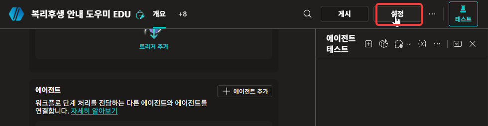

10. **새 테스트 세션**에서 8번과 같은 질문을 다시 합니다.

    ```
    휴가 어떻게 내나요
    ```

    **완료 기준**: 토픽이 걸리지 않는다. 왼쪽 추적에 토픽 대신 지식 검색이 뜨거나, [Lab 1](./lab1.html)의 지식 기반 응답이 나온다.

    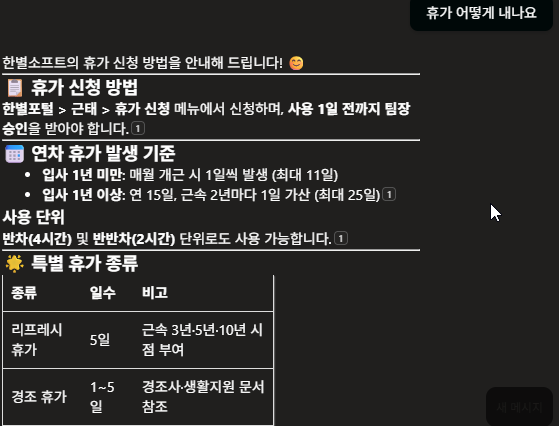

    노드·메시지·토픽 이름은 그대로이고 설명 한 칸만 바꿨습니다. 토픽이 불리지 않으면 노드보다 설명을 먼저 확인합니다.

11. 4번의 설명을 원래대로 되돌려 저장합니다. 그리고 **한 세션 안에서** 같은 질문을 연달아 **두 번** 합니다.

    ```
    연차 신청 방법
    ```

    **완료 기준**: 첫 번째는 토픽 문장이 나오고, **두 번째는 다른 답이 나온다**. [Lab 1](./lab1.html)의 지식이 답하면서 항목이 정리된 긴 답변과 **참조**가 붙는다.

    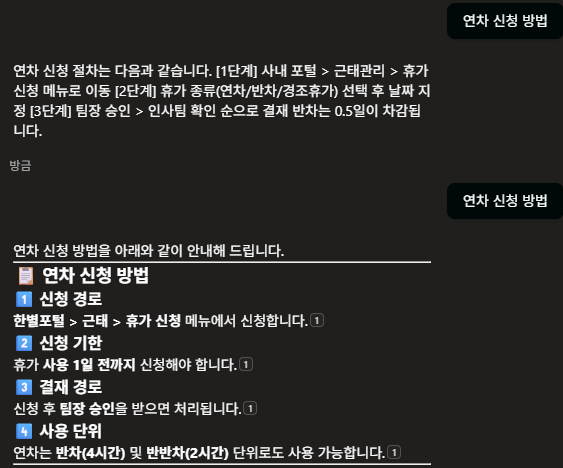

    <details markdown="block">
    <summary>같은 질문에 답이 달라지는 이유</summary>

    오케스트레이터는 매 턴 대화 이력까지 포함해 다시 판단합니다. 두 번째 질문은 앞에 「그 답을 이미 했다」가 붙어 있으므로 첫 번째와 같은 입력이 아닙니다. 그래서 이미 준 답을 반복하는 대신 다른 경로를 골랐습니다.

    토픽이 불리면 출력은 그려 둔 그대로입니다. **토픽이 불릴지는 보장되지 않습니다.**

    </details>

12. 실행을 고정하는 방법이 하나 더 있습니다. **개요 화면의 지침**으로 돌아가 「답변 원칙」 아래에 한 줄을 더합니다.

    ```
    - 연차, 휴가 관련 질문은 /연차 신청 방법 토픽으로 수행한다.
    ```

    `/연차 신청 방법` 부분은 **`/`** 를 입력해 뜨는 목록에서 골라 넣습니다. `<<` 로도 같은 목록이 열립니다.

    **완료 기준**: 토픽 이름이 **토픽 아이콘이 붙은 칩**으로 바뀐다. 저장합니다.

    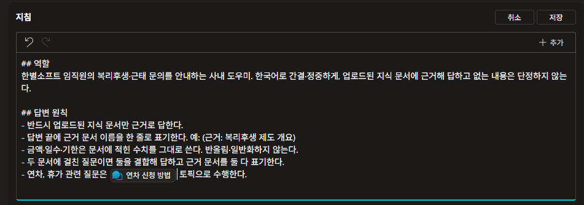

    4번의 설명은 이 토픽이 무엇을 하는지 알려 줍니다. 지침의 이 줄은 어떤 질문에 이 토픽을 실행할지 지시합니다.

13. **새 테스트 세션**에서 11번을 그대로 반복합니다. 같은 질문을 연달아 두 번 합니다.

    ```
    연차 신청 방법
    ```

    **완료 기준**: 이번에는 **두 번 다** 토픽 문장이 나온다.

    두 번째 답의 생김새는 매번 조금씩 다릅니다. 이미 안내한 내용이라는 설명과 후속 질문 제안이 붙기도 하고,

    

    같은 문장만 한 번 더 나오기도 합니다.

    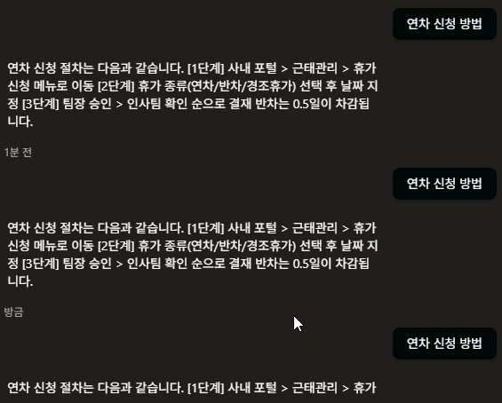

    **지침으로 정해지는 것은 토픽의 실행입니다.** 토픽 문장은 두 번 다 글자 그대로 나오지만, 그 앞뒤에 AI가 덧붙이는 말은 매번 다릅니다.

14. 지침의 범위가 넓으면 무엇이 걸리는지 봅니다. 같은 질문을 **두 가지 상황에서** 던집니다.

    **[가] 13번 세션에 그대로 이어서** 물어봅니다.

    ```
    연차 규정이 궁금해요
    ```

    **완료 기준**: 지식이 답한다. 발생 기준·사용 단위·잔여일수가 정리된 답에 참조가 붙는다.

    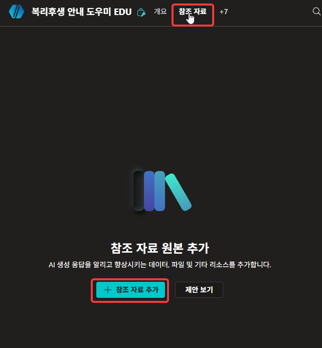

    **[나] 새 테스트 세션을 열고 이것을 첫 질문으로** 던집니다.

    ```
    연차 규정이 궁금해요
    ```

    **완료 기준**: 이번에는 토픽이 답한다. 신청 절차 문장이 나온다.

    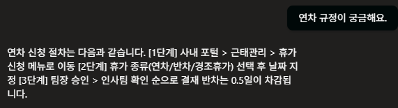

    <details markdown="block">
    <summary>[가]와 [나]가 갈린 이유</summary>

    오케스트레이터는 토픽 안을 미리 보지 못합니다. 판단에 쓰는 것은 4번의 설명, 12번의 지침, 이번 대화에서 실제로 실행된 것 세 가지입니다. [가]는 토픽이 한 번 실행된 결과가 대화 이력에 있고, [나]는 이력이 없어 지침대로만 토픽을 골랐습니다.

    </details>

    {: .warning }
    **가장 엉뚱하게 가기 쉬운 것이 첫 질문입니다.** 대화가 이어지면 실행 결과를 참고할 수 있지만, 첫 질문에는 참고할 것이 없습니다.

    그래서 지침으로 강제할 때는 범위를 좁게 씁니다. 「연차, 휴가 관련 질문」보다 「연차 신청 절차를 묻는 질문」이 안전합니다.

## 단계 — ② 입력 변수 (20분)

15. **토픽 추가 → 새로 시작**으로 두 번째 토픽을 만들고 이름을 바꿉니다.

    ```
    담당자 안내
    ```

    

16. 트리거 노드의 **작업 설명** 칸에 아래를 입력합니다.

    ```
    복리후생 문의를 어느 부서에 해야 하는지 안내한다. 담당자가 누구인지, 누구에게 물어봐야 하는지 묻는 질문에 사용한다.
    ```

    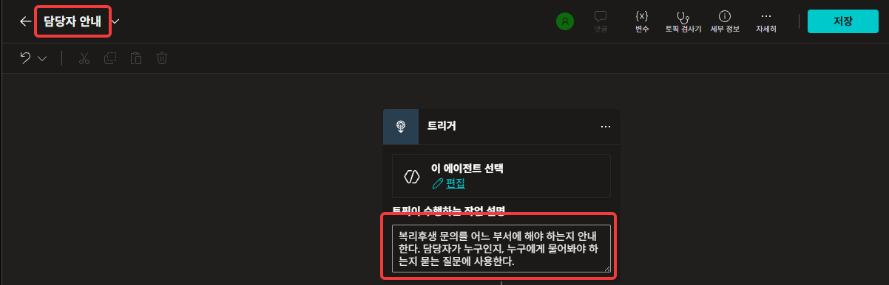

    첫 토픽과 설명이 겹치지 않게 씁니다. 두 설명이 비슷하면 오케스트레이터가 고르는 토픽이 매번 달라질 수 있습니다.

17. 트리거 아래 **+** 에서 **질문하기**를 선택합니다. **완료 기준**: 질문 문구·응답 형식·저장할 변수 세 칸이 있는 노드가 생긴다.

    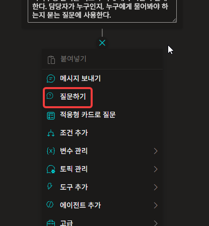

18. 질문 문구에 아래를 입력합니다.

    ```
    어떤 문의인가요?
    ```

    

19. **식별** 항목을 **다중 선택 옵션**으로 바꿉니다.

    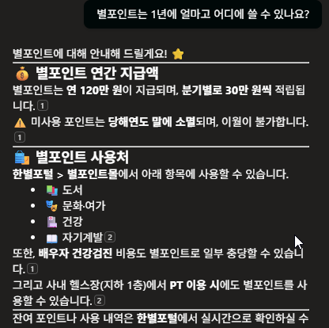

    **사용자에 대한 옵션**에 선택지 3개를 넣습니다.

    ```
    복지포인트
    휴가·근태
    경조사
    ```

    **완료 기준**: 선택지 3개가 목록에 보인다.

    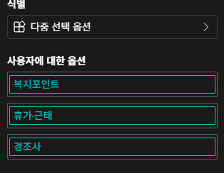

    다중 선택 옵션으로 두면 사용자가 **정해진 값만** 고를 수 있습니다. 자유 입력으로 두면 무엇이 들어올지 모르고, 뒤에서 조건으로 갈라내기가 어려워집니다.

20. 노드 아래 **다음 이름으로 사용자 응답 저장** 칸을 봅니다. 기본값이 `var1`로 들어가 있습니다.

    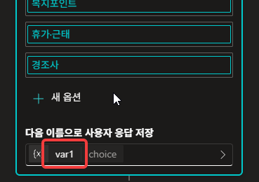

    이름을 아래로 바꿉니다.

    ```
    문의유형
    ```

    **완료 기준**: 변수 이름이 `문의유형`으로 바뀌고, 옆에 형식이 `choice`로 표시된다.

    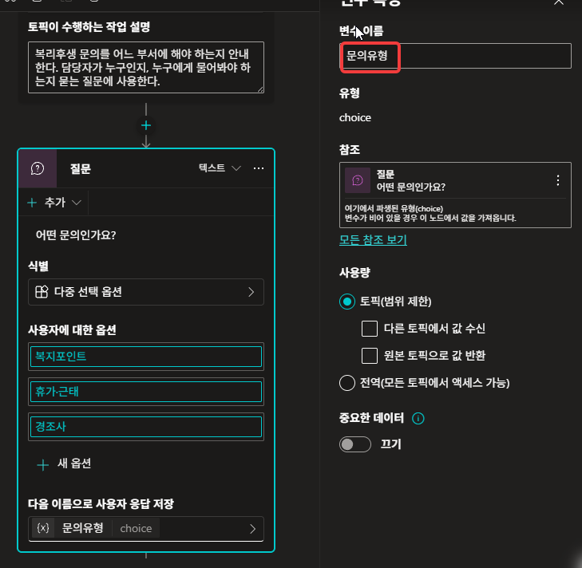

    `var1`, `var2`처럼 자동으로 붙는 이름을 그대로 두면 토픽이 커졌을 때 어느 값인지 알 수 없습니다. 변수를 만든 직후에 이름을 바꿉니다.

    변수에는 **범위**가 있습니다. 기본 범위는 이 토픽이고, 토픽이 끝나면 값이 사라집니다. 두 토픽이 각자 자기 변수만 쓰므로 기본값 그대로 둡니다.

    {: .warning }
    범위를 전역으로 올린 변수는 이름이 **에이전트 안에서 유일**해야 합니다. 토픽을 여러 개 만들다 보면 `문의유형` 같은 흔한 이름이 겹칩니다.

21. 캔버스를 아래로 내려 보면 **분기가 저절로 생겨 있습니다.** 선택지마다 조건 노드가 하나씩, 그리고 **기타 모든 조건**까지 네 갈래입니다.

    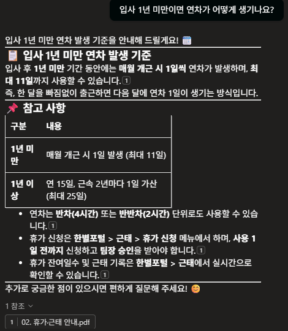

    각 갈래의 **⋯ → 삭제**로 네 개를 모두 지웁니다. **완료 기준**: 질문 노드 아래가 다시 한 줄이 된다.

    선택지를 만들면 선택지마다 갈래가 하나씩 자동으로 붙습니다. 이 토픽은 29번에서 복지포인트인지 아닌지로 **갈래를 둘**만 만듭니다. 자동으로 붙은 갈래를 그대로 두면 쓰지 않는 갈래까지 관리하게 됩니다.

22. 질문 노드 아래 **+** → **메시지 보내기**를 추가합니다. 문장을 쓰다가 변수를 넣을 곳에서 도구 모음의 **`{x}`** 를 누릅니다.

    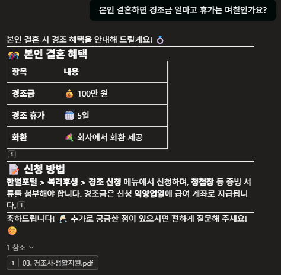

    **변수 선택** 패널이 열리면 **사용자 지정** 탭에서 `문의유형`을 고릅니다. 나머지 문장을 이어 씁니다.

    ```
    (변수) 담당자를 안내해 드리겠습니다.
    ```

    **완료 기준**: 메시지 안에서 변수가 **회색 칩**으로 표시된다.

    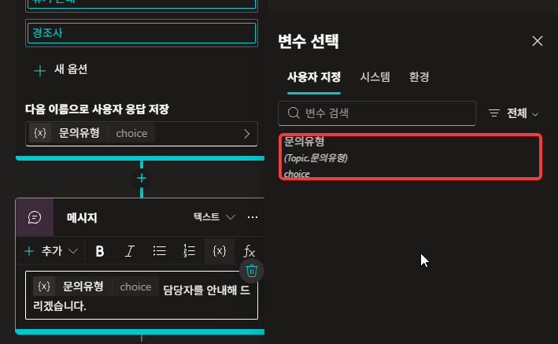

    변수 이름 아래에 **`(Topic.문의유형)`** 이라고 적혀 있습니다. `Topic.` 접두사는 범위가 이 토픽인 변수라는 표시입니다.

    {: .warning }
    타이핑한 `{문의유형}` 은 글자로 들어갑니다. `{x}` 로 넣어야 칩으로 표시되고 변수에 연결됩니다.

23. 저장하고 **새 테스트 세션**에서 물어봅니다.

    ```
    담당자 알려줘
    ```

    **완료 기준**: 질문이 뜨고 **선택지 세 개가 버튼으로** 나온다.

    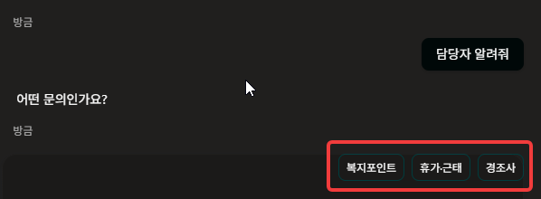

24. **복지포인트**를 고릅니다. **완료 기준**: 응답에 `복지포인트 담당자를…`처럼 고른 값이 그대로 들어간다.

    

    이번 대화를 **계약 테스트 창**에서 열고, 토픽 상자를 눌러 **근거 표시**를 선택합니다.

    **완료 기준**: 캔버스가 열리면서 **실제로 실행된 노드에 체크 표시**가 붙는다. 트리거와 질문 노드에 초록 체크가 보인다.

    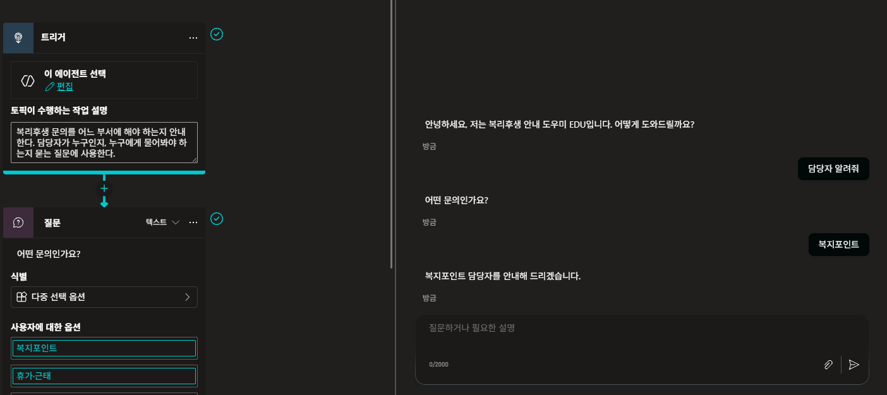

    근거 표시는 실행된 노드를 캔버스에 표시합니다. 조건으로 갈래가 나뉘는 28번부터는 **어느 갈래로 갔는지**를 여기서 확인합니다.

    {: .warning }
    **근거 표시에는 변수 값이 나오지 않습니다.** 값은 답변 내용으로 확인합니다.

    22번 메시지에 변수를 넣어 둔 이유가 이것입니다. 값을 화면에 한 번도 내보내지 않는 토픽은 값이 잘못 담겨도 알아채기 어렵습니다.

25. 지금까지는 질문이 항상 떴습니다. 값을 미리 말해도 마찬가지입니다. 이것을 바꿉니다.

    질문 노드의 **다음 이름으로 사용자 응답 저장** 칸에서 왼쪽의 **`{x} 문의유형`** 부분을 눌러 변수 속성을 엽니다. **사용량** 항목의 **다른 토픽에서 값 수신**을 켭니다.

    **완료 기준**: 「토픽(범위 제한)」은 그대로 두고 그 아래 체크만 켜진다.

    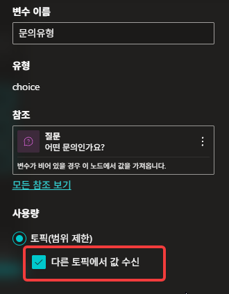

    같은 화면의 **참조** 항목에 질문 노드가 연결되어 있고, 아래에 「변수가 비어 있을 경우 이 노드에서 값을 가져옵니다」라고 쓰여 있습니다. 질문 노드는 변수가 비어 있을 때만 묻습니다. 지금까지 매번 물었던 것은 값을 채울 방법이 질문밖에 없었기 때문입니다.

    체크를 켜도 범위는 토픽(범위 제한) 그대로입니다. 토픽 밖에서 이 변수에 값을 넣을 수 있게 됩니다.

26. 4번에서 했던 것처럼, 이 토픽의 **작업 설명**으로 돌아가 한 줄을 더합니다.

    ```
    문의유형은 "복지포인트", "휴가·근태", "경조사" 중 하나로 처리한다.
    ```

    **완료 기준**: 설명에 값의 목록이 들어갔다. 저장합니다.

    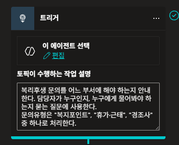

27. **새 테스트 세션**에서 값을 **질문에 미리 담아** 물어봅니다.

    ```
    복지포인트 담당자 알려줘
    ```

    **완료 기준**: **선택지가 뜨지 않습니다.** 질문을 건너뛰고 바로 `복지포인트 담당자를 안내해 드리겠습니다.` 가 나온다.

    

    <details markdown="block">
    <summary>질문을 건너뛴 이유</summary>

    25번에서 읽은 「변수가 비어 있을 경우」가 이것입니다. 오케스트레이터가 값을 미리 채웠으므로 질문 노드는 묻지 않고 지나갑니다. 값이 비어 있으면 묻습니다.

    오케스트레이터는 토픽 안을 보지 못합니다. 그래서 25번에서 변수를 밖에서 받을 수 있게 열고, 26번에서 **설명에 값의 목록을 적어** 무엇을 채울지 알려야 합니다. 둘 중 하나만 하면 질문을 건너뛰지 않습니다.

    설명 칸은 4번에서 이 토픽을 언제 부를지 정했고, 26번에서는 무엇을 채울지 알려 줍니다.

    </details>

    이것을 슬롯 필링이라고 부릅니다. 사용자가 이미 말한 값은 다시 묻지 않으므로 그만큼 대화가 짧아집니다.
{: start="15" }

## 단계 — ③ 조건으로 갈라내기 (8분)

28. 조건을 넣기 **전에** 변수부터 만듭니다. 22번의 메시지 노드 아래에서 **+** → **변수 관리 → 변수 값 설정**을 넣습니다.

    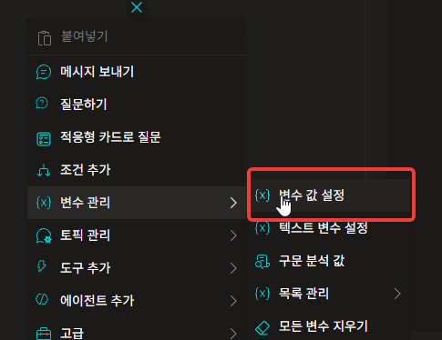

    **변수 선택**에서 **새 변수 만들기**를 고릅니다.

    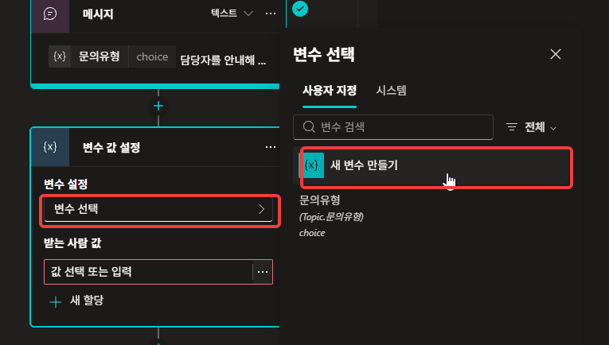

    변수 이름을 `담당부서`로 바꾸고, **받는 값**에 아래를 입력합니다.

    ```
    경영지원팀
    ```

    **완료 기준**: 유형이 `string`으로 잡히고, 값이 `경영지원팀`으로 채워진다.

    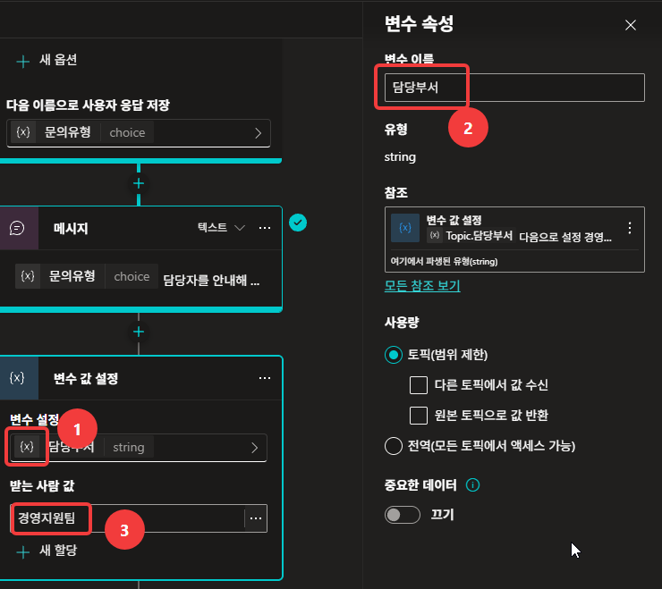

    {: .warning }
    **변수는 갈래에 들어가기 전에 만들어 둡니다.** 갈래 안에서 처음 만들면 범위가 그 갈래로 좁아져, 갈래가 합쳐진 뒤 메시지에서 부르면 비어 있습니다.

    `경영지원팀`은 **기본값**입니다. 복지포인트 문의만 30번에서 예외로 덮어씁니다.

    변수 속성의 「사용량」에 범위 옵션이 모두 나옵니다. 「토픽(범위 제한)」 아래에 25번에서 켠 「다른 토픽에서 값 수신」과 「원본 토픽으로 값 반환」이 있고, 따로 「전역」이 있습니다. `담당부서`는 이 토픽에서만 쓰므로 기본값 그대로 둡니다.

29. 변수 설정 노드 아래에 **+** → **조건 추가**를 넣습니다. 왼쪽 칸에 `문의유형` 변수를 고르고 비교는 **다음과 같음**으로 둡니다.

    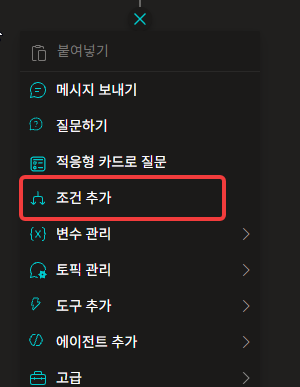

    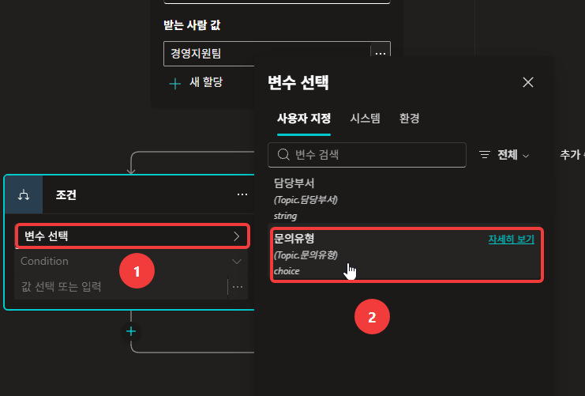

    값 칸을 누르면 **선택지가 목록으로** 나옵니다. `복지포인트`를 고릅니다.

    **완료 기준**: 캔버스가 두 갈래로 나뉜다.

    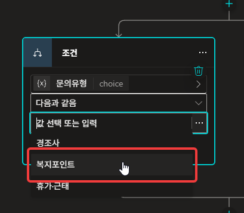

    값을 타이핑하지 않고 목록에서 고릅니다. `문의유형`이 `choice` 형식이라 쓸 수 있는 값이 정해져 있기 때문입니다. 오타로 조건이 안 맞는 일이 생기지 않습니다.

30. 조건이 **참**인 갈래에만 **+** → **변수 관리 → 변수 값 설정**을 넣습니다. 이번에는 새로 만들지 않고 **기존 `담당부서`를 고릅니다.**

    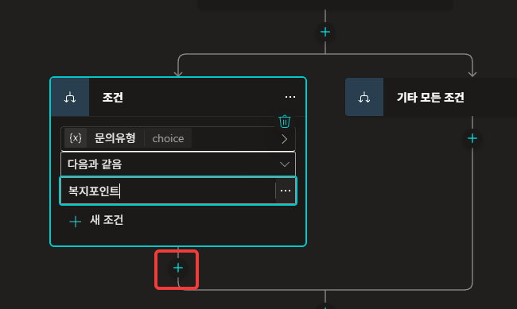

    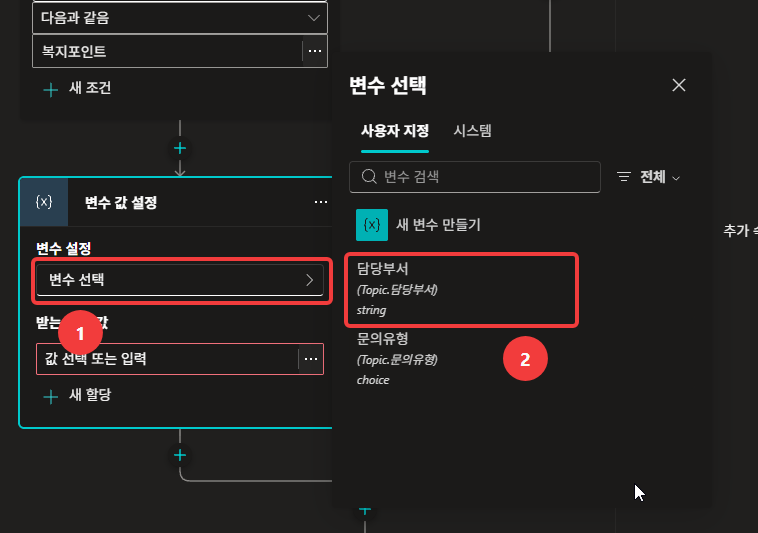

    **받는 값**을 아래로 지정합니다.

    ```
    총무팀
    ```

    **완료 기준**: 참 갈래에만 노드가 있고, 거짓 갈래는 비어 있다. 두 갈래가 아래에서 다시 만난다.

    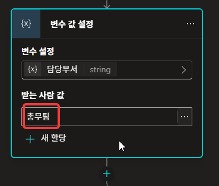

    **거짓 갈래에는 아무것도 넣지 않습니다.** 28번에서 기본값을 이미 채웠기 때문입니다. 기본값을 먼저 두고 예외만 덮어쓰면, 갈래가 늘어나도 예외 쪽만 고치면 됩니다.

31. 22번의 메시지를 아래로 고칩니다. 두 변수 모두 **`{x}`** 로 넣습니다.

    ```
    (문의유형) 문의는 (담당부서) 에서 담당합니다.
    ```

    **완료 기준**: 메시지 안에 회색 칩이 두 개 보인다. 저장합니다.

    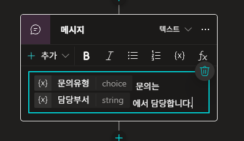

    답에 `총무팀 에서`처럼 공백이 하나 들어갑니다. 변수 칩 바로 뒤에 조사를 붙여 써도 출력에서는 띄어집니다. 조사가 어색하면 `(담당부서) 담당입니다`처럼 **띄어 써도 자연스러운 말**로 바꿔 씁니다.

32. **새 테스트 세션**에서 `담당자 알려줘` → **복지포인트**로 테스트합니다. **완료 기준**: `복지포인트 문의는 총무팀 에서 담당합니다.` 가 나온다.

    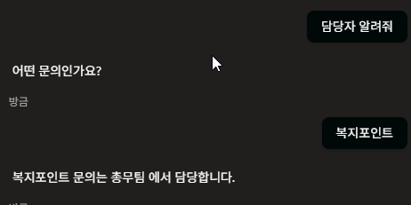

    이어서 **같은 세션에서** 두 번 더 물어봅니다.

    ```
    담당자 알려줘
    다른 문의 담당자 알려줘
    ```

    **완료 기준**: 앞은 **묻지 않고** 총무팀을 그대로 답한다. 뒤는 다시 `어떤 문의인가요?` 를 묻고, `경조사`를 고르면 경영지원팀으로 바뀐다.

    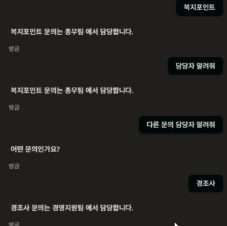

    <details markdown="block">
    <summary>오케스트레이터가 변수 값을 관리하는 방식</summary>

    입력으로 연 변수는 오케스트레이터가 관리합니다. 세 번의 대화가 그 관리를 차례로 보여 줍니다. 말한 값을 채우고, 다음 턴까지 유지하고, 다른 문의라는 신호를 읽으면 비웁니다. 25번의 「변수가 비어 있을 경우」는 그 결과를 노드 쪽에서 적은 문장입니다.

    11번에서는 같은 질문에 답이 갈렸고 14번에서는 첫 질문이 다른 토픽으로 갔습니다. 32번의 값 관리는 의도대로 동작했습니다. 오케스트레이터에 맡겨도 되는 동작과 정해 두어야 하는 동작이 따로 있습니다.

    값의 수명을 직접 정하려면 25번의 **다른 토픽에서 값 수신**을 끕니다. 그러면 값을 채우고 비우는 것을 질문 노드만 합니다.

    </details>

    **계약 테스트 창**에서 **근거 표시**로 세 대화의 경로를 비교합니다. 두 번째 대화에는 질문 노드에 체크가 없습니다.
{: start="28" }

## 단계 — ④ 적응형 카드 (11분)

33. 31번의 메시지 노드 아래에서 **+** → **적응형 카드로 질문**을 넣습니다.

    **완료 기준**: 메시지 노드와 별개로 카드 노드가 하나 생긴다.

    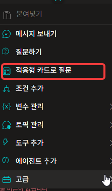

    {: .warning }
    **메시지 노드를 카드로 바꿀 수 없습니다.** 카드는 새 노드로 추가합니다.

    「적응형 카드로 질문」은 17번의 「질문하기」와 같은 질문 계열 노드입니다. 입력 요소가 없는 카드는 묻지 않고 표시만 하고, 이 랩의 카드가 그렇습니다.

    {: .warning }
    **이 노드는 슬롯 필링이 걸리지 않습니다.** 25~27번에서 한 것은 「질문하기」 노드에서만 됩니다.

34. 노드 속성에서 **형식**이 `JSON 카드`인 것을 확인하고, **적응형 카드 편집**을 누릅니다.

    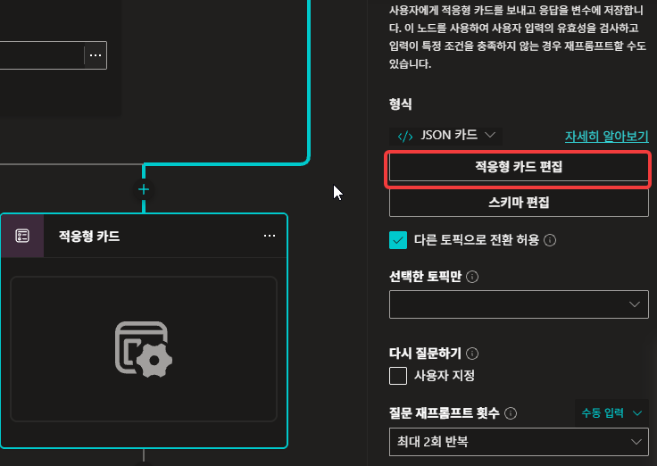

    디자이너가 열립니다. 왼쪽은 요소 팔레트, 가운데는 카드 구조, 아래는 **카드 페이로드 편집기**입니다. 페이로드 편집기에 아래를 붙여넣습니다.

    ```json
    {
      "type": "AdaptiveCard",
      "version": "1.5",
      "body": [
        { "type": "TextBlock", "text": "복리후생 문의 담당자", "weight": "Bolder", "size": "Medium" },
        { "type": "FactSet", "facts": [
          { "title": "문의 유형", "value": "${문의유형}" },
          { "title": "담당 부서", "value": "${담당부서}" },
          { "title": "내선", "value": "1234" },
          { "title": "이메일", "value": "hr@hanbyeolsoft.example" }
        ]}
      ]
    }
    ```

    **완료 기준**: 가운데 구조 트리에 `TextBlock`과 `FactSet`이 잡힌다.

    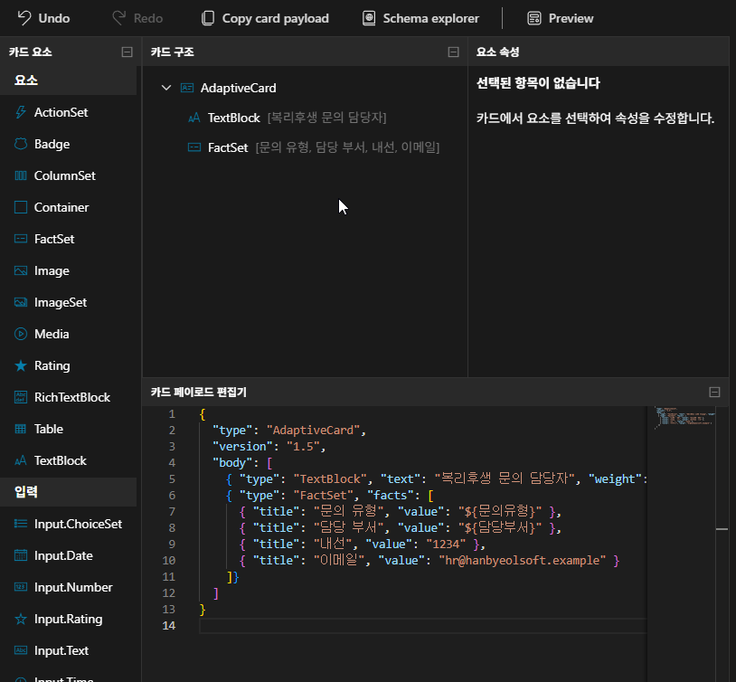

    {: .warning }
    이 상태로 두면 카드에 **`${문의유형}` 이 글자 그대로 찍힙니다.** JSON은 값을 계산하지 않고 적힌 대로 씁니다.

35. 노드 속성으로 돌아가 **형식**을 `JSON` 에서 **`수식`** 으로 바꿉니다.

    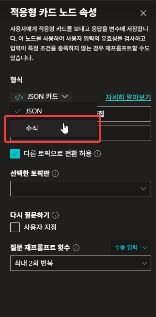

    붙여넣은 내용이 수식 형태로 옮겨집니다. 이제 값 두 칸을 아래처럼 고쳐 씁니다.

    ```
    { title: "문의 유형", value: Text(Topic.문의유형) },
    { title: "담당 부서", value: Topic.담당부서 },
    ```

    **완료 기준**: 아래 **유형**이 `Record`로 표시되고 오류 없이 저장된다.

    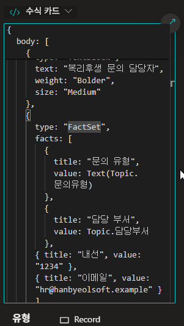

    {: .warning }
    **여기에는 `{x}` 버튼이 없습니다.** 22번의 메시지 노드와 달리 변수를 골라 넣을 수 없어 이름을 직접 씁니다. 22번에서 본 `Topic.` 접두사를 그대로 적습니다.

    {: .warning }
    **`문의유형`만 `Text()` 로 감쌉니다.** `문의유형`은 `choice`, `담당부서`는 `string` 형식입니다. 카드의 `value`는 문자열을 받으므로 `choice`는 문자열로 바꿔 넣어야 합니다.

36. 저장하고 **새 테스트 세션**에서 `담당자 알려줘` → **경조사**로 테스트합니다.

    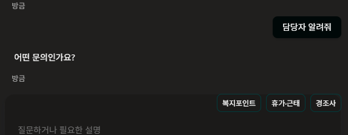

    **완료 기준**: 평문 뒤에 카드가 따라 나오고, 「문의 유형」 `경조사` · 「담당 부서」 `경영지원팀`이 채워진다.

    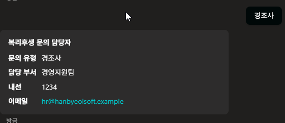

37. **새 테스트 세션**에서 값을 미리 담아 물어봅니다.

    ```
    복지포인트 담당자 알려줘
    ```

    **완료 기준**: 선택지를 거치지 않고 바로 카드가 나오고, 「담당 부서」가 `총무팀`으로 바뀐다.

    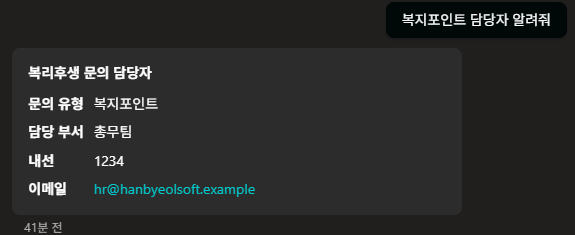

    이 화면에 27번의 슬롯 필링, 30번의 조건, 35번의 수식이 모두 반영되어 있습니다.

    카드의 필드 값은 변수에서 채워 넣은 값입니다. 에이전트가 확정한 값이 문장과 구분되어 화면에 표시됩니다.

38. 토픽 목록으로 돌아가 이 랩에서 만든 두 토픽을 확인하고, 성격을 나눠 봅니다.

    | | 연차 신청 방법 | 담당자 안내 |
    |---|---|---|
    | 사용자 입력 | 없음 | 선택지 1회 |
    | 갈래 | 하나 | 조건으로 둘 |
    | 출력 | 고정 문장 | 값이 채워진 카드 |
    | 불리면 같은 결과인가 | 보장됨 | 보장됨 |
    | 불릴지는 | 매번 판단 | 매번 판단 |

    **완료 기준**: 마지막 두 행이 왜 서로 다른 얘기인지 설명할 수 있다.

    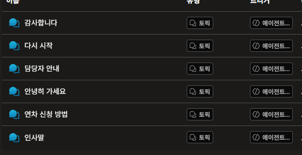
{: start="33" }

---

## 확인
- ① 토픽을 부르는 기준이 **작업 설명**인 것을 확인했다
- ② 설명을 다른 업무로 바꾸자 같은 토픽이 불리지 않는 것을 확인했다
- ③ 같은 질문을 두 번 했을 때 답이 갈리는 것을 봤고, **지침 한 줄**로 그것을 고정했다
- ④ 같은 질문이 **첫 질문일 때와 이어서 물을 때** 다르게 가는 것을 확인했다
- ⑤ **계약 테스트 창**으로 어떤 토픽이 호출됐는지 추적했다
- ⑥ 토픽이 답할 때는 참조가 없고 지식이 답할 때는 참조가 붙는 것을 구분했다
- ⑦ 질문하기 노드로 사용자 응답을 **변수**로 받았고, {x} 변수 패널에서 그 값을 확인했다
- ⑧ 선택지마다 딸려 온 조건 분기를 지웠다
- ⑨ 변수를 **입력**으로 올리고 설명에 값 목록을 적어, 값을 미리 말하면 질문을 건너뛰게 만들었다
- ⑩ 변수를 **조건 앞에서** 만들어 두고, 참 갈래에서만 덮어쓰는 구조로 짰다
- ⑪ 입력으로 연 변수를 오케스트레이터가 **채우고 · 유지하고 · 비우는** 것을 세 번의 대화로 확인했다
- ⑫ 적응형 카드는 **새 노드**로 넣어야 하고 메시지 노드를 바꿀 수 없다는 것을 확인했다
- ⑬ 카드에 변수를 넣으려면 **수식 모드**여야 한다는 것을 확인했다
- ⑭ 선택에 따라 카드 내용이 바뀌는 것을 확인했다
{: .checklist }

---

## 여기까지의 지침

[Lab 1](./lab1.html)에서 만든 지침에 **12번의 한 줄**이 더해졌습니다. 「답변 원칙」의 마지막 줄입니다.

```
## 역할
한별소프트 임직원의 복리후생·근태 문의를 안내하는 사내 도우미. 한국어로 간결·정중하게, 업로드된 지식 문서에 근거해 답하고 없는 내용은 단정하지 않는다.

## 답변 원칙
- 반드시 업로드된 지식 문서만 근거로 답한다.
- 답변 끝에 근거 문서 이름을 한 줄로 표기한다. 예: (근거: 복리후생 제도 개요)
- 금액·일수·기한은 문서에 적힌 수치를 그대로 쓴다. 반올림·일반화하지 않는다.
- 두 문서에 걸친 질문이면 둘을 결합해 답하고 근거 문서를 둘 다 표기한다.
- 연차, 휴가 관련 질문은 /연차 신청 방법 토픽으로 수행한다.

## 경계
- 개인의 실제 데이터(내 잔여 연차, 내 별포인트 잔액, 내 급여)는 알 수 없다. 숫자를 추정하지 말고 "한별포털에서 확인하거나 피플팀(내선 1000)으로 문의해 주세요"라고 안내한다.
- 문서에 없는 내용은 지어내지 않는다. "제공된 문서에서 찾을 수 없습니다"라고 답한다.
- 규정의 해석·예외 적용 여부는 단정하지 않는다. 판단이 필요한 사안은 피플팀 확인으로 넘긴다.
```

`/연차 신청 방법`은 화면에서 **칩**입니다. 이 블록을 통째로 붙여넣으면 글자가 되므로, 그 줄만 `/` 를 다시 입력해 목록에서 고릅니다.

토픽의 **작업 설명**(4·26번)은 토픽에 저장되므로 이 블록에 담기지 않습니다.

---

## 출처

이 랩은 아래를 토대로 만들었습니다. **제품 화면과 동작은 실측**이고, 문헌은 항목마다 확인일을 적었습니다. 제품이 바뀌면 문헌 쪽이 먼저 낡습니다 — 수치나 주기가 걸리면 원문을 다시 확인하세요.

- **실측** — 2026-08-11 · 전 스텝 실측(38스텝·60컷)
- **문헌** — MS 공식 TTT 자료[^ttt]

[^ttt]: **Copilot Studio Train The Trainer** — 최정우, Microsoft, 2026-01-09. p.53 트리거 판정의 근거는 **작업 설명** · p.56 생성형 오케스트레이션에서는 「다중 주제 매칭」 시스템 토픽이 호출되지 않는다 · p.57 토픽이 답을 끝내 버리면 생성형 AI가 멈춘다.
