# Lab 3. 웹사이트를 지식으로 🌐

> **이번 랩 완성물**: 같은 질문을 세 사이트로 물어보며 **무엇을 근거로 답하는지**를 가려낸 기록. 그리고 공신력 있는 근거로 답하는 에이전트
> **예상 시간**: 30분 (순수 핸즈온) · 도입 개념 설명 5분은 별도
> **완성 신호**: 답이 나왔다는 것만으로 믿지 않고, **참조를 눌러 근거의 격을 판단**할 수 있다

{: .time }
30분 타이머 — 「단계」 1번부터 켭니다.

**인터미션 슬라이드** — 랩 시작 전 강사가 설명하는 개념입니다. [브라우저로 보기](../assets/decks/lab3-intermission.html) · [PDF](../assets/decks/lab3-intermission.pdf)

<!-- 저작 메모(2026-08-11 신설). 19스텝·22컷 촬영 완료.

     ★ 이 랩의 에이전트는 **이후 랩에서 쓰지 않는다.** 그래서 18번에서 켠 웹의 정보 사용을
       되돌릴 필요가 없고, "다시 끄세요" 주의 문구 두 곳을 걷어냈다(2026-08-11).
       Lab 2 에이전트는 Lab 4·7에서 재사용하므로 그쪽 주의는 그대로 둔다 — 둘을 혼동하지 말 것.

     ★★ 2026-08-11 실측으로 **설계 전제 두 개가 뒤집혔다.** 반드시 읽고 시작할 것.

     (1) `blog.naver.com`은 **된다.** 크롤링 차단이라고 단정했던 것이 틀렸다.
         근거로 삼았던 것은 `site:blog.naver.com 퇴직금` 검색 결과였는데, 그 검색 자체가
         판정에 못 쓴다고 결론냈으면서 정작 그 결과로 실패 사례를 정하는 모순을 저질렀다.
         실제로 CS에 넣으니 개인 블로그 글 2건을 근거로 답한다.
     (2) `cafe.naver.com`은 안 읽힌다(로그인 벽). 그런데 **답은 한다.**
         "현재 내부 데이터베이스에서 찾을 수 없습니다"라고 사과한 뒤 모델 자체 지식으로
         표까지 만들어 답한다. 참조는 붙지 않는다. 5번에서 켜 둔 「근거 없는 응답 허용하기」
         때문이다.

     ★ 그래서 랩의 축을 **"되느냐 안 되느냐"에서 "무엇을 근거로 답하느냐"로 바꿨다.**
       세 케이스가 근거의 3단계로 정확히 갈린다:
         cafe   → 근거 없음(모델 지식). 참조가 안 붙는다
         blog   → 근거 있음. 다만 개인 블로그
         easylaw→ 근거 있음. 법제처 + 근로자퇴직급여 보장법 조문
       세 번 다 답은 나온다. 이게 이 랩의 심장이다.
       MS 문서의 "커뮤니티·포럼은 위험" 경고가 blog 케이스로 실증된다.

     소재를 퇴직금으로 잡은 이유 — Lab 2의 26번 ③에서 "사내 자료에서 찾을 수 없습니다"로
     끝난 그 질문이다. 「문서에 없으면 문서를 늘린다, 다만 무엇으로 늘리느냐가 남는다」로 이어진다.

     에이전트를 새로 만드는 이유 — Lab 2 지침의 「반드시 업로드된 지식 문서만 근거로
     답한다」와 정면 충돌한다. 거기 웹을 붙이면 지침을 고쳐야 하고 Lab 4·7에서 쓸 상태가
     흐트러진다. 또 Lab 2 에이전트는 "사내 규정만 보는 폐쇄형"이라는 정체성이 있다.

     ★ easylaw 실측: "퇴직금 알려줘" → 근로자퇴직급여 보장법 제8·9·44조를 인용하며
       산정 공식·지급 기한 14일·미지급 처벌·평균임금 제외 기간·IRP 지급까지 답한다.
       참조 = 「퇴직급여 지급 < 퇴직급여제도 - 찾기 쉬운 생활법령정보」(페이지 제목 형태).
       인용이 클리커블하고 실제 원문으로 이동한다:
       https://www.easylaw.go.kr/CSP/CnpClsMainBtr.laf?csmSeq=999&ccfNo=3&cciNo=2&cnpClsNo=1
     ★ 근거 페이지가 사이트 안쪽(/CSP/...)에 있는데 잡혔다. 최상위 도메인으로 등록했기
       때문이다. 깊게 넣었으면 범위 밖이었다 — 13번에 실무 조언으로 넣었다.

     ★ `site:` 사전 검증 스텝은 **의도적으로 넣지 않았다.**
       판정 기준을 두 번 바꿔 봤으나(결과 개수 → 목록 상위) 둘 다 반증됐고, 결국 그 결과를
       믿은 탓에 위 (1)의 오판까지 나왔다. TTT p.61이 권하는 방법이지만 따르지 않는다.
       판정은 언제나 CS 안에서 — 넣고, 물어보고, 참조를 누른다.

     2026-08-11 촬영 반영(6~12번):
       - 참조 자료 추가가 4단계다(탭 → + 추가 → 공개 웹 사이트 선택 → 링크 입력 → 목록).
         6·7번 두 스텝으로 나눴다.
       - ★ 주소 교체는 **삭제 후 재등록이 아니라 편집**이다. 편집 화면에서 이름·설명·
         「웹 페이지에 링크」 세 곳을 바꾸고 저장한다. 10·14번을 그렇게 고쳤다.
       - ★ 편집 화면에 **「공식 출처」 토글**이 있다. 이 랩 주제(근거의 격)와 정확히 맞닿아서
         10번에 복선을 깔고 17번에서 회수한다. MS 문서상 생성형 오케스트레이션에서는
         호환되지 않는다고 하므로 "켜라"가 아니라 "판단은 사람이 한다"로만 다뤘다.
       - ★ 웹사이트 지식에도 **상태 「준비」**가 뜬다(미실측 항목 해소). 다만 이건 등록이
         끝났다는 뜻이지 읽힌다는 뜻이 아니다 — 7번 note에 명시했다.
       - blog.naver.com 참조 실측: 「노무사가 알려주는 퇴직금 …」 등 3건. 전형적인 개인
         블로그 글 제목이라 12번 소재로 그대로 쓴다.

     2026-08-11 촬영 반영(1~5번): 구 5·6번(근거 없는 응답 허용 / 웹의 정보 사용)을 병합했다.
       lab3-05 컷에서 두 토글이 한 화면에 나란히 있는 것을 확인했다.
       스텝 4(설명)는 편집 진입과 저장이 나뉘어 두 컷(04, 04b)이 됐다 — CS는 대부분
       편집 진입이 한 번 더 있다. Lab 2에서 설명·추천 프롬프트·문서 설명·지침이 전부 그랬다.

     ⚠️ 답변 품질이 예상보다 훨씬 높다(easylaw). 사이트가 원래 잘 정리돼 있기 때문이고
       참고 페이지 3부와 연결해 "좋은 문서를 만난 것"으로 짚었다. 다른 사이트로 바꾸면
       이 인상이 안 나올 수 있다.
     2026-08-11 실측 정정(15·18번):
       - 15번 팁에서 "답이 훨씬 길다"를 걷어냈다. **네이버 블로그 쪽이 더 길 수 있다**(SEO).
         길이가 아니라 **논제**가 다르다 — 블로그는 "어떻게 받는가"(사례·팁),
         법제처는 "법이 뭐라고 정하는가"(조문 번호). 조문은 확인 가능하고 팁은 아니다.
       - ★ 18번 — 웹 검색을 켜도 **지정 참조 자료에 인용할 것이 있으면 그쪽을 우선한다**
         (제작자 관찰, Sonnet 특성으로 보임). 그래서 같은 질문으로는 대비가 안 난다.
         구조를 둘로 나눴다: ① 같은 질문 → 안 달라짐 ② 지정 사이트에 없는 질문 → 웹이 샌다.
         결론도 "켜면 섞인다"에서 **"평소엔 티가 안 나다가 경계에서 조용히 새어나간다"**로
         바꿨다. 이쪽이 실제 위험에 가깝다.
       ★ 2026-08-11 확정 — `미국은 퇴직금 제도가 어떻게 되나요?`로 **바로 일반 웹으로 튄다.**
         참조 3건이 전부 easylaw 밖이다(「퇴직 연금과 관련하여 알아…」, 「한국 vs 미국 퇴직연금,
         차이…」, 「미국의 퇴직연금제도는 어떤…」). 답도 401(k) 중심으로 완전히 달라진다.
         반면 `퇴직금 알려줘`는 웹을 켜도 easylaw가 그대로 우선된다 — 대비가 선명하다.
       ⚠️ 18번 두 번째 질문은 후보를 한 번 갈아 끼웠다.
         `퇴직금 계산기는 어디서 쓸 수 있나요?` → **탈락.** easylaw 페이지 안에 고용노동부
           계산기 링크가 있어서 참조가 easylaw로 뜬다. 웹이 새지 않는다.
         → `미국은 퇴직금 제도가 어떻게 되나요?`로 교체. easylaw는 **대한민국 생활법령**만
           다루므로 확실히 범위 밖이고, 법률 질문처럼 보여 경계가 자연스럽다.
         여전히 미확정이다. 이것도 안 새면 후보: 퇴직금 관련 대법원 판례(요약이 있을 위험) /
           퇴직연금 수익률 / 특정 기업 퇴직금 규정.
       ★ 2026-08-11 발견 — 참조를 누르면 **`m.easylaw.go.kr`(모바일 주소)로 열린다.**
         최상위 도메인으로 등록한 덕에 모바일 서브도메인까지 범위에 들어온 것이다.
         13번 note의 "www.를 붙이면 서브도메인이 빠진다"에 대한 실증이라 거기 붙였다.

     ⚠️ 미실측 — 45명 동시 조회 시
       Bing 쪽 제약. 18번에서 웹 검색을 켰을 때 참조가 실제로 섞이는지.

     근거: MS Learn 「Add a public website as a knowledge source」/「Knowledge sources summary」,
     TTT p.60~64. -->

---

## 준비

- [Lab 2](./lab2.html)를 마친 상태. 같은 환경에서 작업합니다.
- 이 랩에서는 **에이전트를 새로 만듭니다.** Lab 2 에이전트는 그대로 둡니다.

{: .warning }
Lab 2 에이전트에 웹사이트를 붙이지 마세요. 그 지침에는 「반드시 업로드된 지식 문서만 근거로 답한다」가 들어 있어 서로 부딪힙니다.

## 단계

1. 왼쪽 메뉴 **에이전트** → **+ 빈 에이전트 만들기**를 누릅니다. [Lab 2](./lab2.html) 3번과 같은 자리입니다.

    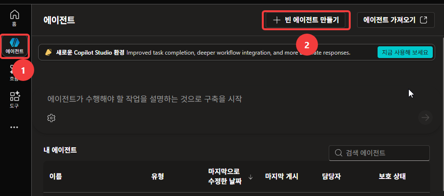

2. 이름에 아래를 입력합니다. `HGD` 자리에는 **본인 영문 이니셜**을 넣습니다.

    ```
    사외 정보 안내 도우미 HGD
    ```

    **에이전트 설정(선택 사항)**을 펼쳐 스키마 이름도 채웁니다.

    ```
    ExternalInfoAgentHGD
    ```

    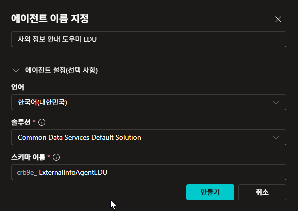

3. **만들기**를 누릅니다. **완료 기준**: 개요 화면이 열린다.

    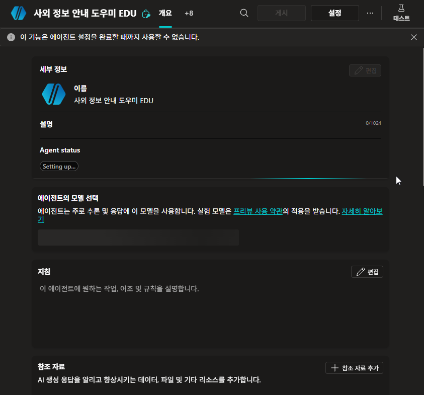

4. **세부 정보**의 **편집**을 눌러 **설명**을 입력합니다.

    ```
    사내 문서에 없는 법·제도 정보를 공개 사이트에 근거해 안내합니다.
    ```

    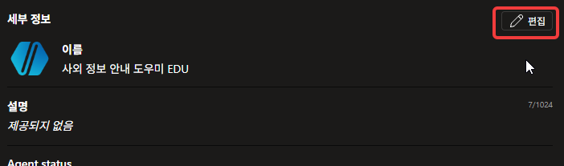

    입력한 뒤 **저장**을 누릅니다.

    

5. 상단 **설정** → **생성형 AI**로 들어갑니다. 「지식」 항목에 토글 두 개가 나란히 있습니다.

    | 토글 | 이렇게 |
    |---|---|
    | **근거 없는 응답 허용하기** | **켜기**인지 확인 (기본값) |
    | **웹의 정보 사용** | **끕니다** |

    **완료 기준**: 위는 켜짐, 아래는 꺼짐.

    

    {: .important }
    **웹 검색과 웹사이트 지식은 다릅니다.** 웹 검색은 「인터넷 전체를 뒤져도 된다」이고, 웹사이트 지식은 「이 주소 안에서만 찾아라」입니다. 둘을 켜두면 결과가 섞여서 어느 쪽이 답했는지 알 수 없습니다. 이 랩은 **어느 사이트가 근거였는지** 가려내는 것이라 웹 검색을 꺼야 합니다.

6. **참조 자료** 탭으로 이동합니다. 「참조 자료 원본 추가」 화면에서 **+ 참조 자료 추가**를 누릅니다.

    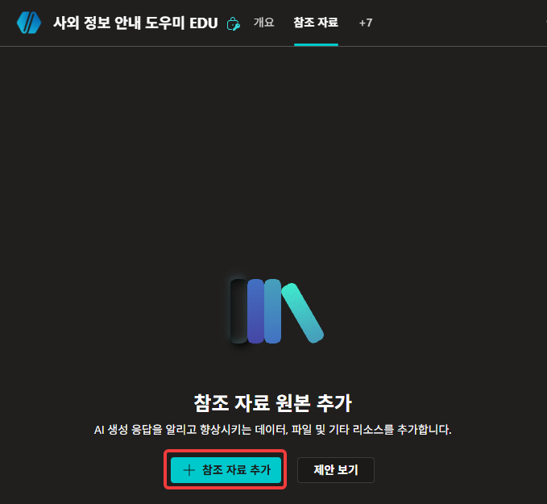

7. 원본 종류에서 **공개 웹 사이트**를 고릅니다.

    

    **공개 웹 사이트 링크** 칸에 아래를 넣고 **추가**를 누릅니다.

    ```
    cafe.naver.com
    ```

    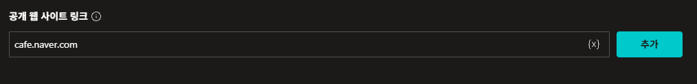

    **완료 기준**: 목록에 주소가 추가되고 상태가 **준비**가 된다. **오류는 나지 않습니다.**

    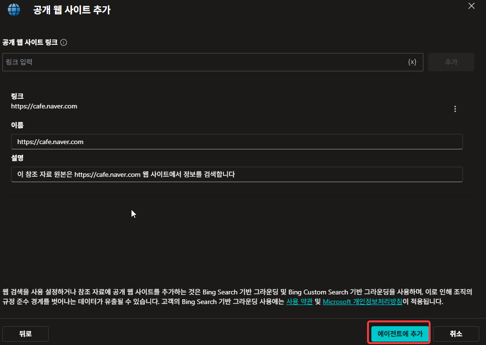

    {: .note }
    Copilot Studio는 주소를 등록할 때 **그 사이트를 실제로 읽을 수 있는지 검사하지 않습니다.** 상태가 「준비」로 바뀌어도 그건 등록이 끝났다는 뜻이지 읽힌다는 뜻이 아닙니다.

8. **새 테스트 세션**에서 물어봅니다.

    ```
    퇴직금 알려줘
    ```

    **완료 기준**: 답이 나온다. 다만 **"찾을 수 없습니다"로 시작한다.**

    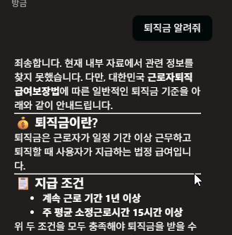

    {: .important }
    **읽히지 않았는데 답은 했습니다.** 네이버 카페는 로그인해야 볼 수 있어서 에이전트가 들어가지 못합니다. 그런데 5번에서 **근거 없는 응답 허용하기**를 켜 두었기 때문에, 근거를 못 찾았다고 밝힌 뒤 **모델이 원래 알고 있던 것으로** 답한 것입니다.

9. 답변 아래를 봅니다. **완료 기준**: 참조가 붙지 않은 것을 눈으로 확인했다.

    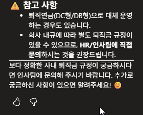

    {: .warning }
    **이 답은 우리가 지정한 사이트에서 나온 것이 아닙니다.** 표까지 붙어 그럴듯하지만 근거는 없습니다. 「찾을 수 없습니다」라는 앞머리를 흘려 읽으면 **그냥 잘 답한 것처럼 보입니다.**

    {: .note }
    그래도 이 토글을 끄지는 않습니다. 끄면 이런 상황에서 대화가 오류로 끊겨서, 에이전트가 **근거가 없다고 말하는 것**과 **막힌 것**을 구분할 수 없게 됩니다. 켜 두고 **참조를 확인하는 습관**으로 다루는 편이 낫습니다.

10. 참조 자료 목록에서 방금 넣은 항목의 **편집**을 눌러 주소를 바꿉니다. 지우고 새로 넣을 필요가 없습니다.

    

    **이름**·**설명**·**웹 페이지에 링크** 세 곳을 아래로 바꾸고 **저장**합니다.

    ```
    https://blog.naver.com
    ```

    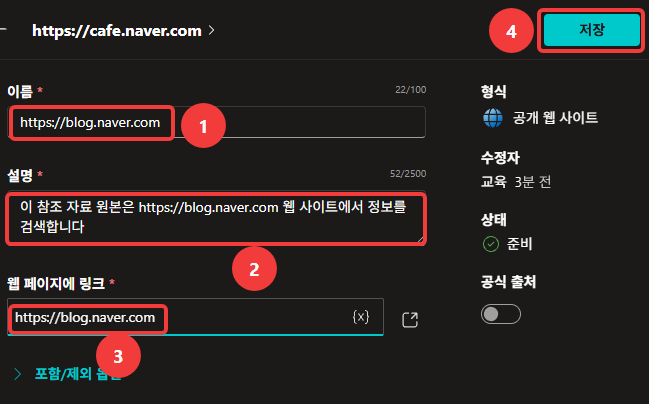

    {: .note }
    이 화면에 **공식 출처** 토글이 보입니다. 지금은 그대로 두고, 17번에서 다시 보겠습니다.

11. **새 테스트 세션**에서 **똑같은 질문**을 다시 합니다.

    **완료 기준**: 이번에는 답변 아래에 **참조가 붙는다.**

    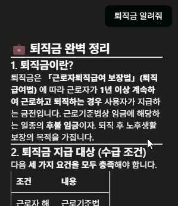

    {: .note }
    8번과 달라졌습니다. 사과로 시작하지 않고, 근거가 붙습니다. **네이버 블로그는 공개된 글이라 읽힙니다.**

12. 참조를 **펼쳐서 눌러 봅니다.** 어떤 글이 근거였는지 확인하세요.

    **완료 기준(필수)**: 근거가 **개인이 쓴 블로그 글**이라는 것을 확인했다.

    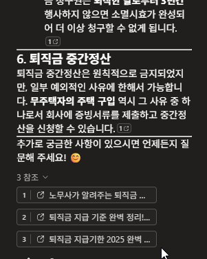

    {: .important }
    **읽혔다고 좋은 근거인 것은 아닙니다.** 지금 이 에이전트는 **법률 정보를 개인 블로그로 답하고 있습니다.** 블로그 글이 틀렸다는 뜻이 아니라, 누가 언제 무엇을 근거로 썼는지 알 수 없다는 뜻입니다. 법이 바뀌어도 그 글은 그대로 남아 있습니다.

    {: .warning }
    Microsoft도 **블로그·카페·포럼 같은 커뮤니티 사이트는 권장하지 않습니다.** 답이 나온다는 점이 문제입니다. 답이 안 나오면 원인을 찾게 되지만, 나오면 근거를 확인하지 않고 넘어갑니다.

13. 여기까지 정리합니다. 공개 웹사이트를 지식으로 쓸 때 걸리는 조건들입니다.

    | 조건 | 내용 |
    |---|---|
    | **Bing에 인덱싱** | 검색은 Bing을 거칩니다. Bing이 안 갖고 있으면 에이전트도 모릅니다 |
    | **로그인이 없어야** | 회원제·사내 인트라넷·위키는 안 됩니다. **에이전트는 로그인하지 못합니다** |
    | **주소 깊이 2단계까지** | `회사.com/제도/휴가` 까지. `회사.com/제도/휴가/연차`는 범위 밖입니다 |
    | **리다이렉트 금지** | 주소를 넣었는데 다른 주소로 넘어가면 **양쪽 다** 결과가 안 나옵니다 |
    | **커뮤니티는 위험** | 읽히긴 하지만 근거로서의 신뢰도가 낮습니다 |

    **완료 기준**: 7번과 10번에 넣은 주소가 각각 무엇에 걸리는지 말할 수 있다.

    {: .warning }
    **넣기 전에 미리 걸러낼 방법이 마땅치 않습니다.** Bing에서 `site:주소 키워드`로 검색해 보라는 안내가 흔한데, 실제로 해보면 지정한 사이트가 아닌 곳이 잔뜩 섞여 나오고 결과 개수도 실제와 맞지 않습니다. **결국 넣고 물어본 뒤 참조를 눌러 보는 것이 유일한 판정입니다.**

    {: .note }
    그래서 웹사이트를 지식으로 쓸 때는 **후보를 두세 개 잡아 두고 하나씩 넣어 보는 편**이 빠릅니다. 한 번에 맞히려 하지 말고, 안 되면 다음 것으로 넘어갑니다.

14. 다시 **편집**을 눌러 마지막 주소로 바꿉니다.[^easylaw] 법제처가 운영하는 「찾기 쉬운 생활법령정보」입니다.

    ```
    https://easylaw.go.kr
    ```

    

    {: .important }
    **주소는 최상위로 넣습니다.** `easylaw.go.kr/무엇/무엇` 처럼 깊게 넣으면 그 아래만 보게 되어, 정작 필요한 페이지가 범위 밖으로 빠집니다. 잠시 뒤 확인하겠지만 이 답의 근거가 되는 페이지는 사이트 **안쪽**에 있습니다 — 최상위로 넣어 두었기 때문에 잡힙니다.

    {: .note }
    `www.`를 붙이는지도 결과가 달라집니다. `www.easylaw.go.kr`로 넣으면 다른 서브도메인이 빠지고, `easylaw.go.kr`로 넣으면 `www.`를 포함해 그 도메인 아래 전부가 들어옵니다. 실제로 뒤에서 참조를 눌러 보면 **`m.easylaw.go.kr`(모바일 주소)로 열리는 경우**가 있습니다 — 최상위로 넣어 두었기 때문에 모바일 서브도메인까지 범위에 들어온 것입니다.

15. **새 테스트 세션**에서 **세 번째로 같은 질문**을 합니다.

    ```
    퇴직금 알려줘
    ```

    **완료 기준(필수)**: 퇴직금 산정 공식(`1일 평균임금 × 30일 × 재직일수 ÷ 365`)과 **근거 법 조항**이 나온다.

    

    {: .important }
    **길이로 비교하지 마세요.** 블로그 쪽이 더 길 수도 있습니다. 달라진 것은 **논제**입니다. 블로그는 「실제로 어떻게 받는가」를 사례와 팁으로 풀고, 법제처는 **「법이 뭐라고 정하고 있는가」**를 조문 번호와 함께 말합니다. 둘 다 쓸모가 있지만, **조문 번호는 확인할 수 있고 팁은 확인할 수 없습니다.**

    {: .note }
    **에이전트가 갑자기 똑똑해진 게 아니라 다른 문서를 만난 것**입니다. [부록 「에이전트 안에서 일어나는 일」 3부](./appendix/inside-the-agent.html)에서 말한 「문서가 답을 정한다」가 그대로 보이는 자리입니다 — 같은 모델, 같은 질문, 같은 지침인데 근거가 바뀌니 답의 성격이 바뀝니다.

16. 참조를 펼치고 **눌러 봅니다.** 15번에서 본 산정 공식이 그 페이지에 있는지 확인합니다.

    **완료 기준(필수)**: 인용을 클릭해 원문 페이지가 열리고, 답변 내용이 그 페이지에 실제로 있다.

    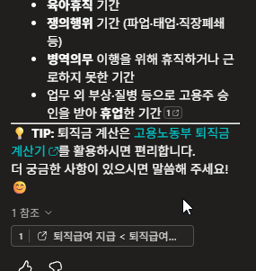

    {: .important }
    **이것이 그라운딩이 성공했다는 증거입니다.** 5번에서 **웹 검색을 껐으므로**, 이 답은 인터넷 전체가 아니라 **우리가 지정한 사이트 안에서만** 나온 것입니다. [Lab 2](./lab2.html) 부록에서 본 「없는 문서 이름을 지어내는」 경우와 정반대입니다 — **눌러서 원문이 확인되면 진짜입니다.**

17. 세 번의 답을 나란히 놓고 비교합니다.

    | 넣은 주소 | 읽혔나 | 답했나 | 근거 | 화면에서 어떻게 아나 |
    |---|---|---|---|---|
    | `cafe.naver.com` | **✗** | ○ | **없음** (모델이 원래 알던 것) | 참조가 없다 · "찾을 수 없습니다"로 시작 |
    | `blog.naver.com` | ○ | ○ | **개인 블로그** | 참조를 누르면 개인 글 |
    | `easylaw.go.kr` | ○ | ○ | **법제처 + 법 조문** | 참조를 누르면 공식 해설 |

    **완료 기준(필수)**: 셋의 차이를 근거 기준으로 말할 수 있다.

    {: .important }
    **세 번 다 답은 나왔습니다.** 다른 것은 근거뿐입니다. 그래서 에이전트를 볼 때 **답했느냐**가 아니라 **무엇을 근거로 답했느냐**를 봐야 합니다. 화면에서 그걸 가르는 방법은 하나입니다 — **참조를 눌러 보는 것.**

    {: .note }
    10번에서 지나쳤던 **공식 출처** 토글이 바로 이 얘기입니다. 검증을 거친 믿을 만한 원본이라면 표시해 두라는 기능인데, **어느 것을 공식으로 볼지는 사람이 정합니다.** 방금 셋을 갈라 본 판단이 그 판단입니다.

18. **설정 → 생성형 AI**에서 **웹의 정보 사용**을 잠깐 **켭니다.**

    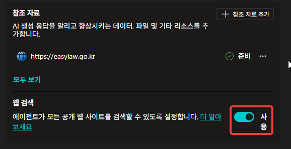

    새 테스트 세션에서 같은 질문을 다시 해봅니다.

    ```
    퇴직금 알려줘
    ```

    **관찰**: 답과 참조가 달라지는지.

    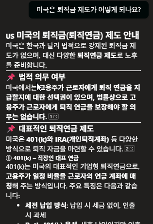

    {: .note }
    **거의 안 달라질 겁니다.** 지정한 사이트에 답이 있으면 에이전트가 **그쪽을 먼저 씁니다.** 웹 검색을 켜도 티가 나지 않습니다.

    이번엔 **그 사이트에 확실히 없는 것**을 물어봅니다. 「찾기 쉬운 생활법령정보」는 **대한민국 생활법령**만 다룹니다.

    ```
    미국은 퇴직금 제도가 어떻게 되나요?
    ```

    **완료 기준**: 참조에 **easylaw가 아닌 페이지**가 뜬다.

    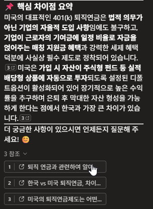

    {: .warning }
    **이것이 웹 검색을 꺼두는 이유입니다.** 켜두어도 평소에는 차이가 드러나지 않습니다. 지정한 사이트에 답이 있는 동안은 그쪽이 먼저 쓰이기 때문입니다. **지정 사이트에 없는 질문이 들어오면 그때부터 인터넷에서 답을 가져옵니다.** 쓰는 사람은 어느 쪽이 답했는지 구분할 수 없습니다.

    {: .note }
    17번의 비교가 성립한 것도 5번에서 껐기 때문입니다. **범위를 좁혀야 무엇이 근거인지 보입니다.**

19. 마지막으로 [Lab 2](./lab2.html)와 비교합니다.

    | | Lab 2 (파일 업로드) | 이 랩 (웹사이트) |
    |---|---|---|
    | 근거가 어디에 | 우리가 올린 파일 | 상대방 서버 |
    | 내용이 바뀌면 | 다시 올려야 함 | 저절로 반영됨 |
    | 못 읽는 경우 | 거의 없음 | **자주 있음** — 13번 조건들 |
    | 인용에 뜨는 것 | 파일 이름 | 페이지 제목 |
    | 원문 확인 | 파일을 열어야 함 | **눌러서 바로** |
    | 출처의 격 | 우리가 고른 것이라 통제됨 | **사이트마다 다름** |

    **완료 기준**: 두 방식 중 어느 쪽을 쓸지 판단하는 기준을 한 문장으로 말할 수 있다.

    {: .important }
    **내가 통제하는 정보는 파일로, 남이 관리하는 정보는 웹사이트로.** 사내 규정은 우리가 고치므로 파일이 맞고, 법·공공 기준은 발행 기관이 고치므로 웹사이트가 맞습니다. 다만 웹사이트에는 **우리가 관리하지 않는 조건이 두 개** 붙습니다 — 상대가 주소를 바꾸거나 로그인을 걸면 답이 나오지 않고, **그 사실이 화면에 표시되지 않습니다.** 그리고 출처의 격은 매번 우리가 판단해야 합니다.

---

## 확인

**필수**

- ① 새 에이전트를 만들고 **웹의 정보 사용**을 껐다(5번)
- ② 안 되는 주소를 넣어도 **오류도 안 나고 상태가 「준비」로 바뀐다**는 것을 확인했다(7번)
- ③ 카페가 안 읽히는데도 **답은 나오고 참조가 없다**는 것을 확인했다(8·9번)
- ④ 블로그는 읽히지만 근거가 **개인 글**이라는 것을 눌러서 확인했다(12번)
- ⑤ 공개 웹사이트 지식의 조건 다섯 가지 중 셋 이상을 말할 수 있다(13번)
- ⑥ 법제처를 넣으니 산정 공식과 법 조항이 나오고, **인용을 눌러 원문에서 확인**했다(15·16번)
- ⑦ **세 번 다 답은 나왔고 다른 것은 근거뿐**이라는 것을 말할 수 있다(17번)
{: .checklist }

**관찰 — 나오면 좋고, 안 나와도 실패가 아닙니다**

- ⑧ 웹 검색을 켰을 때 참조가 어떻게 달라지는가(18번)
- ⑨ 파일과 웹사이트 중 어느 쪽을 쓸지 판단하는 기준을 말할 수 있는가(19번)
{: .checklist }

---

## 출처

이 랩은 아래를 토대로 만들었습니다. **제품 화면과 동작은 실측**이고, 문헌은 항목마다 확인일을 적었습니다. 제품이 바뀌면 문헌 쪽이 먼저 낡습니다 — 수치나 주기가 걸리면 원문을 다시 확인하세요.

- **실측** — 2026-08-11 · 전 스텝 실측(19스텝·22컷). 이 랩은 실측으로 설계 전제 두 개가 뒤집혔습니다
- **문헌** — MS 공식 TTT 자료[^ttt]

[^ttt]: **Copilot Studio Train The Trainer** — 최정우, Microsoft, 2026-01-09. p.151 비즈니스 유저 대상 1일 코스에서 **웹사이트 지식을 필수로 꼽습니다.**
[^easylaw]: 소재로 쓴 공개 사이트 — 법제처 [찾기 쉬운 생활법령정보](https://easylaw.go.kr) (확인 2026-08-11)
