# Lab 6. 도구를 만들고, 도구를 데려온다 🧩

> **이번 랩 완성물**: 조회 조건과 실행 순서를 내가 정한 **에이전트 흐름** 하나. 그리고 밖에서 가져온 **MCP 도구** 하나
> **예상 시간**: 50분 · **완성 신호**: [Lab 5](./lab5.html) 23번과 **똑같은 요청**을 던졌는데 값이 제자리에 들어간다

{: .time }
50분 타이머. 5단(흐름 만들기 → 읽는 조건 → 쓰는 자리와 순서 → 같은 요청 다시 → 도구 데려오기)으로 나눠 진행합니다.

**인터미션 슬라이드** — 랩 시작 전 강사가 설명하는 개념입니다. [브라우저로 보기](../assets/decks/lab6-intermission.html) · [PDF](../assets/decks/lab6-intermission.pdf)

---

## 준비

- **[Lab 5](./lab5.html)까지 마친 에이전트**와 **본인 OneDrive의 `자기계발비_기준표.xlsx`** 를 그대로 씁니다.
- [Lab 5](./lab5.html) 25번에서 적은 세 문장을 꺼내 두세요. 이 랩은 그 셋을 하나씩 해결합니다.

<!-- 저작 메모

     2026-08-25 콜아웃 정리: **108개 → 7개**(warning만), 스텝당 3.09 → 0.20.
       판정표는 `_instructions/decks/lab6-triage.md`(인덱스 0~107).
       덱 66 · 본문 28(평문화) · warning 7(유지) · 삭제 7.
       ★ 계기 — 제작자 피드백. 「수강생이 시간 때문에 본문 텍스트를 못 읽는다.
         이론·개념은 인터미션으로 빼고 내가 주의집중시켜 설명하는 게 효과적이다.」
       ★ 덱으로 간 66개는 `_instructions/decks/lab6-intermission.md`(17장)에 있다.
         본문에는 **조작과 완료 기준만** 남긴다.
       ★ 평문화 = IAL 줄만 제거. 내용은 그대로 두고 콜아웃 상자만 벗겼다.
         `.warning` 7개만 콜아웃으로 남겼다 — 165개 `.important` 에 묻혀 있던
         경고가 이제 진짜 경고로 읽힌다.
       ⚠️ **콜아웃을 지우면 그 뒤 `{: start="N" }` 앞에 빈 줄이 생겨 IAL이 무효가 된다.**
         12·19·25 셋이 그렇게 깨졌고 빌드는 통과했다. linkcheck가 잡았다.
         일괄 삭제 뒤에는 반드시 `linkcheck.py` 로 확인할 것.
     편성: 오후 180분 = Lab 4 토픽 70 / Lab 5 커넥터 50 / Lab 6 60 / 피날레 10.

     ★ 이 랩의 자리 — Lab 5가 남긴 세 문제를 하나씩 받는다.
       읽는 조건(Lab 5 11번) → ② 절 필터·상위 개수
       쓰는 자리(Lab 5 22번) → ③ 절 20번 칸↔값 연결 표
       쓰는 범위(Lab 5 23번) → ③ 절 입력 스키마 + ④ 절 "못 하게 된 것"
       ⚠️ 흐름을 "쓰기 안전장치"로만 소개하지 않는다. 읽기 조건과 쓰는 자리가 먼저다.

     ★ ④ 절이 이 랩의 결론이다. Lab 5의 「테이블에 행 추가」 도구를 떼고 흐름만
       남기면, `신청내역 전부 상태를 승인으로 바꿔줘` 가 실행되지 않는다.
       도구가 없으면 능력이 없고, 흐름은 적힌 것만 한다. Lab 1 부록의 "능력이
       없으면 사고도 없다"와 같은 문장이 실행 계층에서 다시 나온다.

     ★ MCP는 ⑤ 절 5스텝. Lab 3(웹사이트 지식)과 대조하는 자리로 쓴다.
       같은 "밖의 정보"인데 경로가 다르다 — Bing 인덱싱 경유 vs 직접 연결.

     ★ 부록 = 연결된 에이전트 10스텝.
       버리지 않은 이유: Lab 2 스텝 10의 「연결된 에이전트 허용」 토글이 이것을
       전제로 켜져 있고, 저작 비용이 0에 가깝다.
       ⚠️ 45명 동시 게시 시간이 최대 리스크라 본문에 두지 않았다.

     ⚠️ 미실측 — 전 스텝. 아래는 리허설에서 반드시 확인할 것.
       1. 에이전트 흐름 생성 경로와 트리거 이름 (도구 추가 → 새로 만들기 → 에이전트 흐름)
       2. 입력 파라미터 추가 UI
       3. Excel 「행 나열」의 고급 옵션에 필터 쿼리·상위 개수가 있는지
       5. 금액 계산을 어디서 하는지 (변수 설정 / 수식 / 응답 노드)
       6. 흐름 게시 소요시간 — 45명 동시면 이 랩 최대 리스크

     ★ 2026-08-11 실측(1~3번) — ①의 순서가 초안과 반대였다.
       - **이름을 먼저 바꾸면 저장되지 않는다.** 「초안 저장」을 먼저 눌러야
         「제목 없음」으로 잡히고, 그때부터 이름을 바꿀 수 있다. 2번을 뒤집었다.
       - 툴바 구성: 버전 기록 / 흐름 검사기 / 테스트 / **초안 저장** / **게시**.
         저장과 게시가 따로다. 10번 테스트가 이 툴바의 버튼이다.
       - ⚠️ 저장 직후 트리거 라벨이 **`manual`** 로 뜬다. 다른 화면에 갔다가
         재진입하면 「에이전트가 흐름을 호출할 때」로 바뀐다. 3번에 적었다.
       - ★ **응답 노드(Respond to the agent)가 처음부터 있다.** 초안 8번이
         "응답 노드를 추가한다"였는데 추가가 아니라 설정이다. 고쳤다.
         흐름이 무엇을 하든 에이전트에게 돌려주는 것으로 끝난다는 뜻이라
         note로 살렸다.

     ★ 50분은 본문(흐름 + MCP)만이다. 부록(A2A)은 별도이며 시간에 넣지 않는다.
       분량이 더 늘면 Lab 2의 참고 페이지처럼 별도 페이지로 빼는 선택지가 있다.
       Lab 6을 진행하면서 정한다(2026-08-11 보류).
     본문 전 스텝 실측 완료(35스텝·62컷). 부록 10스텝은 미실측·미촬영. -->
<!-- 저작 메모(2026-08-14 소재 교체): 상세는 lab5.md의 같은 날짜 메모를 볼 것.
     이 랩에서 바뀐 것 — 흐름 이름 `자기계발비 신청 처리`, 입력 `항목명`(텍스트)·`수량`(숫자),
     테이블 `지원기준`, 필터 `항목명 eq '(입력: 항목명)'`, 수식의 열 이름 `지원단가`,
     False 갈래 문구 「지원 대상이 아닌 항목입니다.」, 테스트 값 `도서구입`·`4` → 120,000.

     ⚠️ 재촬영 필요 — 본문 7~29번 43컷(lab6-07 ~ lab6-29). 30~35번(MCP)은 이 데이터를
       쓰지 않으므로 그대로 둔다. 부록 8컷은 원래 미촬영이다.
     2026-08-14 추가: 21번에서 `신청번호` 를 수식으로 채운다. 원래 「비워 둡니다 —
       비워 두는 것도 정한 것입니다」였는데, 뒤쪽 「변경 흐름은 신청번호 하나를 받는다」와
       앞뒤가 맞지 않았다. 비어 있는 열로는 한 건을 지목할 수 없다.
         concat(convertFromUtc(utcNow(),'Korea Standard Time','yyyyMMdd-HHmmss'), '-', substring(guid(),0,8))
       ★ Excel 표에는 자동증가(identity)가 없다. 커넥터의 「행 추가」도 키를 만들지 않는다.
         대안 둘은 기각했다 — Excel 계산 열은 커넥터가 빈 값으로 덮을 수 있어 불안정하고,
         기존 행을 세어 +1 하는 방식은 액션이 하나 더 붙는 데다 읽고-쓰는 사이의 경쟁 조건을
         입문에서 대충 가르치게 된다(각자 파일이라 실습은 안전하지만 실무에선 틀린 패턴).
       ★ GUID 8글자를 붙인 것은 같은 초에 두 건이 들어올 때 번호가 겹치기 때문이다.
       ★ convertFromUtc가 있는 것은 흐름의 시계가 UTC라서다. 없으면 9시간 이른 값이 찍힌다.
       ★ 이걸로 흐름이 다루는 값이 네 종류가 된다 — 받은 값·조회한 값·계산한 값·만든 값.
         Lab 5의 커넥터로는 마지막 것을 할 자리가 없었다는 대비가 여기서 선다.
       ⚠️ 스텝을 새로 떼지 않고 21번 안에 넣었다. 떼면 22번 이후가 전부 밀려
         finale·CLAUDE.md의 상호참조 10여 곳을 같이 고쳐야 한다.

     2026-08-14 추가(2): `신청자` 를 본인 이름 직접 입력에서 **이메일**로 바꿨다.
       5번에 입력 `이메일`(텍스트)을 하나 더 만들고, 24번 지침에서 `/System.User.Email` 로
       채워 넣는다. 제작자 실측으로 바인딩 확인됨(2026-08-14).
       ★ DisplayName이 아니라 Email인 이유 — 이름은 겹칠 수 있고 이메일은 겹치지 않는다.
         뒤쪽 「변경 흐름은 신청번호 하나를 받는다」와 같은 결이다. 뒤에서 한 건을 찾아야 하는
         값이면 겹치지 않는 쪽을 쓴다.
       ★ 이 한 줄 때문에 Lab 6도 지침을 건드리게 됐다. 「한 글자도 바뀌지 않았다」는
         더 못 쓴다. 대신 **「더해진 한 줄은 값을 넘기는 방법이지 규칙이 아니다」**로 바꿨다 —
         조회 조건·쓰는 자리·순서는 여전히 지침에 없고 흐름 안에 있다. 결론은 그대로 선다.
       ★ Lab 4 22번이 「시스템 탭은 오늘 안 쓴다」로 지나갔던 것을 여기서 회수한다.
         그쪽 note도 「Lab 6 24번에서 씁니다」로 고쳤다.
       ⚠️ 촬영 주의 — 신청내역 표에 **실제 사내 이메일이 찍힌다.** 컷에 본인 주소가 남고,
         45명 각자도 옆자리에 노출된다. Lab 1의 「참조 목록」 주의와 같은 종류다.

     2026-08-14 추가(3): 신청내역에 **샘플 3행**을 넣었다(kim/lee/park@hanbyul.com).
       빈 표에 첫 행을 쓰면 머리글 행과 붙어 헷갈리고, 무엇보다 Lab 5 24번의 값 밀림이
       **제대로 들어간 세 행과 나란히** 보여야 대비가 산다. 신청번호도 21번에서 만들 형식과
       같은 모양으로 채워 두었다.

     2026-08-20 추가: 4·5번을 **이름 + 설명 두 칸**으로 고쳤다(제작자 재촬영 04b·05).
       ★ 설명 칸이 있는 것을 이제 본문이 쓴다 — 「도구 설명은 무엇을 부를지, 입력 설명은
         무엇을 채울지」로 Lab 5 7번과 짝지었다. 24번의 /System.User.Email 이 왜 그 칸에
         들어가는지가 여기서 미리 선다.
       ★ 5번에서 **익스프레스 모드를 켜는 것**으로 바꿨다(전에는 「건드리지 않습니다」).
         2분 제한·전제조건 4종·64KB는 MS Learn 근거를 각주로 달았다.
       ★ 큰 표를 나열하는 흐름에는 부적합하다는 대목이 부록 「읽어 오는 양」과 정면으로
         맞물린다 — 거기는 1,000행이라 256행에서 끊기고, 여기는 다섯 줄이라 안 걸린다.
       ⚠️ 촬영 확인 — 익스프레스 모드에서는 **실행 중 라이브 활동이 표시되지 않는다**(MS Learn).
         11번이 「실행하면 활동 탭으로 넘어갑니다」인데, 완료 후에 보이는 것이면 그대로 두고
         화면이 다르면 문장을 고친다. 토글이 환경에 아예 없을 수도 있다.
       ⚠️ 10번 실행 입력에 `이메일` 칸을 적어 두었다. 컷(10c)에 본인 주소가 남는다.

     2026-08-20 촬영 반영(1): 07 · 10c · 10f · 12b · 13 · 13b · 14 · 15 여덟 컷 교체.
       ★ 12번 앞에 **「디자이너 탭으로 되돌아간다」**를 넣었다. 11번이 활동 탭에서 끝나서
         바로 노드를 고치라고 하면 화면이 맞지 않는다.
       ★ 10c에서 5번의 **설명이 칸 아래 회색 도움말로 뜬다.** 「같은 글이 사람에게는 안내문,
         에이전트에게는 판단 근거」로 note를 붙였다. 4·5번 개편의 값이 여기서 눈에 보인다.
       ✔ 흐름 이름 건은 같은 날 해소됐다 — 02·09·10·10c·10d·15를 「자기계발비 신청 처리」로
         일괄 재촬영해 받았다.

     2026-08-20 촬영 반영(2): 02 · 09 · 10 · 10c · 10d · 15 재촬영 + 17 신규.
       ★ 17을 세 장으로 늘렸다. 새 컷이 **fx를 누르는 자리**(수식 편집기 열기 직전)여서
         기존 두 장을 뒤로 밀었다 — 17→17b(수식 편집기), 17b→17c(두 갈래).
       ★ 응답 노드 이름이 **자리마다 다르게 보인다.** 캔버스는 `Respond to the agent`(03),
         활동 탭은 「에이전트에게 응답」(10d). 3·8·18번의 표기가 갈려 있던 것을
         **「응답 노드」로 통일**하고, 3번 완료 기준에만 두 이름을 병기했다.
       ✔ 10d로 **활동 탭이 실행 후 노드별 소요시간과 체크를 그대로 보여주는 것**을 확인했다.
         익스프레스 모드의 「실행 중 라이브 활동 미표시」 우려는 11번 문장에 영향이 없다.
         ⚠️ 다만 이 컷을 익스프레스 모드를 켜고 찍었는지는 확인되지 않았다.

     2026-08-20 촬영 반영(3): 18을 **여섯 컷으로 쪼갰다**(신규 18~18f).
       기존 18은 폐기, 기존 18b·18c는 18g·18h로 밀었다.
       ★ 「응답 노드를 하나 더 넣어」 한 줄이었던 것을 드래그 → False의 + → 작업 추가에서
         고르기 → 출력 추가 → 유형 텍스트 → 이름·값으로 나눴다. 조작이 여섯 번인데
         한 문장이었다.
       ★ 18b 툴팁에 **「조건-elseActions」**가 찍혔다. 화면의 False가 정의 안에서는
         `elseActions` 다. 3번의 응답 노드(캔버스 영문 / 활동 탭 한글)와 같은 종류라
         note로 이어 붙였다.
       ★ 18d에서 노드 이름이 **「에이전트에게 응답 1」**로 자동 번호가 붙는다.
         17번 수식이 노드 이름으로 앞 결과를 가리켰던 것과 맞물려, 이름이 유일해야 하는
         이유가 여기서 보인다.
       ★ 18c에서 응답 노드가 **작업 추가 창의 AI 기능 묶음**에 있는 것이 드러난다.
         3번에 처음부터 놓여 있어 특별해 보이던 것이 그냥 작업 하나였다는 회수.

     2026-08-20 촬영 반영(4): 19의 앞부분을 **네 컷으로 쪼갰다**(신규 19~19d).
       기존 19는 폐기, 기존 19b·19c는 **순서를 뒤집어** 19e·19f로 뒤에 붙였다.
       ★ 뒤집은 이유 — 조작 순서가 「노드를 놓고 → 이름을 드롭다운에서 고르고 → 값에
         수식을 넣는다」인데 컷은 수식이 먼저였다.
       ★ 19c에서 **변수 초기화와 변수 설정이 같은 목록에 나란히 보인다.** 「만드는 것과
         값을 넣는 것이 다른 작업」이라는 note를 그 자리에 붙였다 — 뒤에서 변수 설정을
         찾을 때 헤매지 않는다.
       ✔ 19f를 흐름 이름이 안 보이는 컷으로 교체받았다. 19g(전체 조감)를 뒤에 추가했다.
       ✔ 19f를 다시 교체받아 `?['지원단가']` 로 맞았다. 옛 컬럼명 건은 닫혔다.
       ★ 교체된 19f에 True 갈래 응답이 빈 채로 같이 잡혀서, 「22번에서 채운다」 안내가
         컷 두 장(19f·19g)에서 다 보인다.
     2026-08-20 촬영 반영(9): 28·28b·29·35 교체. **본문 컷은 이것으로 전부 실측이 됐다.**
       기존 34(도구 목록)는 35 자리에 새 컷으로 교체하며 폐기했다.
       ★ 28b(응답 하단)에 **「승인 처리는 담당 결재권자 권한」**이라는 안내가 붙어 있다.
         지침에도 지식에도 결재 권한 얘기는 없다 — **에이전트가 지어낸 문장이다.**
         못 하는 진짜 이유는 21번에서 `상태` 를 `접수` 로 고정한 것인데, 사용자에게는
         조직 규정처럼 들린다. note로 넣었다. 이 랩에서 가장 값어치 있는 관찰 중 하나다.
       ★ 29 컷이 **한 표에 세 덩어리**를 담고 있다 — 샘플 3줄 / Lab 5가 쌓은 줄 / 오늘 흐름이 쓴 줄.
         완료 기준을 「다섯 줄이 제자리에」에서 **「세 덩어리로 보인다」**로 바꾸고,
         `신청번호`(가운데만 빈칸)와 `신청자`(표시 이름 vs 이메일) 두 열을 세로로 훑게 했다.
       ✔ Lab 5 24번 서술과의 불일치는 같은 날 닫혔다 — **lab5-24 컷을 교체하고 설명을
         「비결정」으로 다시 썼다**(제작자 지시). 실측에서 여러 번 관측된 것이고,
         순수 커넥터로 Excel 행을 쓰면 **어느 칸에 무슨 값이 들어갈지가 매번 다르다.**
         ★ lab5-22(여섯 칸 통째로 밀림)와 lab5-24(신청번호만 비고 신청자에 표시 이름)가
           **같은 도구·같은 요청인데 다른 결과**라서, 두 컷이 나란히 비결정의 증거가 된다.
         ★ Lab 5 24번의 「어긋나는 방식이 여섯 줄 모두 같습니다」는 **뺐다** — 그 주장이
           비결정과 정면으로 어긋난다. 22번에도 「어느 칸이 어긋나는지는 실행마다 다릅니다」
           한 줄을 넣었다. 수강생 화면이 컷과 달라도 되는 것이 여기서 중요하다.
         ★ 오케스트레이터가 「5건 모두 정상 접수」로 보고하는 것은 어느 쪽이든 같다 —
           그 important는 그대로 뒀다.
       ⚠️ lab5-22의 줄이 lab5-24 컷에 없다(파일을 새로 받았거나 다시 돌린 것으로 보인다).
         24번 완료 기준에서 「22번 한 줄 + 방금 다섯 줄 = 여섯 줄」 세는 문장을 뺐다.

     2026-08-20 촬영 반영(8): 25~27 컷 교체 + **순서 재배치**(제작자 지시).
       기존 27(도구 끄기)을 25 자리로 당겼다. 결과 25=끄기 · 26=한 건 테스트 · 27=여러 건/없는 항목.
       ★ 순서를 바꾼 이유 — **쓰기 커넥터를 끄고 나서 테스트해야** 흐름이 쓴 결과인지 알 수 있다.
         켜 둔 채로 신청하면 같은 표에 쓰는 도구가 둘이다.
       ★ 절 경계도 옮겼다. ④ 「같은 요청, 다른 결과」가 **끄기부터** 시작한다.
         ③ 11분→8분(6스텝), ④ 4분→7분(5스텝). 합계 15분은 그대로.
       ★ 기존 25·25b 두 장이 새 26 한 장에 다 들어갔다(계약 테스트 + 대화 응답).
       ★ 새 26 컷에서 대화 답이 **표 형식**으로 나온다. 흐름이 돌려준 것은 한 줄짜리 문장이고,
         지침의 `[자기계발비 신청 접수]` 형식으로 다시 쓴 것은 오케스트레이터다.
         **흐름이 정한 것과 지침이 정한 것이 한 화면에** — note로 넣었다.
       ★ 새 27 컷의 합계 440,000원도 흐름이 낸 값이 아니다(세 결과를 오케스트레이터가 더함).
       ✔ **27b에서 흐름은 불리지 않는다**(2026-08-20 제작자 확인). 오케스트레이터가
         `지원단가 조회` 로 기준표를 먼저 보고 `헬스장 이용권` 이 없는 것을 알아, 신청으로
         넘어가지 않았다. 응답의 지원 가능 항목 표가 그 조회 결과 그대로다.
         ★ 기존 본문은 「오케스트레이터가 판단한 것이 아니라 18번 갈래를 탄 것」이라고
           **거꾸로** 적고 있었다. 실제로는 오케스트레이터가 먼저 막았다.
         ★ 그래서 18번 False 갈래가 이 랩에서 **한 번도 안 불린다.** 그 사실을 감추지 않고
           **「앞에서 막는 것과 안에서 막는 것은 서로를 대신하지 않는다」**로 바꿔 적었다.
           조회를 건너뛰고 흐름이 바로 불리는 경우에 걸리는 것이 그 갈래다.
         ★ 둘의 성질 차이(지침은 매번 판단 / 갈래는 그려진 대로)는 그대로 살렸다.

     2026-08-20 촬영 반영(7): 23 교체 + 24를 세 장에서 **네 장으로**(24d 신규).
       ✔ 23 컷의 body에 `도서구입 4건 접수되었습니다. 금액 120000원` 이 찍혔다.
         19f의 옛 컬럼명 우려는 이것으로 완전히 닫혔다 — `단가` 였다면 `금액 0` 이 나온다.
       ★ 24c 화면에 **「오케스트레이터가 어떻게 식별하는지에 대한 설명입니다」**가
         제품 문구로 적혀 있다. 「설명이 판단 근거」를 랩 내내 우리가 말해 왔는데
         여기서는 제품이 말한다. important로 올렸다.
       ★ 「추가 세부 정보」 세 항목을 접기로 넣었다 — 사용 가능 시점 / 실행 전 사용자 확인 /
         자격 증명. 가운데 항목이 이 랩의 결과 「쓰기 도구도 조회 도구와 같은 기본값으로
         등록된다」와 맞물린다. **셋 다 기본값으로 두고 무엇을 정하는 자리인지만 본다.**
       ★ 24 컷에 **오류·차단됨·사용 설정됨** 열이 보인다. 27번(도구 끄기)의 전조라 note로 이었다.
       ★ 24d(지침 편집기)가 새로 들어갔다. `System.User.Email` 이 칩으로 들어간 화면이
         본문에 없었다 — 「칩으로 바뀐다」는 완료 기준을 확인할 컷이 없던 자리다.
       ⚠️ 24b 목록에 남의 흐름 셋(전형단계변경·정산 신청 처리1·AI적합도변경)이 그대로 찍혔다.
         기존 warning의 실물 근거가 되므로 그대로 두었다.

     2026-08-20 촬영 반영(6): 21의 컷 세 장을 **다섯 장으로 전면 교체**했다(21~21e).
       ★ 「모두 보기로 펼칩니다」를 컷대로 고쳤다 — 드롭다운을 펼쳐 체크하는 방식이다.
       ★ **7개 중 6개**를 켠다. 맨 위 「날짜/시간 형식」은 열이 아니라 커넥터 설정이다.
         7번의 민감도 레이블 두 칸과 같은 종류라 note로 이었다.
       ★ 21c 툴팁이 **「`/` 를 누르세요」**를 알려 준다. 17번과 같은 툴팁인데 거기서는
         안 짚었다 — 여기서 한 번 적어 둔다.
       ★ 버튼 이름이 갈린다 — 새로 넣을 때 **추가**(21d), 고칠 때 **업데이트**(17번).
       ★ 21e에서 칩 아이콘이 **네 종류로 갈린다**(fx 수식 · 파란 트리거 입력 · 보라 변수 ·
         아이콘 없는 글자). 「값의 출처가 화면에 보인다」를 important로 새로 넣었다.
         21번이 원래 하려던 말(칸마다 무엇을 넣을지 내가 잇는다)의 시각적 근거다.

     2026-08-20 촬영 반영(5): 20을 두 컷으로 쪼갰다. 신규 20(변수 설정과 응답 **사이**의 +),
       기존 20은 20b로 밀었다.
       ★ 컷이 `+` 를 정확히 그 자리에 표시하고 있어, **응답보다 위에 놓는다**는 것을
         `{: .important }` 로 명시했다. ③ 절 제목(「쓰는 자리와 순서를 정한다」)이 여기서 선다.
         아래에 놓으면 쓰기가 실패해도 사용자는 접수됐다고 듣는다.

       ★ 19g에서 True 갈래 응답의 값 칸이 **비어 있다.** 22번에서 채우는 것이 맞으므로
         컷은 정상인데, 18번 note가 「8번의 연결이 옮겨도 그대로」라고 적고 있어 어긋났다.
         그 주장을 빼고 **「값은 22번에서 다시 채운다」**로 바꿨다. 19g에 같은 안내를 붙였다.

     ✔ 필터 쿼리에 **한글 값이 먹는다**(2026-08-14 제작자 사전 확인, 별도 에이전트에서 테스트).
       항목명을 영문 코드로 폴백할 이유가 없어졌다. 이 건은 닫혔다. -->

---

## 단계 — ① 흐름을 만든다 (16분)

1. **도구 → 도구 추가**를 엽니다. [Lab 5](./lab5.html) 6번에서 아래쪽 탭만 썼는데, 이번에는 위쪽 **새로 만들기**에서 **에이전트 흐름**을 고릅니다.

    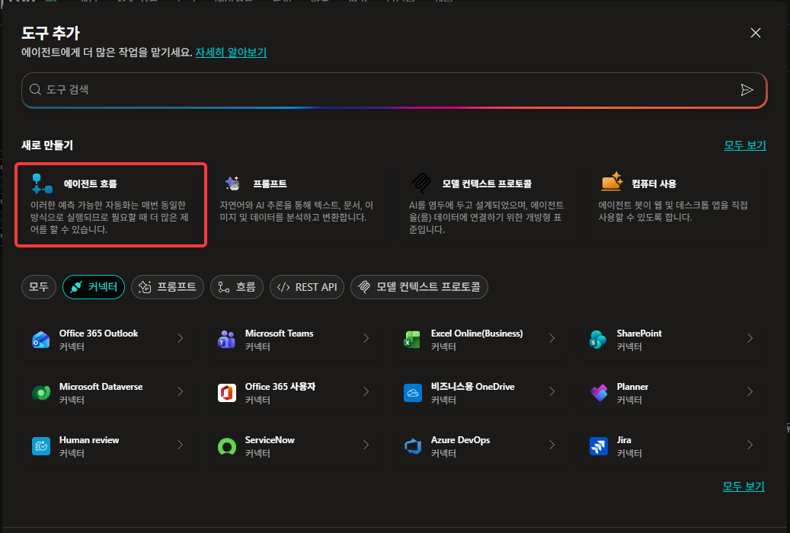

2. 흐름 편집기가 열립니다. **이름부터 바꾸려 하면 저장되지 않습니다.** 툴바의 **초안 저장**을 먼저 누르고, 그다음 좌측 상단 이름을 바꿉니다.

    ```
    자기계발비 신청 처리
    ```

    **완료 기준**: 이름이 「제목 없음」에서 바뀌고, 다시 저장된다.

    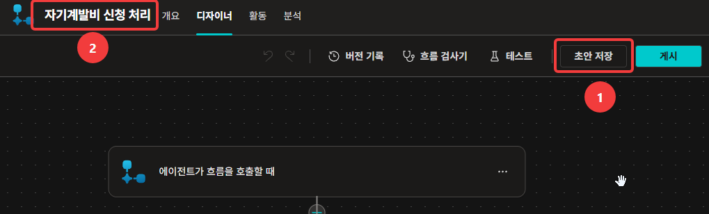

    저장 버튼이 **초안 저장**이고 그 옆이 **게시**입니다. 둘은 다릅니다 — 초안은 나만 볼 수 있고, 에이전트가 부르려면 게시해야 합니다. 9번에서 게시합니다.

    툴바의 **흐름 검사기**는 저장·게시 전에 **빠진 값과 잘못된 연결을 모아 보여주는 자리**입니다. 노드를 하나씩 열어 보지 않아도 어디가 비었는지 알 수 있습니다. 뒤에서 수식이나 칸 연결이 어긋났을 때 여기부터 봅니다. 그 옆 **테스트**는 10번에서 씁니다.

3. **트리거** 노드를 봅니다. 방금 저장한 직후에는 이름이 `manual` 처럼 영문으로 보일 수 있습니다. **다른 화면에 갔다가 되돌아오면** 원래 이름으로 표시됩니다.

    **완료 기준**: 트리거가 **「에이전트가 흐름을 호출할 때」**이고, 그 아래에 **응답 노드**가 이미 놓여 있다. 캔버스에서는 `Respond to the agent`, 실행 뒤 **활동** 탭에서는 「에이전트에게 응답」으로 보입니다. **같은 노드입니다.**

    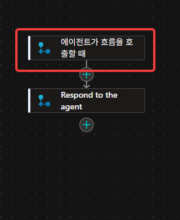

    **응답 노드도 처음부터 있습니다.** 흐름이 무엇을 하든 에이전트에게 돌려주는 것으로 끝난다는 뜻입니다. 결국 사용자가 정의하는 작업은 아래와같습니다.
    - 에이전트 제작자의 작업은 흐름 호출설정(입력변수)
    - 에이전트에게 되돌려줄 응답의 내용(출력)
    - 위 두 액션의 사이에 추가 액션 지정

4. 트리거 노드를 눌러 속성을 엽니다. **매개 변수** 탭의 **입력 추가**를 누릅니다.

    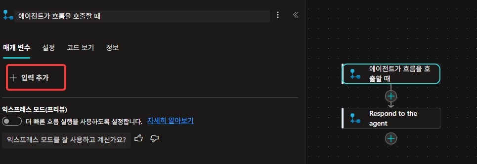

    형식을 **텍스트**로 두고 **이름**과 **설명**을 아래로 씁니다. 칸이 둘입니다.

    | 이름 | 설명 |
    |---|---|
    | `항목명` | `항목명을 입력하세요` |

    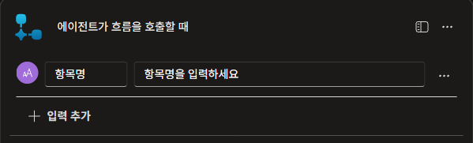

5. **입력 추가**를 두 번 더 눌러 나머지 둘을 만듭니다. 가운데만 형식이 **숫자**입니다.

    | 이름 | 형식 | 설명 |
    |---|---|---|
    | `수량` | **숫자** | `항목의 수량을 입력하세요` |
    | `이메일` | 텍스트 | `흐름을 호출한 사용자의 이메일을 입력하세요` |

    이어서 트리거 카드의 **익스프레스 모드**를 **켭니다.**

    <details markdown="block">
    <summary>익스프레스 모드가 무엇인가</summary>

    에이전트가 부른 흐름은 **2분 안에 응답하지 못하면 실패합니다.** 익스프레스 모드는 실행을 빠르게 해서 그 안에 끝날 가능성을 높이는 설정입니다. 추가 비용은 붙지 않습니다.[^learn-express]

    네 가지를 모두 갖춘 흐름만 켤 수 있습니다. 지금 만든 흐름은 넷 다 해당합니다.

    | 조건 | 지금 흐름 |
    |---|---|
    | `에이전트가 흐름을 호출할 때` 트리거 | 3번에서 선택 |
    | `에이전트에게 응답` 액션 | 3번부터 놓여 있음 |
    | Copilot Studio 플랜 | 환경 조건 |
    | 새 인프라로 올라간 환경 | 환경 조건 |

    **데이터를 많이 실어 나르는 흐름에는 맞지 않습니다.** 큰 표를 통째로 나열하는 흐름은 메모리 한도에 걸립니다 — 개별 액션이 주고받는 크기가 64KB로 제한됩니다.[^learn-express] 지금 흐름은 기준표 다섯 줄에서 한 줄을 찾아 계산하는 것이라 여기 걸리지 않습니다.

    토글이 화면에 없으면 그 환경이 아직 지원하지 않는 것입니다. 켜지 않고 진행해도 랩은 끝까지 갑니다.

    </details>

    **완료 기준**: 입력이 세 개 있고 가운데 것만 형식 아이콘이 다르다. 익스프레스 모드가 켜져 있다.

    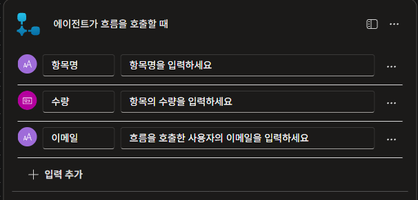

6. 트리거 아래 **+** 에서 **Excel Online (Business)** 를 고르고, 작업 목록에서 **테이블에 있는 행 나열**을 넣습니다.

    

    

7. 매개 변수를 채웁니다. 위치·문서 라이브러리·파일을 본인 것으로 고르고, 테이블은 **`지원기준`** 로 지정합니다. 파일에 표가 셋이라 목록에 `지원기준`·`신청내역`·`지원대상목록`이 함께 뜹니다. 민감도 레이블 두 칸은 비워 둡니다.

    **완료 기준**: 파일 칸에 `/문서/자기계발비_기준표.xlsx` 처럼 **경로가 보인다.**

    

8. 3번에서 본 **응답 노드**를 엽니다. 출력 이름을 `결과` 로 두고, 값에 Excel 액션의 **`body/value`** 를 끼웁니다.

    **완료 기준**: 출력이 하나 있고 값이 앞 노드에 연결되어 있다.

    

9. **초안 저장** 후 **게시**합니다. **완료 기준**: 게시 완료 표시가 뜬다.

    

    {: .warning }
    흐름도 게시해야 에이전트가 부를 수 있습니다. 고칠 때마다 다시 게시합니다.

10. 툴바의 **테스트**를 누릅니다.

    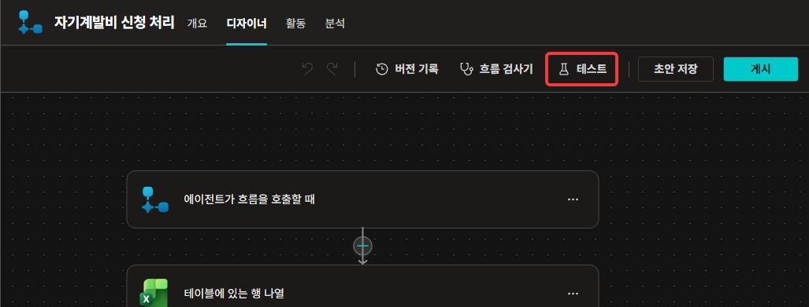

    **흐름 테스트**에서 **수동**을 고르고 **게시 및 테스트**를 누릅니다.

    

    **자동**은 지난 실행을 다시 쓰는 방식인데, 처음이라 「이 흐름의 실행이 없습니다」로 막혀 있습니다.

    버튼이 **게시 및 테스트**입니다. 9번에서 게시했더라도 테스트할 때 한 번 더 게시합니다. **고친 것이 반영되지 않았다면 여기부터 다시 눌러 봅니다.**

    **흐름 실행** 패널에 값을 넣고 **흐름 실행**을 누릅니다.

    ```
    항목명   도서구입
    수량       4
    이메일   (본인 계정 이메일)
    ```

    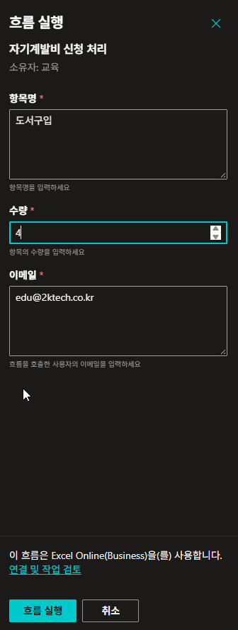

    4·5번에서 만든 입력이 그대로 칸이 됐습니다. **형식도 따라옵니다** — `수량` 칸에는 숫자만 들어갑니다.

11. 실행하면 **활동** 탭으로 넘어갑니다. **완료 기준**: 노드 세 개에 소요시간과 체크가 붙는다.

    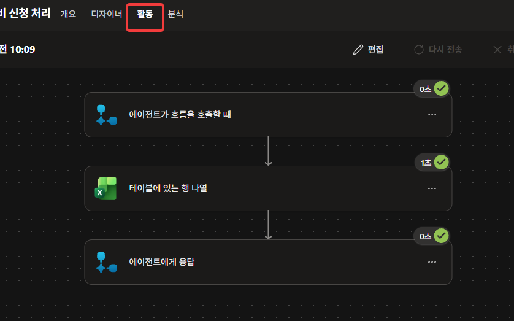

    **테이블에 있는 행 나열** 노드를 눌러 **출력**을 봅니다. `statusCode` 가 `200` 이면 호출은 성공입니다. 그 아래 **원시 출력 표시**를 누릅니다.

    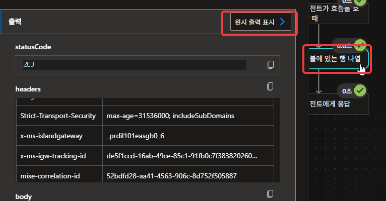

    **완료 기준**: `body` 의 `value` 에 **다섯 행이 전부** 들어 있다.

    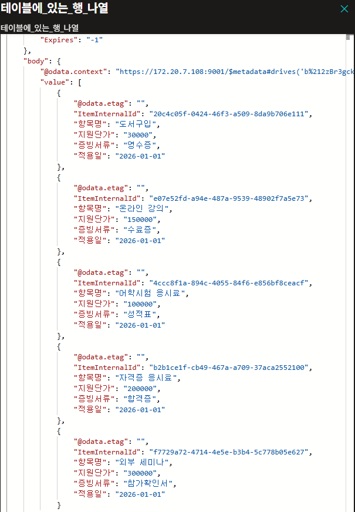

## 단계 — ② 읽는 조건을 내가 정한다 (10분)

12. 위쪽 **디자이너** 탭을 눌러 편집 화면으로 되돌아갑니다. 11번에서 **활동** 탭에 있었으므로 노드를 고치려면 먼저 이쪽으로 옵니다.

    6번의 Excel 액션을 열고 **고급 매개 변수** 드롭다운을 펼칩니다. 여섯 개가 체크박스로 들어 있습니다.

    

    **필터 쿼리**를 켜면 아래에 칸이 생깁니다. 아래처럼 채웁니다. 작은따옴표 **안쪽**에 4번의 입력을 끼웁니다.

    ```
    항목명 eq '(입력: 항목명)'
    ```

    **완료 기준**: 따옴표 두 개 사이에 `항목명` 칩이 들어가 있다.

    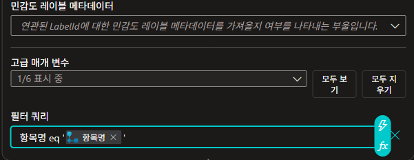

    **같은 이름이 두 군데에 나옵니다.** 왼쪽의 `항목명` 은 Excel 표의 머리글 이름이고, 따옴표 안의 파란 칩은 4번에서 만든 흐름의 입력입니다. 「표의 이 열이, 받은 값과 같은 행」이라고 읽습니다.

    **`항목명`은 우리가 만든 Excel 표의 머리글 이름 그대로입니다.** 한글이어도 됩니다. `eq` 는 「같다」는 뜻이고, 이런 문법으로 조건을 씁니다.

    {: .warning }
    칩이 따옴표 **밖**에 나가면 실행 시 오류가 납니다. 값은 글자로 취급되므로 따옴표 안에 있어야 합니다.

13. 같은 드롭다운에서 **최대 개수**를 켜고 `1` 을 넣습니다.

    **완료 기준**: 표시 중인 항목이 둘이 되고, 최대 개수 칸에 `1` 이 들어간다. **초안 저장** 후 **게시**합니다.

    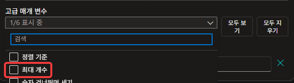

    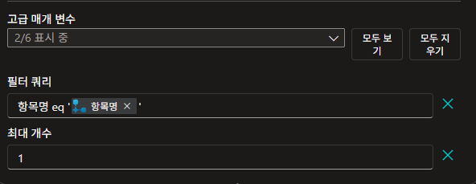

    이름이 **「최대 개수」**입니다. 조건에 맞는 것이 그보다 적으면 적은 대로 옵니다. `0` 개일 수도 있고, 그 경우를 15번에서 봅니다.

14. 10번과 같은 값(`도서구입` · `4`)으로 다시 테스트하고, 11번처럼 **원시 출력**을 확인합니다.

    **완료 기준**: `value` 에 **한 행만** 들어 있고, 그 행이 `도서구입`이다.

    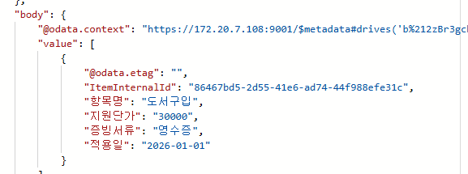

15. 없는 항목으로 테스트합니다. `항목명`에 `헬스장 이용권`, `수량`에 `1` 을 넣고 실행합니다.

    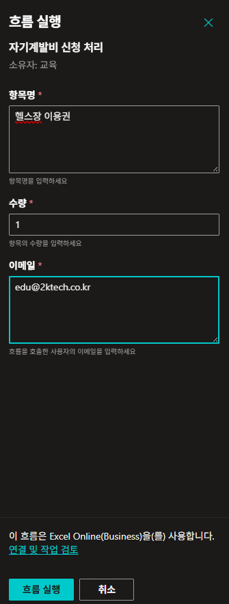

    **완료 기준**: 오류가 아니라 `value` 가 **빈 배열**(`[]`)로 온다.

    

16. Excel 액션 아래 **+** 에서 `조건` 을 검색해 **컨트롤** 묶음의 **조건**을 넣습니다.

    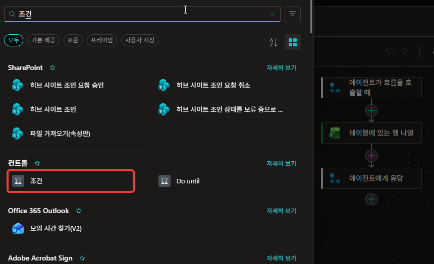

    **완료 기준**: 조건 노드가 놓이고 아래가 두 갈래로 벌어진다.

    검색하면 SharePoint 등 다른 커넥터의 비슷한 항목이 같이 나옵니다. **컨트롤** 아래의 것을 고릅니다.

17. 조건 노드의 **왼쪽 칸**을 누르고, 칸 옆에 뜨는 **`fx`** 를 누릅니다.

    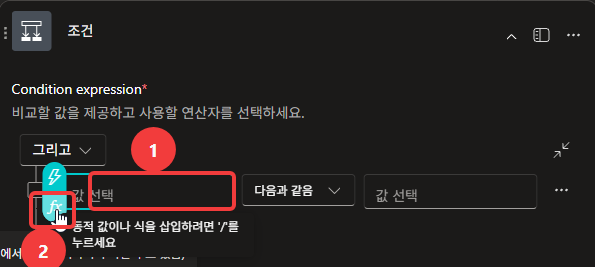

    수식 편집기가 열립니다. 아래를 **붙여넣고** **업데이트**를 누릅니다.

    ```
    length(outputs('테이블에_있는_행_나열')?['body/value'])
    ```

    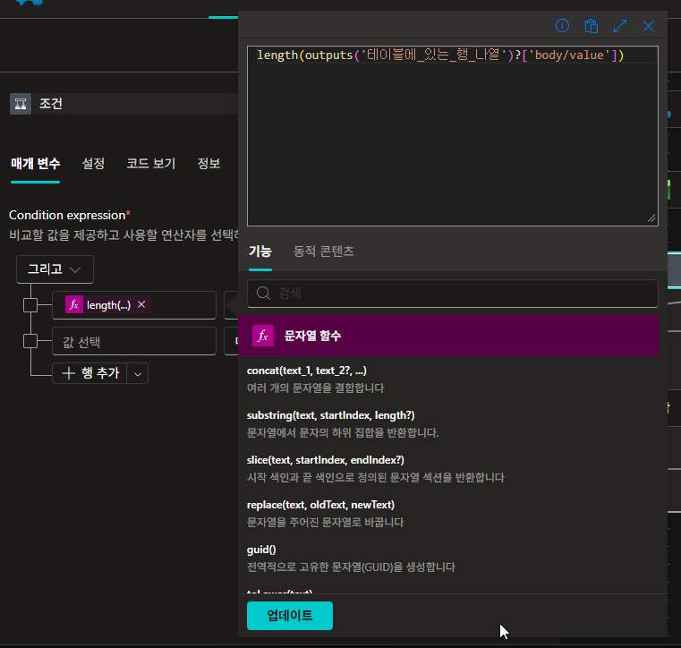

    비교는 **다음과 같음**, 값은 `1` 로 둡니다.

    **완료 기준**: 캔버스가 **True**와 **False** 두 갈래로 나뉜다.

    

    <details markdown="block">
    <summary>이 수식에 대한 추가설명을 보려면 클릭</summary>

    **수식은 안에서 밖으로 계산됩니다.** 괄호 안쪽이 먼저 값이 되고, 그 값이 바깥 함수의 재료가 됩니다. `?['…']` 는 바로 앞 결과에 붙어 그 자리에서 풀립니다. 그래서 읽는 순서도 안에서 밖입니다.

    **① `outputs('테이블에_있는_행_나열')`**

    그 이름의 노드가 **돌려준 것 전부**입니다. 11번 활동 탭에서 열어 본 그 덩어리입니다.[^learn-wdl]

    ```json
    {
      "statusCode": 200,
      "headers": { … },
      "body": { "value": [ … ] }
    }
    ```

    **② `outputs('테이블에_있는_행_나열')?['body/value']`**

    그 덩어리에서 **`body` 안의 `value` 만** 꺼냅니다. 대괄호가 「이 이름의 칸을 꺼내라」이고, 안의 슬래시는 「`body` 아래의 `value`」라는 경로입니다.

    `?` 는 **없으면 오류 대신 빈 값**을 돌려주라는 표시입니다. 물음표가 없으면 `body` 가 없는 순간 흐름이 통째로 멈춥니다.[^learn-wdl]

    | 넣은 항목명 | 이 자리의 값 |
    |---|---|
    | `도서구입` | `[ { "항목명": "도서구입", "지원단가": "30000", … } ]` |
    | `헬스장 이용권` | `[]` |

    14번과 15번에서 **원시 출력으로 눈으로 본 것**이 이 값입니다.

    **③ `length(outputs('테이블에_있는_행_나열')?['body/value'])`**

    배열에 **몇 개 들어 있는지** 셉니다. 안의 내용은 보지 않고 개수만 셉니다.[^learn-wdl]

    | 넣은 항목명 | 이 자리의 값 |
    |---|---|
    | `도서구입` | `1` |
    | `헬스장 이용권` | `0` |

    그래서 비교가 **「`1` 과 같은가」**가 됩니다. 14번의 한 행과 15번의 빈 배열이 여기서 `1` 과 `0` 이라는 숫자로 바뀌고, 그 숫자가 갈래를 정합니다.

    </details>

    {: .warning }
    수식 안의 `테이블에_있는_행_나열` 은 **6번에서 넣은 노드의 이름**입니다. 노드 이름을 바꿨다면 수식 안의 이름도 같이 바꿔야 합니다. 공백은 밑줄로 들어갑니다.

18. 조건 노드 아래에 있던 **응답 노드**를 **True** 갈래 안으로 **드래그**합니다.

    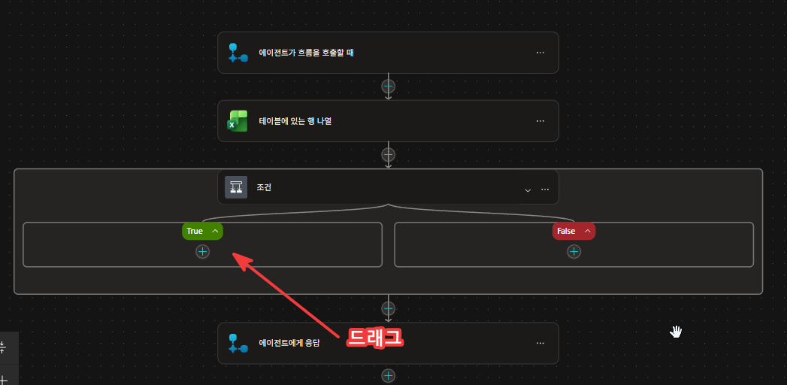

    지우고 새로 만들지 않습니다. 노드는 갈래 안팎으로 **옮길 수 있습니다.** 값은 22번에서 다시 채웁니다.

    **False** 갈래 안의 **+** 를 누릅니다.

    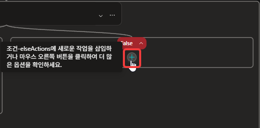

    **작업 추가** 창이 열립니다. **AI 기능** 묶음에서 **에이전트에게 응답**을 고릅니다.

    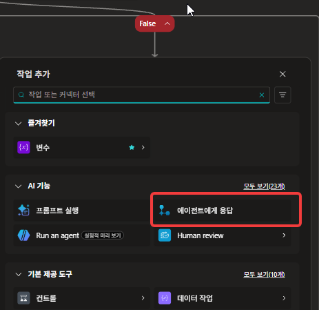

    노드가 **에이전트에게 응답 1** 이라는 이름으로 놓입니다. **출력 추가**를 누릅니다.

    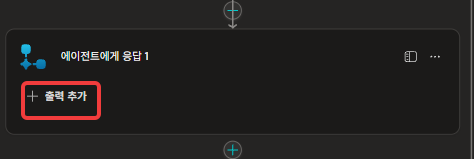

    이름 끝에 `1` 이 붙었습니다. 같은 종류의 노드가 둘이 되어 **이름이 겹치지 않게 자동으로 번호가 붙은 것**입니다. 17번 수식이 노드 이름으로 앞 결과를 가리켰던 것을 떠올리면, 이름이 유일해야 하는 이유가 보입니다.

    **출력 유형 선택**에서 **텍스트**를 고릅니다.

    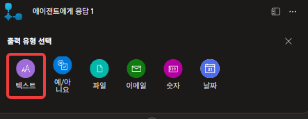

    이름을 `결과` 로 하고, 값에 아래를 씁니다.

    ```
    지원 대상이 아닌 항목입니다.
    ```

    **완료 기준**: 두 갈래에 응답 노드가 하나씩 있고, False 쪽 출력 이름이 True 쪽과 같은 `결과` 다.

    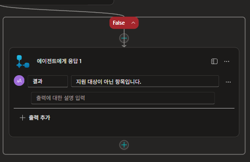

    저장·게시하고 두 값으로 테스트합니다.

    | 입력 | 어느 갈래 | 결과 |
    |---|---|---|
    | `온라인 강의` | **True** | 원래 갈래로 간다 |
    | `헬스장 이용권` | **False** | 위 문장이 나온다 |

    **완료 기준**: 활동 탭에서 두 실행이 서로 다른 갈래를 탄 것이 보인다.

    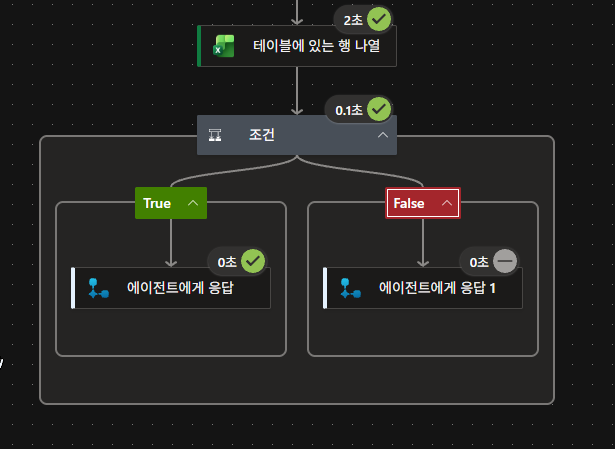

    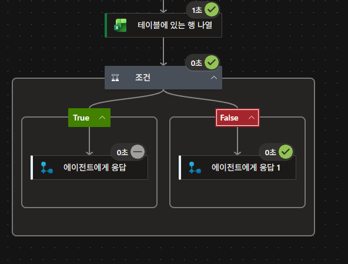

    **찾은 쪽이 True입니다.** 정상 경로가 True 갈래이고, 못 찾은 경우가 False로 빠집니다. 갈래를 반대로 그리면 흐름을 읽을 때마다 한 번씩 헷갈립니다.
{: start="12" }

## 단계 — ③ 쓰는 자리와 순서를 정한다 (8분)

19. 금액을 담을 변수를 만듭니다. **테이블에 있는 행 나열과 조건 사이**의 `+` 를 누릅니다.

    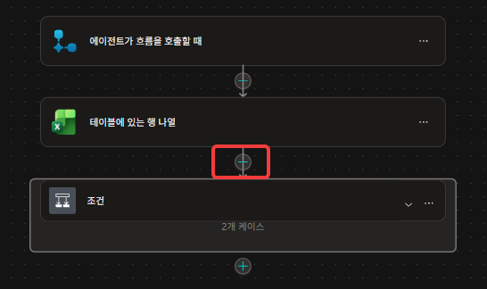

    작업 추가 창의 **기본 제공 도구**에서 **변수**를 고릅니다.

    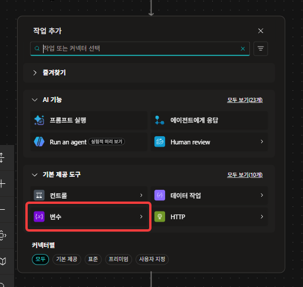

    목록에서 **변수 초기화**를 고릅니다.

    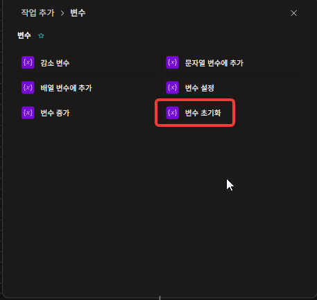

    같은 목록에 **변수 설정**도 있습니다. 조금 뒤에 쓸 것이 여기 있습니다 — **만드는 것과 값을 넣는 것이 다른 작업**입니다.

    이름 `금액`, 유형 **정수**, 값 `0` 을 넣습니다.

    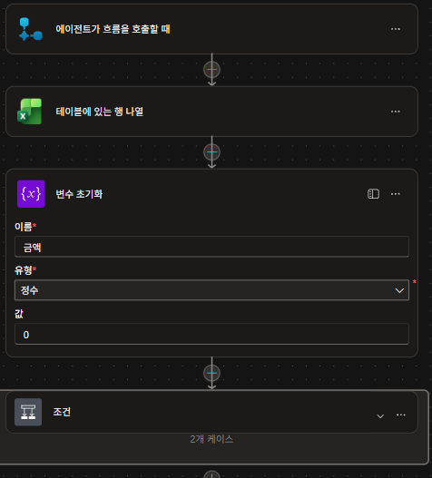

    {: .warning }
    **변수 초기화는 갈래 안에 넣을 수 없습니다.** True 갈래에 놓으면 저장이나 게시에서 막힙니다. 조건보다 위, 갈래가 갈라지기 전에 놓아야 합니다.

    이제 **True** 갈래에 **변수 설정**을 넣어 값을 채웁니다. 변수는 `금액`, 값에는 아래 수식을 **붙여넣습니다.**

    ```
    mul(int(first(outputs('테이블에_있는_행_나열')?['body/value'])?['지원단가']), triggerBody()?['number'])
    ```

    **완료 기준**: 조건 위에 초기화가, True 갈래에 설정이 하나씩 있다.

    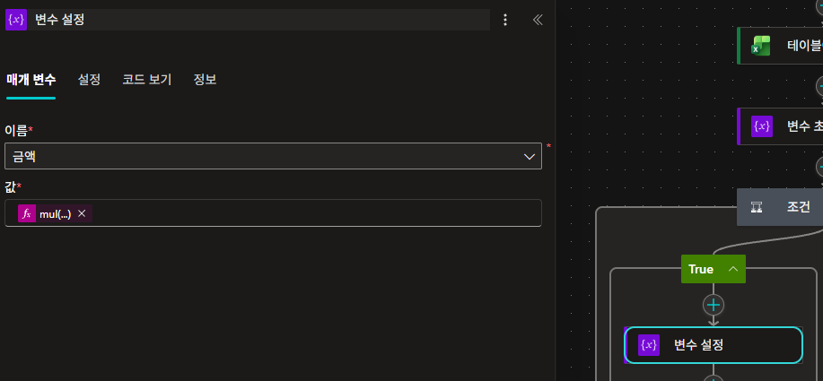

    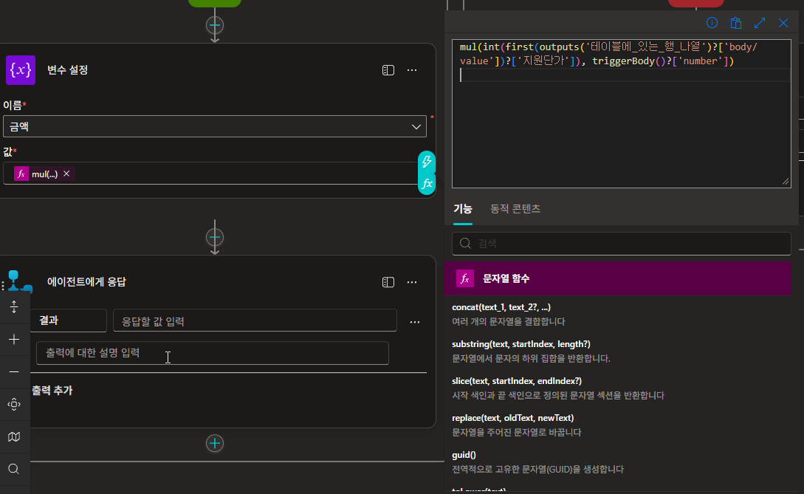

    여기까지의 전체 모양입니다. 조건 위에 **변수 초기화**, True 갈래에 **변수 설정**과 응답, False 갈래에 응답이 하나씩 있습니다.

    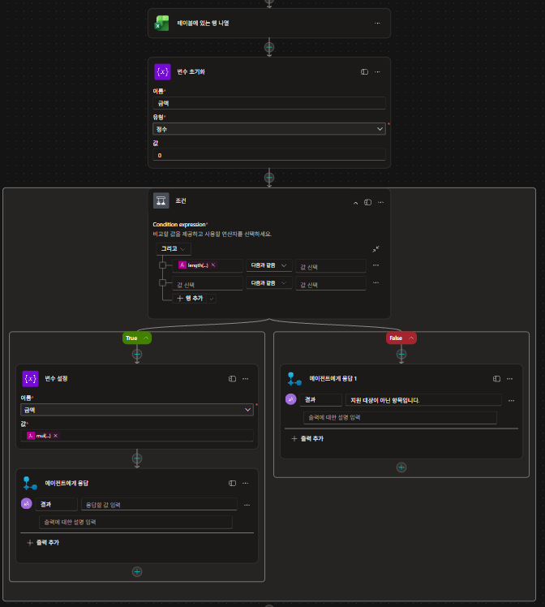

    True 갈래 응답의 값 칸은 아직 **비어 있습니다.** 22번에서 채웁니다.

    **변수 설정에서는 이름을 드롭다운으로 고릅니다.** 앞에서 초기화한 것만 목록에 뜹니다. 여기서 이름이 안 보이면 초기화가 갈래 안에 들어가 있는 것입니다.

    {: .warning }
    **수량을 `triggerBody()?['number']` 로 부릅니다.** 입력 이름(`수량`)이 아니라 **형식 이름**입니다. 입력이 여러 개면 `number_1`·`text_1` 처럼 번호가 붙으므로, 수식을 붙여넣은 뒤 값이 맞는지 한 번 실행해 확인합니다.

    **수식이 세 겹입니다.** 안쪽부터 읽으면 `first` 로 배열의 첫 행을 꺼내고, `?['지원단가']` 로 그 행의 지원단가 칸을 집고, `int` 로 숫자로 바꾸고, `mul` 로 수량과 곱합니다. 붙여넣고 넘어가도 되지만, 어느 조각이 무엇인지는 한 번 짚어 두면 고칠 때 편합니다.

20. **변수 설정과 응답 노드 사이**의 `+` 를 누릅니다.

    

    **Excel Online (Business) → 테이블에 행 추가**를 넣습니다.

    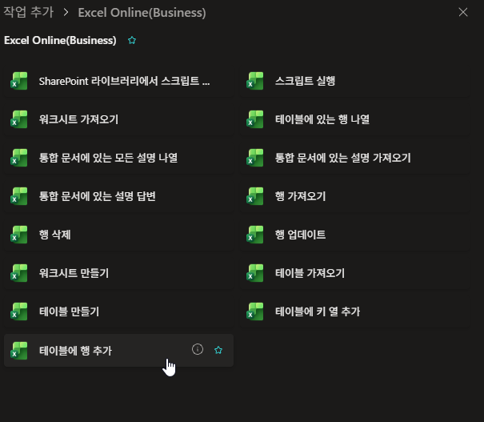

21. 위치·문서 라이브러리·파일을 고르고 테이블은 **`신청내역`** 으로 지정합니다. 표의 칸들은 **고급 매개 변수** 안에 들어 있고, 처음에는 `0/7 표시 중` 입니다.

    

    드롭다운을 펼쳐 **열 여섯 개**를 체크합니다. 맨 위 **날짜/시간 형식**은 켜지 않습니다.

    

    일곱 개 중 여섯 개입니다. 맨 위 하나는 표의 열이 아니라 **커넥터의 설정**입니다. 7번에서 민감도 레이블 두 칸을 비워 둔 것과 같은 종류입니다.

    여섯 칸을 아래처럼 채웁니다.

    | 칸 | 무엇을 넣나 |
    |---|---|
    | 신청번호 | 아래 수식 |
    | 신청자 | 5번의 이메일 입력 칩 |
    | 항목명 | 4번의 입력 칩 |
    | 수량 | 5번의 입력 칩 |
    | 금액 | 19번의 변수 칩 |
    | 상태 | `접수` (글자로 직접) |

    `신청번호` 칸은 **수식**으로 채웁니다. 칸을 누르면 오른쪽에 아이콘 둘이 뜹니다. 위가 동적 콘텐츠(번개), 아래가 **수식**(`fx`)입니다. `fx` 를 누릅니다.

    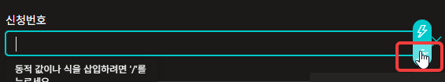

    툴팁이 **「동적 값이나 식을 삽입하려면 `/` 를 누르세요」**라고 알려 줍니다. 칸에 `/` 를 쳐도 같은 창이 열립니다.

    아래를 붙여넣고 **추가**를 누릅니다.

    ```
    concat(convertFromUtc(utcNow(),'Korea Standard Time','yyyyMMdd-HHmmss'), '-', substring(guid(),0,8))
    ```

    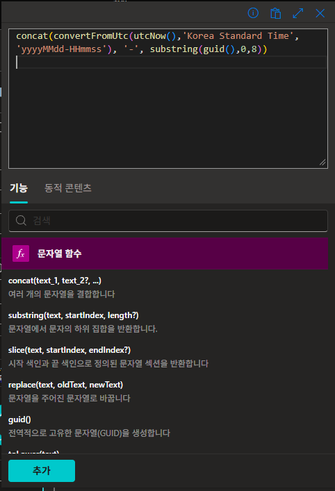

    버튼이 **추가**입니다. 17번에서 이미 있는 수식을 고칠 때는 **업데이트**였습니다. 새로 넣느냐 고치느냐로 이름이 바뀝니다.

    **완료 기준**: 여섯 칸이 다 채워지고 `6/7 표시 중` 이 된다.

    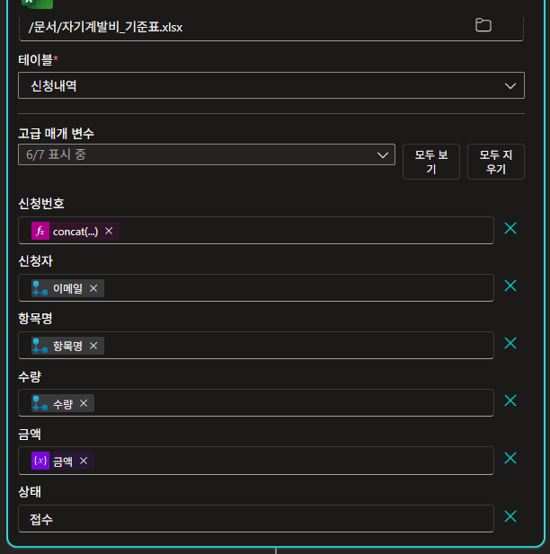

    수식은 두 조각입니다. 앞은 **지금 시각**(`20260814-152130`), 뒤는 **GUID**(겹치지 않게 만들어지는 긴 식별자)의 **앞 8글자**(`c2ecc88d`)입니다. 시각만 쓰면 같은 초에 두 건이 들어올 때 번호가 겹칩니다. 뒤 8글자가 그것을 갈라 줍니다. `convertFromUtc` 가 있는 것은 흐름의 시계가 **UTC**라서입니다 — 그냥 두면 9시간 이른 값이 찍힙니다.

22. **True** 갈래의 **에이전트에게 응답** 노드를 엽니다. 출력 이름이 18번과 같은 `결과` · **텍스트**인지 확인하고, 값에 아래 수식을 붙여넣습니다.

    ```
    concat(triggerBody()?['text'], ' ', string(triggerBody()?['number']), '건 접수되었습니다. 금액 ', string(variables('금액')), '원')
    ```

    **완료 기준**: 두 갈래의 출력이 **같은 이름 · 같은 형식**이다.

    

    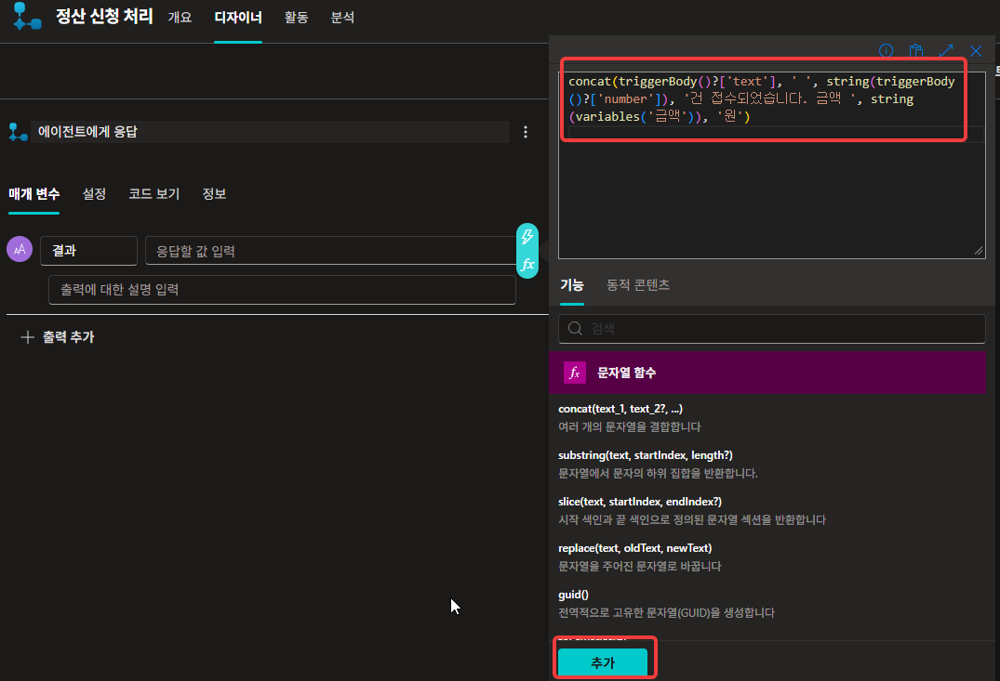

23. 저장하고 게시한 뒤, `도서구입` · `4` 로 테스트합니다. 활동 탭에서 **에이전트에게 응답** 노드의 **원시 출력**을 엽니다.

    **완료 기준**: `body` 에 `도서구입 4건 접수되었습니다. 금액 120000원` 이 들어 있다.

    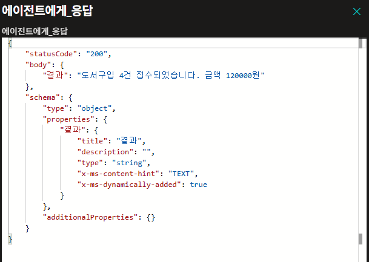

    이어서 **OneDrive에서 Excel 파일을 열어** 확인합니다.

    **완료 기준**: `신청내역` 에 한 줄이 추가되어 있고, **값이 제자리에 들어가 있다.**

    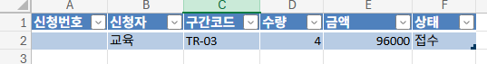

24. 에이전트로 돌아가 **도구** 탭을 엽니다. [Lab 5](./lab5.html)에서 붙인 도구 셋이 있습니다. **도구 추가**를 누릅니다.

    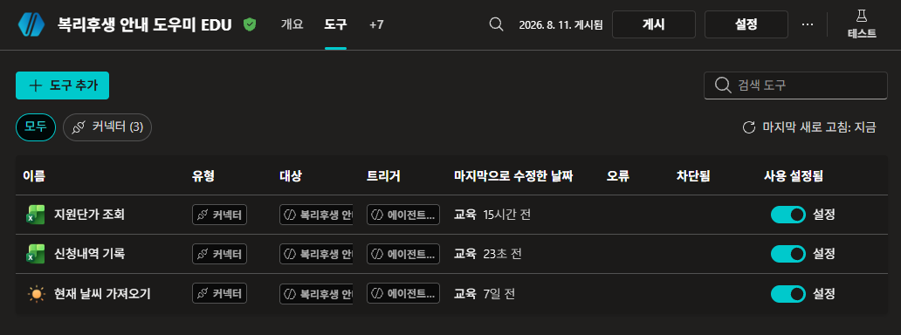

    목록 오른쪽에 **오류 · 차단됨 · 사용 설정됨** 열이 있습니다. 25번에서 이 중 하나를 씁니다.

    **흐름** 탭에서 `자기계발비 신청 처리` 를 고릅니다.

    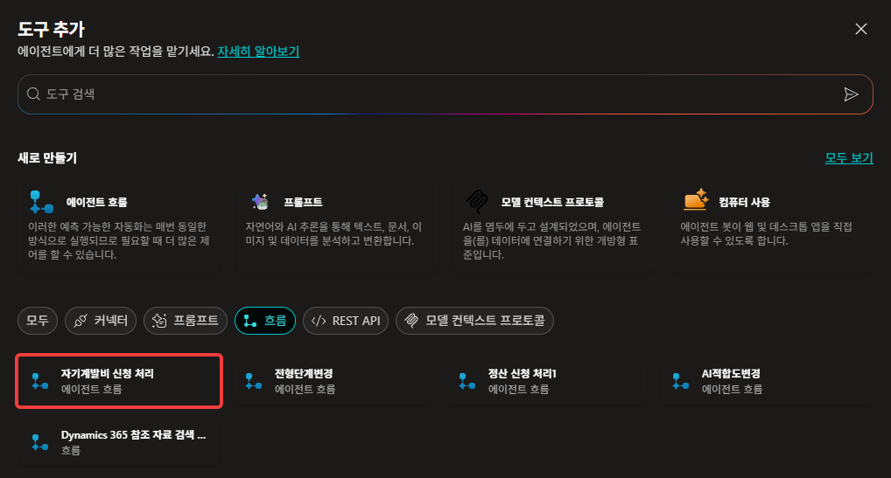

    {: .warning }
    목록에 **남이 만든 흐름도 보입니다.** 같은 환경을 45명이 쓰고 있습니다. 이름으로 본인 것을 가려내야 합니다.

    **세부 정보** 화면이 열립니다. **이름**은 흐름 이름이 그대로 들어옵니다. **설명**을 아래로 씁니다.

    ```
    자기계발비 신청 한 건을 처리한다. 항목명으로 지원단가를 조회해 금액을 계산하고 신청내역에 접수로 기록한다. 등록되지 않은 항목명은 기록하지 않는다.
    ```

    **완료 기준**: 설명이 채워지고 **저장**된다.

    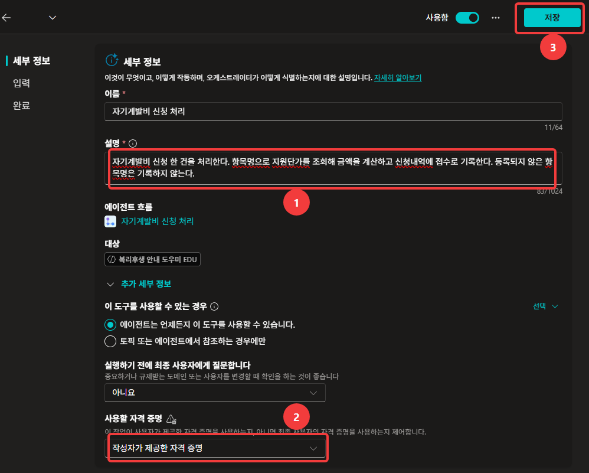

    <details markdown="block">
    <summary>「추가 세부 정보」에 무엇이 있나</summary>

    오늘은 셋 다 기본값 그대로 둡니다. 무엇을 정하는 자리인지만 봅니다.

    | 항목 | 지금 값 | 무엇을 정하나 |
    |---|---|---|
    | 이 도구를 사용할 수 있는 경우 | 에이전트는 언제든지 | 「토픽 또는 에이전트에서 참조하는 경우에만」으로 바꾸면 **지목받을 때만** 불립니다. [Lab 5](./lab5.html) 12번에서 지침으로 도구를 지목한 것이 이 설정과 만납니다 |
    | 실행하기 전에 최종 사용자에게 질문합니다 | 아니요 | 부르기 전에 사용자에게 한 번 묻습니다. 화면이 「중요하거나 규제받는 도메인 또는 사용자를 변경할 때 확인을 하는 것이 좋습니다」라고 안내합니다 |
    | 사용할 자격 증명 | 작성자가 제공한 자격 증명 | 흐름이 **내 권한으로** Excel 파일을 엽니다. 최종 사용자 쪽으로 바꾸면 각자 자기 계정으로 붙습니다 |

    가운데 항목을 한 번 더 봅니다. **이 도구는 표에 줄을 씁니다.** 지운 뒤에 되돌릴 방법이 랩 안에 없습니다. 조회 도구와 쓰기 도구가 같은 화면, 같은 기본값으로 등록된다는 것이 이 자리에서 보입니다.

    </details>

    이어서 **지침**의 「답변 원칙」 아래에 한 줄을 더합니다. 변수 이름 자리에서 **`/`** 를 눌러 목록에서 고릅니다.

    ```
    - 자기계발비 신청 시 이메일은 /System.User.Email 을 입력 변수로 집어넣는다.
    ```

    **완료 기준**: 변수 이름이 **칩**으로 바뀐다. 저장하고 게시합니다.

    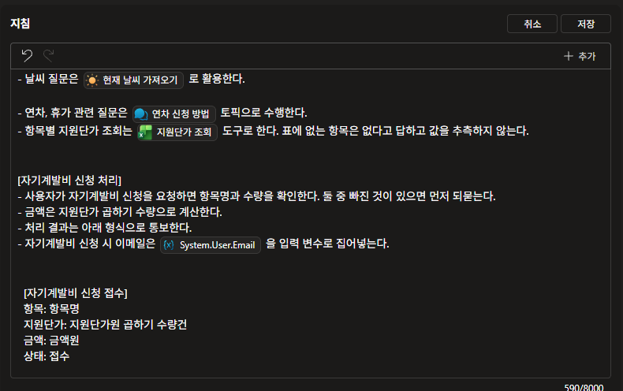
{: start="19" }

## 단계 — ④ 같은 요청, 다른 결과 (7분)

25. 테스트하기 전에 먼저 **[Lab 5](./lab5.html) 20번에 이름 붙인 `신청내역 기록`** 을 끕니다. 도구 목록에서 그 줄의 **사용 설정** 토글을 누릅니다.

    **완료 기준**: 도구는 목록에 남아 있고 사용만 꺼진다. `자기계발비 신청 처리` 는 켜져 있다.

    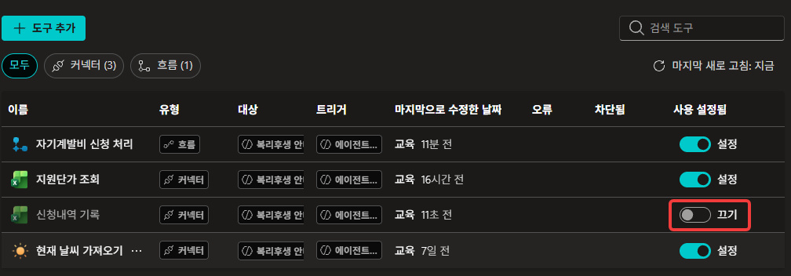

    **먼저 끄고 나서 테스트합니다.** 켜 둔 채로 신청하면 같은 표에 쓰는 도구가 둘이라 어느 쪽이 썼는지 알 수 없습니다. 이 랩이 보여주려는 것은 **흐름이 쓴 결과**입니다.

26. **새 테스트 세션**에서 신청합니다.

    ```
    도서구입으로 4건 자기계발비 신청할게요
    ```

    **완료 기준**: 계약 테스트 창에 `자기계발비 신청 처리` 가 **흐름**으로 기록되고, **상자가 하나**다.

    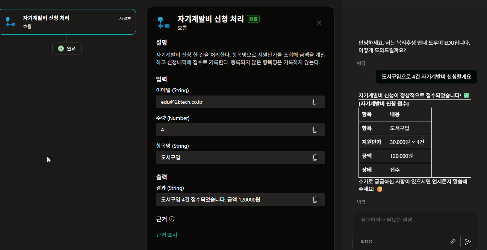

    `이메일` 칸에 본인 주소가 들어가 있습니다. 대화에서 말하지 않은 값입니다 — 24번의 지침 한 줄이 채워 넣은 것입니다.

27. 여러 건과 없는 항목을 잇달아 시켜 봅니다.

    ```
    온라인 강의 1건, 어학시험 응시료 2건, 도서구입 3건으로 신청해주세요
    ```

    ```
    헬스장 이용권으로 2건 자기계발비 신청할게요
    ```

    **완료 기준**: 앞은 흐름이 **세 번** 호출되고 합계까지 정리된다. 뒤는 흐름이 **한 번도 불리지 않고** 기록도 되지 않는다.

    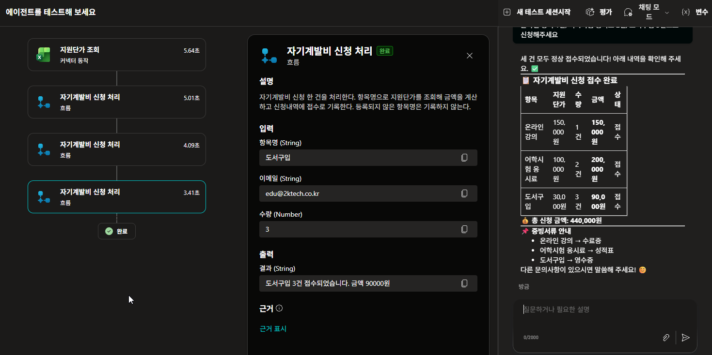

    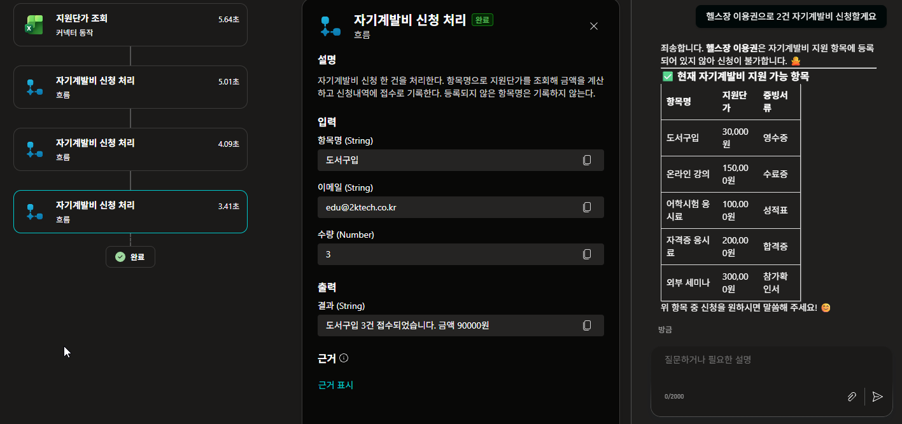

28. [Lab 5](./lab5.html) 23번에서 했던 두 요청을 **그대로** 다시 합니다.

    ```
    신청내역 전부 상태를 승인으로 바꿔줘
    다섯 항목을 각 1건씩 전부 신청하고 기록해줘
    ```

    **완료 기준**: 뒤는 흐름이 **다섯 번** 호출된다. 앞은 [Lab 5](./lab5.html) 때처럼 **여전히 못 합니다.**

    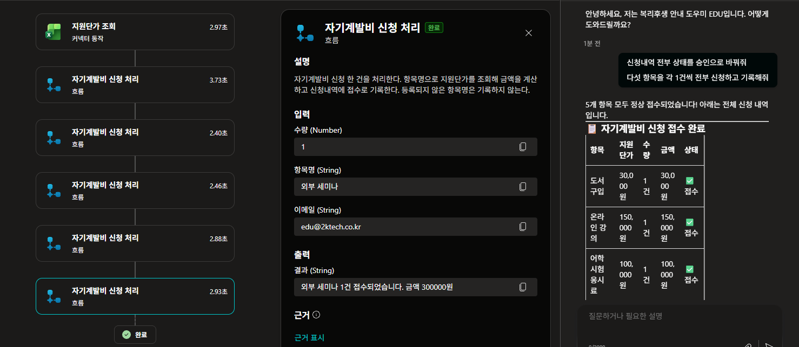

    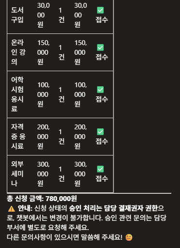

29. **OneDrive에서 Excel 파일을 열어** [Lab 5](./lab5.html) 24번의 표와 견줍니다.

    **완료 기준**: 표가 **세 덩어리**로 보인다. 맨 위 샘플 세 줄, 가운데 [Lab 5](./lab5.html)에서 쌓인 줄, 아래 오늘 흐름이 쓴 줄.

    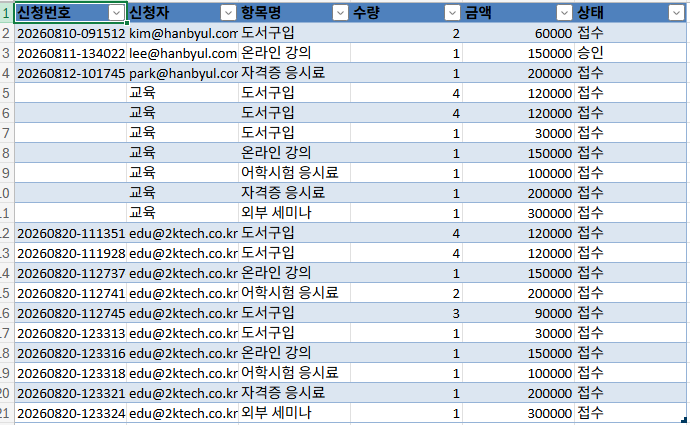

    같은 요청인데 결과가 다릅니다. 달라진 것은 도구 구성뿐입니다. **한 표에서 위아래로 비교되므로 지우지 말고 남겨 둡니다.**
{: start="25" }

### 참고 — 실무에서는 흐름을 더 잘게 쪼갭니다

읽고 넘어가는 대목입니다. 만들지 않습니다.

오늘 만든 흐름은 **조회 · 계산 · 기록**을 한 덩어리로 합니다. 배우기에는 이 편이 낫지만, 실제로 쓸 것이라면 보통 더 나눕니다.

| 흐름 | 하는 일 | 왜 나누나 |
|---|---|---|
| 조회 | 항목명으로 지원단가를 찾아 돌려준다 | 바깥을 바꾸지 않는다. 몇 번 불려도 안전하다 |
| 등록 | 확정된 값을 신청내역에 기록한다 | 바깥을 바꾼다. 언제 불릴지가 중요하다 |
| 변경 | 신청번호 하나의 상태를 바꾼다 | 되돌리기가 가장 어렵다. 따로 두고 따로 관리한다 |

---

## 단계 — ⑤ 도구를 데려온다 (9분)

30. **도구 추가**에서 위쪽 **새로 만들기**의 **모델 컨텍스트 프로토콜**을 고릅니다.

    

31. 서버 정보를 채웁니다.

    ```
    서버 이름   Microsoft Learn MCP
    서버 설명   Microsoft 의 공식 제공 기술문서 및 예제에 대한 Best Practice MCP 서버
    서버 URL    https://learn.microsoft.com/api/mcp
    인증        없음
    ```

    **완료 기준**: 네 칸이 채워지고 **만들기**가 활성으로 바뀐다.

    

    인증이 「없음」인 것은 이 서버가 공개 문서만 다루기 때문입니다. 사내 시스템을 MCP로 열면 API 키나 OAuth 2.0을 씁니다.

32. 만들고 나면 「사용자 지정 커넥터를 만들었습니다」가 뜨는데, **아직 추가되지 않았습니다.** 아래 **연결**이 「연결되지 않음」이고 **추가 및 구성**이 비활성입니다.

    

    **연결**을 눌러 연결을 만듭니다. 표시 이름은 비워 두어도 됩니다.

    **완료 기준**: 연결이 만들어지고 **추가 및 구성**이 활성으로 바뀐다.

    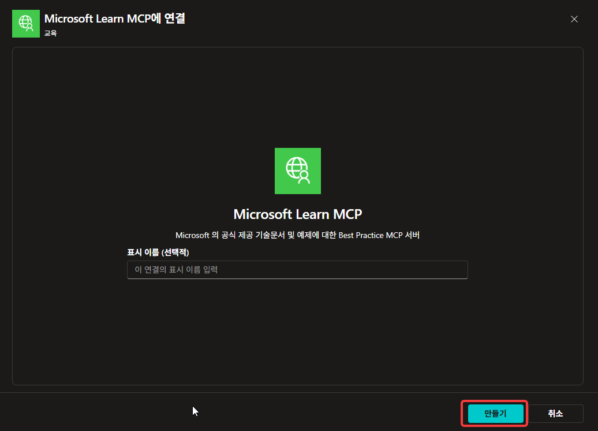

33. 추가하고 나서 서버를 열어 **도구** 항목을 봅니다.

    **완료 기준**: 서버 하나 아래에 **도구 셋**이 들어와 있다.

    

    | 도구 | 하는 일 |
    |---|---|
    | `microsoft_docs_search` | 공식 문서에서 관련 내용을 찾는다 |
    | `microsoft_code_sample_search` | 코드 예제를 찾는다 |
    | `microsoft_docs_fetch` | 문서 한 쪽을 통째로 가져온다 |

34. **새 테스트 세션**에서 물어봅니다.

    ```
    Copilot Studio에서 에이전트 흐름을 만드는 방법 알려줘
    ```

    처음에는 **연결 관리자를 열라**는 안내가 나올 수 있습니다.

    

    링크를 눌러 **연결 관리**에서 `Microsoft Learn MCP` 의 상태를 확인합니다. 「연결되지 않음」이면 **연결**을 눌러 잇습니다.

    

    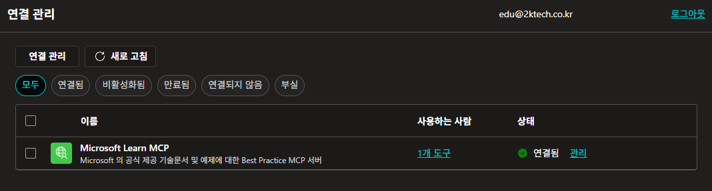

    돌아와 **다시 시도**를 누릅니다. **완료 기준**: 공식 문서를 근거로 답하고, 답 아래에 **참조**가 여러 개 붙는다.

    

    {: .warning }
    **32번에서 연결을 만들었는데도 다시 물어봅니다.** 만드는 자리의 연결과 쓰는 자리의 연결이 따로 잡히는 경우가 있습니다. 안내가 뜨면 링크를 따라가 상태만 확인하면 됩니다.

35. **도구 목록**을 열어 오늘 얻은 것을 한 화면에서 봅니다.

    **완료 기준**: 위쪽 필터가 **커넥터(3) · 흐름(1) · 모델 컨텍스트 프로토콜(1)** 로 나뉘고, 25번에서 끈 도구가 **끄기** 상태로 남아 있다.

    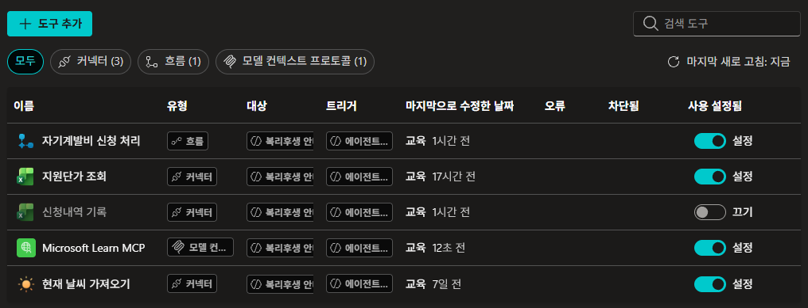

    | 얻은 방법 | 무엇 | 어디서 |
    |---|---|---|
    | 가져다 썼다 | 현재 날씨 가져오기 · 지원단가 조회 · 신청내역 기록 | [Lab 5](./lab5.html) |
    | 만들었다 | 자기계발비 신청 처리 | Lab 6 ①~③ |
    | 데려왔다 | Microsoft Learn MCP | Lab 6 ⑤ |

    | | [Lab 3](./lab3.html) 웹사이트 | Lab 6 MCP |
    |---|---|---|
    | 경로 | Bing 인덱싱을 거친다 | 서버에 직접 묻는다 |
    | 조건 | 로그인·깊이·리다이렉트·2,048자 | 주소와 연결만 있으면 된다 |
    | 받는 것 | 페이지 조각 | 구조화된 결과 |
    | 지식인가 도구인가 | 지식 | **도구** |
{: start="30" }

---

## 확인
- ① 트리거가 「에이전트가 호출하는 경우」로 고정된 흐름을 만들었다
- ② 입력을 **형식까지 정해** 선언했다
- ③ **필터 쿼리**와 최대 개수로 읽어 오는 양을 내가 정했다
- ④ 행 추가 액션에서 **칸마다 값을 이어** 값이 밀리지 않게 했다
- ⑤ 조건 갈래로 「없는 항목」을 흐름 안에서 갈라냈다
- ⑥ 조회 → 계산 → 기록을 **하나의 도구**로 묶었고, 계약 테스트 창에 상자가 하나로 뜨는 것을 확인했다
- ⑦ 쓰기 도구를 끄고 **같은 요청**을 다시 했을 때 값이 제자리에 들어가는 것을 확인했다
- ⑧ MCP 서버를 **주소로 등록**하고, 서버와 별개로 **연결**을 만들어야 하는 것을 확인했다
- ⑨ MCP 서버 하나로 도구 여러 개가 한꺼번에 들어오는 것을 확인했다
- ⑩ 커넥터 · 흐름 · MCP 세 가지가 오케스트레이터에게는 모두 도구라는 것을 말할 수 있다
{: .checklist }

---

## 여기까지의 지침

[Lab 5](./lab5.html) 상태에 **한 줄**이 더해졌습니다. 「답변 원칙」의 마지막 줄(24번)입니다.

```
## 역할
한별소프트 임직원의 복리후생·근태 문의를 안내하는 사내 도우미. 한국어로 간결·정중하게, 업로드된 지식 문서에 근거해 답하고 없는 내용은 단정하지 않는다.

## 답변 원칙
- 반드시 업로드된 지식 문서만 근거로 답한다.
- 답변 끝에 근거 문서 이름을 한 줄로 표기한다. 예: (근거: 복리후생 제도 개요)
- 금액·일수·기한은 문서에 적힌 수치를 그대로 쓴다. 반올림·일반화하지 않는다.
- 두 문서에 걸친 질문이면 둘을 결합해 답하고 근거 문서를 둘 다 표기한다.
- 연차, 휴가 관련 질문은 /연차 신청 방법 토픽으로 수행한다.
- 항목별 지원단가 조회는 /지원단가 조회 도구로 한다. 표에 없는 항목은 없다고 답하고 값을 추측하지 않는다.
- 자기계발비 신청 시 이메일은 /System.User.Email 을 입력 변수로 집어넣는다.

## 경계
- 개인의 실제 데이터(내 잔여 연차, 내 별포인트 잔액, 내 급여)는 알 수 없다. 숫자를 추정하지 말고 "한별포털에서 확인하거나 피플팀(내선 1000)으로 문의해 주세요"라고 안내한다.
- 문서에 없는 내용은 지어내지 않는다. "제공된 문서에서 찾을 수 없습니다"라고 답한다.
- 규정의 해석·예외 적용 여부는 단정하지 않는다. 판단이 필요한 사안은 피플팀 확인으로 넘긴다.

[자기계발비 신청 처리]
- 사용자가 자기계발비 신청을 요청하면 항목명과 수량을 확인한다. 둘 중 빠진 것이 있으면 먼저 되묻는다.
- 금액은 지원단가 곱하기 수량으로 계산한다.
- 처리 결과는 아래 형식으로 통보한다.

  [자기계발비 신청 접수]
  항목: 항목명
  지원단가: 지원단가원 곱하기 수량건
  금액: 금액원
  상태: 접수
```

`/연차 신청 방법` · `/지원단가 조회` · `/System.User.Email` 은 화면에서 **칩**입니다. 통째로 붙여넣으면 글자가 되므로, 그 세 줄만 `/` 를 다시 입력해 목록에서 고릅니다.

**5번에서 날씨 도구가 안 불려 지침을 추가했다면** 「답변 원칙」에 `- 날씨 질문은 /현재 날씨 가져오기 를 활용한다.` 한 줄이 더 있습니다. 위 블록에는 넣지 않았습니다 — 사람마다 있을 수도 없을 수도 있어서입니다. 그대로 두어도 뒤에 영향이 없습니다.

**더해진 한 줄은 값을 넘기는 방법이지, 무엇을 어떻게 하라는 규칙이 아닙니다.** 조회 조건도, 쓰는 자리도, 순서도 지침에는 한 글자도 적혀 있지 않습니다. 그것들은 전부 흐름 안에 있습니다. 28·29번에서 같은 요청의 결과가 달라진 것은 **도구 구성이 바뀌었기 때문**입니다.

---

## 부록

이 랩에는 [에이전트가 에이전트를 부른다](./appendix/connected-agent.html) 부록이 있습니다. 랩 진행에 필요하지 않습니다 — [부록 모음](./appendix/)에서 골라 하세요.

---

## 출처

이 랩은 아래를 토대로 만들었습니다. **제품 화면과 동작은 실측**이고, 문헌은 항목마다 확인일을 적었습니다. 제품이 바뀌면 문헌 쪽이 먼저 낡습니다 — 수치나 주기가 걸리면 원문을 다시 확인하세요.

- **실측** — 2026-08-12 · 본문 전 스텝 실측(35스텝·62컷). 소재를 2026-08-14에 자기계발비로 바꿨고 그 부분은 재실측 대기 중입니다
- **문헌** — MS Learn 익스프레스 모드 문서[^learn-express] · MS Learn 워크플로 정의 언어 참조[^learn-wdl](둘 다 2026-08-20 확인) · MS 공식 TTT 자료[^ttt]

[^ttt]: **Copilot Studio Train The Trainer** — 최정우, Microsoft, 2026-01-09. p.151 흐름·커스텀 커넥터를 비즈니스 유저 과정에서 빼자는 편성안이 있습니다. 이 교안은 **부록이 아니라 본문에 두는 쪽**을 골랐습니다 — 편성 판단은 강사마다 다릅니다.

[^learn-express]: **Speed up agent flow execution with express mode (preview)** — Microsoft Learn. <https://learn.microsoft.com/microsoft-copilot-studio/agent-flow-express-mode> (2026-08-20 확인). 2분 시간 제한, 전제조건 4종, 64KB 메시지 크기 제한, 데이터가 많은 흐름에 부적합하다는 지침이 여기 있습니다. **프리뷰 문서라 바뀔 수 있습니다.**

[^learn-wdl]: **Schema reference guide for the Workflow Definition Language** · **Reference guide to expression functions** — Microsoft Learn. <https://learn.microsoft.com/azure/logic-apps/workflow-definition-language-schema#operators> · <https://learn.microsoft.com/azure/logic-apps/workflow-definition-language-functions-reference> (2026-08-20 확인). `?` 를 **null ignore operator**로, 대괄호를 JSON 객체 안의 값을 꺼내는 연산자로 정의합니다. `outputs()` 와 `length()` 의 정의는 함수 참조 쪽에 있습니다. **에이전트 흐름의 수식은 Logic Apps와 같은 언어를 씁니다** — 그래서 문서가 Azure 쪽에 있습니다.
