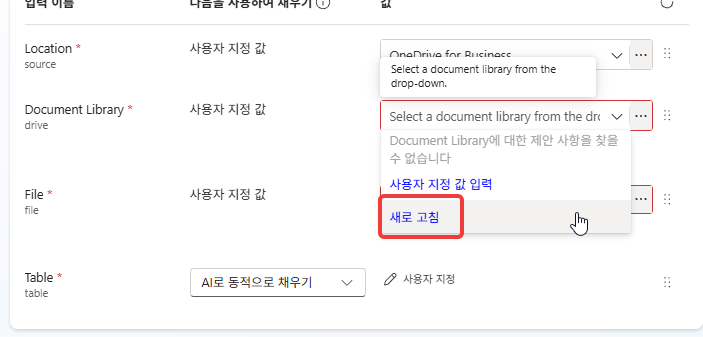
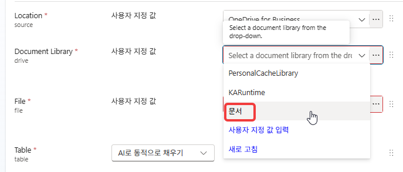
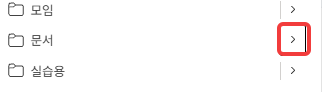
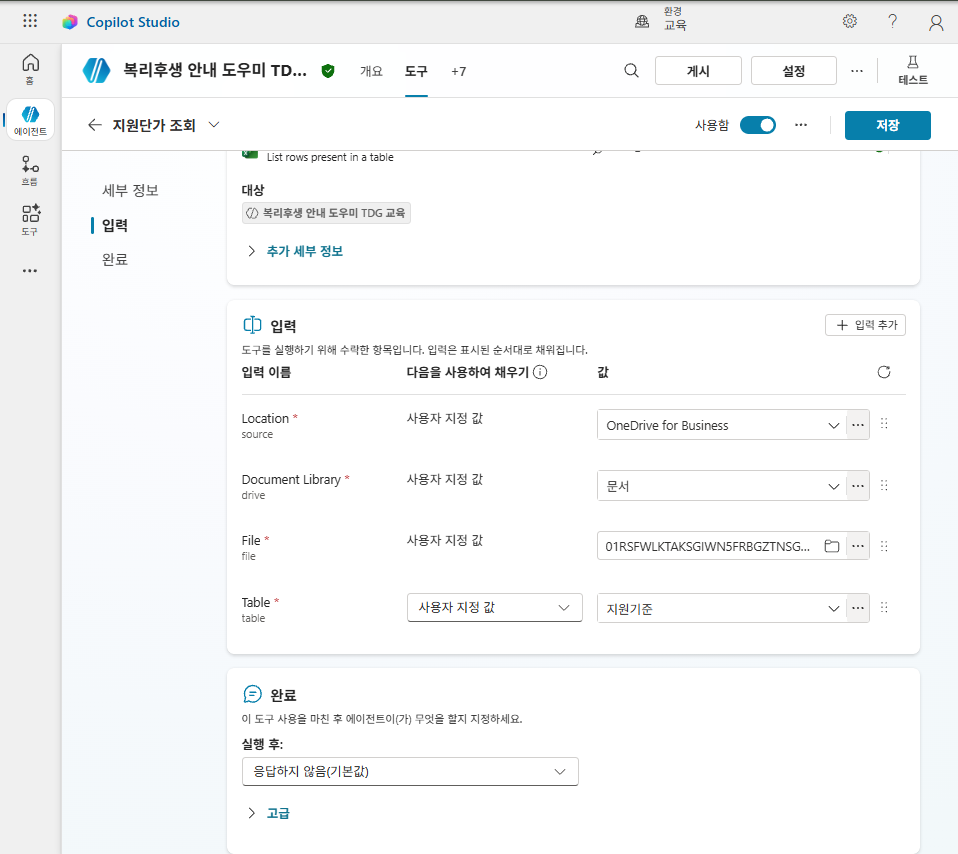
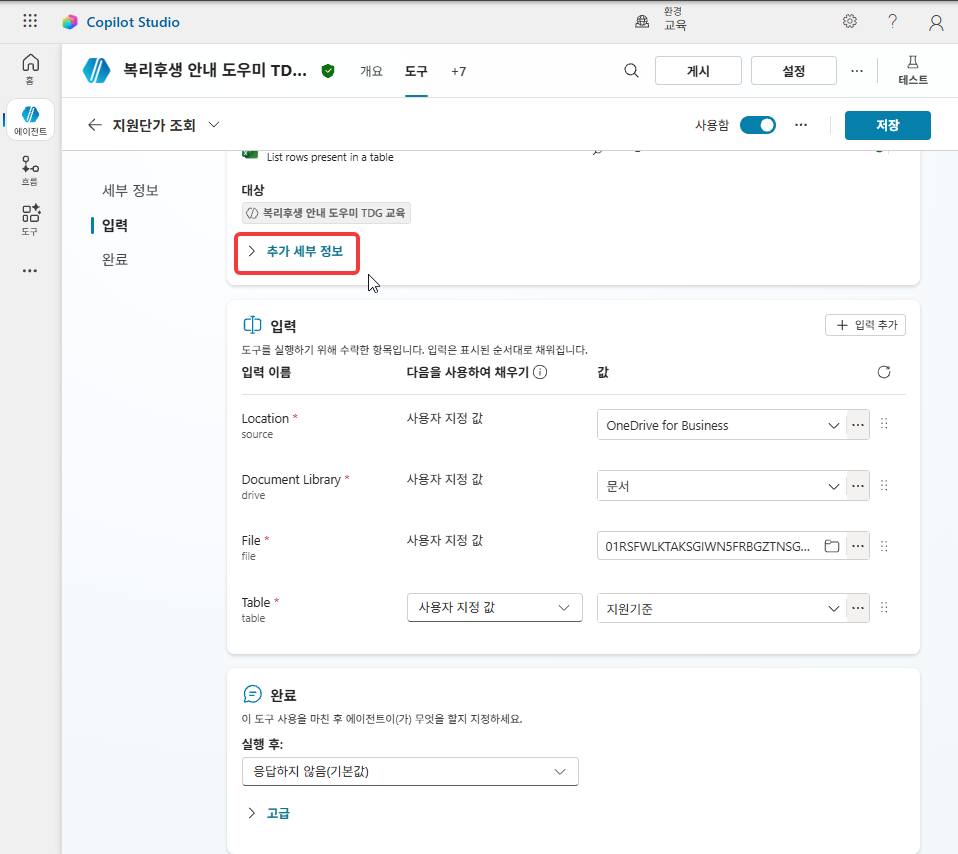

# Lab 1. SharePoint와 지식 📂

<!-- 저작 메모 — 2026-09-14 초안. 촬영·실측 전이다.

     ★ 재료
       - docs/lab1.md(입문 Lab 2) 1~7 · 9~16 · 18~20 · 22 · 24~26 → ①②③⑤
       - 새로 쓴 것 → ④ CSV로 개인 목록 만들기
       - 뺀 것 → 입문 8번 추천 프롬프트(테스트 창에 안 보임) · 17번 부록 읽기 · 21·23번 문서별 질문(24번 하나만)
                  · 27번 교차 질의 · 28번 날씨 질문(받아 줄 입문 Lab 5 ①이 TDG에 없다)

     ★ 제작자 결정(2026-09-14)
       - 스텝 예산 40 안팎. 리허설 없이 바로 수업한다
       - 목록은 PA 프로비저닝 흐름이 아니라 개인이 CSV 템플릿으로 만든다. CSV 내용은 저작 때 확정한다
       - 이 랩에서는 게시하지 않는다(게시는 외부 반출용). 트리거 파트와 게시는 2026-09-14 Lab 2 ①로 옮겼다(맞바꾸기)
       - ⑥은 구 Lab 2 ① 1~5번(지원단가 조회 도구)이다. 1,000행 읽기(구 6·7번)는 부록 read-volume 에 있어 뺐다

     ★ 랩 간 의존
       - 오후 GHCP lab4 의 워크플로 에이전트 노드는 게시된 에이전트만 고른다. Lab 2 16번 게시로 충족된다
       - 20번에서 만든 `경조신청_HGD` 에 Lab 2 ① 트리거가 기록하고, Lab 2 ② 조회 도구와 Lab 3 ④ 조회 흐름이 읽는다
       - ⑥의 `지원단가 조회` 도구와 27번에서 OneDrive에 올린 Excel 파일을 Lab 2 ③ 이후가 쓴다

     ⚠️ 실측할 것
       - Upload files › SharePoint 에서 폴더 안 개별 PDF 를 고를 수 있는지. 인용이 PDF 페이지 단위로 나오는지
       - CSV에서 목록 만들기의 스텝 수 · 열 형식 선택지 · 기본 「제목」 열 처리 · 내부 열 이름(Lab 3 31번 필터 쿼리가 쓴다)

     ★ 모델 — 10번에서 Claude Sonnet 4.6 을 고른다(제작자 추천, 2026-09-14). 입문의 모델 대조 부록
       `docs/appendix/model.md` 는 2026-09-11 ef6fafb 에서 부록 전체와 함께 걷어냈다(오전 180분에 부록 슬롯 없음).
       원본은 `cs_lab/docs/appendix/model.md` 에 있다.

     ★ 이미지 — assets/tdg1/ 에 스텝 번호로 넣는다. `N.png` 가 N번 스텝, `N-2.png`·`N-3.png` 는 같은 스텝의 연속 컷이다
       (2026-09-14 제작자 규칙).
     ✔ 빈 CSV(머리글만)로 목록이 만들어진다. 형식 선택 창에 첫 열 `제목` 이 제목 열로 잡히고 나머지는 전부 한 줄 텍스트다(18.png).
       제목 열은 필수라 Lab 2 9번 트리거 지침에 「제목: 신청자와 사유」를 넣었다. 신청자는 응답자 기록이 아니라 양식 문항(짧은 텍스트)으로 받는다(2026-09-14 제작자).
     ⚠️ 23번 경조사 질문이 03 문서를 못 찾았다(2026-09-14). 답은 02 휴가·근태 안내의 「경조 휴가 1~5일」 행과 04 FAQ만 인용했다.
       입문(로컬 업로드)에서는 같은 질문이 100만 원 · 5일로 나왔다. 원인 미확인.
       03 에만 있는 평문(명절 선물 15만 원)도 못 찾았다 → 표 문제가 아니라 **03 파일이 통째로 검색에 안 잡힌다.**
       상태는 네 건 모두 준비였다. 원본 PDF 는 텍스트 추출이 정상이다(pypdf 540자, 01·02·04 와 같은 방식으로 만든 파일).
       ★ 제작자 판단(2026-09-14): 교안은 네 파일 모두 SharePoint 경로 그대로 둔다. 03 누락은 특이 사항으로 제작자만 알고 있고, 본문에 경고·대체 경로를 넣지 않는다.
     ⚠️ 13번 SharePoint 선택 창이 일반 브라우저 창에서 40초 초기화 타임아웃으로 멈췄다(콘솔 `Initialization timed out
       after 40000ms` · spofilepickerwebpack.js). InPrivate 창에서는 성공했다(2026-09-14 제작자). 원인은 좁히지 않았다. 1-2·1-3 은 홈 화면이 1.png 와 다를 때만 하는 분기다(새로운 환경 토글 끄기 → 피드백 창은 이유 없이 제출). -->

> **이번 랩 완성물**: SharePoint 문서로 답하고 Excel 표를 도구로 읽는 복리후생 안내 도우미, 경조사 신청을 받을 빈 목록
>
> **예상 시간**: 50분
>
> **완성 신호**: 지원단가를 물으면 Excel `지원기준` 표의 값이 나온다

{: .time }
50분 타이머. 6단(에이전트 → 설정과 기준선 → SharePoint 지식 → 목록 → 지침 → 표 읽기 도구)으로 나눠 진행합니다.

---

## 준비

- 가상 회사 한별소프트의 복리후생 안내 에이전트를 만듭니다. 회사명·금액·제도는 모두 가상 설정입니다.
- 브라우저는 **InPrivate(시크릿) 창**으로 열고 본인 계정 하나로만 로그인합니다. 일반 창에서는 13번의 SharePoint 선택 창이 뜨지 않고 멈출 수 있습니다.
- 강사가 안내한 **SharePoint 사이트 주소**와 **Copilot Studio 환경**을 확인합니다. 안내한 폴더에 복리후생 PDF 네 개가 들어 있습니다.
- 경조사 신청 목록을 만들 CSV 템플릿을 PC에 받아 둡니다. [경조신청_템플릿.csv 다운로드](../assets/download/경조신청_템플릿.csv)

---

## 단계 ① 에이전트를 만든다

1. [copilotstudio.microsoft.com](https://copilotstudio.microsoft.com)에 본인 M365 계정으로 로그인합니다.

    

    홈 화면이 위와 다르면 오른쪽 위 **새로운 환경** 토글을 끕니다.

    

    피드백 창이 뜨면 **제출**을 누릅니다.

    

2. 상단 가운데 **환경**이 강사가 안내한 환경인지 확인합니다.

    

3. 왼쪽 메뉴 **에이전트**에서 **+ 빈 에이전트 만들기**를 누릅니다.

    

4. **에이전트 이름 지정** 창에서 **에이전트 설정(선택 사항)**을 펼칩니다.

    

5. 이름 칸과 **스키마 이름** 접두사 뒤에 아래를 입력하고 **만들기**를 누릅니다. `HGD` 대신 본인 영문 이니셜을 넣고, **언어**와 **솔루션**은 기본값 그대로 둡니다.

    ```
    복리후생 안내 도우미 HGD
    ```

    ```
    WelfareAgentHGD
    ```

    {: .warning }
    **이름 끝에 본인 이니셜을 넣습니다.** 교육생 전원이 같은 환경에서 작업하므로, 이름이 같으면 목록에서 본인 에이전트를 고를 수 없습니다.

    

    **만들기**를 누르면 **준비 중** 화면이 뜹니다.

    

6. **여러분의 에이전트이(가) 프로비전되었습니다** 메시지가 뜨면 **세부 정보**의 **편집**을 누릅니다. 메시지가 뜨기 전에는 편집이 활성화되지 않습니다.

    

    **설명**에 아래를 입력하고 **저장**을 누릅니다.

    ```
    한별소프트의 복리후생·휴가·경조사 제도를 사내 문서에 근거해 안내합니다.
    ```

    

## 단계 ② 설정과 기준선

7. 오른쪽 위 **⋯** 을 누르고 **설정**을 고릅니다.

    

8. **오케스트레이션**이 **예**인지, **연결된 에이전트**의 **다른 에이전트가 이 에이전트에 연결하여 사용하도록 허용**이 **켜기**인지 확인합니다.

    {: .warning }
    **오케스트레이션은 「예」로 둡니다.** 이벤트 트리거는 생성형 오케스트레이션을 켠 에이전트에서만 쓸 수 있습니다.[^trigger]

    

9. 아래로 내려 세 토글을 맞추고 **저장**을 누릅니다.

    | 항목 | 값 |
    |---|---|
    | 사용자 피드백 › 에이전트 메시지에 대한 사용자 반응 수집 | 끄기 |
    | 지식 › 근거 없는 응답 허용하기 | 켜기 |
    | 지식 › 웹의 정보 사용 | 끄기 |

    {: .warning }
    **근거 없는 응답 허용하기는 켜 둡니다.** 끄면 25번의 개인 데이터 질문에 오류 응답이 나와, 지침의 안내 문장이 나오는지 확인할 수 없습니다.

    

10. 오른쪽 위 **X**를 눌러 설정 창을 닫습니다.

    

    **에이전트의 모델 선택**에서 **Claude Sonnet 4.6**을 고릅니다.

    

    오른쪽 위 **테스트**를 눌러 테스트 창을 열고 아래를 입력합니다. 아직 참조 자료도 지침도 없는 상태입니다.

    

    ```
    별포인트는 1년에 얼마고 어디에 쓸 수 있나요?
    ```

    **관찰**: 「찾지 못했다」는 취지의 답이 나온다.

    

    이 답을 기준선으로 둡니다.
{: start="7" }

## 단계 ③ SharePoint 지식을 추가한다

11. 개요의 **참조 자료**에서 **+ 참조 자료 추가**를 누릅니다. 상단 **참조 자료** 탭에서 눌러도 됩니다.

    

12. **파일 업로드** 영역 안의 **SharePoint**를 누릅니다.

    {: .warning }
    **아래 추천 목록의 SharePoint 타일이 아닙니다.** 그쪽은 SharePoint 커넥터로 연결하는 다른 방식입니다.

    

13. 강사가 안내한 사이트와 폴더에서 PDF 네 개를 모두 선택하고 **선택 확인**을 누릅니다.

    

    {: .warning }
    **네 파일을 한 번에 추가합니다.** 하나씩 추가하면 인덱싱 대기를 네 번 합니다.

    PDF를 PC에 받아 12번 창의 **파일 업로드** 영역에 올려도 됩니다.

    [01. 복리후생 제도 개요](../assets/download/01.%20복리후생%20제도%20개요.pdf) · [02. 휴가·근태 안내](../assets/download/02.%20휴가·근태%20안내.pdf) · [03. 경조사·생활지원](../assets/download/03.%20경조사·생활지원.pdf) · [04. 사내복지·자주 묻는 질문(FAQ)](../assets/download/04.%20사내복지·자주%20묻는%20질문%28FAQ%29.pdf)

14. 창 위쪽에 「선택한 파일은 Dataverse에 업로드됩니다」가 있는지 확인합니다. 파일마다 **설명**을 넣고 **에이전트에 추가**를 누릅니다. 설명은 필수 항목입니다.

    | 파일 | 설명 |
    |---|---|
    | `01. 복리후생 제도 개요` | `식대·통신비·별포인트·건강검진·자기계발비 지원 기준` |
    | `02. 휴가·근태 안내` | `근무시간·연차·특별휴가·육아돌봄 규정` |
    | `03. 경조사·생활지원` | `경조금·경조휴가·학자금·주택자금 지원 기준` |
    | `04. 사내복지·자주 묻는 질문(FAQ)` | `사내 시설 안내와 자주 묻는 질문` |

    

    오케스트레이터는 어느 문서를 검색할지 고를 때 이 설명을 참고합니다.
{: start="11" }

## 단계 ④ 인덱싱 동안 목록을 만든다

15. 새 브라우저 탭에서 강사가 안내한 SharePoint 사이트를 엽니다.

    

16. **+ 신규**에서 **목록**을 고릅니다.

    

17. **가져오기 출처**의 **CSV**를 고르고, 준비해 둔 `경조신청_템플릿.csv`를 업로드합니다.

    

18. **사용자 지정** 창에서 열 형식을 아래와 같이 맞추고 **다음**을 누릅니다. 다르면 드롭다운에서 바꿉니다. 오른쪽 열은 가로로 스크롤해야 보입니다.

    | 열 | 형식 |
    |---|---|
    | 제목 | 제목 |
    | 신청자 | 한 줄 텍스트 |
    | 원문 | 여러 줄 텍스트 |
    | 사유 | 한 줄 텍스트 |
    | 발생일 | 날짜 |
    | 경조금 | 숫자 |
    | 경조휴가 | 숫자 |
    | 근거 | 한 줄 텍스트 |

    

19. 목록 이름을 아래로 입력하고 **사이트 탐색에 목록 표시**의 체크를 해제한 뒤 **만들기**를 누릅니다. `HGD` 대신 본인 이니셜을 넣습니다.

    ```
    경조신청_HGD
    ```

    

20. 만들어진 빈 목록에서 열 머리글을 확인합니다.

    
{: start="15" }

## 단계 ⑤ 지침

21. Copilot Studio 탭으로 돌아가 **참조 자료** 탭에서 네 건이 모두 **준비** 상태인지 확인합니다.

    

    {: .warning }
    **준비로 바뀌기 전에 질문하면 「모른다」고 답합니다.** 파일이 추가되어 있어도 아직 검색 대상이 아닙니다.

22. 테스트 창 위쪽의 **새 테스트 세션**(+)을 누르고 10번의 질문을 다시 입력합니다. **계속하려면 연결하세요** 카드가 뜨면 **허용**을 누릅니다.

    ```
    별포인트는 1년에 얼마고 어디에 쓸 수 있나요?
    ```

    SharePoint에서 가져온 파일은 답할 때마다 질문한 사람의 SharePoint 권한을 확인하므로 연결을 한 번 요구합니다.[^knowledge]

    

23. 경조사·생활지원 문서의 내용을 묻습니다.

    ```
    본인 결혼하면 경조금 얼마고 휴가는 며칠인가요?
    ```

    

24. 상단 탭 묶음(`+8` 등)에서 **개요**를 엽니다.

    

    **지침**의 **편집**을 누릅니다.

    

    아래 블록을 붙여넣고 **저장**을 누릅니다.

    ```
    ## 역할
    한별소프트 임직원의 복리후생·근태 문의를 안내하는 사내 도우미. 한국어로 간결·정중하게, 업로드된 지식 문서에 근거해 답하고 없는 내용은 단정하지 않는다.

    ## 답변 원칙
    - 반드시 업로드된 지식 문서만 근거로 답한다.
    - 답변 끝에 근거 문서 이름을 한 줄로 표기한다. 예: (근거: 복리후생 제도 개요)
    - 금액·일수·기한은 문서에 적힌 수치를 그대로 쓴다. 반올림·일반화하지 않는다.
    - 두 문서에 걸친 질문이면 둘을 결합해 답하고 근거 문서를 둘 다 표기한다.

    ## 경계
    - 개인의 실제 데이터(내 잔여 연차, 내 별포인트 잔액, 내 급여)는 알 수 없다. 숫자를 추정하지 말고 "한별포털에서 확인하거나 피플팀(내선 1000)으로 문의해 주세요"라고 안내한다.
    - 문서에 없는 내용은 지어내지 않는다. "제공된 문서에서 찾을 수 없습니다"라고 답한다.
    - 규정의 해석·예외 적용 여부는 단정하지 않는다. 판단이 필요한 사안은 피플팀 확인으로 넘긴다.
    ```

    

25. 질문마다 **새 테스트 세션**을 열고 아래 세 질문을 입력합니다.

    ```
    별포인트는 1년에 얼마고 어디에 쓸 수 있나요?
    ```

    

    ```
    제 남은 연차 며칠인지 알려주세요
    ```

    

    ```
    퇴직금은 얼마나 나오나요?
    ```

    

    지식에 넣은 문서는 기준(제도)입니다. 내 잔여 연차 같은 데이터는 들어 있지 않습니다.
{: start="21" }

## 단계 ⑥ 표를 도구로 읽는다

26. 자기계발비 기준표 Excel 파일을 PC에 받습니다. 강사가 안내한 SharePoint 폴더에서 받아도 됩니다.

    [자기계발비_기준표.xlsx 다운로드](../assets/download/자기계발비_기준표.xlsx)

    

27. 새 탭에서 OneDrive를 열고, **내 파일**의 **문서** 폴더에 26번 파일을 업로드합니다.

    {: .warning }
    **파일은 각자 본인 OneDrive에 업로드합니다.** 한 파일에 여러 사람이 동시에 쓰면 병합 충돌과 데이터 불일치가 생길 수 있습니다.[^excel]

    

    파일에는 표가 셋 있습니다. `지원기준`은 읽기만 하고, `신청내역`에 씁니다. `지원대상목록`은 1,000행입니다.

28. Copilot Studio 탭으로 돌아가 상단 **도구** 탭에서 **+ 도구 추가**를 누릅니다.

    

    **커넥터** 탭에서 **Excel Online(Business)** 를 누릅니다.

    

    **테이블에 있는 행 나열**을 고릅니다.

    

    **연결**에 본인 계정과 초록 확인 표시가 있는지 봅니다. 없으면 드롭다운에서 연결을 새로 만든 뒤 **추가 및 구성**을 누릅니다.

    

29. **세부 정보**의 **이름**과 **설명**을 아래로 바꿉니다.

    ```
    지원단가 조회
    ```

    ```
    자기계발비 항목별 지원단가를 조회한다. 항목명·지원단가·증빙서류·적용일이 들어 있는 기준표를 읽는다.
    ```

    

30. **입력** 네 칸을 아래 순서로 채웁니다.

    | 입력 이름 | 채우는 방법 | 값 |
    |---|---|---|
    | Location | 사용자 지정 값 | OneDrive for Business |
    | Document Library | 사용자 지정 값 | 문서 |
    | File | 사용자 지정 값 | 폴더 아이콘 › 문서 › `자기계발비_기준표.xlsx` |
    | Table | **사용자 지정 값**으로 바꾼 뒤 | `지원기준` |

    **Location**에서 **OneDrive for Business**를 고릅니다.

    

    **Document Library** 목록이 비어 있으면 **새로 고침**을 누르고, **문서**를 고릅니다.

    

    

    **File**의 폴더 아이콘을 눌러 **문서** 옆 **>** 로 들어가 `자기계발비_기준표.xlsx`를 고릅니다.

    

    

    **Table**의 채우는 방법을 **사용자 지정 값**으로 바꾸고 `지원기준`을 고릅니다.

    {: .warning }
    **`Table`의 기본값은 「AI로 동적으로 채우기」입니다.** 그대로 두면 어느 표를 읽을지 오케스트레이터가 호출마다 정하고, `신청내역`을 읽고 지원단가를 답할 수 있습니다.

    

31. **세부 정보** 아래 **추가 세부 정보**를 펼칩니다.

    

    **사용할 자격 증명**을 **작성자가 제공한 자격 증명**으로 바꿉니다.

    

32. 오른쪽 위 **저장**을 누른 뒤, 테스트 창의 **새 테스트 세션**을 누르고 물어봅니다.

    ```
    어학시험 응시료 지원단가가 얼마야?
    ```

    

    답은 `지원기준` 표에서 읽어 온 값입니다.
{: start="26" }

---

## 확인

**필수**: 여기까지 되면 이 랩은 통과입니다

- ① 근거 없는 응답 허용은 켜기, 웹의 정보 사용은 끄기다 (9번)
- ② SharePoint 지식 네 건이 준비 상태이고 각각 설명이 있다 (13·14·21번)
- ③ 경조사 질문에 문서의 값이 그대로 나온다 (23번)
- ④ 지침을 저장했다 (24번)
- ⑤ 세 질문이 문서 수치 · 안내 · 없음으로 갈린다 (25번)
- ⑥ 본인 이니셜이 붙은 경조신청 목록이 있다 (19·20번)
- ⑦ 본인 OneDrive에 올린 파일의 `지원기준`만 읽는 도구를 만들었다 (27·30·32번)
{: .checklist }

---

## 여기까지의 지침

24번에서 붙인 지침 전문입니다. ⑥의 도구 추가로는 지침이 바뀌지 않습니다.

```
## 역할
한별소프트 임직원의 복리후생·근태 문의를 안내하는 사내 도우미. 한국어로 간결·정중하게, 업로드된 지식 문서에 근거해 답하고 없는 내용은 단정하지 않는다.

## 답변 원칙
- 반드시 업로드된 지식 문서만 근거로 답한다.
- 답변 끝에 근거 문서 이름을 한 줄로 표기한다. 예: (근거: 복리후생 제도 개요)
- 금액·일수·기한은 문서에 적힌 수치를 그대로 쓴다. 반올림·일반화하지 않는다.
- 두 문서에 걸친 질문이면 둘을 결합해 답하고 근거 문서를 둘 다 표기한다.

## 경계
- 개인의 실제 데이터(내 잔여 연차, 내 별포인트 잔액, 내 급여)는 알 수 없다. 숫자를 추정하지 말고 "한별포털에서 확인하거나 피플팀(내선 1000)으로 문의해 주세요"라고 안내한다.
- 문서에 없는 내용은 지어내지 않는다. "제공된 문서에서 찾을 수 없습니다"라고 답한다.
- 규정의 해석·예외 적용 여부는 단정하지 않는다. 판단이 필요한 사안은 피플팀 확인으로 넘긴다.
```

---

## 출처

[^knowledge]: Unstructured data as a knowledge source <https://learn.microsoft.com/microsoft-copilot-studio/knowledge-unstructured-data>. Microsoft Learn.
[^excel]: Excel Online (Business) <https://learn.microsoft.com/connectors/excelonlinebusiness/>. Microsoft Learn.
[^trigger]: Event trigger overview <https://learn.microsoft.com/microsoft-copilot-studio/authoring-triggers-about> · Add an event trigger <https://learn.microsoft.com/microsoft-copilot-studio/authoring-trigger-event>. Microsoft Learn.
