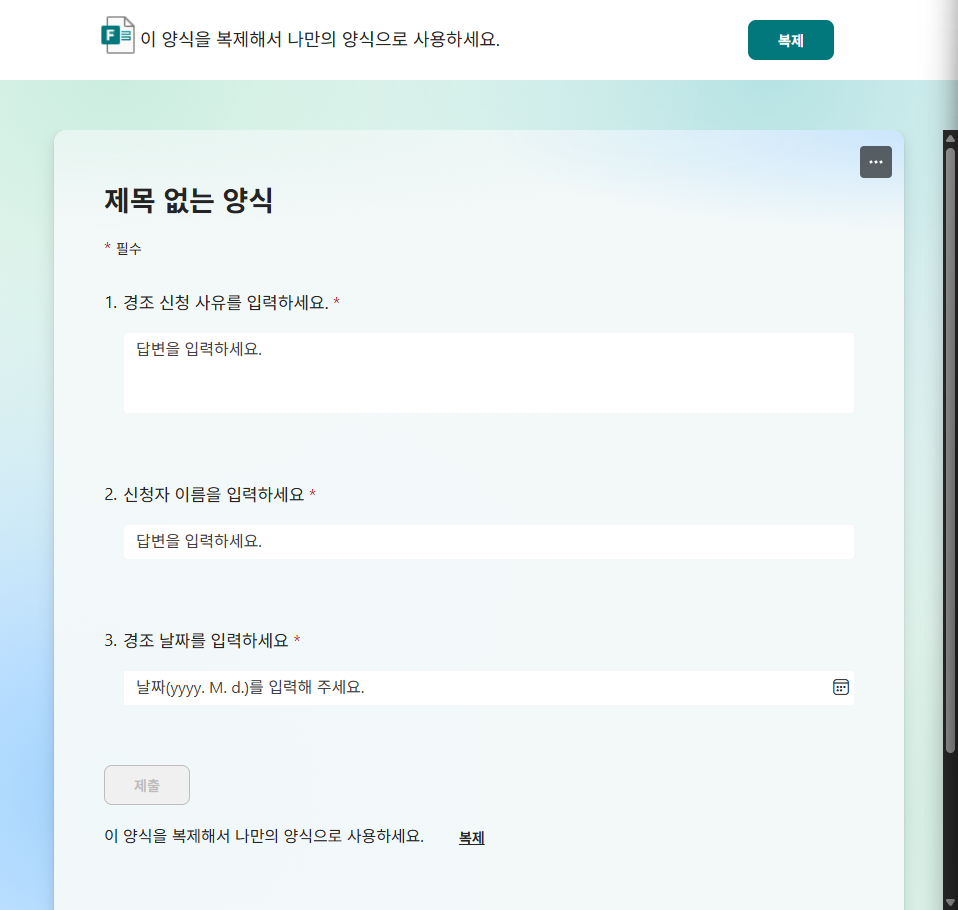
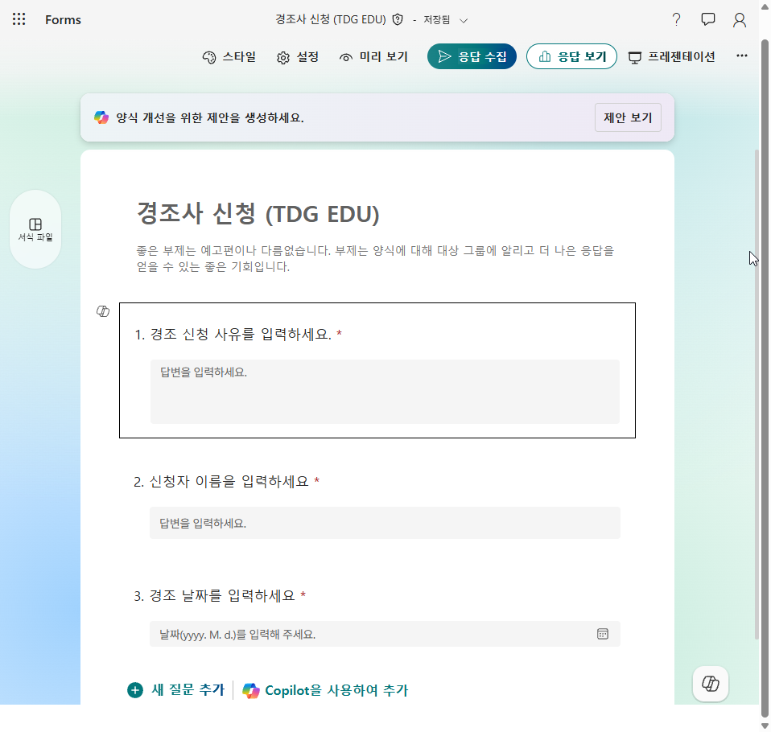
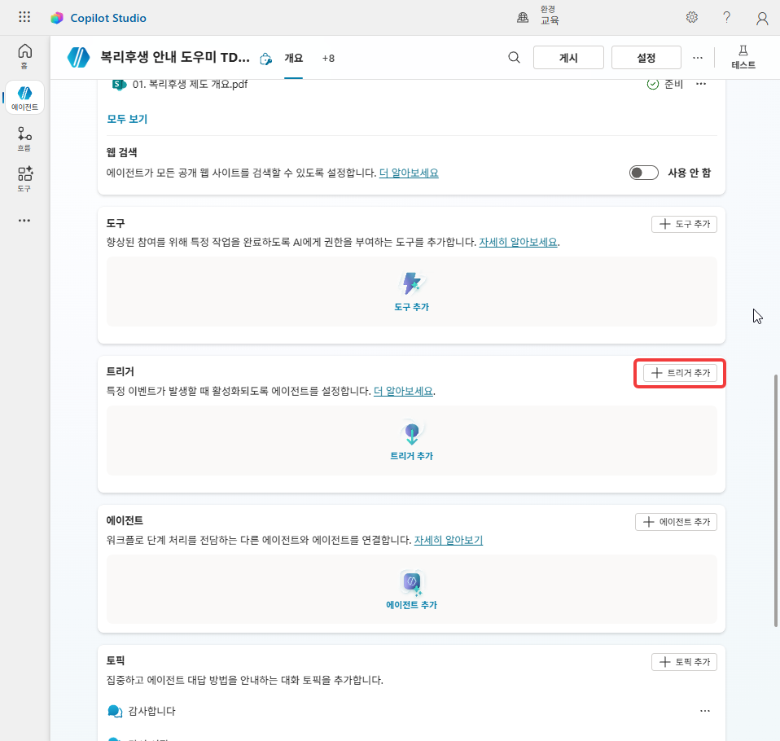
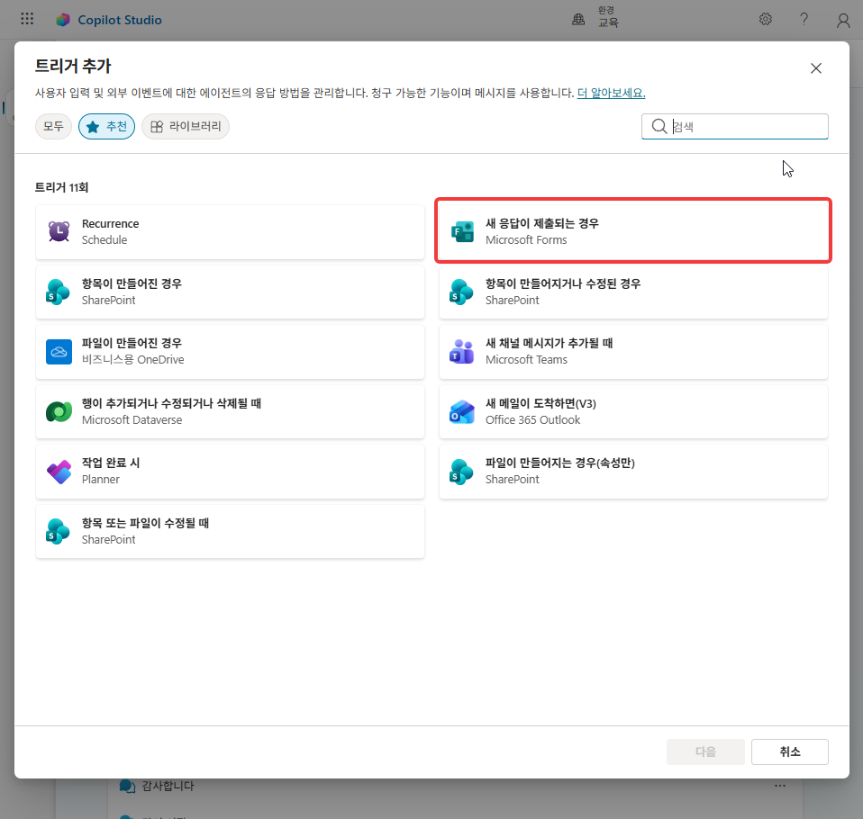
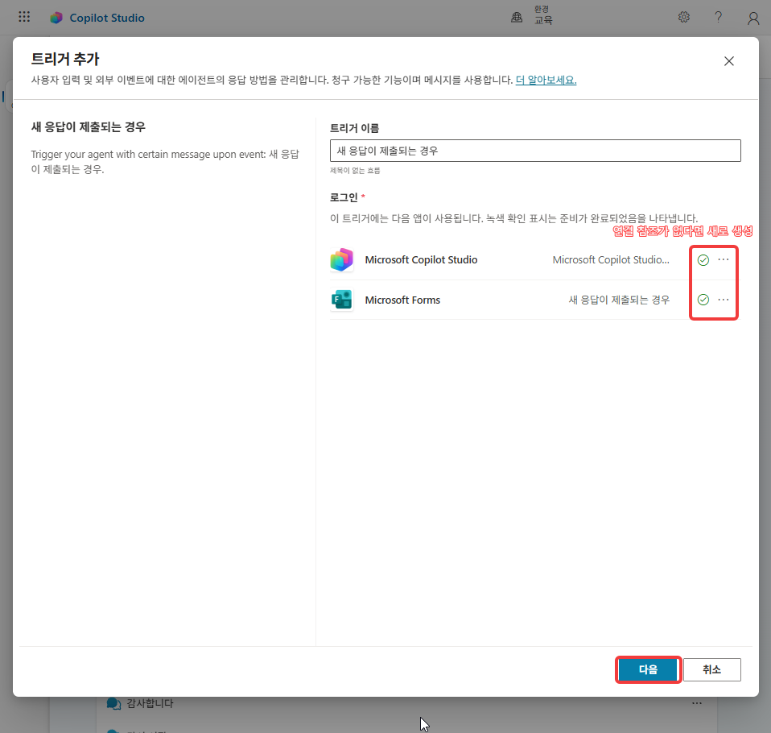
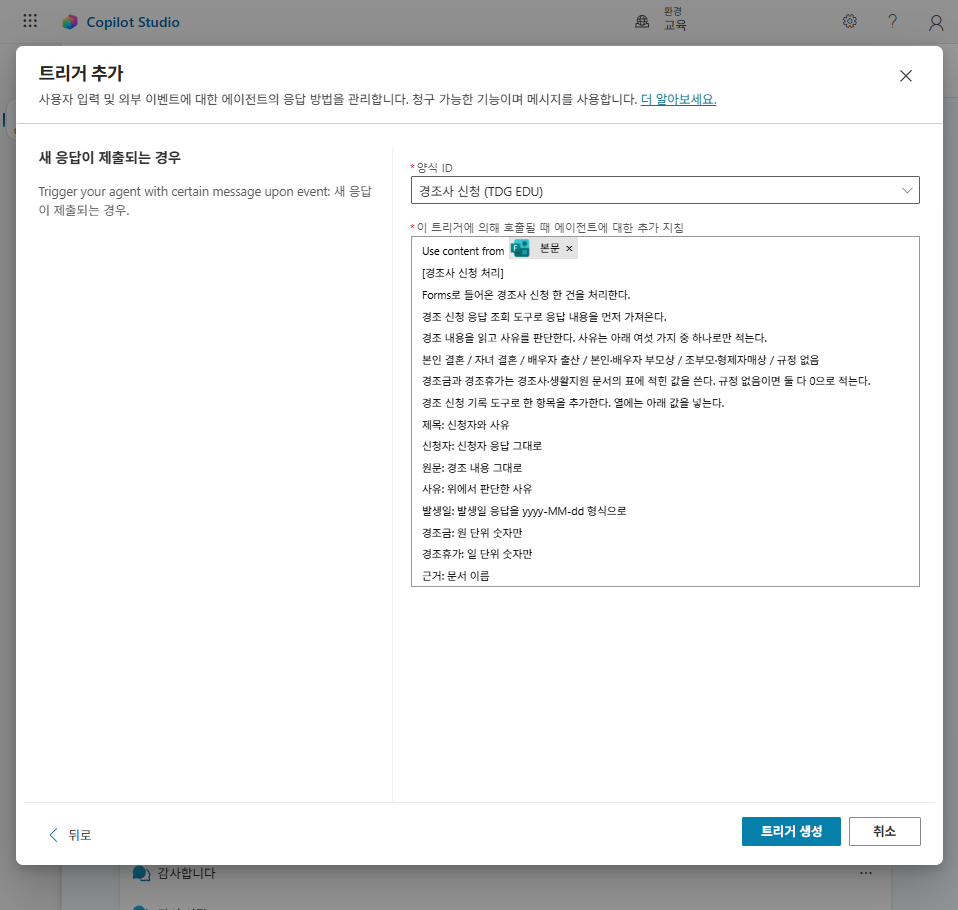

# Lab 2. 커넥터와 흐름 🔗

<!-- 저작 메모 — 2026-09-14 초안. 촬영·실측 전이다.

     ★ 재료
       - 입문 Lab 5 ② 6~9 · ③ 12·13·15 · ④ 18~23 → Lab 1 ⑥ 26~30 · 이 랩 ③ 24~30
       - 입문 Lab 6 ① 1~11 · ② 12~18 · ③ 19~24 · ④ 25~29 → ④ 31~45 · ⑤ 46~50
       - 새로 쓴 것 → ① Forms 트리거와 트리거 흐름 · ② 경조신청 목록 조회 도구
       - 구 ① 1~5번(지원단가 조회)은 Lab 1 ⑥으로, 1,000행 읽기(구 6·7번)는 부록 read-volume 으로 뺐다
       - 뺀 것 → 입문 Lab 5 ① MSN 날씨 · 10번 도구 지목 · 14번 수량 되묻기 · 16번 큰 수 · 17번 도구 정리
                  · 23번 없는 기능(상태 변경) · 25번 세 문장 표
                  → 입문 Lab 6 ⑤ MCP · 10~11번과 14~15번의 테스트 세부(29번 하나로 합쳤다)

     ★ 제작자 결정(2026-09-14)
       - Excel 킥을 유지한다. 커넥터 도구로 행을 쓰면 칸이 밀리고, 에이전트 흐름으로 해결한다
       - 조회 시트 · 작성 시트 · 1,000행 시트가 기조. 파일은 개인 OneDrive 에 둔다(쓰기 격리)
       - SharePoint 목록 조회는 커넥터 도구 하나를 이 랩에, 에이전트 흐름 하나를 Lab 3 에 둔다

     ★ 입문과 달라진 것
       - 흐름 이름에 이니셜을 붙였다(`자기계발비 신청 처리 HGD`). 입문 Lab 6 24번이 「남이 만든 흐름도 보인다」고
         경고하면서 이름에는 이니셜이 없었다
       - 입문 Lab 6 24번은 지침을 고친 뒤 에이전트를 게시했다. TDG 는 45번에서 다시 게시하지 않는다.
         ① 16번에서 트리거와 함께 이미 게시했다

     ★ 랩 간 의존
       - ①은 Lab 1 20번 목록에 기록하고, ② 22·23번이 그 기록을 읽는다. Lab 1 ⑥ 도구·Excel 파일을 ③이 쓴다
       - ④의 흐름을 Lab 3 24번 토픽이 부른다. 입력 이름(항목명 · 수량 · 이메일)을 바꾸면 Lab 3 도 같이 고친다

     ⚠️ 실측할 것
       - SharePoint 「항목 가져오기」를 도구로 붙였을 때 기본 몇 개까지 가져오는지(흐름 기준 문서는 100개)
       - 흐름 수식은 입문 Lab 6 에서 옮겼다. 이니셜을 붙인 흐름 이름이 노드 이름 수식에 영향이 없는지
       - 익스프레스 모드 토글이 TDG 환경에 뜨는지


     ★ ① 트리거 — 2026-09-14 Lab 1 ⑥에서 옮겼다(맞바꾸기). 아래 메모의 스텝 번호는 옮기기 전 Lab 1 번호다(26→1)
       - Forms 는 강사 템플릿을 각자 복제한다
       - Forms 제출 → 트리거 → 에이전트가 분석·가공 → 「항목 만들기」로 목록에 적재. 적재 규칙은 트리거 지침에 둔다
       - 소재는 경조사 신청 접수. 오후 GHCP lab4 가 「복리후생 문의」와 평문 분류·인적 검토를 쓰므로 겹치지 않게 골랐다
       - 트리거 흐름 기본값은 응답 알림(응답 ID)만 에이전트에 넘긴다. easycopilotlab 실습③대로 흐름에서 응답 세부 정보를 받아 myBody 로 넘긴다(35~40번). 디자이너를 여는 메뉴 라벨 실측
       - 30번 「항목 만들기」가 목록 열을 입력 칸으로 펼치는지, 기본값이 AI로 동적으로 채우기인지
       - 트리거 실행에서 에이전트가 지식을 검색하는지. 검색하지 않으면 경조사 표 다섯 행을 34번 트리거 지침에 넣는다
       - 환경에 솔루션 인식 클라우드 흐름 공유가 켜져 있는지. 꺼져 있으면 트리거를 추가할 수 없다
       - Forms 복제 단추 라벨 · 트리거 목록에서 Forms 「새 응답이 제출되는 경우」에 이르는 경로
     ★ 과금 — 트리거 테스트와 게시 전 인스턴스는 과금되지 않는다(제작자 확인). 트리거 자율 실행은
       제작자 라이선스 기반 fair use 로 예상하지만 본문은 「크레딧이 소비될 수 있다」로 적는다.

     ★ ⑥ 제작자 POC(2026-09-14) — 트리거만 추가하고 게시했더니 제대로 동작하지 않았다. 트리거 흐름이 응답 알림만 넘기기 때문이다.
       easycopilotlab 「실습③ 트리거 워크플로우 업데이트」대로 흐름을 고치는 절차(35~40번)를 넣었다. 에이전트 쪽 「응답 세부 정보」 도구는 뺐다.
       트리거 추가 창: 로그인(연결 두 개) → 양식 ID·추가 지침 한 화면(`Use content from 본문` 칩이 미리 있음) → 트리거 생성.
       ⚠️ ⑥ 컷 파일 번호(28·29·30)는 POC 촬영 순서라 스텝 번호(32~34·41)와 다르다. 28~31번 도구, 35~40번 흐름, 42번 이후는 미촬영.
       ⚠️ ① 컷은 아직 assets/tdg1/(26·27·28·28-2·28-3·29·29-2·30) 에 있다. ShareX 원본도 tdg 이다.

     ★ 이미지 — ①만 넣었다. -->

> **이번 랩 완성물**: Forms 경조사 신청을 목록에 기록하는 트리거, 목록을 읽는 도구, 신청내역에 쓰는 도구, 조회 조건과 쓰는 칸을 정해 둔 [에이전트 흐름](./glossary.html#agent-flow)
>
> **예상 시간**: 50분
>
> **완성 신호**: 제출한 경조사 신청이 목록에 한 줄로 기록되고, 커넥터 도구로 쓴 신청내역은 칸이 어긋나며 같은 요청을 흐름으로 보내면 칸에 맞게 들어간다

{: .time }
50분 타이머. 5단(트리거 → 목록 읽기 → 도구로 쓰기 → 흐름으로 정해 두기 → 같은 요청 다시)으로 나눠 진행합니다.

---

## 준비

- **[Lab 1](./tdg-lab1.html)에서 만든 복리후생 안내 도우미**에 이어서 작업합니다.
- Lab 1 준비에서 OneDrive에 올린 `자기계발비_기준표.xlsx`를 그대로 씁니다.

---

## 단계 ① 경조사 신청을 트리거로 받는다

1. [경조사 신청 양식 템플릿]({{ site.tdg.forms_template_url }})을 열고 오른쪽 위 **복제**를 누릅니다.

    

2. 복제한 양식의 제목을 아래로 바꾸고 문항 셋을 확인합니다. `HGD` 대신 본인 이니셜을 넣습니다.

    ```
    경조사 신청 (HGD)
    ```

    | 문항 | 형식 |
    |---|---|
    | 경조 신청 사유를 입력하세요. | 긴 텍스트 |
    | 신청자 이름을 입력하세요 | 짧은 텍스트 |
    | 경조 날짜를 입력하세요 | 날짜 |

    

3. Copilot Studio 개요의 **도구**에서 **도구 추가**를 누르고, **SharePoint**의 **항목 만들기**를 고릅니다.

4. **사이트 주소**와 **목록 이름**을 사용자 지정 값으로 지정합니다. 목록은 Lab 1 19번에서 만든 `경조신청_HGD`입니다.

5. 목록을 고르면 열마다 입력 칸이 펼쳐집니다. 모두 **AI로 동적으로 채우기** 그대로 두고, 열과 형식을 확인합니다.

    | 열 | 형식 |
    |---|---|
    | 제목 | 필수 |
    | 신청자 · 원문 · 사유 · 근거 | 텍스트 |
    | 발생일 | 날짜 |
    | 경조금 · 경조휴가 | 숫자 |

6. 도구 이름과 설명을 아래로 바꿉니다. **사용할 자격 증명**이 **작성자가 제공한 자격 증명**인지 확인하고 **에이전트에 추가**를 누릅니다.

    ```
    경조 신청 기록
    ```

    ```
    경조사 신청 한 건을 경조신청 목록에 기록한다. 제목·신청자·원문·사유·발생일·경조금·경조휴가·근거를 한 항목으로 추가한다.
    ```

    {: .warning }
    **트리거로 실행될 때 도구는 작성자 자격 증명으로만 동작합니다.** 다른 값이면 트리거 실행에서 기록이 되지 않습니다.[^trigger]

7. 개요의 **트리거**에서 **+ 트리거 추가**를 누르고, Microsoft Forms의 **새 응답이 제출되는 경우**를 고른 뒤 **다음**을 누릅니다.

    

    

8. **로그인**의 Microsoft Copilot Studio와 Microsoft Forms에 초록 확인 표시가 있는지 봅니다. 표시가 없으면 **⋯**에서 연결을 새로 만든 뒤 **다음**을 누릅니다.

    

9. **양식 ID**에서 2번에서 이름을 바꾼 양식을 고릅니다.

    

    **이 트리거에 의해 호출될 때 에이전트에 대한 추가 지침** 칸의 `Use content from 본문` 줄 아래에 아래를 붙여넣고 **트리거 생성**을 누릅니다.

    ```
    [경조사 신청 처리]
    Forms로 들어온 경조사 신청 한 건을 처리한다.
    전달된 내용에는 [신청자] [경조 날짜] [경조 신청 사유] 세 값이 들어 있다.
    경조 신청 사유를 읽고 사유를 판단한다. 사유는 아래 여섯 가지 중 하나로만 적는다.
    본인 결혼 / 자녀 결혼 / 배우자 출산 / 본인·배우자 부모상 / 조부모·형제자매상 / 규정 없음
    경조금과 경조휴가는 경조사·생활지원 문서의 표에 적힌 값을 쓴다. 규정 없음이면 둘 다 0으로 적는다.
    경조 신청 기록 도구로 한 항목을 추가한다. 열에는 아래 값을 넣는다.
    제목: 신청자와 사유
    신청자: [신청자] 값 그대로
    원문: [경조 신청 사유] 값 그대로
    사유: 위에서 판단한 사유
    발생일: [경조 날짜] 값을 yyyy-MM-dd 형식으로
    경조금: 원 단위 숫자만
    경조휴가: 일 단위 숫자만
    근거: 문서 이름
    ```

    {: .warning }
    **`Use content from 본문` 줄은 지우지 않습니다.** 흐름이 넘긴 본문이 이 칩으로 에이전트에 전달됩니다.

    

    이 지침은 에이전트 지침에 넣지 않고 트리거에 저장합니다. 에이전트 지침은 대화 응답을 전제로 쓴 문장이라, 두 지시를 한곳에 두면 충돌할 수 있습니다.[^trigger]

10. 개요의 **트리거**에서 방금 만든 `새 응답이 제출되는 경우`의 **⋯**를 눌러 Power Automate 디자이너를 엽니다. 흐름이 두 노드로 되어 있습니다.

    | 순서 | 노드 |
    |---|---|
    | 1 | 새 응답이 제출되는 경우 |
    | 2 | Sends a prompt to the specified copilot for processing |

    트리거는 어느 응답이 들어왔는지만 넘깁니다. 11~14번에서 응답 내용을 가져와 에이전트에 넘기도록 흐름을 고칩니다.[^ecl]

11. 두 노드 사이의 **+** 를 누르고 **Microsoft Forms**의 **응답 세부 정보 가져오기**를 넣습니다. **양식 ID**는 본인 양식, **응답 ID**는 동적 콘텐츠의 `응답 알림 목록 응답 ID`입니다.

    응답 ID를 넣으면 노드가 **For each** 안으로 들어갑니다.

12. **For each 위**의 **+** 에서 **변수 초기화**를 넣습니다. 이름은 `myBody`, 유형은 **문자열**입니다.

    {: .warning }
    **변수 초기화는 For each 안에 넣을 수 없습니다.** For each보다 위에 둡니다.

13. **For each 안**의 응답 세부 정보 가져오기 아래에 **변수 설정**을 넣습니다. 이름은 `myBody`이고, 값은 아래 글자와 **⚡** 동적 콘텐츠(응답 세부 정보 가져오기)를 번갈아 넣어 만듭니다.

    | 넣는 순서 | 무엇을 |
    |---|---|
    | 1 | 글자 `[신청자] ` |
    | 2 | 동적 콘텐츠 `신청자 이름을 입력하세요` |
    | 3 | 글자 ` [경조 날짜] ` |
    | 4 | 동적 콘텐츠 `경조 날짜를 입력하세요` |
    | 5 | 글자 ` [경조 신청 사유] ` |
    | 6 | 동적 콘텐츠 `경조 신청 사유를 입력하세요.` |

14. **Sends a prompt to the specified copilot for processing** 노드를 열어 에이전트가 본인 에이전트인지 확인하고, **Body/message** 칸을 `myBody` 변수로 바꿉니다.

15. 흐름 오른쪽 위 **게시**를 누릅니다.

    {: .warning }
    **흐름을 게시해야 고친 흐름으로 트리거가 실행됩니다.** 저장만 하면 이전 흐름이 돕니다.[^ecl]

16. Copilot Studio로 돌아가 에이전트 우측 상단 **게시**를 누릅니다. **최신 버전 강제 적용**은 체크하지 않고 **게시**합니다.

    

    트리거는 게시한 에이전트에서 실행됩니다. 트리거로 실행될 때마다 Copilot 크레딧이 소비될 수 있습니다.[^billing]

17. 양식 링크를 열어 응답을 하나 제출합니다. 신청자 이름에는 본인 이름, 경조 날짜에는 오늘 날짜를 넣고 경조 신청 사유에 아래를 적습니다.

    ```
    외할머니께서 돌아가셨습니다
    ```

18. 에이전트의 **활동** 탭에서 방금 실행된 트리거를 엽니다. 상태가 **완료됨**인지 봅니다.

19. 같은 실행에서 `경조 신청 기록`이 호출되었는지, 기록 도구의 입력에 어떤 값이 들어갔는지 봅니다.

20. SharePoint 탭에서 `경조신청_HGD`를 새로 고칩니다.

21. 경조 신청 사유를 아래로 바꿔 17~20번을 한 번 더 합니다.

    ```
    처남이 결혼합니다
    ```

    **관찰**: 사유가 `규정 없음`, 경조금과 경조휴가가 `0`으로 기록된다.

    경조사·생활지원 문서의 표에서 결혼 항목은 본인과 자녀뿐입니다.

## 단계 ② 기록을 도구로 읽는다

22. **도구 추가**에서 **SharePoint**의 **항목 가져오기**를 고릅니다. **사이트 주소**와 **목록 이름**을 사용자 지정 값으로 지정하고(목록 `경조신청_HGD`), 이름을 `경조 신청 조회`로 바꾼 뒤 **에이전트에 추가**를 누릅니다.

23. **새 테스트 세션**에서 물어봅니다.

    ```
    경조사 신청 내역 보여줘
    ```

    답은 ①에서 기록한 `경조신청_HGD` 목록에서 읽어 온 값입니다.
{: start="22" }

## 단계 ③ 신청을 도구로 쓴다

24. **지침** 맨 아래에 아래 블록을 더하고 저장합니다.

    ```
    [자기계발비 신청 처리]
    - 사용자가 자기계발비 신청을 요청하면 항목명과 수량을 확인한다. 둘 중 빠진 것이 있으면 먼저 되묻는다.
    - 금액은 지원단가 곱하기 수량으로 계산한다.
    - 처리 결과는 아래 형식으로 통보한다.

      [자기계발비 신청 접수]
      항목: 항목명
      지원단가: 지원단가원 곱하기 수량건
      금액: 금액원
      상태: 접수
    ```

    {: .warning }
    붙여넣을 때 `-` 로 시작하는 줄과 대괄호는 그대로 두고, **숫자 목록이나 `*` 는 쓰지 않습니다.** 이 칸은 붙여넣은 글을 마크다운으로 해석합니다.

25. **새 테스트 세션**에서 신청합니다.

    ```
    도서구입으로 4건 자기계발비 신청할게요
    ```

26. **활동** 탭에서 25번 대화를 엽니다.

27. **도구 추가**에서 **Excel Online (Business)** 의 **테이블에 행 추가**를 고르고, Lab 1 28번과 같은 파일에 `Table`을 `신청내역`으로 지정합니다. 이름은 `신청내역 기록`으로 바꾸고 **에이전트에 추가**를 누릅니다.

    {: .warning }
    **테이블을 잘못 고르면 `지원기준`에 신청 내역이 쌓입니다.** `Table`이 `신청내역`인지 확인하고 추가합니다.

28. **새 테스트 세션**에서 신청하고 기록까지 시킵니다.

    ```
    도서구입으로 4건 자기계발비 신청하고 신청내역에 기록해줘
    ```

29. OneDrive에서 Excel 파일을 열어 `신청내역`을 봅니다.

    어느 값이 어느 칸에 들어갈지는 도구에 정해 두지 않았습니다. 「테이블에 행 추가」 도구에는 칸마다 값을 지정하는 입력이 없고 대상 테이블만 고릅니다.

30. **새 테스트 세션**에서 여러 건을 한 번에 시킵니다.

    ```
    다섯 항목을 각 1건씩 전부 신청하고 기록해줘
    ```

    요청을 보낸 뒤 Excel의 `신청내역`을 다시 엽니다.
{: start="24" }

## 단계 ④ 흐름으로 조회와 쓰기를 정해 둔다

31. **도구 추가**의 위쪽 **새로 만들기**에서 **에이전트 흐름**을 고릅니다.

32. 툴바의 **초안 저장**을 먼저 누르고, 좌측 상단 이름을 아래로 바꿉니다. `HGD` 대신 본인 이니셜을 넣습니다.

    ```
    자기계발비 신청 처리 HGD
    ```

    {: .warning }
    **이름부터 바꾸면 저장되지 않습니다.**

33. **트리거** 노드를 봅니다.

34. 트리거의 **매개 변수** 탭에서 **입력 추가**로 입력 세 개를 만들고, **익스프레스 모드**를 켭니다.

    | 이름 | 형식 | 설명 |
    |---|---|---|
    | `항목명` | 텍스트 | `항목명을 입력하세요` |
    | `수량` | 숫자 | `항목의 수량을 입력하세요` |
    | `이메일` | 텍스트 | `흐름을 호출한 사용자의 이메일을 입력하세요` |

35. 트리거 아래 **+** 에서 **Excel Online (Business)** 의 **테이블에 있는 행 나열**을 넣고, 위치·문서 라이브러리·파일을 본인 것으로, 테이블을 `지원기준`으로 지정합니다.

36. **고급 매개 변수**에서 **필터 쿼리**와 **최대 개수**를 켭니다. 필터 쿼리의 작은따옴표 안쪽에 34번의 `항목명` 입력을 넣고, 최대 개수는 `1`로 둡니다.

    ```
    항목명 eq '(입력: 항목명)'
    ```

    {: .warning }
    **칩을 작은따옴표 안에 둡니다.** 따옴표 밖에 있으면 실행 시 오류가 납니다.

37. Excel 액션 아래 **+** 에서 **컨트롤**의 **조건**을 넣습니다. 왼쪽 칸의 **`fx`** 에 아래 수식을 붙여넣고 **업데이트**를 누릅니다. 비교는 **다음과 같음**, 값은 `1`입니다.

    ```
    length(outputs('테이블에_있는_행_나열')?['body/value'])
    ```

38. 응답 노드를 **True** 갈래 안으로 드래그합니다. **False** 갈래에는 **에이전트에게 응답**을 넣고 출력 `결과`(텍스트)에 아래를 씁니다.

    ```
    지원 대상이 아닌 항목입니다.
    ```

39. **행 나열과 조건 사이**에 **변수 초기화**를 넣습니다(이름 `금액`, 유형 정수, 값 `0`). **True** 갈래에는 **변수 설정**을 넣고 값에 아래를 붙여넣습니다.

    ```
    mul(int(first(outputs('테이블에_있는_행_나열')?['body/value'])?['지원단가']), triggerBody()?['number'])
    ```

    {: .warning }
    **변수 초기화는 갈래 안에 넣을 수 없습니다.** 조건보다 위에 둡니다.

40. **True** 갈래의 변수 설정 아래에 **Excel Online (Business)** 의 **테이블에 행 추가**를 넣고 테이블을 `신청내역`으로 지정합니다. **고급 매개 변수**에서 칸 여섯 개를 켜고 아래처럼 채웁니다.

    | 칸 | 값 |
    |---|---|
    | 신청번호 | 아래 수식 |
    | 신청자 | `이메일` 입력 |
    | 항목명 | `항목명` 입력 |
    | 수량 | `수량` 입력 |
    | 금액 | `금액` 변수 |
    | 상태 | `접수` |

    ```
    concat(convertFromUtc(utcNow(),'Korea Standard Time','yyyyMMdd-HHmmss'), '-', substring(guid(),0,8))
    ```

41. **True** 갈래의 응답 노드를 열고, 출력 `결과`(텍스트)의 값에 아래를 붙여넣습니다.

    ```
    concat(triggerBody()?['text'], ' ', string(triggerBody()?['number']), '건 접수되었습니다. 금액 ', string(variables('금액')), '원')
    ```

42. **초안 저장** 후 **게시**합니다.

43. 툴바의 **테스트**에서 **수동**을 고르고 **게시 및 테스트**를 누른 뒤, `도서구입` · `4` · 본인 이메일로 실행합니다.

44. 에이전트의 **도구** 탭에서 **도구 추가**를 누르고, **흐름** 탭에서 32번의 흐름을 고릅니다. **설명**을 아래로 쓰고 저장합니다.

    ```
    자기계발비 신청 한 건을 처리한다. 항목명으로 지원단가를 조회해 금액을 계산하고 신청내역에 접수로 기록한다. 등록되지 않은 항목명은 기록하지 않는다.
    ```

45. **지침**의 「답변 원칙」 마지막에 한 줄을 더하고 저장합니다. `/System.User.Email` 부분은 **`/`** 를 눌러 뜨는 목록에서 고릅니다.

    ```
    - 자기계발비 신청 시 이메일은 /System.User.Email 을 입력 변수로 넣는다.
    ```

    에이전트는 게시하지 않습니다.
{: start="31" }

## 단계 ⑤ 같은 요청을 흐름으로 보낸다

46. 도구 목록에서 `신청내역 기록`의 **사용 설정**을 끕니다.

47. **새 테스트 세션**에서 28번과 같은 요청을 합니다.

48. 30번과 같은 요청을 합니다.

49. 등록되지 않은 항목을 신청합니다.

    ```
    헬스장 이용권 1건 신청하고 기록해줘
    ```

50. OneDrive에서 Excel 파일을 열어 `신청내역`을 봅니다.
{: start="46" }

---

## 확인

**필수**: 여기까지 되면 이 랩은 통과입니다

- ① 트리거 흐름을 고쳐 게시하고 에이전트를 게시했다 (10~16번)
- ② 양식 제출로 경조사 신청 한 줄이 목록에 기록되었다 (17~20번)
- ③ 경조신청 목록을 도구로 읽었다 (23번)
- ④ 커넥터 도구로 쓴 줄의 값이 칸과 어긋난 것을 확인했다 (29·30번)
- ⑤ 흐름이 조회 · 계산 · 기록을 하고 결과를 돌려준다 (43번)
- ⑥ 같은 요청을 흐름으로 보내면 값이 칸에 맞게 들어간다 (47·48·50번)
- ⑦ 등록되지 않은 항목은 기록되지 않는다 (49번)
{: .checklist }

**관찰**: 나오면 좋고, 안 나와도 실패가 아닙니다

- ⑧ 규정에 없는 신청이 규정 없음 · 0으로 기록되는가 (21번)
- ⑨ 25번의 곱셈이 추론 칸에 문장으로만 남는가 (26번)
{: .checklist }

---

## 여기까지의 지침

[Lab 1](./tdg-lab1.html) 상태에 **두 군데**가 더해졌습니다. 맨 아래 `[자기계발비 신청 처리]` 블록(24번)과 「답변 원칙」의 마지막 줄(45번)입니다. 9번의 트리거 지침은 트리거에 저장되어 이 블록에 담기지 않습니다.

```
## 역할
한별소프트 임직원의 복리후생·근태 문의를 안내하는 사내 도우미. 한국어로 간결·정중하게, 업로드된 지식 문서에 근거해 답하고 없는 내용은 단정하지 않는다.

## 답변 원칙
- 반드시 업로드된 지식 문서만 근거로 답한다.
- 답변 끝에 근거 문서 이름을 한 줄로 표기한다. 예: (근거: 복리후생 제도 개요)
- 금액·일수·기한은 문서에 적힌 수치를 그대로 쓴다. 반올림·일반화하지 않는다.
- 두 문서에 걸친 질문이면 둘을 결합해 답하고 근거 문서를 둘 다 표기한다.
- 자기계발비 신청 시 이메일은 /System.User.Email 을 입력 변수로 넣는다.

## 경계
- 개인의 실제 데이터(내 잔여 연차, 내 별포인트 잔액, 내 급여)는 알 수 없다. 숫자를 추정하지 말고 "한별포털에서 확인하거나 피플팀(내선 1000)으로 문의해 주세요"라고 안내한다.
- 문서에 없는 내용은 지어내지 않는다. "제공된 문서에서 찾을 수 없습니다"라고 답한다.
- 규정의 해석·예외 적용 여부는 단정하지 않는다. 판단이 필요한 사안은 피플팀 확인으로 넘긴다.

[자기계발비 신청 처리]
- 사용자가 자기계발비 신청을 요청하면 항목명과 수량을 확인한다. 둘 중 빠진 것이 있으면 먼저 되묻는다.
- 금액은 지원단가 곱하기 수량으로 계산한다.
- 처리 결과는 아래 형식으로 통보한다.

  [자기계발비 신청 접수]
  항목: 항목명
  지원단가: 지원단가원 곱하기 수량건
  금액: 금액원
  상태: 접수
```

`/System.User.Email`은 화면에서 **칩**입니다. 통째로 붙여넣으면 글자가 되므로, 그 줄만 `/` 를 다시 입력해 목록에서 고릅니다.

---

## 출처
[^ecl]: 실습③ 트리거 워크플로우 업데이트 <https://microsoft.github.io/easycopilotlab/docs/m16-3-trigger-workflow.html> · 실습④ 트리거 결과 테스트 <https://microsoft.github.io/easycopilotlab/docs/m16-4-trigger-result.html>. Microsoft easycopilotlab.
[^trigger]: Event trigger overview <https://learn.microsoft.com/microsoft-copilot-studio/authoring-triggers-about> · Add an event trigger <https://learn.microsoft.com/microsoft-copilot-studio/authoring-trigger-event>. Microsoft Learn.
[^billing]: Billing rates and management <https://learn.microsoft.com/microsoft-copilot-studio/requirements-messages-management> · FAQ for Copilot Studio billing and licensing <https://learn.microsoft.com/microsoft-copilot-studio/faq-billing-licensing>. Microsoft Learn.
