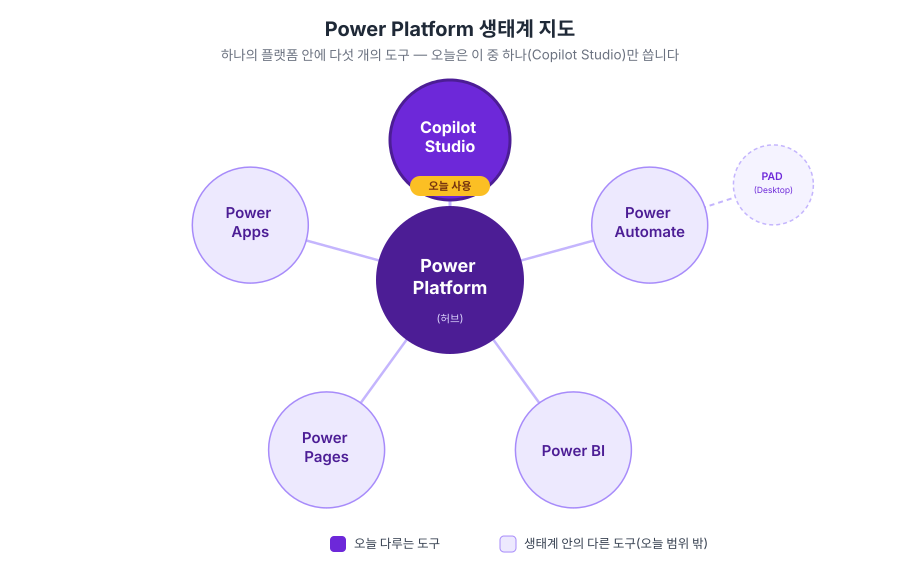
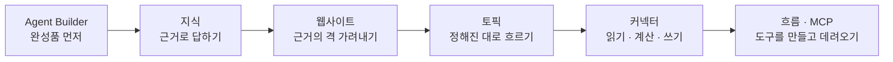

# Copilot Studio 입문 Lab 🌱

**"에이전트 하나를 손으로 만들어보면, 나머지는 응용입니다."**

가장 쉬운 도구로 하나를 끝까지 완성하는 것부터 시작합니다. 거기에 [지식](./docs/glossary.html#knowledge)·[지침](./docs/glossary.html#instructions)·[토픽](./docs/glossary.html#topic)·[커넥터](./docs/glossary.html#connector)를 하나씩 손으로 붙여 나만의 에이전트를 만들고, 마지막에는 필요한 도구를 직접 만들어 답니다. 보고, 따라 하고, 붙여넣으면 완성됩니다.

{: .note }
이 사이트는 **입문 1일 과정**을 담습니다. Lab 1~6과 피날레로 하루가 구성됩니다.

---

## 오늘 쓸 두 도구

<!-- 저작 메모(2026-08-13 전면 재작성): 구 opening.md를 흡수한 홈 페이지다.
     인트로 슬롯이 "덱"이고 랩이 없으므로 별도 오프닝 페이지를 두지 않고 홈이 그 역할을 겸한다.
     아래 SVG 2장은 원래 opening.md에 있던 것 — 덱에서도 같은 그림을 쓴다.

     ★ 이 페이지는 랩이 전부 확정된 뒤에 마지막으로 맞춘다.
       구 index는 랩 8개 시절에 쓰인 뒤 랩만 6개로 정리되어, 없어진 「축약 경로」 블록과
       이미 사라진 랩을 가리키고 있었다(2026-08-13 발견). 인덱스를 먼저 쓰고
       랩을 고치면 같은 일이 되풀이된다.
     ★ 「핸즈온 합계 265분」은 랩별 표기의 실제 합(255분)과 10분 어긋나 있다.
       어느 쪽을 고칠지 미결이라 숫자는 구본 그대로 두었다(2026-08-13). -->

**[Agent Builder](./docs/glossary.html#agent-builder)** (M365 Copilot 내장, 선언형·쉬움)와 **[Copilot Studio](./docs/glossary.html#copilot-studio)** (확장형·강력함). 같은 스펙트럼의 다른 지점입니다.

---

## 하루의 흐름

완성품을 먼저 만져본 뒤 문서를 근거로 답하게 만들고, 그 근거가 믿을 만한지 가려냅니다. 이어서 대화를 정해진 대로 흐르게 하고, 바깥 시스템으로 손을 뻗습니다. 마지막에는 그 손이 무엇을 어떤 순서로 하는지까지 정합니다.

---

## 과정 구성

각 랩은 **타이머**로 페이스를 맞추며 진행합니다.

| 랩 | 분 | 내용 |
|---|---|---|
| [Lab 1. Agent Builder로 첫 에이전트](./docs/lab1.html) | 35 | 내 메일함 요약·답변초안 에이전트 · 가드레일을 껐다 켜보기 |
| [Lab 2. 지식 기반 챗봇](./docs/lab2.html) | 40 | 지식 4종 · 지침 2단계 · 아는 것과 모르는 것의 경계 |
| [Lab 3. 웹사이트를 지식으로](./docs/lab3.html) | 30 | 같은 질문을 세 사이트로 · 무엇을 근거로 답하는가 |
| [Lab 4. 토픽 → 적응형 카드](./docs/lab4.html) | 60 | 설명이 [트리거](./docs/glossary.html#trigger-phrase) · 입력 [변수](./docs/glossary.html#variable) · 슬롯 필링 · 조건 · [적응형 카드](./docs/glossary.html#adaptive-card) |
| [Lab 5. 커넥터 — 읽고, 계산하고, 쓴다](./docs/lab5.html) | 40 | 날씨 · Excel 지원기준 조회 · 금액 계산 · 신청내역 기록 |
| [Lab 6. 도구를 만들고, 도구를 데려온다](./docs/lab6.html) | 50 | [에이전트 흐름](./docs/glossary.html#agent-flow)으로 조건·순서 정하기 · [MCP](./docs/glossary.html#mcp) 연결 |
| [피날레](./docs/finale.html) | 10 | 오늘 한 것과 안 한 것 |

**핸즈온 합계 265분**(랩 6개). 표에 적힌 시간은 **손을 움직이는 시간만**입니다 — 랩마다 시작 전 개념 설명과 마무리 정리로 10분 정도가 더 붙어, 실제 진행은 325분 안팎이 됩니다.

랩마다 그 개념 설명 슬라이드는 [인터미션 슬라이드](./docs/intermission.html)에 모여 있습니다. 수업 뒤에 다시 볼 수 있습니다.

{: .note }
[에이전트 안에서 일어나는 일](./docs/appendix/inside-the-agent.html)은 랩이 아니라 읽고 짧게 실습하는 페이지입니다. **1부**([RAG](./docs/glossary.html#rag)·[인덱싱](./docs/glossary.html#indexing))는 Lab 2의 인덱싱 대기 시간에 흡수되어 추가 시간이 들지 않습니다. **2부**(토큰·비용)는 별도 15분 슬롯으로 편성합니다 — 앞뒤 랩과 의존이 없어 어디에 끼워도 되고, 시간이 밀리면 통째로 뺄 수 있습니다. **3부**(지식 문서 준비)는 10분이고 읽는 자리입니다.

[부록 모음](./docs/appendix/)에는 랩 본문에 넣지 않은 것들이 있습니다. **어느 것도 랩 진행에 필요하지 않습니다** — 시간이 남을 때 골라 하거나 나중에 혼자 해볼 몫입니다.

용어는 [용어집](./docs/glossary.html)에 처음 등장 순서대로 정리해 두었습니다.

---

## 하루가 답하는 질문

랩 여섯 개에 같은 질문이 돌아옵니다. **어디까지 맡기고 어디부터 정하는가.**

**에이전트는 무엇을 알고, 무엇을 모르는가**
[지식](./docs/glossary.html#knowledge)에 넣은 문서는 기준이지 데이터가 아닙니다. Lab 2에서 만드는 복리후생 에이전트는 제도는 알지만 내 잔여 연차는 모릅니다. 이 경계를 어디에 긋느냐가 실무에서 에이전트를 설계할 때 가장 먼저 필요한 판단입니다.

**답이 나온 것과 근거가 있는 것은 다르다**
Lab 3에서 같은 질문을 세 사이트로 던져보고 참조를 눌러 원문을 확인합니다. 참조가 하나도 붙지 않은 채 답만 나오는 경우도 봅니다.

**맡길 것인가, 정해 둘 것인가**
Lab 1~3에서는 질문을 던지면 [오케스트레이터](./docs/glossary.html#orchestrator)가 알아서 골랐습니다([생성형 오케스트레이션](./docs/glossary.html#generative-orchestration)). Lab 4의 [토픽](./docs/glossary.html#topic)은 그린 대로만 흐르고, Lab 6의 흐름은 조건과 순서를 내가 정합니다. 어느 쪽이 맞는지는 자리마다 다릅니다.

> 이 교육의 목표는 기능을 익히는 데서 끝나지 않습니다. 본인 업무를 보며 '여기에도 적용할 수 있겠다'는 생각을 스스로 떠올리고, 새로운 아이디어를 계속 만들어낼 수 있는 기반을 만드는 것입니다.

---

{: .note }
Lab 2 이후에 다루는 회사 이름·제도·금액·지원 항목은 모두 가상 설정(한별소프트)입니다. 실제 개인 정보를 시스템에 업로드하지 마세요.

---

[Lab 1부터 시작하기 →](./docs/lab1.html){: .btn .btn-purple }
